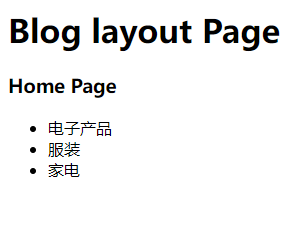
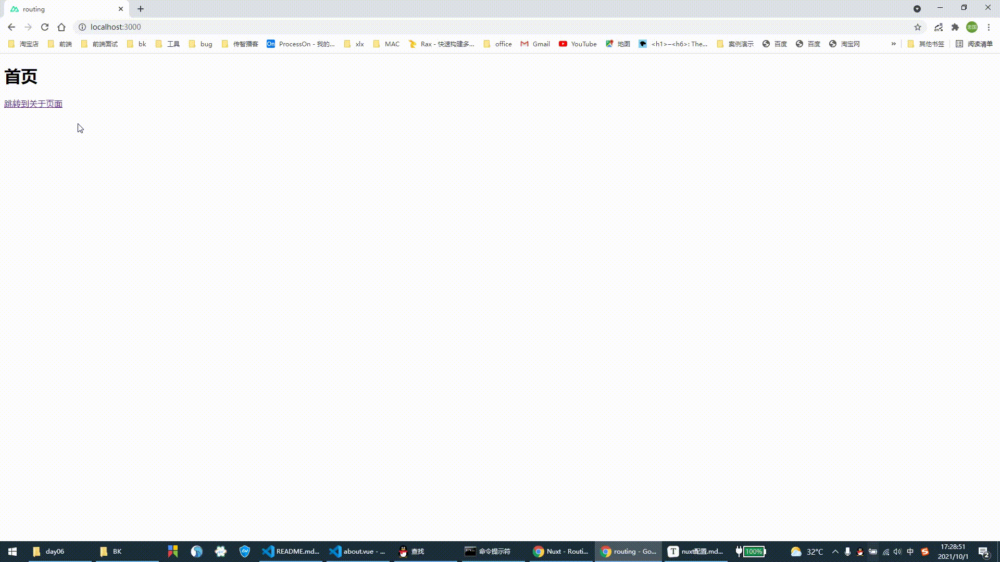
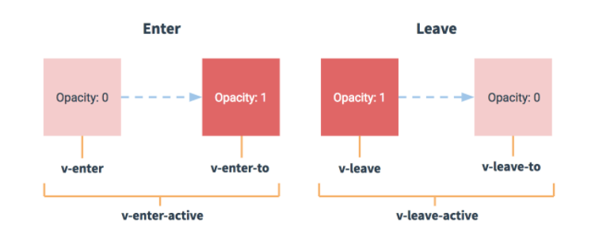
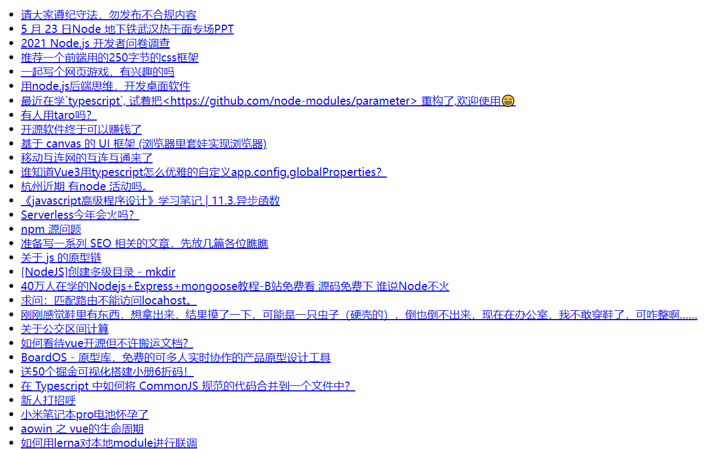
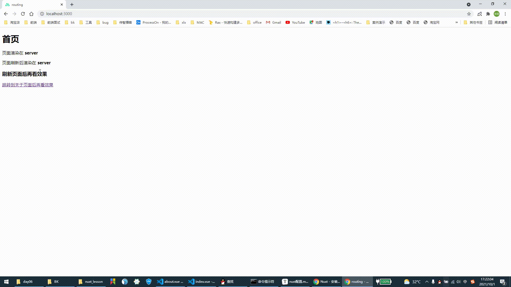

# Nuxt.js 第一章节

## 01.SSR介绍

### 1.1.客户端渲染

 前端的JS代码都是在浏览器中运行的，所以我们之前写的Vue的代码都是在客户端运行的:


 **好处**：代码在客户的浏览器中运行，所以消耗的是客户的CPU和内存等资源，减轻服务器的压力。

 **缺点**：页面中没有初始数据(查看页面源代码可以看到并没有数据)，所以**不利于SEO优化!!!**

​          原因：页面源代码时空的，没有数据，所以百度等网站抓取到的都是没有数据的空页面，这种页面不可能排到前面

  客户端渲染的特点：

-    JS代码是在浏览器中运行的
-   查看源代码时，看不到渲染出来的数据(因为数据时JS运行之后渲染出来的，所有页面中时没有初始数据的!)

### 1.2 什么是SEO

​      SEO(搜索引擎优化)：让我们的网站， 在百度，谷歌里排到前面！

​          搜索引擎(百度，谷歌，必应等)会从每个网站的页面中抓取核心数据到自己的数据库中，然后当有用户在这些网站上搜索一个关键字，会通过抓取网页的内容和关键字匹配，匹配度好的排在前面。

​      **SEO原理:** 

​		  搜索引擎通过一个叫做“爬虫”的程序来抓取每个页面的数据，但是注意它抓取时页面并不会执行JS，所以对于前面的页面，搜索引擎抓取不到任何数据，所以就无法在搜索引擎中搜索出来


​       总结： 在使用Vue开发项目时，要解决SEO问题,就要使用SSR（服务器端渲染）


**我们的网站如何在百度里排名靠前**？

- 花钱

- 不花钱

  - SSR(服务器端渲染) 让百度把我们的网站收录到百度的数据库中

    - 百度有一个爬虫系统，会自动从网站中抓取网页到他们的数据库(不会执行JS代码)

  - 当有人在百度中搜索时，会到数据库中找出相应的网页显示


### 1.3.服务器端渲染

<table><tr><td bgcolor=#D1EEEE>服务器端渲染(SSR: ServerSide Render):在服务端运行的Vue代码，然后将结果返回给前端</td></tr></table>

.

**用途**：解决SEO

**特点**: Vue的代码在服务器端运行，把运行结果返回给前端， 前端源代码里面可以查看到数据


**什么是Nuxt.js**

* Nuxt.js 是一个基于 Vue.js 的**通用**应用框架。
* 通过对客户端/服务端基础架构的抽象组织，Nuxt.js 主要关注的是应用的 **UI 渲染**。
* Nuxt.js 预设了利用 Vue.js 开发**服务端渲染**的应用所需要的各种配置。


## 02.安装运行相关的指令

### 2.1 安装

   ```javascript
1.  yarn create nuxt-app <项目名>  
    或者
2.  npx create-nuxt-app <项目名>
   ```

### 2.2 运行

  ```javascript
1. cd 项目目录
2. yarn dev / npm run dev

注意：

   开发时:
           yarn dev        npm run dev        --->开启开发服务器

   开发完：
   		   yarn build      npm run build      ---> 打包
	       yarn start      npm run start      ---> 开启正式服务器

           yarn generate   npm run generate   ---> 生成静态页
				特点：  1. 生成dist
                       2. 生成.html的页面
  ```

## 03.脚手架项目结构

### 3.1 详细目录介绍

.

| 目录名称       | 描述                                                         |
| -------------- | ------------------------------------------------------------ |
| assets         | 资源目录，用于存放**需要编译**的静态资源。例如：LESS、SASS等 <br/>默认情况下，Nuxt使用Webpack若干加载器处理目录中的文件 |
| components     | vue组件目录，Nuxt.js 不会增强该目录，及不支持SSR             |
| layouts        | 布局组件目录                                                 |
| pages          | 页面目录，所有的vue视图，nuxt根据目录结构自动生成对应的路由。 |
| plugins        | 插件目录                                                     |
| static         | 静态文件目录，**不需要编译**的文件                           |
| store          | vuex目录                                                     |
| nuxt.config.js | nuxt个性化配置文件，内容将覆盖默认                           |
| package.json   | 项目配置文件                                                 |


### 3.2  页面组成

Nuxt中每个页面都由三个层级的文件组成

1. 布局文件(根组件)： 保存在layouts目录中，所有的页面都是布局文件中的子组件
2. 页面组件(页面)： 保存在pages目录， 一个文件就是一个路由页面
3. 组件文件(组件)： 保存在components中，在每个页面中使用的组件

.


必要条件： 所有页面都是由布局文件+ 页面文件组成， 页面文件中还可以有多个组件文件

#### 3.2.2 布局文件

- 所有页面默认都使用layouts/default.vue做为布局文件


 案例演示

.

实现思路：

1. 创建layouts/defualt.vue文件
2. 创建pages/index.vue文件


代码实现：

​	layouts/default.vue文件

```vue
<template>
   <div class="container">
        <h1>layout Page</h1>
        <Nuxt />
   </div>
</template>
```

pages/index.vue

```vue
<template>
    <div class="home">
        <h3>Home Page</h3>
    </div>
</template>
```


总结：布局页面包含页面组件，在布局页面使用<Nuxt/>内置组件占位，用于路由匹配到的页面组件


#### 3.2.3 页面文件 

- 页面文件中还可以有多个组件文件
- 如果要修改使用的布局文件可以在页面中使用 layout:'xxxx'来指定要使用的布局文件


1.案例演示

.

2.实现思路

1.  创建layouts/blog.vue布局文件
2. 创建pages/index.vue文件
3. 创建components/Goods.vue组件

3.代码实现

1. layouts/blog.vue

   ```vue
   <template>
       <div class="blog">
           <h1>Blog layout Page</h1>
           <Nuxt/>
       </div>
   </template>
   ```

2. pages/index.vue

   ```vue
   <template>
       <div class="home">
           <h3>Home Page</h3>
           <Goods />
       </div>
   </template>
   <script>
   export default {
      layout:'blog'
   }
   </script>
   ```

3. components/Goods.vue

   ```vue
   <template>
       <div class="goods">
           <ul>
               <li>电子产品</li>
               <li>服装</li>
               <li>家电</li>
           </ul>
       </div>
   </template>
   ```


总结：布局文件包含页面组件，页面组件可以直接使用components目录下的复用组件，可以在页面组件中使用layout:xxx.vue 指定布局文件


### 3.3 自定义错误页面

- 如果布局文件名叫做error.vue 那么系统出错时会显示这个页面


 1.案例演示：

.

2.实现思路

1. 基于3.2案例创建layouts/error.vue布局文件


   总结：路由不存在时会自动跳转layouts/error.vue文件,  该文件虽然在layouts目录下，但是要看成是页面组件，默认继承default.vue布局文件


## 04.路由

-  Nuxt中已经内置了vue-router组件，所以我们直接使用即可，而且不需要写任何代码。
- 在Nuxt中不需要自己配置路由，Nuxt会根据pages目录中的文件结构自动生成路由的配置

###    1.路由初体验

.

 1.1 实现思路

​      在pages目录下新建如下两个vue文件

-  index.vue
- about.vue

 1.2.代码

​		文件：pages/index.vue

```javascript
<template>
  <div class="home">
    <h1>首页</h1>
    <nuxt-link to="/about">跳转到关于页面</nuxt-link>
  </div>
</template>

<script>
export default {
  asyncData() {
    return {
      rendering: process.server ? "server" : "client",
    };
  },
};
</script>
```

​       文件： pages/about.vue

```javascript
<template>
  <div class="about">
    <h1>关于页面</h1>
    <nuxt-link to="/">跳转到首页</nuxt-link>
  </div>
</template>

<script>
export default {
  asyncData() {
    return {
      rendering: process.server ? "server" : "client",
    };
  },
};
</script>
```

### 2.路由切换激活类名

​      目标：当前路由选中后<nuxt-link>组件会自带激活类名

- nuxt-link-active  模糊匹配
- nuxt-link-exact-active 精确匹配

####    1.案例演示

.


2.实现思路

1. 创建layouts/default.vue 布局文件存放<nuxt-link>导航组件 和<Nuxt/>占位组件
2. 创建pages/index.vue和pages/about.vue组件 


3.代码实现

layouts/default.vue

```vue
<template>
  <div>
    <nav>
      <ul>
        <li>
          <NuxtLink to="/">Home</NuxtLink>
        </li>
        <li>
          <NuxtLink to="/about">About Page</NuxtLink>
        </li>
      </ul>
    </nav>
    <main>
      <!--  -->
      <Nuxt />
    </main>
  </div>
</template>

<style>
a {
  text-decoration: none;
}

body {
  font-family: system-ui, -apple-system, BlinkMacSystemFont, Segoe UI, Roboto,
    Helvetica Neue, Arial, Noto Sans, sans-serif, Apple Color Emoji,
    Segoe UI Emoji, Segoe UI Symbol, Noto Color Emoji;
  margin: 0;
}

main {
  margin: 0 auto;
  padding: 0 1rem;
  margin-top: 100px;
  max-width: 1280px;
  text-align: center;
}
img {
  margin-bottom: 1rem;
}

ul {
  list-style-type: none;
  padding: 0;
  display: flex;
  justify-content: center;
  flex-wrap: wrap;
}
li {
  margin: 0 0.5rem;
  padding: 0.25rem;
  font-size: 1.2rem;
}

nav {
  padding: 0 1rem;
}
</style>

```

激活样式

```css
a.nuxt-link-active {
  font-weight: bold;
}
a.nuxt-link-exact-active {
  color: #00c58e;
}
```


pages/index.vue

```vue
<template>
  <div>
    <h1>Hello Nuxters! 👋</h1>
  </div>
</template>
```


pages/about.vue

```vue
<template>
  <div>
    <h1>About Page</h1>
  </div>
</template>

```

总结: <nuxt-link>组件点击后会自带激活类名  1.nuxt-link-active 模糊匹配  2.nuxt-link-exact-active 模糊匹配 


### 4.1.路径和文件的关系

​        不需要自己写配置文件，直接和文件名直接对应.

| 文件                  | 对应路径             |
| --------------------- | -------------------- |
| pages/index.vue       | /                    |
| pages/login.vue       | /login               |
| pages/user/order.vue  | /user/order          |
| pages/goods/index.vue | /good(省略index.vue) |

注意:在Nuxt中一个文件对应一个路径，如果文件名时pages/index.vue, 那么路径可以省略

### 4.2.路由参数

很多时候我们需要在路由上传参数，路由上的参数有两种

- 路径参数：/goods/100
- 查询参数: /goods?id=100

#### 4.2.1 路径参数

​		为了能够配置路径参数，我们需要以_做为文件名的前缀，比如:

匹配方式:

##### 方式1：查询参数

| 路径                     | 对应文件        | 页面中接受                        |
| ------------------------ | --------------- | --------------------------------- |
| /goods?id=100            | pages/goods.vue | $route.query.id                   |
| /goods/?id=12&sort=apple | pages/goods.vue | $route.query.id/$route.query.sort |
|                          |                 |                                   |

1.案例演示：

.

2.代码实现

​      创建文件：pages/index.vue

```vue
<template>
  <div>
    <h1>home page</h1>
    <nuxt-link to="/goods?id=100&sort=apple">goods</nuxt-link>
  </div>
</template>
```

​    创建文件: pages/goods.vue

    ```vue
    <template>
       <div>
            <h1>goods page</h1>
            <p>获取查询参数id: {{ $route.query.id }}</p>
            <p>获取查询参数sort: {{ $route.query.sort }}</p>
            <nuxt-link to="/">index</nuxt-link>
       </div>
    </template>
    ```

##### 方式2：路径参数

| 路径           | 对应文件           | 页面中接受                          |
| -------------- | ------------------ | ----------------------------------- |
| /goods/100     | /goods/_id.vue     | $route.params.id                    |
| /goods/100     | /goods/_i.vue      | $route.params.i                     |
| /goods/100/200 | /goods/\_cid/\_gid | $route.params.cid/$route.params.gid |

1.案例演示

.

2.代码实现

​      思路步骤：

1. 创建pages/good/_id.vue  接受一个路径参数id
2. 创建pages/good/_____cid/_gid.vue 接受两个路由参数cid和gid

​     

​       创建pages/goods/_id.vue

```vue
<template>
   <div>
        <h1>goods/_id page</h1>
         <p>获取查询参数id: {{ $route.params.id }}</p>
        <nuxt-link to="/">index</nuxt-link>
   </div>
</template>
```

​    创建pages/good/_____cid/_gid.vue 

```vue
<template>
   <div>
        <h1>goods/_cid/_gid page</h1>
         <p>获取查询参数cid: {{ $route.params.cid }}</p>
         <p>获取查询参数gid: {{ $route.params.gid }}</p>
        <nuxt-link to="/">index</nuxt-link>
   </div>
</template>
```

总结：

   使用区别：

- 查询参数?  不利于SEO,  百度再抓取我们页面时，如果用?  只会抓取一个页面 
  - content/?id=1
  - content/?id=2
  - content/?id=3
- 推荐使用路径参数 

### 4.3.嵌套路由

   1.案例演示

.

​    2.思路分析：

- 创建一个布局文件  layouts/default.vue   -->  显示一级路由，放一个<Nuxt/>组件, 存放一级路由匹配到的页面       
- 创建一个页面文件 pages/parent.vue        ---> 页面中放一个<nuxt-child/>组件,存放二级路由匹配到的页面
- 再创建一个目录     pages/parent               --->  所有parent路由下的子文件页面放到 parent目录中     

3.代码实现

   1.创建一个布局文件 layouts/default.vue

```vue
<template>
  <div>
    <nav class="nav">
      <ul>
        <li>
          <!-- <NuxtLink to="/">Home</NuxtLink> -->
          <span :class="{active:active}" @click="go('/')">Home</span>
        </li>
        <li>
          <!-- <NuxtLink to="/parent">Parent</NuxtLink> -->
           <span :class="{active:!active}" @click="go('/parent')">Parent</span>
        </li>
      </ul>
    </nav>
    <main>
      <Nuxt />
    </main>
  </div>
</template>

<script>
export default  {
   data () {
      return {
        active:true
      }
   },
   methods:{
     go (path) {
       this.active = !this.active;
       this.$router.push({
         path
       })
     }
   }
}
</script>


<style>
:root {
  --primary-color: #00c58e;
}

body {
  font-family: system-ui, -apple-system, BlinkMacSystemFont, Segoe UI, Roboto,
    Helvetica Neue, Arial, Noto Sans, sans-serif, Apple Color Emoji,
    Segoe UI Emoji, Segoe UI Symbol, Noto Color Emoji;
  margin: 0;
}

a {
  color: inherit;
  text-decoration: none;
}
nav a:hover {
  text-decoration: none;
}

a:hover {
  text-decoration: underline;
}

main {
  margin: 0 auto;
  margin-top: 100px;
  padding: 0 1rem;
  max-width: 1280px;
  text-align: center;
}

img {
  margin-bottom: 1rem;
}

ul {
  list-style-type: none;
  padding: 0;
  display: flex;
  justify-content: center;
  flex-wrap: wrap;
}
li {
  margin: 0 0.5rem;
  padding: 0.25rem;
  font-size: 1.2rem;
}

nav {
  padding: 0 1rem;
}
.nuxt-link-exact-active,.active {
  color: #00c58e;
}
</style>

```

   2.创建pages/index.vue文件

```vue
<template>
  <div>
      <h1>hello Nuxtjs</h1>
  </div>
</template>
```

3.创建pages/parent.vue文件

```vue
<template>
   <div>
       <h1>parent页面(二级路由)</h1>
       <nav>
           <ul>
               <li><nuxt-link to="/parent/child1">Chind1</nuxt-link></li>
               <li><nuxt-link to="/parent/child2">Chind2</nuxt-link></li>
           </ul>
       </nav>
       <NuxtChild/>
   </div>
</template>
```

4.创建pages/parent/child1.vue  

 ```vue
 <template>
   <div>
       <h1>parent页面的第一子页面(三级路由)</h1>
       <p>路由：{{ $route.path }}</p>
   </div>
 </template>
 ```

5.创建pages/parent/child2.vue

```vue
<template>
  <div>
    <h1>parent页面第二个子页面(三级路由)</h1>
    <p>路由:{{ $route.path }}</p>
  </div>
</template>
```

6.创建pages/parent/index.vue

```vue
<template>
   <div>
       <p>点击上面的链接</p>
   </div>
</template>
```


总结：

             1. 在布局文件中使用<Nuxt/>组件占位, 存放一级路由页面，在一级路由页面使用<NuxtChild/>存放二级路由页面
                2. <nuxt-link>组件自带激活类名(路由匹配到时)  模糊匹配类名:nuxt-link-active， 精确匹配类名：nuxt-link-exact-active


### 4.4 过度和动画

文档：https://nuxtjs.org/docs/features/transitions/

####         1.概念：

​				Nuxt.js 使用vue [过渡组件](http://vuejs.org/v2/guide/transitions.html#Transitioning-Single-Elements-Components)在路由切换时创建过渡/动画。


#### 2.特点

- Nuxt.js 默认过渡名称是 `page`
- 设置自定义动画， 使用transition属性在页面中自定义动画名称
- 设置动画样式注意以自定义的动画名称开头设置，比如bounce


css过度:

.

#### 3.案例演示

.

实现思路：

1. 创建布局文件layouts/defaults.vue 存放导航
2. pages目录下分别创建三个页面组件
3. 路由匹配的页面组件会自动添加类名  .page-enter .page-enter-active  .page-leave .page-leave-active  给其添加样式  


代码实现：

layouts/default.vue（直接复制模板）

```vue
<template>
  <div class="container">
    <nav>
      <ul>
        <li><nuxt-link to="/">Home</nuxt-link></li>
        <li><nuxt-link to="/fade">Fade</nuxt-link></li>
        <li><nuxt-link to="/bounce">Bounce</nuxt-link></li>
      </ul>
    </nav>
    <main>
      <Nuxt />
    </main>
  </div>
</template>

<style scoped>

body {
  font-family: system-ui, -apple-system, BlinkMacSystemFont, Segoe UI, Roboto,
    Helvetica Neue, Arial, Noto Sans, sans-serif, Apple Color Emoji,
    Segoe UI Emoji, Segoe UI Symbol, Noto Color Emoji;
  margin: 0;
}

nav a {
  color: inherit;
  text-decoration: none;
}

a.nuxt-link-exact-active {
  color: #00c58e;
}

main {
  margin: 0 auto;
  margin-top: 50px;
  padding: 0 1rem;
  max-width: 1280px;
  text-align: center;
}

ul {
  list-style-type: none;
  padding: 0;
  display: flex;
  justify-content: center;
  flex-wrap: wrap;
}
li {
  margin: 0 0.5rem;
  padding: 0.25rem;
  font-size: 1.2rem;
}

nav {
  padding: 0 1rem;
}
</style>
```


layouts/default.vue 添加动画样式

```css
/* 过度开始前和过度结束后隐藏 */
.page-enter,.page-leave-to {
   opacity: 0;
}
/* 过度激活状态显示 */
.page-enter-active, .page-leave-active {
   transition:opacity 0.5s;
}

/* 自定义动画 动画进入前*/
.bounce-enter-active {
   transform-origin: top;
   animation: bounce-in 0.8s;
}

/* 动画结束后 */
.bounce-leave-active {
   transform-origin: top;
   animation: bounce-out 0.5s;
}

@keyframes bounce-in {
   0% {
      transform:scale(0)
   }

   50% {
      transform:scale(1.25)
   }

   100% {
      transform:scale(1)
   }
}

@keyframes bounce-out {
    0% {
       transform:scale(1)
    }

    50% {
       transform:scale(1.25)
    }

    100% {
       transform:scale(0)
    }
}
```


pages/index.vue

```vue
<template>
    <div class="home">
       <h1>Hello Nuxters! 👏</h1>
    </div>
</template>
```

pages/fade.vue

```vue
<template>
    <div class="fade">
        <h1>Fade Transtion</h1>
    </div>
</template>
```


pages/bounce.vue

```vue
<template>
    <div class="bounce">
        <h1>Bounce Transtion</h1>
    </div>
</template>

<script>
export default {
    transition:'bounce'
}
</script>
```


总结： nuxt过度和动画使用vue的<transition>组件，只需要给对应激活类名添加样式即可


## 05.asyncData

​        Nuxt.js 扩展了 Vue.js，增加了一个叫 `asyncData` 的方法，使得我们可以在设置组件的数据之前能异步获取或处理数据。

###       1. asyncData函数什么时候用？

- 只能用在页面文件中(page目录下的文件中)
- 在获取页面初始化异步数据时使用

###       2. 为什么要使用它?

- 在这里获取的数据会显示在页面源代码中，有利于SEO~ 

###       3.有哪些特点

- 需要return 一个数据，然后这个数据可以在页面中使用
- 有很多参数： 比如 query, params ,route等
- 它可以在服务端或路由更新之前被调用
  - asnycData 函数默认在服务端渲染
  - asnycData 函数在当前所在页面刷新后在服务端渲染
  - asyncData 函数在路由跳转时在客户端渲染

### 4.使用方式

#### 4.1 return数据

1.页面效果

.

2.代码演示

```vue
<template>
     <div class="home">
         <h1>{{ msg }}</h1>
     </div>
</template>

<script>
export default {
    asyncData () {
        return {
            msg:'hello nuxt.js'
        }
    }
}
</script>
```

总结：Nuxt.js 会将 `asyncData` 返回的数据融合组件 `data` 方法返回的数据一并返回给当前组件。

#### 4.2 返回 promise,

接口地址：https://cnodejs.org/api/topics    get

1.案例演示

.

2.代码实现

```VUE
<template>
  <div class="home">
    <ul>
      <li v-for="item in list" :key="item.id"><a href="#">{{ item.title }}</a></li>
    </ul>
  </div>
</template>

<script>
import axios from "axios";
export default {
  asyncData() {
    return axios.get("https://cnodejs.org/api/v1/topics").then((res) => {
      console.log(res.data.data, "res");
      return {
        list: res.data.data,
      };
    });
  },
};
</script>
```

3.使用async await 

```vue
<template>
  <div class="home">
    <ul>
      <li v-for="item in list" :key="item.id">
        <a href="#">{{ item.title }}</a>
      </li>
    </ul>
  </div>
</template>

<script>
import axios from "axios";
export default {
  async asyncData() {
    const {
      data: { data: list },
    } = await axios.get("https://cnodejs.org/api/v1/topics");
    return {
      list,
    };
  },
};
</script>
```


总结：nuxt.js 会等待该`Promise`被解析之后才会设置组件的数据，从而渲染组件.


### 5.案例演示

  1.案例演示



2.代码

​       pages/index.vue

```vue
<template>
  <div class="home">
    <h1>首页</h1>
    <div v-if="rendering == 'server'">
      <p>页面渲染在 <strong>{{ rendering }}</strong> </p>
      <p>页面刷新后渲染在 <strong>{{ rendering }}</strong> </p>
    </div>
    <p v-if="rendering == 'client'">页面跳转后渲染在{{ rendering }}</p>
    <h3>刷新页面后再看效果</h3>
    <nuxt-link to="/about">跳转到关于页面后再看效果</nuxt-link>
  </div>
</template>

<script>
export default {
  asyncData() {
    return {
      rendering: process.server ? "server" : "client",
    };
  },
};
</script>

```

   pages/about.vue

```vue
<template>
  <div class="about">
    <h1>关于页面</h1>
    <div v-if="rendering == 'server'">
      <p>页面渲染在 <strong>{{ rendering }}</strong> </p>
      <p>页面刷新后渲染在 <strong>{{ rendering }}</strong> </p>
    </div>
    <p v-if="rendering == 'client'">页面跳转后渲染在{{ rendering }}</p>
    <h3>刷新页面后再看效果</h3>
    <nuxt-link to="/">跳转到首页再看效果</nuxt-link>
  </div>
</template>

<script>
export default {
  asyncData() {
    return {
      rendering: process.server ? "server" : "client",
    };
  },
};
</script>
```


总结：asyncData函数在页面刷新或者路由跳转时都会触发，刷新在服务端触发，路由切换在客户端触发


### 6.服务器端运行

Nuxt为了实现SSR，在原VUE中添加了一些额外的功能，这些功能都会在服务器端执行

#### 1.服务端执行的生命周期

| 功能                   | 执行的位置          |
| ---------------------- | ------------------- |
| 中间件                 | 服务器 或者路由更新 |
| asyncData              | 服务器或者路由更新  |
| fetch                  | 服务器或者路由更新  |
| beforeCreated, created | 服务器或者路由更新  |
| nuxtServerInt          | 服务器端            |

##### 1.1区分代码执行的位置

######   1. console.log()

  我么可以使用console.log()来打印数据，以此查看代码执行的位置

  为了让我们区分代码执行的位置，Nuxt会把服务器执行的代码输出到Nuxt SSR中，可以在浏览器的工具中查看

   比如，我们在页面中添加created生命周期函数并输出

###### 2. process.server

​      有些代码在服务器和客户端都会执行一遍，beforeCreated, created 生成生命周期函数。

对于既在服务器端执行又在客户端执行的代码来说，有时我们可能只希望它在牟一端执行，这时我们可以使用process.server来判断当前的环境，然后针对不同的环境执行代码.


## 06.中间件

### 带问题学中间件

- 什么是中间件? 它在什么时候执行?
- 什么全局中间件? 什么是页面中间件?
- 如何创建中间件
- 如何设置中间件为全局的
- 如何设置中间件为局部的
- 在中间件中如何判断当前运行的环境是客户端还是服务器端

### 1.概念

  就是一个函数，会在每一次请求路由之前被执行

### 2.应用场景

​	 可以用来做权限验证等功能~

### 3.使用中间件注意事项

- 中间件会在前端后端都执行，所以写代码时要判断环境
- 只有前端能操作浏览器
- 如果后端属于node环境不能操作浏览器，不能使用localStorage等浏览器专用的API
- 中间件执行流程顺序：
  1. `nuxt.config.js`
  2. 匹配布局
  3. 匹配页面


### 4.基础案例演示：

..


实现思路

1. 创建middleware目录的创建三个xxx.js文件，打印执行
2. 分别应用在全局配置nuxt.config.js 布局文件，页面组件中使用


代码实现：

middleware/auth1.js

```javascript
export default () =>{
   //console.log('auth1中间件执行了');
    const server = process.server ? '服务端':'客户端';
    console.log(`auth2中间件执行在${server}`);
}
```

middleware/auth2.js

```javascript
export default () =>{
  // console.log('auth2中间件执行了');
   const server = process.server ? '服务端':'客户端';
    console.log(`auth2中间件执行在${server}`);
   
}
```

middleware/auth3.js

```javascript
export default () =>{
   //console.log('auth3中间件执行了');
    const server = process.server ? '服务端':'客户端';
    console.log(`auth2中间件执行在${server}`);
}
```


nuxt.config.js

```javascript
  router:{
    middleware:'auth1'
  },
```

layouts/default.vue

```vue
<template>
   <div>
       <h1>布局文件</h1>
       <Nuxt/>
   </div>
</template>

<script>
export default {
  middleware:'auth2'
}
</script>
```

pages/index.vue

```vue
<template>
  <div>
    <div>home Page</div>
    <nuxt-link to="/about">切换关于页面</nuxt-link>
  </div>
</template>

<script>
export default {
  middleware: "auth3",
};
</script>
```


pages/about.vue

```vue
<template>
    <div>
        <h1>关于页面</h1>
        <nuxt-link to="/">回到首页</nuxt-link>
    </div>
</template>

<script>

```


总结：

1. 中间件： 在访问一个组件之前自动执行的函数
2. 中间件的执行范围有三种:
   1. 全局执行：在加载所有的组件之前都会被自动调用             --> 需要在配置文件中配置
   2. 布局文件执行： 在某些组件加载之前会被自动执行            --> 写布局文件中写中间件
   3. 单个文件执行： 在某一个组件加载之前会被自动执行       ---> 直接卸载这个文件中即可
3. 中间件的执行时机：在服务器端和客户端都会执行
   1. 服务端执行：当我们直接在浏览器中刷新页面，直接打这个页面的路径时
   2. 客户端执行：当点击页面的按钮(nuxt-link)切换组件时
4. 什么时候使用中间: 权限验证等

## 06.资源文件

### 1.使用css/html预处理器

​	 目的：为了更高效或者简洁的编写html, css代码，我们一般会使用html或者css预处理器

   1.1 css常见预处理：

- sass
- less
- stylus

  1.2 html预处理器

-  pug


#### 1.1 案例演示(less）

.

实现思路：

1.  yarn/npm 安装less依赖包               
2. 安装@nuxtjs/style-resources
3. 配置nuxt.config.js

 代码实现：

1.安装指定版本(nuxt内置webpack4)

```javascript
yarn add less less-loader@7.3.0
```

2.创建公共类库文件 assets/less/base.less文件

```less
body {
    font-family: system-ui, -apple-system, BlinkMacSystemFont, Segoe UI, Roboto,
      Helvetica Neue, Arial, Noto Sans, sans-serif, Apple Color Emoji,
      Segoe UI Emoji, Segoe UI Symbol, Noto Color Emoji;
    margin: 0;
    overflow-x: hidden;
    overflow-y: scroll;
  }
  
  main {
    margin: 0 auto;
    margin-top: 25vh;
    margin-bottom: 2rem;
    padding: 0 1rem;
    max-width: 1280px;
    text-align: center;
  }
  
  h1 {
    // 使用全局less变量
    color: @secondary;
  }
  
```

3. 创建全局变量文件assets/less/variables.less

```less
@primary:orangered;
@secondary:dodgerblue;
```

   4.安装@nuxtjs/style-resources

```javascript
 yarn add -D @nuxtjs/style-resources
```

  5.配置nuxt.config.js

```javascript
css: ['~/assets/less/base.less'],  
 buildModules: [
    '@nuxtjs/style-resources'
  ],
  // global style resources 配置全局less变量
  styleResources:{
     less:[ '~/assets/less/variables.less']
  },
```


#### 1.2.案例演示(scss）

.

实现思路

1. yarn/npm 安装scss依赖包    
   - 文档地址: https://nuxtjs.org/docs/2.x/features/configuration#pre-processors
2. 安装@nuxtjs/style-resources 
3. 配置nuxt.config.js

​      

代码实现：

1. 创建assets/scss/base.scss

   ```scss
   body {
       font-family: system-ui, -apple-system, BlinkMacSystemFont, Segoe UI, Roboto,
         Helvetica Neue, Arial, Noto Sans, sans-serif, Apple Color Emoji,
         Segoe UI Emoji, Segoe UI Symbol, Noto Color Emoji;
       margin: 0;
       overflow-x: hidden;
       overflow-y: scroll;
     }
     
     main {
       margin: 0 auto;
       margin-top: 25vh;
       margin-bottom: 2rem;
       padding: 0 1rem;
       max-width: 1280px;
       text-align: center;
     }
     
     h1 {
       color: $secondary; // 使用scss全局变量
     }
     
   ```

2. 创建assets/scss/variables.scss

   ```scss
   $primary:orangered;
   $secondary:dodgerblue;
   ```

3. 配置nuxt.config.js

    安装@nuxtjs/style-resources

    ```javascript
    yarn add -D @nuxtjs/style-resources
    ```

   配置nuxt.config.js

   ```javascript
    css: [
       '~/assets/less/base.less',
       '~/assets/scss/base.scss'
     ],
    buildModules: [
       '@nuxtjs/style-resources'
     ],
     // global style resources
     styleResources:{
        less:[
          '~/assets/less/variables.less'
        ],
        scss:[
          '~/assets/scss/variables.scss'
        ]
     },
   ```


#### 1.3 案例演示(pug)

.

​	 pug：是html模板引擎 ，作用是让html代码更加精简

​     

实现思路：

1.   使用npm/yarn 安装pug
2.   指定html格式  lang="pug"

   安装pug

```javascript
 yarn add -D pug pug-plain-loader
```

​     pug使用：

```vue
<template lang="pug">
  div
    h1 Hello Nuxters! 👋
    p This page uses less add scss
</template>

<style lang="scss" scoped>
div {
  p {
    color: $secondary;
  }
}
</style>

```

### 2.assets目录

  特点：

   - assets目录下的图片，less，scss等资源会被webpack编译。
   - 行内样式使用图片时，不会被webpack编译，需要手动使用require加载图片

####  1.案例演示

.

  代码实现

 ```vue
 <template>
   <div class="home">
     <h3>使用img标签显示图片</h3>
     
     <h3>使用类名显示图片</h3>
     <div class="pic"></div>
     <h3>使用行内样式显示图片</h3>
     <div class="stylePic" :style="stylePic"></div>
   </div>
 </template>
 
 <script>
 export default {
   data() {
     return {
       stylePic: `background:url(${require("~/assets/imgs/3.jpg")})`,
     };
   },
 };
 </script>
 
 <style  scoped>
 img {
   width: 200px;
 }
 .pic {
   width: 200px;
   height: 200px;
   background: url(~/assets/imgs/2.jpg) no-repeat;
   background-size: contain;
 }
 .stylePic {
   width: 200px;
   height: 200px;
 }
 </style>
 ```


总结：

	  1. assets目录下的图片，less，scss等资源会被webpack编译。
   	  2. 行内样式使用图片时，不会被webpack编译，需要手动使用require加载图片

### 3.static目录

   特点：

- 加载时资源时相对static目录找资源， 比如：加载assets目录下的文件

  ```html
  
  ```

- Nuxt直接使用资源文件，不做任何处理 


####   1.案例演示：

.

代码实现：

```vue
<template>
  <div class="home">
    <h3>使用img标签显示图片</h3>
    
    <h3>使用类名显示图片</h3>
    <div class="pic"></div>
    <h3>使用行内演示显示图片</h3>
    <div class="stylePic" :style="stylePic"></div>
  </div>
</template>

<script>
export default {
  data() {
    return {
      stylePic: `background:url(${require("~/static/imgs/3.jpg")})`,
    };
  },
};
</script>

<style scoped>
img {
  width: 200px;
}
.pic {
  width: 200px;
  height: 200px;
  /* 类名加载static下的图片需要补全路径 */
  background: url(~/static/imgs/2.jpg) no-repeat;
  background-size: contain;
}
.stylePic {
  width: 200px;
  height: 200px;
}
</style>
```


总结：预处理器简化或者复用代码，使用预处理需要先安装对应的包

