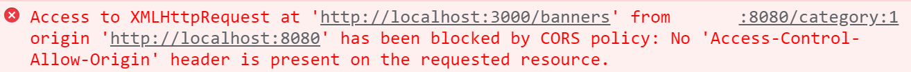

# 乐淘前端项目

## 1.项目搭建

### 1.目标

​       使用nuxt脚手架搭建前端项目

### 2.实现思路

1. 使用nuxt脚手架命令创建前端项目
2. cd 切换到项目目录 执行yarn命令安装项目依赖的包
3. 使用yarn dev 启动项目 

### 3.代码实现

```javascript
yarn create nuxt-app 项目名称
cd 项目名称
yarn dev
```

### 4.总结

使用yarn create nuxt-app 项目名称，注意：项目名称格式是英文，不要用关键字react  vue  redux等常用的包名

## 2.公共结构布局

### 1.目标

​     使用```vant``` 组件库完成乐淘前端项目公共布局结构

### 2.实现思路

1.  项目根目录创建```layouts/default.vue```文件，划分公共页面头部，主体，底部三部分, 
2.  在主体结构中，使用<Nuxt/>组件占位
3.  集成```vant ```组件到```nuxt```项目插件中
4.  参照```vant```官方使用头部和底部导航组件
5.  在pages目录中创建首页 分类 购物车 我的路由页面组件

### 3.代码实现

```layouts/default.vue```

```vue
<template>
  <!-- 项目公共布局文件 -->
  <div class="layout_home">
    <!-- 头部 -->
    <header>
      <van-nav-bar
        title="标题"
        @click-left="$router.go(-1)"
        left-text="返回"
        left-arrow
      >
        <template #right>
          <van-icon name="search" size="18" />
        </template>
      </van-nav-bar>
    </header>
    <!-- 主体 -->
    <main>
      <Nuxt />
    </main>
    <!-- 底部导航 -->
    <footer>
      <van-tabbar v-model="active">
        <van-tabbar-item icon="home-o" to="/">首页</van-tabbar-item>
        <van-tabbar-item icon="bag-o" to="/category">分类</van-tabbar-item>
        <van-tabbar-item icon="shopping-cart-o" to="/cart"
          >购物车</van-tabbar-item
        >
        <van-tabbar-item icon="friends-o" to="/my">我的</van-tabbar-item>
      </van-tabbar>
    </footer>
  </div>
</template>

<script>
export default {
  data() {
    return {
      active: 0,
    };
  },
};
</script>
```

### 4.总结

​      页面组件中，除了首页使用index.vue文件，其他页面建议使用路由名创建文件夹，里面创建对应的xxx.vue文件


## 3. 布局文件优化

### 1.目标

​    解决刷新页面，1.底部导航高亮还原问题  2.标题更新问题

### 2.实现思路

1. 在导航组件中设置name属性，使用this.route.name设置data中的active字段的值
2. data中声明title字段默认为空
3. 使用watch监听路由变化，重新设置标题
4. 在mounted方法中处理，页面刷新后的标题设置

### 3.代码实现

```plugins/default.vue```

```vue
<template>
  <!-- 项目公共布局文件 -->
  <div class="layout_home">
    <!-- 头部 -->
    <header>
      <van-nav-bar
        :title="title"
        @click-left="$router.go(-1)"
        left-text="返回"
        left-arrow
      >
        <template #right>
          <van-icon name="search" size="18" />
        </template>
      </van-nav-bar>
    </header>
    <!-- 主体 -->
    <main>
      <Nuxt />
    </main>
    <!-- 底部导航 -->
    <footer>
      <van-tabbar v-model="active">
        <van-tabbar-item name="index" icon="home-o" to="/"
          >首页</van-tabbar-item
        >
        <van-tabbar-item name="category" icon="bag-o" to="/category"
          >分类</van-tabbar-item
        >
        <van-tabbar-item name="cart" icon="shopping-cart-o" to="/cart"
          >购物车</van-tabbar-item
        >
        <van-tabbar-item name="my" icon="friends-o" to="/my"
          >我的</van-tabbar-item
        >
      </van-tabbar>
    </footer>
  </div>
</template>

<script>
export default {
  data() {
    return {
      active: this.$route.name, // 底部高亮
      title: "", // 顶部标题
    };
  },
  methods: {
    // 页面刷新后设置标题
    refreshHandle() {
      this.title = {
        index: "乐淘-首页",
        category: "乐淘-分类页",
        cart: "乐淘-购物车",
        my: "乐淘-我的",
      }[this.$route.name];
    },
  },
  mounted() {
    // 页面刷新后会触发mounted方法 所以我们需要重新设置标题
    this.refreshHandle();
  },
  // 刷新页面，路由不更改就不会触发watch方法 导致刷新页面 标题始终是乐淘-首页
  watch: {
    // 路由切换后 设置标题
    $route() {
        this.refreshHandle();
    },
  },
};
</script>
```


### 4.总结

  watch监听路由变化时设置标题，但是刷新路由，由于路由没有发生变化，所有不会触发watch，从而标题不会设置设置， 使用mounted方法重新设置标题解决

```asyncData```方法只能用在页面组件，所以不能在布局文件中使用```asyncData```方法设置标题


## 4.前端解决跨域问题



### 1.目标

​       首页调用轮播图接口读取数据，配置前端项目启动ip和端口。

### 2.实现思路

1.  使用yarn安装```$nuxtjs/axio```s模块，并在nuxt.config.js中model中做配置
2. 在nuxt.config.js中配置```serevr```修改前端项目启动的```ip```和端口

3.  在```pages/index.vue```中使用```asyncData``` 函数中的参数```$axios```调用后端轮播图接口，并在控制台中打印返回的数据

4.  安装```@nuxtjs/proxy ``` 模块解决跨域问题

### 3.代码实现

nuxt.config.js

```javascript
export default {
 
  // Modules: https://go.nuxtjs.dev/config-modules
  modules: [
    '@nuxtjs/axios',
    '@nuxtjs/proxy'
  ],
  axios: {
    proxy: true
    // 自动加前缀
    // prefix:'/api'
  },
  proxy: {
    '/api': {
      target: 'http://localhost:3000',
      pathRewrite: {
        '^/api': '/'
      }
    }
  },
  server: {
    host: 'localhost',
    port: 8080
  }
}
```

pages/index.vue

```vue
<template>
 <div class="home">
    <!-- 1.轮播图 -->
    <!-- 2.宫格 -->
    <!-- 3.活动 -->
    <!-- 4.品牌 -->
    <!-- 5.运动 -->
 </div>
</template>

<script>
export default {
   async asyncData ({$axios}) {
     const {swipperList} = await $axios.$get('/api/banners');
     console.log(swipperList);
     return {
        swipperList
     }
   }
}
</script>

```

#### 4.总结

​     什么是跨域？ 协议，域名，端口，有任意一个不同就是跨域, 解决方案：1. 前端配置代理解决    2.后端解决跨域问题


## 5.服务端解决跨域问题

### 1.目标

  服务端使用```koa-cors```中间件解决跨域问题

### 2.实现思路

1. 使用yarn安装```koa-cors```包
2. 在服务端app.js 中引入```koa-cors```
3. 使用```app.use(cors()) ```注册中间件

### 3.代码实现

```app.js```

```javascript
const Koa = require('koa')  // KOA 包
const app = new Koa()  // 创建app服务
const cors = require('koa-cors');

// 启动dotenv
require('dotenv').config()

app.use(cors())

module.exports = app

```

### 4.总结

  跨域解决方案有很多，前端可以配置代理，或者使用```nginx```代理都可以，后端也可以解决跨域问题，一般在开发中是前端解决跨域问题.


## 6.首页轮播图模块

### 1.目标

实现首页轮播图模块功能

### 2.实现思路

1. 使用vant组件库中的轮播图组件完成轮播图静态页面效果
2. 封装轮播图组件到components目录
3. 父子通信，完成轮播图交互功能呢
4. 在前端项目中的static目录存放静态图片文件

### 3.代码实现

```pages/index.vue```

```vue
<template>
 <div class="home">
    <!-- 1.轮播图 -->
    <Carousel :banners="swipperList"/>
    <!-- 2.宫格 -->
    <!-- 3.活动 -->
    <!-- 4.品牌 -->
    <!-- 5.运动 -->
 </div>
</template>

<script>
export default {
   async asyncData ({$axios}) {
     const {swipperList} = await $axios.$get('/banners');
     console.log(swipperList);
     return {
        swipperList
     }
   }
}
</script>

```

### 4.总结

## 7.首页其他组件的封装

### 1.目标

  完成宫格组件，活动组件，品牌组件，运动组件的封装

### 2.实现思路

1. 在components目录下创建```IndexGridList IndexActive IndexBrand  IndexSports```四个组件
2. 在组件中粘贴一下静态页面
3. 在页面中使用组件

### 3.代码实现

```components/IndexGridList.vue```

```vue
<template>
  <div class="grid">
    <van-grid :border="false" :column-num="3">
      <van-grid-item>
        <van-image src="https://img01.yzcdn.cn/vant/apple-2.jpg" />
      </van-grid-item>
      <van-grid-item>
        <van-image src="https://img01.yzcdn.cn/vant/apple-3.jpg" />
      </van-grid-item>
      <van-grid-item>
        <van-image src="https://img01.yzcdn.cn/vant/apple-1.jpg" />
      </van-grid-item>
      <van-grid-item>
        <van-image src="https://img01.yzcdn.cn/vant/apple-2.jpg" />
      </van-grid-item>
      <van-grid-item>
        <van-image src="https://img01.yzcdn.cn/vant/apple-3.jpg" />
      </van-grid-item> 
    </van-grid>
  </div>
</template>

<script>
export default {
  props:['gridList']
};
</script>
```

```components/IndexActive.vue```

```vue
<template>
  <div class="cz_active">
    <a href="#">
      
      
    </a>
    <a href="#">
      
    </a>
    <a href="#">
      
      
    </a>
  </div>
</template>

<style scoped>
.cz_active {
  border-top: 1px solid #ccc;
  margin-top: 15px;
  padding: 0 10px;
}
.cz_active a:nth-child(2n + 1) {
  width: 67.1%;
  float: left;
}
.cz_active a:nth-child(2n + 1) img {
  width: 50%;
  float: left;
}
.cz_active a:nth-child(2) {
  width: 32.9%;
  float: right;
}
.cz_active a:nth-child(2) img {
  width: 100%;
}
</style>
```

```components/IndexBrand.vue```

```vue
<template>
  <div class="cz_brand">
    
    <ul>
      <li>
        <a href="#">
          
        </a>
      </li>
      <li>
        <a href="#">
          
        </a>
      </li>
      <li>
        <a href="#">
          
        </a>
      </li>
      <li>
        <a href="#">
          
        </a>
      </li>
      <li>
        <a href="#">
          
        </a>
      </li>
      <li>
        <a href="#">
          
        </a>
      </li>
      <li>
        <a href="#">
          
        </a>
      </li>
      <li>
        <a href="#">
          
        </a>
      </li>
    </ul>
  </div>
</template>

<style scoped>
.cz_brand {
  padding: 0 10px;
}
.cz_brand > img {
  width: 100%;
}

.cz_brand ul {
  list-style: none;
  margin: 0;
  padding: 0;
}
.cz_brand ul li {
  width: 25%;
  float: left;
}
.cz_brand ul li a {
  display: block;
}
.cz_brand ul li a img {
  width: 100%;
}
</style>
```

```components/IndexSport.vue```

```vue
<template>
  <div class="cz_live">
    
    <div class="mui-clearfix">
      <a href="#" class="cz_product">
        <div class="box">
          
          <p class="name">adidas阿迪达斯 男式 场下休闲篮球鞋S83700</p>
          <p>
            <span class="price">¥560.00</span
            ><span class="oldPrice">¥888.00</span>
          </p>
          <button class="button">立即购买</button>
        </div>
      </a>
      <a href="#" class="cz_product">
        <div class="box">
          
          <p class="name">adidas阿迪达斯 男式 场下休闲篮球鞋S83700</p>
          <p>
            <span class="price">¥560.00</span
            ><span class="oldPrice">¥888.00</span>
          </p>
          <button class="button">立即购买</button>
        </div>
      </a>
      <a href="#" class="cz_product">
        <div class="box">
          
          <p class="name">adidas阿迪达斯 男式 场下休闲篮球鞋S83700</p>
          <p>
            <span class="price">¥560.00</span
            ><span class="oldPrice">¥888.00</span>
          </p>
          <button class="button">立即购买</button>
        </div>
      </a>
      <a href="#" class="cz_product">
        <div class="box">
          
          <p class="name">adidas阿迪达斯 男式 场下休闲篮球鞋S83700</p>
          <p>
            <span class="price">¥560.00</span
            ><span class="oldPrice">¥888.00</span>
          </p>
          <button class="button">立即购买</button>
        </div>
      </a>
    </div>
  </div>
</template>
<style scoped>
.cz_live {
  padding: 0 10px;
  margin-top: 10px;
  overflow: hidden;
  padding-bottom: 100px;
}
.cz_live > img {
  width: 100%;
}

.mui-clearfix:after {
  content: "020";
  display: block;
  height: 0;
  clear: both;
  visibility: hidden;
}

.mui-clearfix {
  /* 触发 hasLayout */
  zoom: 1;
}

.cz_product {
  float: left;
  width: 50%;
  padding: 0 5px;
  margin-bottom: 10px;
  box-sizing: border-box;
}
.cz_product .box {
  width: 100%;
  box-shadow: 0 0 5px #ccc;
  text-align: center;
  padding: 10px 0;
}
.cz_product .box img {
  width: 100%;
}
.cz_product .box .name {
  padding: 0 10px;
  height: 36px;
  line-height: 18px;
  overflow: hidden;
}
.cz_product .box .price {
  font-size: 12px;
  color: #f30;
  margin-right: 10px;
}
.cz_product .box .oldPrice {
  font-size: 12px;
  color: #ccc;
  text-decoration: line-through;
}
.cz_product .box .button {
  background: #006699;
  color: #fff;
}
</style>
```

#### 4.总结

​     对于公共可复用组件要单独封装到components目录下的功能组件，方便组件复用。


## 8.首页组件交互

### 1.目标

​     调用后端接口，使用父子组件通信，完成首页组件的动态数据交互。

### 2.实现思路

1. 在页面组件中的```asyncData```方法中解构出```$axios```方法调用后端接口，拿数据
2. 使用父子组件通信技术完成首页复用组件的交互

### 3.代码实现

pages/index.vue

```vue
<template>
 <div class="home">
    <!-- 1.轮播图 -->
    <IndexCarousel :banners="swipperList"/>
    <!-- 2.宫格 -->
    <IndexGridList :gridlist="gridlist" />
    <!-- 3.活动 -->
    <IndexActive />
    <!-- 4.品牌 -->
    <IndexBrand />
    <!-- 5.运动 -->
    <IndexSport :sports="sports"/>
 </div>
</template>

<script>
export default {
   async asyncData ({$axios}) {
     const {swipperList} = await $axios.$get('/banners');
     const {gridlist} = await $axios.$get('/gridlist');
     const {sports} = await $axios.$get('/sports');
     
     return {
        swipperList,
        gridlist,
        sports
     }
   }
}
</script>
```

```components/IndexGirdList.vue```

```vue
<template>
  <div class="grid">
    <van-grid :border="false" :column-num="3">
      <van-grid-item v-for="item in gridlist" :key="item.id">
        <van-image :src="item.img_src" />
      </van-grid-item>
    </van-grid>
  </div>
</template>

<script>
export default {
  props:['gridlist']
};
</script>
```

```components/IndexSport.vue```

```vue
<template>
  <div class="cz_live">
    
    <div class="mui-clearfix">
      <a href="#" class="cz_product" v-for="item in sports" :key="item.id">
        <div class="box">
          
          <p class="name">{{ item.name }}</p>
          <p>
            <span class="price">¥{{item.price}}</span
            ><span class="oldPrice">¥{{ item.oldPrice }}</span>
          </p>
          <button class="button">立即购买</button>
        </div>
      </a>
    </div>
  </div>
</template>
<script>
export default {
  props:['sports']
}
</script>
<style scoped>
.cz_live {
  padding: 0 10px;
  margin-top: 10px;
  overflow: hidden;
  padding-bottom: 100px;
}
.cz_live > img {
  width: 100%;
}

.mui-clearfix:after {
  content: "020";
  display: block;
  height: 0;
  clear: both;
  visibility: hidden;
}

.mui-clearfix {
  /* 触发 hasLayout */
  zoom: 1;
}

.cz_product {
  float: left;
  width: 50%;
  padding: 0 5px;
  margin-bottom: 10px;
  box-sizing: border-box;
}
.cz_product .box {
  width: 100%;
  box-shadow: 0 0 5px #ccc;
  text-align: center;
  padding: 10px 0;
}
.cz_product .box img {
  width: 100%;
}
.cz_product .box .name {
  padding: 0 10px;
  height: 36px;
  line-height: 18px;
  overflow: hidden;
}
.cz_product .box .price {
  font-size: 12px;
  color: #f30;
  margin-right: 10px;
}
.cz_product .box .oldPrice {
  font-size: 12px;
  color: #ccc;
  text-decoration: line-through;
}
.cz_product .box .button {
  background: #006699;
  color: #fff;
}
</style>
```

#### 4.总结

​            使用props完成父子组件通信，<组件名  :属性 />  属性前面记得要：传递动态数据

## 9.```$nuxtjs/axios```二次封装

### 1. 请求和响应拦截

#### 1.目标

​     完成```@nuxtjs/axios```二次封装，完成请求，响应，错误拦截。

####  2.实现思路

1. 创建plugins/axios.js ， 设置请求，响应，错误拦截
2. 在store/index.js  导出state,用户token默认为空 表示用户未登录
3. 请求中拦截中读取store中的token，设置请求头Authorization
4. 在响应拦截中，影响状态码错误，使用```vant```组件中Toast组件提示用户
5. 在错误拦截中，如果http状态码为401，则重定向到登录页面
6. 封装http错误状态码，给错误拦截使用
7. 在nuxt.config.js中plugins配置中完成插件的注册

#### 3.代码实现

````plugins/axios/httpcode.js```

```javascript
export const httpcode = {
    // http状态吗
    400: '请求错误(400)',
    401: '未授权，请重新登录(401)',
    403: '未登录，请重新登录(401)',
    404: 'Not Found 请求出错(404)',
    412: '未找到有效session',
    408: '请求超时(408)',
    500: '服务器错误(500)',
    501: '服务未实现(501)',
    502: '网络错误(502)',
    503: '服务不可用(503)',
    504: '网络超时(504)',
    505: 'HTTP版本不受支持(505)'
}
```


```plugins/axios/index.js```

```javascript
import { httpcode } from './httpcode';
import { Toast } from 'vant'
export default function ({ $axios, redirect,store }) {
    // 请求拦截
    $axios.onRequest(config => {
      //token验证
      if (store.state.token) {
        //  设置请求头的token, 用于身份验证
        $axios.setHeader('Authorization', `Bearer ${store.state.token}`);
      } 
      return config;
    })

    // 响应拦截
    $axios.onResponse(response => {
        // console.log(response,'response');
        const { status, msg} = response.data;
        if (status !== 200) {
          Toast(msg);
        }
    });
  
    // 错误拦截
    $axios.onError(error => {
      const code = parseInt(error.response && error.response.status)
      // 弹框提示
      Toast(httpcode[code]);
      if (code === 404) {
        redirect('/404')
      } else if (code == 401) {
        redirect('/my/login');
      }
    })
  }
```

store/index.js

```javascript
export const state = ()=>{
    return {
        token:''
    }
}
```


#### 4.总结

   在请求拦截中读取store上的token并且设置请求头，在响应拦截中，遇到错误，弹框提示用户，在错误拦截中进行页面跳转，或者提示用户


### 2.请求方法封装

#### 1.目标

​       我们再使用```@nuxtjs/axios```模块调用接口时，分为get 和post请求等，还需要区分get和post的参数```get/delete的请求参数是params  post/post请求参数data```，所以需要进行二次封装

#### 2.实现思路

1. 在```plugins/axios/index.js``` 继续封装请求方法
2. 在```plugins/axios/index.js```  注入request
3. 在nuxt.config.js中的plugins注册插件
4. 在页面中```asyncData```方法中的参数中解构$request请求接口


#### 3.代码实现

```plugins/axios/index.js```

```javascript
import { httpcode } from './httpcode';
import { Toast } from 'vant'
export default function ({ $axios, redirect,store }, inject) {
    // 请求方法封装
    let requestMethods = {};

    ['get','post', 'delete', 'pust'].forEach(method =>{
       let paramsOrData = method == 'get' || method == 'delete' ? 'params' :'data';
       requestMethods[method] = function (url, data) {
          return $axios({
             method,
             url,
             [paramsOrData]:data
          })
       }
    });

    inject('request', requestMethods);

  }
```

nuxt.config.js

```javascript
  plugins: [
    '~/plugins/vant',
    '~/plugins/axios'
  ],
```


#### 4.总结

   请求方法不同，请求参数格式不同，对于不同的就是变化的，要进行二次封装.


### 3.请求方法封装优化

#### 1.目的

   ```@nuxtjs/axios模块支持  $axios.get  同样支持$axios.$get 区别是， $axios.$get拿到的数据少一层data```

#### 2.实现思路

1. 修改请求方法的封装，````把$axios.get请求换成$axios.$get请求```
2. 其他请求方法以此类推
3. 在页面中```asyncData```方法中的参数中解构$request请求接口

#### 3.代码实现

````plugins/axios/index.js```

```javascript
import { httpcode } from './httpcode';
import { Toast } from 'vant'
export default function ({ $axios, redirect,store }, inject) {
    // 请求方法封装
    let requestMethods = {};
    ['$get','$post', '$delete', '#put'].forEach(method =>{
       requestMethods[method] = function (url, data) {
          return $axios[method](
             url,
             data
          )
       }
    });

    inject('request', requestMethods);

  }
```

#### 4.总结

   使用$get $post请求，读取接口数据时，少一层data，代码书写更优雅，而且封装时无需考虑```params```参数还是data参数


### 4.请求```api```的封装

#### 1.目标

   前端项目中会有很多接口调用，对于接口地址，我们不应该散落到页面中，而是统一到一个文件方便管理，所以我们要对项目中的API进行封装

#### 2.实现思路

1. 创建plugins/api.js 插件
2. 在此插件中注入```api```完成项目中所有```api```的封装,此插件以来request插件
3. nuxt.config.js中的plugins中注入```api```插件
4. 在页面中```asyncData```方法中的参数中解构```$api``` 直接调用api


#### 3.代码实现

plugins/api.js

```javascript
export default function ({ app: { $request } }, inject) {
    inject('api', {
        /**
        * 首页宫格数据
        * @returns 
        */
        IndexGrid() {
            return $request.$get('/gridlist');
        },
        /**
         * 首页轮播图数据
         * @returns 
         */
        IndexBanners() {
            return $request.$get('/banners');
        },
        /**
         * 首页运动专区数据
         * @returns 
         */
        IndexSport() {
            return $request.$get('/sports');
        },
    });
}
```

nuxt.config.js

```javascript
  plugins: [
    '~/plugins/vant',
    '~/plugins/axios',
    '~/plugins/axios/api'
  ],
```

pages/index.vue

```vue
<template>
 <div class="home">
    <!-- 1.轮播图 -->
    <IndexCarousel :banners="swipperList"/>
    <!-- 2.宫格 -->
    <IndexGridList :gridlist="gridlist" />
    <!-- 3.活动 -->
    <IndexActive />
    <!-- 4.品牌 -->
    <IndexBrand />
    <!-- 5.运动 -->
    <IndexSport :sports="sports"/>
 </div>
</template>

<script>
export default {
   async asyncData ({$axios,app:{$api}}) {
       
     const { swipperList } = await $api.IndexBanners();
     const { gridlist } = await $api.IndexGrid();
     const { sports } = await $api.IndexSport();
     
     // 并发请求
     // const [{swipperList},{gridlist},{sports}] = await Promise.all([$api.IndexBanners(),await $api.IndexGrid(), await $api.IndexSport() ]);
       
     eturn {
        swipperList,
        gridlist,
        sports
     }
   }
}
</script>

```


## 10.分类页面

   效果演示


### 1.目标

​     完成分类页面交互

### 2.实现思路

1. 使用```vant```中```TreeSelect```分类组件完成静态页面

2. 调用一级分类和二级分类接口,按照```TreeSelect```组件对一级分类数据格式要求处理一级分类数据
3. 参照vantage组件官方文档，给一级分类绑定```click-nav```事件，点击一级分类加载二级分类

### 3.代码实现

pages/category/index.vue

```vue
<template>
  <div class="category">
    <van-tree-select
      height="100vw"
      :items="oneCategoryList"
      :main-active-index.sync="active"
      @click-nav="categoryHandle"
    >
      <template #content>
        <div v-for="item in twoCategory" :key="item.id" class="cate_item">
          <van-image  width="4rem" :src="item.brandLogo" />
          <p>{{ item.brandName }}</p>
        </div>
      </template>
    </van-tree-select>
  </div>
</template>

<script>
export default {
  data() {
    return {
      active: 0,
    };
  },
  methods: {
   async categoryHandle(index) {
      // 根据选中的一级分类id加载二级分类, 默认第一个一级分类是选中
      let { twoCategory } = await this.$api.TwoCategory(
        this.oneCategoryList[index]["id"]
      );
      this.twoCategory = twoCategory;
    },
  },
  async asyncData({ $api }) {
    let active = 0;
    // 记载一级分类
    let { oneCategoryList } = await $api.OneCategory();
    // 处理一级分类数据
    oneCategoryList = oneCategoryList.map((item) => {
      return {
        id: item.id,
        text: item.categoryName,
      };
    });
    // 根据选中的一级分类id加载二级分类, 默认第一个一级分类是选中
    let { twoCategory } = await $api.TwoCategory(oneCategoryList[active]["id"]);
    return {
      oneCategoryList,
      twoCategory,
    };
  },
};
</script>

<style scoped>
.cate_item {
  float: left;
  text-align: center;
}
</style>
```

#### 4.总结

在使用```vant```中的组件时，需要仔细阅读官方文档的```api```，复制粘贴后按照格式，调整数据或者事件绑定。

##       11.会员

1. 会员注册模块
2. 会员登录模块
3. 会员中心模块

  1.目标


###          1.注册静态页

           ```vue
           <template>
             <div class="register">
               <van-form @submit="onSubmit">
                 <van-field
                   v-model="username"
                   name="username"
                   label="用户名"
                   placeholder="用户名"
                   :rules="[{ required: true, message: '请填写用户名' }]"
                 />
                 <van-field
                   v-model="password"
                   type="password"
                   name="password"
                   label="密码"
                   placeholder="密码"
                   :rules="[{ required: true, message: '请填写密码' }]"
                 />
                 <van-field
                   v-model="passwordOk"
                   type="password"
                   name="passwordOk"
                   label="确认密码"
                   placeholder="确认密码"
                   :rules="[{ required: true, message: '请填写密码' }]"
                 />
                 <van-field
                   v-model="mobile"
                   name="passwordOk"
                   label="手机号"
                   placeholder="手机号"
                   :rules="[{ required: true, message: '请填写手机号' }]"
                 />
                 <van-field
                   v-model="sms"
                   name="sms"
                   label="短信验证码"
                   placeholder="短信验证码"
                   :rules="[{ required: true, message: '请输入短信验证码' }]"
                 >
                   <template #button>
                     <van-button
                       native-type="button"
                       :disabled="disabled"
                       size="small"
                       type="primary"
                       >发送验证码</van-button
                     >
                   </template>
                 </van-field>
                 <div style="margin: 16px">
                   <van-button round block type="info" native-type="submit"
                     >提交</van-button
                   >
                 </div>
               </van-form>
           	<van-row type="flex" justify="space-between" class="license">
                 <van-col span="12" offset="2">
                   <van-checkbox v-model="isAgree">我同意《会员服务协议》</van-checkbox>
                 </van-col>
                 <van-col span="6">
                   <NuxtLink to="/user/login">立即登录</NuxtLink>
                 </van-col>
               </van-row>
             </div>
           </template>
           
           <script>
           export default {
             data() {
               return {
                 username: "", // 用户名
                 password: "", // 密码
                 mobile: "", // 手机号
                 passwordOk: "", // 确认密码
                 sms: "", // 短信验证码
                 isAgree:false, // 是否勾选协议
                 disabled:false // 默认发送短信的按钮是可以点击的
               };
             },
             methods: {
               onSubmit(values) {
                 console.log("submit", values);
               },
             },
           };
           </script>
           
           <style>
               <style>
           .rigister .license {
             font-size: 12px;
           }
           .rigister .license input {
             vertical-align: top;
           }
           </style>
           </style>
           ```

###       2.注册交互

     ```vue
     <template>
       <div class="register">
         <van-form @submit="onSubmit">
           <van-field
             v-model="username"
             name="username"
             label="用户名"
             placeholder="用户名"
             :rules="[{ required: true, message: '请填写用户名' }]"
           />
           <van-field
             v-model="password"
             type="password"
             name="password"
             label="密码"
             placeholder="密码"
             :rules="[{ required: true, message: '请填写密码' }]"
           />
           <van-field
             v-model="passwordOk"
             type="password"
             name="passwordOk"
             label="确认密码"
             placeholder="确认密码"
             :rules="[{ validator: validatorPassword, message: '密码不一致' }]"
           />
           <van-field
             v-model="mobile"
             name="mobile"
             label="手机号"
             placeholder="手机号"
             :rules="[{ validator: validatorMobile, message: '请填写手机号' }]"
           />
           <van-field
             v-model="sms"
             name="sms"
             label="短信验证码"
             placeholder="短信验证码"
             :rules="[{ required: true, message: '请输入短信验证码' }]"
           >
             <template #button>
               <van-button
                 native-type="button"
                 :disabled="disabled"
                 size="small"
                 type="primary"
                 @click="sendSms"
                 >发送验证码</van-button
               >
             </template>
           </van-field>
           <div style="margin: 16px">
             <van-button round block type="info" native-type="submit"
               >提交</van-button
             >
           </div>
         </van-form>
          <van-row type="flex" justify="space-between" class="license">
           <van-col span="12" offset="2">
             <van-checkbox v-model="isAgree">我同意《会员服务协议》</van-checkbox>
           </van-col>
           <van-col span="6">
             <NuxtLink to="/user/login">立即登录</NuxtLink>
           </van-col>
         </van-row>
       </div>
     </template>
     
     <script>
     import { Toast } from "vant";
     export default {
       data() {
         return {
           username: "", // 用户名
           password: "", // 密码
           mobile: "", // 手机号
           passwordOk: "", // 确认密码
           sms: "", // 短信验证码
           isAgree: true, // 是否勾选协议
           disabled: false, // 默认发送短信的按钮是可以点击的
           validatorCode: "", // 保存调用短信接口返回的验证码
         };
       },
       methods: {
         // 验证手机号
         /*
           * 移动号码包括的号段：134/135/136/137,138,139；
           * 147/148(物联卡号)；
           * 150/151/152/157/158/159；
           * 165（虚拟运营商）；
           * 1703/1705/1706（虚拟运营商）、178；
           * 182/183/184/187/188
           * 198
     
           * 联通号段包括：130/131
           * 145
           * 155/156
           * 166/167(虚拟运营商)
           * 1704/1707/1708/1709、171
           * 186/186
           *
           * 电信号段包括： 133
           * 153
           * 162(虚拟运营商)
           * 1700/1701/1702(虚拟运营商)
           * 180/181/189
           * 191/199
           * */
         validatorMobile(phone) {
           let reg =
             /^1(3[0-9]|4[5,7]|5[0,1,2,3,5,6,7,8,9]|6[2,5,6,7]|7[0,1,7,8]|8[0-9]|9[1,8,9])\d{8}$/;
           return reg.test(phone);
         },
     
         // 确认密码
         validatorPassword(password) {
           return password == this.password;
         },
         // 发送验证码
         async sendSms () {
             if (!this.validatorMobile(this.mobile)) {
                 Toast.fail('手机号格式有误');
                 return;
             } 
             // 发送短信按钮禁用
             this.disabled = true;
             const { data  } = await  this.$api.SendSms({mobile:this.mobile});  
             if (data.status == 200) {
                 this.disabled = false;
                 this.validatorCode = data.code
             }
         },
     
         // 提交
         async onSubmit(values) {
           //是否勾选协议
           if (!this.isAgree) {
               Toast.fail('请勾选协议');
               return;
           }   
           // 校验短信验证码
           if (this.sms != this.validatorCode) {
             Toast.fail("验证码有误");
             return;
           }
           //   console.log("submit", values);
           //  注册
          const  data = await this.$api.Register(values);
          if (data.data.status == 200) {
              this.$router.push('/user/login');
          }
         },
       },
     };
     </script>
     
     <style>
     .rigister .license {
       font-size: 12px;
     }
     .rigister .license input {
       vertical-align: top;
     }
     </style>
     ```

###       3.登录静态页

       ```vue
       <template>
         <div class="login">
           <van-form @submit="onSubmit">
             <van-field
               v-model="username"
               name="username"
               label="用户名"
               placeholder="用户名"
               :rules="[{ required: true, message: '请填写用户名' }]"
             />
             <van-field
               v-model="password"
               type="password"
               name="password"
               label="密码"
               placeholder="密码"
               :rules="[{ required: true, message: '请填写密码' }]"
             />
             <div style="margin: 16px">
               <van-button round block type="info" native-type="submit"
                 >提交</van-button
               >
             </div>
           </van-form>
           <van-row type="flex" justify="space-between" class="license">
             <van-col span="6" offset="2">
               <NuxtLink to="/user/register">立即注册</NuxtLink>
             </van-col>
           </van-row>
         </div>
       </template>
       
       <script>
       export default {
         data() {
           return {
             username: "",
             password: "",
           };
         },
         methods: {
           async onSubmit(values) {
             console.log("submit", values);
           },
         },
       };
       </script>
       
       <style>
       </style>
       ```

###        4.登录交互

​                 1.登录成功后需要把用户信息和token存储到store

​		store目录下index.js

         ```javascript
         // 公共仓库
         export const state = () => {
              return {
                  token:'',
                  userInfo:{} // 用户信息
              }
         }
         
         export const mutations = {
             // 存储token
             setToken (state, token) {
                 state.token = token;
             },
             // 存储用户信息
             setUserInfo (state, userInfo) {
                 state.userInfo = userInfo;
             }
         }
         ```

​       pages目录 login.vue

         ```vue
         <template>
           <div class="login">
             <van-form @submit="onSubmit">
               <van-field
                 v-model="username"
                 name="username"
                 label="用户名"
                 placeholder="用户名"
                 :rules="[{ required: true, message: '请填写用户名' }]"
               />
               <van-field
                 v-model="password"
                 type="password"
                 name="password"
                 label="密码"
                 placeholder="密码"
                 :rules="[{ required: true, message: '请填写密码' }]"
               />
               <div style="margin: 16px">
                 <van-button round block type="info" native-type="submit"
                   >提交</van-button
                 >
               </div>
             </van-form>
             <van-row type="flex" justify="space-between" class="license">
               <van-col span="6" offset="2">
                 <NuxtLink to="/user/register">立即注册</NuxtLink>
               </van-col>
             </van-row>
           </div>
         </template>
         
         <script>
         import { mapMutations } from 'vuex';
         export default {
           data() {
             return {
               username: "",
               password: "",
             };
           },
           methods: {
             ...mapMutations(['setToken', 'setUserInfo']),
             async onSubmit(values) {
               console.log("submit", values);
               const {data:{token, status,userInfo}} =  await this.$api.Login(values);
               if (status == 200) {
                   // this.$store.commit('setToken', token);  // 存储token
                   // this.$store.commit('setUserInfo', userInfo);  // 存储用户信息\
                   this.setToken(token);
                   this.setUserInfo(userInfo);
                   this.$router.push('/user'); // 跳转会员中心  
               }
             },
           },
         };
         </script>
         
         <style>
         </style>
         ```


## 11.loading组件

###  1.目标

​    页面切换时，需要加载接口，接口记载过程中，页面没有数据，显示空白，为了提升用户体验所以需要设置loading效果，页面显示完毕，需要停止loding

###  2.实现思路

1.   在```components/Loading.vue``` 创建Loading组件 
2.    使用```vant```中van-overlay遮罩组件和van-loading显示加载样式
3.    在Loading组件中设置默认加载loading状态为false，在methods中定义start 和 finish两个方法显示和隐藏loading
4.    在nuxt.config.js中注册Loading组件


### 3.实现思路

 components/Loading.vue

```vue
<template>
  <van-overlay :show="loading"  class="loading" z-index="10">
    <van-loading color="#fff" v-show="loading"  :vertical="true">加载中...</van-loading>
  </van-overlay>
</template>

<script>
export default {
  data() {
    return {
      loading: false,
    };
  },
  methods: {
    start() {
      console.log(1);
      this.loading = true;
    },
    finish() {
        console.log(2);
      this.loading = false;
    },
  },
};
</script>

<style scoped>
.loading {
  display: flex;
  align-items: center;
  justify-content: center;
  height: 100%;
}
</style>
```

nuxt.config.js

```javascript
loading:'~/components/Loading.vue',
```

### 4.总结

 在```nuxt```项目中，只需要配置Loading组件中即可，实现全局loading效果，无需在```axios```中进行封装,只需要按照配置做，```nuxt```帮你自动实现loading


​	

##      8.nuxtServerInit

​         1.解决刷新页面token丢失问题

​         2. 安装js-cookie 和 cookieparser

```javascript
yarn add js-cookie  cookieparser 
```

​        登录页面

```vue
<template>
  <div class="login">
    <van-form @submit="onSubmit">
      <van-field
        v-model="username"
        name="username"
        label="用户名"
        placeholder="用户名"
        :rules="[{ required: true, message: '请填写用户名' }]"
      />
      <van-field
        v-model="password"
        type="password"
        name="password"
        label="密码"
        placeholder="密码"
        :rules="[{ required: true, message: '请填写密码' }]"
      />
      <div style="margin: 16px">
        <van-button round block type="info" native-type="submit"
          >提交</van-button
        >
      </div>
    </van-form>
    <van-row type="flex" justify="space-between" class="license">
      <van-col span="6" offset="2">
        <NuxtLink to="/user/register">立即注册</NuxtLink>
      </van-col>
    </van-row>
  </div>
</template>

<script>
import Cookie from 'js-cookie';
import { mapMutations } from 'vuex';
export default {
  data() {
    return {
      username: "",
      password: "",
    };
  },
  methods: {
    ...mapMutations(['setToken', 'setUserInfo']),
    async onSubmit(values) {
      // console.log("submit", values);
      const {data:{token, status,userInfo}} =  await this.$api.Login(values);
      if (status == 200) {
          // this.$store.commit('setToken', token);  // 存储token
          // this.$store.commit('setUserInfo', userInfo);  // 存储用户信息\
          Cookie.set('token', token);
          Cookie.set('userInfo', JSON.stringify(userInfo));
          this.setToken(token);
          this.setUserInfo(userInfo);
          this.$router.push('/user'); // 跳转会员中心  
      }
    },
  },
};
</script>

<style>
</style>
```

​      store目录下index.js

```javascript
  const cookieParser = require('cookieparser');
  // 公共仓库
  export const state = () => {
       return {
           token:'',
           userInfo:{} // 用户信息
       }
  }
  
  export const mutations = {
      // 存储token
      setToken (state, token) {
          state.token = token;
      },
      // 存储用户信息
      setUserInfo (state, userInfo) {
          state.userInfo = userInfo;
      }
  }
  
  export const actions =  {
      nuxtServerInit ({commit}, {req}) {
         let token = '';
         let userInfo = '';
         if (req.headers.cookie) {
              let parsed = cookieParser.parse(req.headers.cookie);
              token = parsed.token;
              userInfo = JSON.parse(parsed.userInfo);
         }
         commit('setToken', token);
         commit('setUserInfo', userInfo);
      }
```

##      9.支付

​       静态页面 (pages/pay/pay.vue)

```vue
   <template>
     <div class="pay">
       <van-sticky :offset-top="50">
         <h3>微信支付</h3>
         <van-image
           width="150"
           height="150"
           src="https://img01.yzcdn.cn/vant/cat.jpeg"
         />
       </van-sticky>
     </div>
   </template>
   
   <script>
   
   </script>
   
   <style scoped>
   .pay {
     text-align: center;
   }
   </style>
```

​     动态交互

```vue
<template>
  <div class="pay">
    <van-sticky :offset-top="50">
      <h3>微信支付</h3>
      <van-image
        v-if="!payStatus"
        width="150"
        height="150"
        :src="payUrl"
      />
      <h2>{{ payStatus }}</h2>
    </van-sticky>
  </div>
</template>

<script>
import queryString from "query-string";
import { Toast } from "vant";
export default {
  data() {
    return {
      payUrl: "",
      timer: null, // 订单查询轮询id
      payStatus: "",
    };
  },
  methods: {
    queryOrder() {
      this.$api.OrderQuery();
    },
  },
  async mounted() {
    const parsed = queryString.parse(location.search);
    // console.log(parsed, "parsed");
    // 下单请求参数
    const params = {
      body: parsed.name,
      ip: "127.0.0.1",
      total_fee: +parsed.price,
      trade_type: "NATIVE",
    };
    const data = await this.$api.WeiXinOrder(params);
    // 订单已支付
    let order = data.data.data;
    if (data.data.status == 1050) {
        this.payStatus = '该订单已支付'
        console.log(22);
        return;
    }
    if (
      order.return_code[0] == "SUCCESS" &&
      order.return_msg[0] == "OK" &&
      order.result_code[0] == "SUCCESS"
    ) {
      // 支付二维码
      this.payUrl = order.payUrl;

      // 轮训查询订单支付状态
      this.timer = setInterval(async () => {
        if (this.payStatus == "支付成功") {
          this.timer = null;
          return;
        }
        // 查询订单
        const data = await this.$api.OrderQuery();
        let orderQuery = data.data.data;
        if (
          orderQuery.return_code[0] == "SUCCESS" &&
          orderQuery.return_msg[0] == "OK" &&
          orderQuery.result_code == "SUCCESS"
        ) {
          this.payStatus = orderQuery.trade_state_desc[0];
        } else {
          this.payStatus = orderQuery.err_code_des; // 该订单已支付
        }
      }, 10000);
    } else {
      Toast.fail(orderQuery.return_msg[0]);
    }
  },

  beforeDestroy() {
    this.timer = null;
  },
};
</script>

<style scoped>
.pay {
  text-align: center;
}
</style>
```

## 10.404页面

pages目录下_.vue

```vue
<template>
  <van-empty description="页面不存在" />
</template>

<script>
export default {

}
</script>

<style>

</style>
```


​                