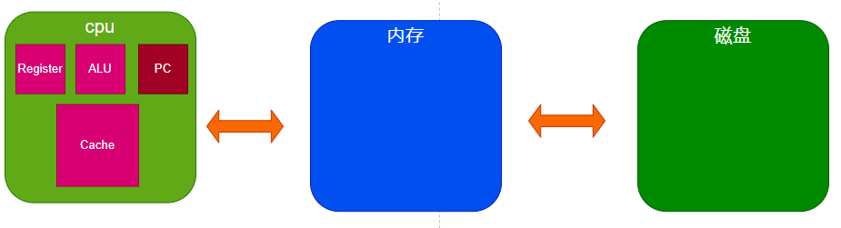
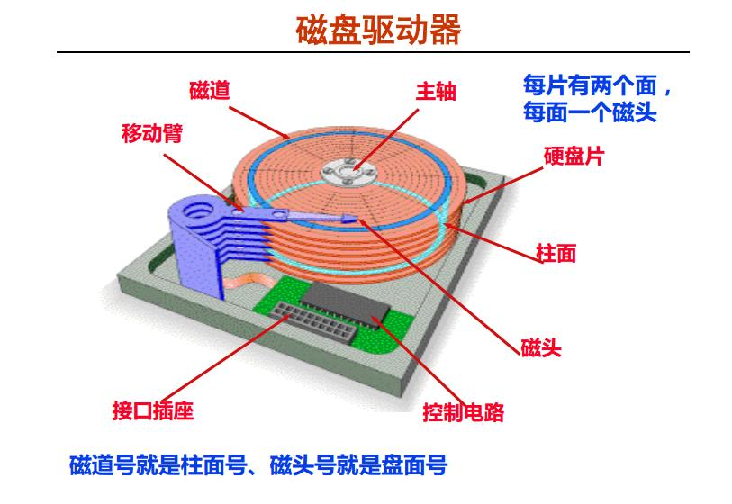
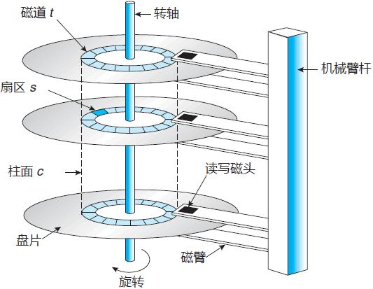
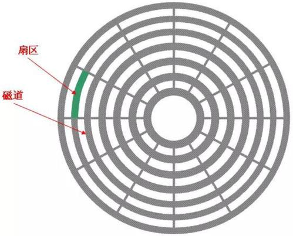
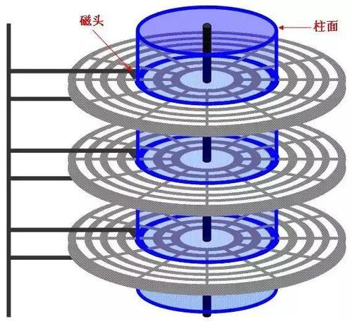
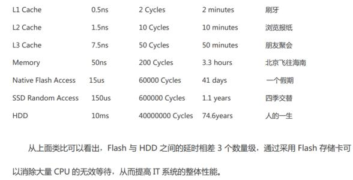
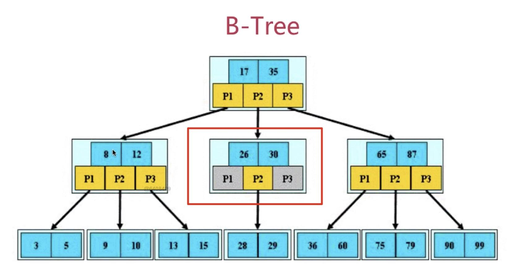
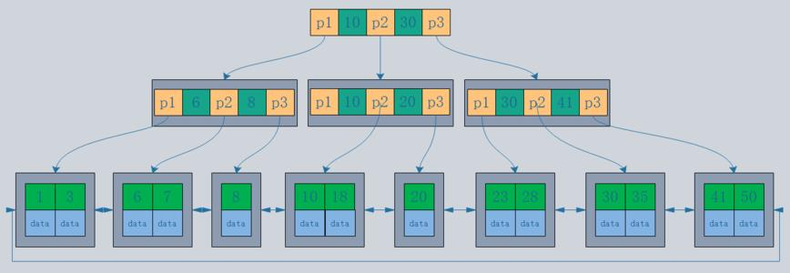
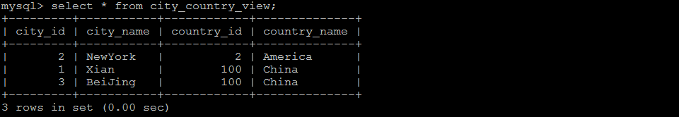
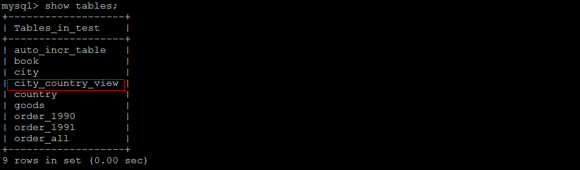

# Mysql高级01

### MySQL高级课程简介

| 序号 | 01             | 02          | 03             | 04             |
| :--: | -------------- | ----------- | -------------- | -------------- |
|  1   | 基本硬件知识   | 体系结构    | 应用优化       | MySQL 常用工具 |
|  2   | 索引           | 存储引擎    | 查询缓存优化   | MySQL 日志     |
|  3   | 视图           | 优化SQL步骤 | 内存管理及优化 | MySQL 主从复制 |
|  4   | 存储过程和函数 | 索引使用    | MySQL锁问题    |                |
|  5   | 触发器         | SQL优化     | 常用SQL技巧    |                |


### 1. 基本硬件知识

#### 1.1   计算机工作原理



1.中央处理器（英文Central Processing Unit，CPU）是一台计算机的运算核心和控制核心。CPU、内部存储器和输入/输出设备是电子计算机三大核心部件。其功能主要是解释计算机指令以及处理计算机软件中的数据。

​	CPU核心组件：

​	1.**算术逻辑单元（Arithmetic&logical Unit）**是[中央处理器](https://baike.baidu.com/item/中央处理器)(CPU)的执行单元，是所有中央处理器的核心组成部分，由"And Gate"（[与门](https://baike.baidu.com/item/与门)） 和"Or Gate"（[或门](https://baike.baidu.com/item/或门)）构成的算术逻辑单元，主要功能是进行二位元的算术运算，如加减乘(不包括整数除法)。

​	2.PC：负责储存内存地址，该地址指向下一条即将执行的指令，每解释执行完一条指令，pc寄存器的值就会自动被更新为下一条指令的地址。

​	3.寄存器（Register）是CPU内部的元件，所以在寄存器之间的数据传送非常快。用途：1.可将寄存器内的数据执行算术及逻辑运算。2.存于寄存器内的地址可用来指向内存的某个位置，即寻址。3.可以用来读写数据到电脑的周边设备。

​	4.Cache:缓存

2.内存(Memory)是[计算机](https://baike.baidu.com/item/计算机/140338)的重要部件之一，也称[内存储器](https://baike.baidu.com/item/内存储器/834392)和[主存储器](https://baike.baidu.com/item/主存储器/10635399)，它用于暂时存放CPU中的运算数据，与[硬盘](https://baike.baidu.com/item/硬盘/159825)等[外部存储器](https://baike.baidu.com/item/外部存储器/4843180)交换的数据。它是[外存](https://baike.baidu.com/item/外存/2445612)与[CPU](https://baike.baidu.com/item/CPU/120556)进行沟通的桥梁，计算机中所有程序的运行都在内存中进行，内存性能的强弱影响计算机整体发挥的水平。只要计算机开始运行，[操作系统](https://baike.baidu.com/item/操作系统/192)就会把需要运算的数据从内存调到CPU中进行运算，当运算完成，CPU将结果传送出来。


#### 1.2 磁盘的一些概念

**（1）盘片、片面 和 磁头**

硬盘中一般会有多个盘片组成，每个盘片包含两个面，每个盘面都对应地有一个读/写磁头。受到硬盘整体体积和生产成本的限制，盘片数量都受到限制，一般都在5片以内。盘片的编号自下向上从0开始，如最下边的盘片有0面和1面，再上一个盘片就编号为2面和3面。

如下图：





**（2）扇区 和 磁道**

下图显示的是一个盘面，盘面中一圈圈灰色同心圆为一条条磁道，从圆心向外画直线，可以将磁道划分为若干个弧段，每个磁道上一个弧段被称之为一个扇区（图践绿色部分）。扇区是磁盘的最小组成单元，通常是512字节。（由于不断提高磁盘的大小，部分厂商设定每个扇区的大小是4096字节）



通过磁头和磁道的接触，然后我们进行数据的读写

**（3）磁头 和 柱面**

硬盘通常由重叠的一组盘片构成，每个盘面都被划分为数目相等的磁道，并从外缘的“0”开始编号，具有相同编号的磁道形成一个圆柱，称之为磁盘的柱面。磁盘的柱面数与一个盘面上的磁道数是相等的。由于每个盘面都有自己的磁头，因此，盘面数等于总的磁头数。 如下图



**3、磁盘容量计算**

存储容量 ＝ 磁头数 × 磁道(柱面)数 × 每道扇区数 × 每扇区字节数图3中磁盘是一个 3个圆盘6个磁头，7个柱面（每个盘片7个磁道） 的磁盘，上图中每条磁道有12个扇区，所以此磁盘的容量为：存储容量 6 * 7 * 12 * 512 = 258048  

每个磁道的扇区数一样是说的老的硬盘，外圈的密度小，内圈的密度大，每圈可存储的数据量是一样的。新的硬盘数据的密度都一致，这样磁道的周长越长，扇区就越多，存储的数据量就越大。

**4、磁盘读取响应时间**

1. 寻道时间：磁头从开始移动到数据所在磁道所需要的时间，寻道时间越短，I/O操作越快，目前磁盘的平均寻道时间一般在3－15ms，一般都在10ms左右。

2. 旋转延迟：盘片旋转将请求数据所在扇区移至读写磁头下方所需要的时间，旋转延迟取决于磁盘转速。普通硬盘一般都是7200rpm，慢的5400rpm。

3. 数据传输时间：完成传输所请求的数据所需要的时间。

小结一下：从上面的指标来看、其实最重要的、或者说、我们最关心的应该只有两个：寻道时间；旋转延迟

**读写一次磁盘信息所需的时间可分解为：寻道时间、延迟时间、传输时间。为提高磁盘传输效率，软件应着重考虑减少寻道时间和延迟时间。（类似于CPU缓存行，把随机读改成顺序读写）**

**5、块/簇**

磁盘块/簇（虚拟出来的）。 块是操作系统中最小的逻辑存储单位。操作系统与磁盘打交道的最小单位是磁盘块。每个块可以包括2、4、8、16、32、64…2的n次方个扇区。

**为什么存在磁盘块？**

读取方便：由于扇区的数量比较小，数目众多在寻址时比较困难，所以操作系统就将相邻的扇区组合在一起，形成一个块，再对块进行整体的操作。分离对底层的依赖：操作系统忽略对底层物理存储结构的设计。通过虚拟出来磁盘块的概念，在系统中认为块是最小的单位。（就是类似于班级，小组等）

**6、page**

操作系统经常与内存和硬盘这两种存储设备进行通信，类似于“块”的概念，都需要一种虚拟的基本单位。所以，与内存操作，是虚拟一个页的概念来作为最小单位。与硬盘打交道，就是以块为最小单位。

**7、扇区、块/簇、page的关系**

1. 扇区： 硬盘的最小读写单元

2. 块/簇： 是操作系统针对硬盘读写的最小单元

3. page： 是内存与操作系统之间操作的最小单元。

扇区 <= 块/簇 <= page

**8、计算机读取数据流程**

当需要从磁盘读取数据时，系统会将数据地址传给磁盘，即确定要读的数据在哪个磁道，哪个扇区。为了读取这个扇区的数据，需要将磁头放到这个扇区上方，为了实现这一点，磁头需要移动对准相应磁道，这个过程叫做 寻道 ，所耗费时间叫做 寻道时间 ，然后磁盘旋转将目标扇区旋转到磁头下，这个过程耗费的时间叫做**旋转时间**。


#### 1.3 **局部性原理,磁盘预读,CPU缓存行,磁盘IO**

​	1、由于存储介质的特性，磁盘本身存取就比主存慢很多，再加上机械运动耗费，磁盘的存取速度往往是主存的十万分之一，因此为了提高效率，要**尽量减少磁盘I/O**。为了达到这个目的，磁盘往往不是严格按需读取，而是每次都会预读，即使只需要一个字节，磁盘也会从这个位置开始，顺序向后读取一定长度的数据放入内存。这样做的理论依据是计算机科学中著名的**局部性原理**：

当一个数据被用到时，其附近的数据也通常会马上被使用。程序运行期间所需要的数据通常比较集中。由于磁盘顺序读取的效率很高（不需要寻道时间，只需很少的旋转时间），因此对于具有局部性的程序来说，预读可以提高I/O效率。

预读的长度一般为**页（page）**的整倍数。页是计算机管理存储器的逻辑块，硬件及操作系统往往将主存和磁盘存储区分割为连续的大小相等的块，每个存储块称为一页（在许多操作系统中，页得大小通常为4k），主存和磁盘以页为单位交换数据。当程序要读取的数据不在主存中时，会触发一个缺页异常，此时系统会向磁盘发出读盘信号，磁盘会找到数据的起始位置并向后连续读取一页或几页载入内存中，然后异常返回，程序继续运行。

下图是计算机硬件延迟的对比图，供大家参考：




​		2、磁盘IO的问题

mysql的数据一般以文件形式存储在磁盘上，检索需要磁盘I/O操作。与主存不同，磁盘I/O存在机械运动耗费，因此磁盘I/O的时间消耗是巨大的。


### 2. 索引

#### 2.1 索引概述

MySQL官方对索引的定义为：索引（index）是帮助MySQL高效获取数据的数据结构（有序）。在数据之外，数据库系统还维护者满足特定查找算法的数据结构，这些数据结构以某种方式引用（指向）数据， 这样就可以在这些数据结构上实现高级查找算法，这种数据结构就是索引。如下面的==示意图==所示 : 

 

左边是数据表，一共有两列七条记录，最左边的是数据记录的物理地址（注意逻辑上相邻的记录在磁盘上也并不是一定物理相邻的）。为了加快Col2的查找，可以维护一个右边所示的二叉查找树，每个节点分别包含索引键值和一个指向对应数据记录物理地址的指针，这样就可以运用二叉查找快速获取到相应数据。

一般来说索引本身也很大，不可能全部存储在内存中，因此索引往往以索引文件的形式存储在磁盘上。索引是数据库中用来提高性能的最常用的工具。


#### 2.2 索引优势劣势

优势

1） 类似于书籍的目录索引，提高数据检索的效率，降低数据库的IO成本。

2） 通过索引列对数据进行排序，降低数据排序的成本，降低CPU的消耗。

劣势

1） 实际上索引也是一张表，该表中保存了主键与索引字段，并指向实体类的记录，所以索引列也是要占用空间的。

2） 虽然索引大大提高了查询效率，同时却也降低更新表的速度，如对表进行INSERT、UPDATE、DELETE。因为更新表时，MySQL 不仅要保存数据，还要保存一下索引文件每次更新添加了索引列的字段，都会调整因为更新所带来的键值变化后的索引信息。


#### 2.3 索引结构

索引是在MySQL的存储引擎层中实现的，而不是在服务器层实现的。所以每种存储引擎的索引都不一定完全相同，也不是所有的存储引擎都支持所有的索引类型的。MySQL目前提供了以下4种索引：

- BTREE 索引 ： 最常见的索引类型，大部分索引都支持 B 树索引。
- HASH 索引：只有Memory引擎支持 ， 使用场景简单 。
- R-tree 索引（空间索引）：空间索引是MyISAM引擎的一个特殊索引类型，主要用于地理空间数据类型，通常使用较少，不做特别介绍。
- Full-text （全文索引） ：全文索引也是MyISAM的一个特殊索引类型，主要用于全文索引，InnoDB从Mysql5.6版本开始支持全文索引。

<center><b>MyISAM、InnoDB、Memory三种存储引擎对各种索引类型的支持</b></center>

| 索引        | InnoDB引擎      | MyISAM引擎 | Memory引擎 |
| ----------- | --------------- | ---------- | ---------- |
| BTREE索引   | 支持            | 支持       | 支持       |
| HASH 索引   | 不支持          | 不支持     | 支持       |
| R-tree 索引 | 不支持          | 支持       | 不支持     |
| Full-text   | 5.6版本之后支持 | 支持       | 不支持     |

我们平常所说的索引，如果没有特别指明，都是指B+树（多路搜索树，并不一定是二叉的）结构组织的索引。其中聚集索引、复合索引、前缀索引、唯一索引默认都是使用 B+tree 索引，统称为 索引。


##### 2.3.1 索引数据结构的选型

从第一块内容中我们明白了磁盘是怎么存储文件的，而我们的mysql的数据文件又是存储在磁盘上的，所以我们有必要去研究一下，mysql是怎么保障数据在磁盘上存储，效率还能比较高的原因。首先，在数据库文件存储在磁盘时，为了提升查询效率，一定会选用合适的数据结构进行文件的存储。

接下来咱们探讨一下：

###### **1、数组和链表**

肯定不能选，这种最基本的数据结构，各自的劣势太明显。数据库对查询要求是最很高的所以链表这种查询必须全表遍历的基本数据结构是不能用的。数组这种结构在添加数据时成本太大，插入数据时太过于频繁。

###### **2、hash**

类似与咱们的hashmap，这样行吗？ 速度快，但是只要是hash就会产生无序的问题，所以不常用但也有。

###### **3、树**

看来看去也就是树这种结构比较合理了。二叉查找树可以吗？在查找一个数据时，二叉树是读取根节点，小则从左找，大则从右找，每次读取一个数据。没有办法合理的利用局部性原理与磁盘预读，IO次数太多太多，其次就是树的层次还是偏高，所以不适合。那每次读多个数据，每一个节点存多个数据的结构就只有B-树和B+树了；

接下来就讨论这两种数据结构的选型。

###### **4、B-树**

B-树,这里的 B 表示 balance( 平衡的意思),B-树是一种多路自平衡的搜索树

它类似普通的平衡二叉树，不同的一点是B-树允许每个节点有更多的子节点。下图是 B-树的简化图.



B-树有如下特点:

1. 所有键值分布在整颗树中；

2. 任何一个关键字出现且只出现在一个结点中；

3. 搜索有可能在非叶子结点结束；

4. 在关键字全集内做一次查找，性能逼近二分查找

###### **5、B+ 树**

默认是主键，如果没有主键则使用唯一索引，唯一索引也没有则使用rowid，行号。

所以一定要建立主键。

B+树是B-树的变体，也是一种多路搜索树, 它与 B- 树的不同之处在于:

1. 所有关键字存储在叶子节点出现,内部节点(非叶子节点并不存储真正的 data)

2. 为所有叶子结点增加了一个链指针

简化 B+树 如下图



###### **6、为什么使用B-/B+ Tree**

红黑树等数据结构也可以用来实现索引，但是文件系统及数据库系统普遍采用B-/+Tree作为索引结构。

MySQL 是基于磁盘的数据库系统,索引往往以索引文件的形式存储的磁盘上,索引查找过程中就要产生磁

盘I/O消耗,相对于内存存取，I/O存取的消耗要高几个数量级,索引的结构组织要尽量减少查找过程中磁

盘I/O的存取次数。为什么使用B-/+Tree，还跟磁盘存取原理有关。

MySQL(默认使用InnoDB引擎),将记录按照页的方式进行管理,每页大小默认为16K(这个值可以修 改).linux 默认页大小为4K

###### **7、为什么使用 B+树**

1. B+树更适合外部存储,由于内节点无 data 域,一个结点可以存储更多的内结点,每个节点能索引的范

围更大更精确,也意味着 B+树单次磁盘IO的信息量大于B-树,I/O效率更高。

2. Mysql是一种关系型数据库，区间访问是常见的一种情况，B+树叶节点增加的链指针,加强了区间

访问性，可使用在范围区间查询等，而B-树每个节点 key 和 data 在一起，则无法区间查找。


##### 2.3.2 MySQL中的B+Tree

MySql索引数据结构对经典的B+Tree进行了优化。在原B+Tree的基础上，增加一个指向相邻叶子节点的链表指针，就形成了带有顺序指针的B+Tree，提高区间访问的性能。

MySQL中的 B+Tree 索引结构示意图: 

  


#### 2.4 索引分类

1） 单值索引 ：即一个索引只包含单个列，一个表可以有多个单列索引

2） 唯一索引 ：索引列的值必须唯一，但允许有空值

3） 复合索引 ：即一个索引包含多个列


#### 2.5 索引语法

索引在创建表的时候，可以同时创建， 也可以随时增加新的索引。

准备环境:

```SQL
create database demo_01 default charset=utf8mb4;

use demo_01;

CREATE TABLE `city` (
  `city_id` int(11) NOT NULL AUTO_INCREMENT,
  `city_name` varchar(50) NOT NULL,
  `country_id` int(11) NOT NULL,
  PRIMARY KEY (`city_id`)
) ENGINE=InnoDB DEFAULT CHARSET=utf8;

CREATE TABLE `country` (
  `country_id` int(11) NOT NULL AUTO_INCREMENT,
  `country_name` varchar(100) NOT NULL,
  PRIMARY KEY (`country_id`)
) ENGINE=InnoDB DEFAULT CHARSET=utf8;


insert into `city` (`city_id`, `city_name`, `country_id`) values(1,'西安',1);
insert into `city` (`city_id`, `city_name`, `country_id`) values(2,'NewYork',2);
insert into `city` (`city_id`, `city_name`, `country_id`) values(3,'北京',1);
insert into `city` (`city_id`, `city_name`, `country_id`) values(4,'上海',1);

insert into `country` (`country_id`, `country_name`) values(1,'China');
insert into `country` (`country_id`, `country_name`) values(2,'America');
insert into `country` (`country_id`, `country_name`) values(3,'Japan');
insert into `country` (`country_id`, `country_name`) values(4,'UK');
```


##### 2.5.1 创建索引

语法 ： 	

```sql
CREATE 	[UNIQUE|FULLTEXT|SPATIAL]  INDEX index_name 
[USING  index_type]
ON tbl_name(index_col_name,...)


index_col_name : column_name[(length)][ASC | DESC]
```

示例 ： 为city表中的city_name字段创建索引 ；

    ​	  

​	

##### 2.5.2 查看索引

语法： 

```
show index  from  table_name;
```

示例：查看city表中的索引信息；

 

 	 


##### 2.5.3 删除索引

语法 ：

```
DROP  INDEX  index_name  ON  tbl_name;
```

示例 ： 想要删除city表上的索引idx_city_name，可以操作如下：

 	 


##### 2.5.4 ALTER命令

```
1). alter  table  tb_name  add  primary  key(column_list); 

	该语句添加一个主键，这意味着索引值必须是唯一的，且不能为NULL
	
2). alter  table  tb_name  add  unique index_name(column_list);
	
	这条语句创建索引的值必须是唯一的（除了NULL外，NULL可能会出现多次）
	
3). alter  table  tb_name  add  index index_name(column_list);

	添加普通索引， 索引值可以出现多次。
	
4). alter  table  tb_name  add  fulltext  index_name(column_list);
	
	该语句指定了索引为FULLTEXT， 用于全文索引
	
```


#### 2.6 索引设计原则

​	索引的设计可以遵循一些已有的原则，创建索引的时候请尽量考虑符合这些原则，便于提升索引的使用效率，更高效的使用索引。

- 对查询频次较高，且数据量比较大的表建立索引。

- 索引字段的选择，最佳候选列应当从where子句的条件中提取，如果where子句中的组合比较多，那么应当挑选最常用、过滤效果最好的列的组合。

- 使用唯一索引，区分度越高，使用索引的效率越高。

- 索引可以有效的提升查询数据的效率，但索引数量不是多多益善，索引越多，维护索引的代价自然也就水涨船高。对于插入、更新、删除等DML操作比较频繁的表来说，索引过多，会引入相当高的维护代价，降低DML操作的效率，增加相应操作的时间消耗。另外索引过多的话，MySQL也会犯选择困难病，虽然最终仍然会找到一个可用的索引，但无疑提高了选择的代价。

- 使用短索引，索引创建之后也是使用硬盘来存储的，因此提升索引访问的I/O效率，也可以提升总体的访问效率。假如构成索引的字段总长度比较短，那么在给定大小的存储块内可以存储更多的索引值，相应的可以有效的提升MySQL访问索引的I/O效率。

- 利用最左前缀，N个列组合而成的组合索引，那么相当于是创建了N个索引，如果查询时where子句中使用了组成该索引的前几个字段，那么这条查询SQL可以利用组合索引来提升查询效率。

  ```
  创建复合索引:
  
  	CREATE INDEX idx_name_email_status ON tb_seller(NAME,email,STATUS);
  
  就相当于
  	对name 创建索引 ;
  	对name , email 创建了索引 ;
  	对name , email, status 创建了索引 ;
  ```


### 3. 视图

#### 3.1 视图概述

​	视图（View）是一种虚拟存在的表。视图并不在数据库中实际存在，行和列数据来自定义视图的查询中使用的表，并且是在使用视图时动态生成的。通俗的讲，视图就是一条SELECT语句执行后返回的结果集。所以我们在创建视图的时候，主要的工作就落在创建这条SQL查询语句上。

视图相对于普通的表的优势主要包括以下几项。

- 简单：使用视图的用户完全不需要关心后面对应的表的结构、关联条件和筛选条件，对用户来说已经是过滤好的复合条件的结果集。
- 安全：使用视图的用户只能访问他们被允许查询的结果集，对表的权限管理并不能限制到某个行某个列，但是通过视图就可以简单的实现。
- 数据独立：一旦视图的结构确定了，可以屏蔽表结构变化对用户的影响，源表增加列对视图没有影响；源表修改列名，则可以通过修改视图来解决，不会造成对访问者的影响。

#### 3.2 创建或者修改视图

创建视图的语法为：

```sql
CREATE [OR REPLACE] [ALGORITHM = {UNDEFINED | MERGE | TEMPTABLE}]

VIEW view_name [(column_list)]

AS select_statement

[WITH [CASCADED | LOCAL] CHECK OPTION]
```

MERGE
引用视图和视图定义的语句的文本被合并，使视图定义的部分取代语句的相应部分。意味着视图只是一个规则，语句规则，当查询视图时，
把查询视图的语句比如：where…那些与创建时的语句where子句等合并，分析，形成一条select语句。

我们先创建一张视图查询所有商品价格大于3000的商品

```sql
 create view g2 as select goods_id,goods_name,shop_price from goods where shop_price > 3000;
```

然后我们再查询视图的时候，再加上一个where条件<5000

```sql
select * from g2 where shop_price < 5000;
```

这时候它就会把两条语句合并分析最终形成这样一条select语句

```sql
select goods_id,goods_name,shop_price from goods where shop_price > 3000 and shop_price < 5000;
```


TEMPTABLE
视图中的结果被检索到一个临时表中，然后用来执行语句。


UNDEFINED
MySQL选择使用哪种算法。如果可能的话，它更倾向于MERGE而不是TEMPTABLE，因为MERGE通常更有效率，而且如果使用临时表，视图无法更新。

官方给出的说法：MERGE通常更有效率

merge 和 temptalbe 有一个显著的区别，

merge最终去查的还是原表，而temptable去查的是虚拟表。


修改视图的语法为：

```sql
ALTER [ALGORITHM = {UNDEFINED | MERGE | TEMPTABLE}]

VIEW view_name [(column_list)]

AS select_statement

[WITH [CASCADED | LOCAL] CHECK OPTION]
```

```
选项 : 
	WITH [CASCADED | LOCAL] CHECK OPTION 决定了是否允许更新数据使记录不再满足视图的条件。
	
	LOCAL ： 只要满足本视图的条件就可以更新。
	CASCADED ： 必须满足所有针对该视图的所有视图的条件才可以更新。 默认值.
```

示例 , 创建city_country_view视图 , 执行如下SQL : 

```sql
create or replace view city_country_view 
as 
select t.*,c.country_name from country c , city t where c.country_id = t.country_id;

```

查询视图 : 

 	


#### 3.3 查看视图

​	从 MySQL 5.1 版本开始，使用 SHOW TABLES 命令的时候不仅显示表的名字，同时也会显示视图的名字，而不存在单独显示视图的 SHOW VIEWS 命令。

	 

同样，在使用 SHOW TABLE STATUS 命令的时候，不但可以显示表的信息，同时也可以显示视图的信息。	

 

如果需要查询某个视图的定义，可以使用 SHOW CREATE VIEW 命令进行查看 ： 

  

#### 3.4 删除视图

语法 : 

```sql
DROP VIEW [IF EXISTS] view_name [, view_name] ...[RESTRICT | CASCADE]	
```

示例 , 删除视图city_country_view :

```
DROP VIEW city_country_view ;
```


### 4. 存储过程和函数

#### 4.1 存储过程和函数概述

​	存储过程和函数是  事先经过编译并存储在数据库中的一段 SQL 语句的集合，调用存储过程和函数可以简化应用开发人员的很多工作，减少数据在数据库和应用服务器之间的传输，对于提高数据处理的效率是有好处的。	

​	存储过程和函数的区别在于函数必须有返回值，而存储过程没有。

​	函数 ： 是一个有返回值的过程 ；

​	过程 ： 是一个没有返回值的函数 ；

#### 4.2 创建存储过程

```sql
CREATE PROCEDURE procedure_name ([proc_parameter[,...]])
begin
	-- SQL语句
end ;
```


示例 ：

```sql 
delimiter $

create procedure pro_test1()
begin
	select 'Hello Mysql' ;
end$

delimiter ;
```


<strong><font color="red">知识小贴士</font></strong>

DELIMITER

​	该关键字用来声明SQL语句的分隔符 , 告诉 MySQL 解释器，该段命令是否已经结束了，mysql是否可以执行了。默认情况下，delimiter是分号;。在命令行客户端中，如果有一行命令以分号结束，那么回车后，mysql将会执行该命令。


#### 4.3 调用存储过程

```sql
call procedure_name() ;	
```

#### 4.4 查看存储过程

```sql
-- 查询db_name数据库中的所有的存储过程
select name from mysql.proc where db='db_name';

-- 查询存储过程的状态信息
show procedure status;

-- 查询某个存储过程的定义
show create procedure test.pro_test1;
```

#### 4.5 删除存储过程

```sql
DROP PROCEDURE  [IF EXISTS] sp_name ；
```


#### 4.6 语法

存储过程是可以编程的，意味着可以使用变量，表达式，控制结构 ， 来完成比较复杂的功能。

##### 4.6.1 变量

-  DECLARE

  通过 DECLARE 可以定义一个局部变量，该变量的作用范围只能在 BEGIN…END 块中。

```sql
DECLARE var_name[,...] type [DEFAULT value]
```

示例 : 

```sql
 delimiter $

 create procedure pro_test2() 
 begin 
 	declare num int default 5;
 	select num+ 10; 
 end$

 delimiter ; 
```


- SET

直接赋值使用 SET，可以赋常量或者赋表达式，具体语法如下：

```
  SET var_name = expr [, var_name = expr] ...
```

示例 : 

```sql
  DELIMITER $
  
  CREATE  PROCEDURE pro_test3()
  BEGIN
  	DECLARE NAME VARCHAR(20);
  	SET NAME = 'MYSQL';
  	SELECT NAME ;
  END$
  
  DELIMITER ;
```


也可以通过select ... into 方式进行赋值操作 :

```SQL
DELIMITER $

CREATE  PROCEDURE pro_test5()
BEGIN
	declare  countnum int;
	select count(*) into countnum from city;
	select countnum;
END$

DELIMITER ;
```


##### 4.6.2 if条件判断

语法结构 : 

```sql
if search_condition then statement_list

	[elseif search_condition then statement_list] ...
	
	[else statement_list]
	
end if;
```

需求： 

```
根据定义的身高变量，判定当前身高的所属的身材类型 

	180 及以上 ----------> 身材高挑

	170 - 180  ---------> 标准身材

	170 以下  ----------> 一般身材
```

示例 : 

```sql
delimiter $

create procedure pro_test6()
begin
  declare  height  int  default  175; 
  declare  description  varchar(50);
  
  if  height >= 180  then
    set description = '身材高挑';
  elseif height >= 170 and height < 180  then
    set description = '标准身材';
  else
    set description = '一般身材';
  end if;
  
  select description ;
end$

delimiter ;
```

调用结果为 : 

 


##### 4.6.3 传递参数

语法格式 : 

```
create procedure procedure_name([in/out/inout] 参数名   参数类型)
...


IN :   该参数可以作为输入，也就是需要调用方传入值 , 默认
OUT:   该参数作为输出，也就是该参数可以作为返回值
INOUT: 既可以作为输入参数，也可以作为输出参数
```

**IN - 输入**

需求 :

```
根据定义的身高变量，判定当前身高的所属的身材类型 
```

示例  : 

```sql
delimiter $

create procedure pro_test5(in height int)
begin
    declare description varchar(50) default '';
  if height >= 180 then
    set description='身材高挑';
  elseif height >= 170 and height < 180 then
    set description='标准身材';
  else
    set description='一般身材';
  end if;
  select concat('身高 ', height , '对应的身材类型为:',description);
end$

delimiter ;
```


**OUT-输出**

 需求 :

```
根据传入的身高变量，获取当前身高的所属的身材类型  
```

示例:

```SQL 
create procedure pro_test5(in height int , out description varchar(100))
begin
  if height >= 180 then
    set description='身材高挑';
  elseif height >= 170 and height < 180 then
    set description='标准身材';
  else
    set description='一般身材';
  end if;
end$	
```

调用:

```
call pro_test8(168, @description);

select @description
```

<font color='red'>**小知识** </font>

@description :  这种变量要在变量名称前面加上“@”符号，叫做用户会话变量，代表整个会话过程他都是有作用的，这个类似于全局变量一样。

@@global.sort_buffer_size : 这种在变量前加上 "@@" 符号, 叫做 系统变量 


##### 4.6.4 case结构

语法结构 : 	

```SQL
方式一 : 

CASE case_value

  WHEN when_value THEN statement_list
  
  [WHEN when_value THEN statement_list] ...
  
  [ELSE statement_list]
  
END CASE;


方式二 : 

CASE

  WHEN search_condition THEN statement_list
  
  [WHEN search_condition THEN statement_list] ...
  
  [ELSE statement_list]
  
END CASE;

```

需求:

```
给定一个月份, 然后计算出所在的季度
```

示例  :

```sql
delimiter $

create procedure pro_test9(month int)
begin
  declare result varchar(20);
  case 
    when month >= 1 and month <=3 then 
      set result = '第一季度';
    when month >= 4 and month <=6 then 
      set result = '第二季度';
    when month >= 7 and month <=9 then 
      set result = '第三季度';
    when month >= 10 and month <=12 then 
      set result = '第四季度';
  end case;
  
  select concat('您输入的月份为 :', month , ' , 该月份为 : ' , result) as content ;
end$

delimiter ;
```


##### 4.6.5 while循环

语法结构: 

```sql
while search_condition do

	statement_list
	
end while;
```

需求:

```
计算从1加到n的值
```

示例  : 

```sql
delimiter $

create procedure pro_test8(n int)
begin
  declare total int default 0;
  declare num int default 1;
  while num<=n do
    set total = total + num;
	set num = num + 1;
  end while;
  select total;
end$

delimiter ;
```


##### 4.6.6 repeat结构

有条件的循环控制语句, 当满足条件的时候退出循环 。while 是满足条件才执行，repeat 是满足条件就退出循环。

语法结构 : 

```SQL
REPEAT

  statement_list

  UNTIL search_condition

END REPEAT;
```

需求: 

```
计算从1加到n的值
```

示例  : 

```sql
delimiter $

create procedure pro_test10(n int)
begin
  declare total int default 0;
  
  repeat 
    set total = total + n;
    set n = n - 1;
    until n=0  
  end repeat;
  
  select total ;
  
end$


delimiter ;
```


##### 4.6.7 loop语句

LOOP 实现简单的循环，退出循环的条件需要使用其他的语句定义，通常可以使用 LEAVE 语句实现，具体语法如下：

```sql
[begin_label:] LOOP

  statement_list

END LOOP [end_label]
```

如果不在 statement_list 中增加退出循环的语句，那么 LOOP 语句可以用来实现简单的死循环。


##### 4.6.8 leave语句

用来从标注的流程构造中退出，通常和 BEGIN ... END 或者循环一起使用。下面是一个使用 LOOP 和 LEAVE 的简单例子 , 退出循环：

```SQL
delimiter $

CREATE PROCEDURE pro_test11(n int)
BEGIN
  declare total int default 0;
  
  ins: LOOP
    
    IF n <= 0 then
      leave ins;
    END IF;
    
    set total = total + n;
    set n = n - 1;
  	
  END LOOP ins;
  
  select total;
END$

delimiter ;
```


##### 4.6.9 游标/光标

游标是用来存储查询结果集的数据类型 , 在存储过程和函数中可以使用光标对结果集进行循环的处理。光标的使用包括光标的声明、OPEN、FETCH 和 CLOSE，其语法分别如下。

声明光标：

```sql
DECLARE cursor_name CURSOR FOR select_statement ;
```

OPEN 光标：

```sql
OPEN cursor_name ;
```

FETCH 光标：

```sql
FETCH cursor_name INTO var_name [, var_name] ...
```

CLOSE 光标：

```sql
CLOSE cursor_name ;
```


示例 : 

初始化脚本:

``` sql
create table emp(
  id int(11) not null auto_increment ,
  name varchar(50) not null comment '姓名',
  age int(11) comment '年龄',
  salary int(11) comment '薪水',
  primary key(`id`)
)engine=innodb default charset=utf8 ;

insert into emp(id,name,age,salary) values(null,'金毛狮王',55,3800),(null,'白眉鹰王',60,4000),(null,'青翼蝠王',38,2800),(null,'紫衫龙王',42,1800);

```


``` SQL
-- 查询emp表中数据, 并逐行获取进行展示
create procedure pro_test11()
begin
  declare e_id int(11);
  declare e_name varchar(50);
  declare e_age int(11);
  declare e_salary int(11);
  declare emp_result cursor for select * from emp;
  
  open emp_result;
  
  fetch emp_result into e_id,e_name,e_age,e_salary;
  select concat('id=',e_id , ', name=',e_name, ', age=', e_age, ', 薪资为: ',e_salary);
  
  fetch emp_result into e_id,e_name,e_age,e_salary;
  select concat('id=',e_id , ', name=',e_name, ', age=', e_age, ', 薪资为: ',e_salary);
  
  fetch emp_result into e_id,e_name,e_age,e_salary;
  select concat('id=',e_id , ', name=',e_name, ', age=', e_age, ', 薪资为: ',e_salary);
  
  fetch emp_result into e_id,e_name,e_age,e_salary;
  select concat('id=',e_id , ', name=',e_name, ', age=', e_age, ', 薪资为: ',e_salary);
  
  fetch emp_result into e_id,e_name,e_age,e_salary;
  select concat('id=',e_id , ', name=',e_name, ', age=', e_age, ', 薪资为: ',e_salary);
  
  close emp_result;
end$

```


通过循环结构 , 获取游标中的数据 : 

```sql
DELIMITER $

create procedure pro_test12()
begin
  DECLARE id int(11);
  DECLARE name varchar(50);
  DECLARE age int(11);
  DECLARE salary int(11);
  DECLARE has_data int default 1;
  
  DECLARE emp_result CURSOR FOR select * from emp;
  DECLARE EXIT HANDLER FOR NOT FOUND set has_data = 0;
  
  open emp_result;
  
  repeat
    fetch emp_result into id , name , age , salary;
    select concat('id为',id, ', name 为' ,name , ', age为 ' ,age , ', 薪水为: ', salary);
    until has_data = 0
  end repeat;
  
  close emp_result;
end$

DELIMITER ; 
```


#### 4.7 存储函数

语法结构:

``` 
CREATE FUNCTION function_name([param type ... ]) 
RETURNS type 
BEGIN
	...
END;
```

案例 : 

定义一个存储过程, 请求满足条件的总记录数 ;

```SQL

delimiter $

create function count_city(countryId int)
returns int
begin
  declare cnum int ;
  
  select count(*) into cnum from city where country_id = countryId;
  
  return cnum;
end$

delimiter ;
```

调用: 

```
select count_city(1);

select count_city(2);
```


### 5. 触发器

#### 5.1 介绍

触发器是与表有关的数据库对象，指在 insert/update/delete 之前或之后，触发并执行触发器中定义的SQL语句集合。触发器的这种特性可以协助应用在数据库端确保数据的完整性 , 日志记录 , 数据校验等操作 。

使用别名 OLD 和 NEW 来引用触发器中发生变化的记录内容，这与其他的数据库是相似的。现在触发器还只支持行级触发，不支持语句级触发。

| 触发器类型      | NEW 和 OLD的使用                                        |
| --------------- | ------------------------------------------------------- |
| INSERT 型触发器 | NEW 表示将要或者已经新增的数据                          |
| UPDATE 型触发器 | OLD 表示修改之前的数据 , NEW 表示将要或已经修改后的数据 |
| DELETE 型触发器 | OLD 表示将要或者已经删除的数据                          |


#### 5.2 创建触发器

语法结构 : 

```sql
create trigger trigger_name 

before/after insert/update/delete

on tbl_name 

[ for each row ]  -- 行级触发器

begin

	trigger_stmt ;

end;
```


示例 

需求

```
通过触发器记录 emp 表的数据变更日志 , 包含增加, 修改 , 删除 ;
```

首先创建一张日志表 : 

```sql
create table emp_logs(
  id int(11) not null auto_increment,
  operation varchar(20) not null comment '操作类型, insert/update/delete',
  operate_time datetime not null comment '操作时间',
  operate_id int(11) not null comment '操作表的ID',
  operate_params varchar(500) comment '操作参数',
  primary key(`id`)
)engine=innodb default charset=utf8;
```

创建 insert 型触发器，完成插入数据时的日志记录 : 

```sql
DELIMITER $

create trigger emp_logs_insert_trigger
after insert 
on emp 
for each row 
begin
  insert into emp_logs (id,operation,operate_time,operate_id,operate_params) values(null,'insert',now(),new.id,concat('插入后(id:',new.id,', name:',new.name,', age:',new.age,', salary:',new.salary,')'));	
end $

DELIMITER ;
```

创建 update 型触发器，完成更新数据时的日志记录 : 

``` sql
DELIMITER $

create trigger emp_logs_update_trigger
after update 
on emp 
for each row 
begin
  insert into emp_logs (id,operation,operate_time,operate_id,operate_params) values(null,'update',now(),new.id,concat('修改前(id:',old.id,', name:',old.name,', age:',old.age,', salary:',old.salary,') , 修改后(id',new.id, 'name:',new.name,', age:',new.age,', salary:',new.salary,')'));                                                                      
end $

DELIMITER ;
```

创建delete 行的触发器 , 完成删除数据时的日志记录 : 

```sql
DELIMITER $

create trigger emp_logs_delete_trigger
after delete 
on emp 
for each row 
begin
  insert into emp_logs (id,operation,operate_time,operate_id,operate_params) values(null,'delete',now(),old.id,concat('删除前(id:',old.id,', name:',old.name,', age:',old.age,', salary:',old.salary,')'));                                                                      
end $

DELIMITER ;
```


测试：

```sql
insert into emp(id,name,age,salary) values(null, '光明左使',30,3500);
insert into emp(id,name,age,salary) values(null, '光明右使',33,3200);

update emp set age = 39 where id = 3;

delete from emp where id = 5;
```


#### 5.3 删除触发器

语法结构 : 

```
drop trigger [schema_name.]trigger_name
```

如果没有指定 schema_name，默认为当前数据库 。

#### 5.4 查看触发器

可以通过执行 SHOW TRIGGERS 命令查看触发器的状态、语法等信息。

语法结构 ： 

```
show triggers ；
```

 

### 6.课后练习

建表语句

```
create table dept1(
  id int unsigned primary key auto_increment,
  deptno mediumint unsigned not null default 0,
  dname varchar(20) not null default "",
  loc varchar(13) not null default ""
)engine=innodb default charset=gbk;
create table emp1(
  id int unsigned primary key auto_increment,
  empno mediumint unsigned not null default 0,/*编号*/
  ename varchar(20) not null default "",/*姓名*/
  job varchar(9) not null default "",/*工作*/
  mgr mediumint unsigned not null default 0,/*上级编号*/
  hiredate date not null,/*入职时间*/
  sal decimal(7,2) not null, /*薪水*/
  comm decimal(7,2) not null,/*红利*/
  deptno mediumint unsigned not null default 0/*部门编号*/
)engine=innodb default charset=gbk;
```

任务要求1：写一个随机生成100-109的函数（PS：FLOOR可以取整  示例：FLOOR(3.5) = 3）

任务要求2：写一个随机生成长度为N的字符串的函数（n为入参，字符串中字符为大小写的英文）

任务要求3：写一个存储过程，向两张表emp1与dept2中分别插入1W条数据


