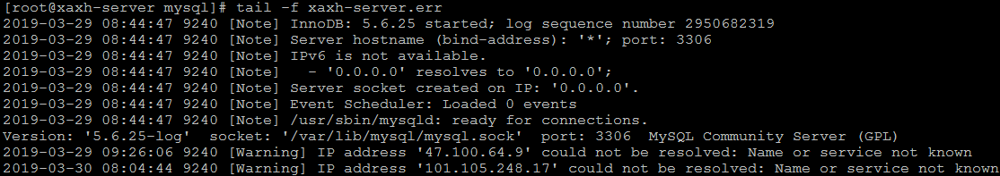
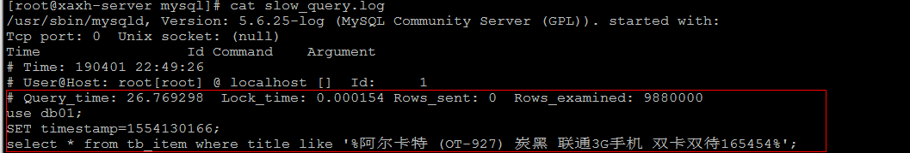

# Mysql高级-day04

### 1. MySql中常用工具

#### 1.1 mysql

该mysql不是指mysql服务，而是指mysql的客户端工具。

语法 ：

```sql
mysql [options] [database]
```

##### 1.1.1 连接选项

```
参数 ： 
	-u, --user=name			指定用户名
	-p, --password[=name]	指定密码
	-h, --host=name			指定服务器IP或域名
	-P, --port=#			指定连接端口

示例 ：
	mysql -h 127.0.0.1 -P 3306 -u root -p
	
	mysql -h127.0.0.1 -P3306 -uroot -p2143
	
```

##### 1.1.2 执行选项

```
-e, --execute=name		执行SQL语句并退出
```

此选项可以在Mysql客户端执行SQL语句，而不用连接到MySQL数据库再执行，对于一些批处理脚本，这种方式尤其方便。

```
示例：
	mysql -uroot -p2143 db01 -e "select * from tb_book";
```

 


#### 1.2 mysqladmin

mysqladmin 是一个执行管理操作的客户端程序。可以用它来检查服务器的配置和当前状态、创建并删除数据库等。

可以通过 ： mysqladmin --help  指令查看帮助文档

 

```
示例 ：
	mysqladmin -uroot -p2143 create 'test01';  
	mysqladmin -uroot -p2143 drop 'test01';
    mysqladmin -V;
	
```


#### 1.3 mysqlbinlog

由于服务器生成的二进制日志文件以二进制格式保存，所以如果想要检查这些文本的文本格式，就会使用到mysqlbinlog 日志管理工具。

语法 ：

```
mysqlbinlog [options]  log-files1 log-files2 ...

选项：
	
	-d, --database=name : 指定数据库名称，只列出指定的数据库相关操作。
	
	-o, --offset=# : 忽略掉日志中的前n行命令。
	
	-r,--result-file=name : 将输出的文本格式日志输出到指定文件。
	
	-s, --short-form : 显示简单格式， 省略掉一些信息。
	
	--start-datatime=date1  --stop-datetime=date2 : 指定日期间隔内的所有日志。
	
	--start-position=pos1 --stop-position=pos2 : 指定位置间隔内的所有日志。
```


#### 1.4 mysqldump

mysqldump 客户端工具用来备份数据库或在不同数据库之间进行数据迁移。备份内容包含创建表，及插入表的SQL语句。

语法 ：

```sql
mysqldump [options] db_name [tables]

mysqldump [options] --database/-B db1 [db2 db3...]

mysqldump [options] --all-databases/-A
```

##### 1.4.1 连接选项

```
参数 ： 
	-u, --user=name			指定用户名
	-p, --password[=name]	指定密码
	-h, --host=name			指定服务器IP或域名
	-P, --port=#			指定连接端口
```


##### 1.4.2 输出内容选项

```
参数：
	--add-drop-database		在每个数据库创建语句前加上 Drop database 语句
	--add-drop-table		在每个表创建语句前加上 Drop table 语句 , 默认开启 ; 不开启 (--skip-add-drop-table)
	
	-n, --no-create-db		不包含数据库的创建语句
	-t, --no-create-info	不包含数据表的创建语句
	-d --no-data			不包含数据
	
	 -T, --tab=name			自动生成两个文件：一个.sql文件，创建表结构的语句；
	 						一个.txt文件，数据文件，相当于select into outfile  
```

```
示例 ： 
	mysqldump -uroot -pren137739 data student > d:\gbak.sql
	
	mysqldump -uroot -pren137739 data -d --no-data > d:\gbak.sql
	
	mysqldump -uroot -pren137739 data --add-drop-database --add-drop-table > d:\gbak.sql
	
	mysqldump -uroot -pren137739 -T "C:\ProgramData\MySQL\MySQL Server 5.7\Uploads"  data student
```

 

其中mysqldump -uroot -pren137739 -T d:\ data student报错解决方案 https://blog.csdn.net/qq_28921653/article/details/54174341

```sql
show global variables like '%secure%';
```


其中路径中的空格一定要用“ ”包起来！


#### 1.5 mysqlimport/source

mysqlimport 是客户端数据导入工具，用来导入mysqldump 加 -T 参数后导出的文本文件。

语法：

```sql
mysqlimport [options]  db_name  textfile1  [textfile2...]
```

示例：

```sql
mysqlimport -uroot -pren137739 data "C:\ProgramData\MySQL\MySQL Server 5.7\Uploads\student.txt"
```

如果需要导入sql文件,可以使用mysql中的source 指令 : （这个操作在MySQL命令行中操作）

```sql
source C:\ProgramData\MySQL\MySQL Server 5.7\Uploads\student.sql
```


#### 1.6 mysqlshow

mysqlshow 客户端对象查找工具，用来很快地查找存在哪些数据库、数据库中的表、表中的列或者索引。

语法：

```
mysqlshow [options] [db_name [table_name [col_name]]]
```

参数：

```
--count		显示数据库及表的统计信息（数据库，表 均可以不指定）

-i			显示指定数据库或者指定表的状态信息
```


示例：

```sql
#查询每个数据库的表的数量及表中记录的数量
mysqlshow -uroot -pren137739 --count

#查询test库中每个表中的字段书，及行数
mysqlshow -uroot -pren137739 data --count

#查询test库中book表的详细情况
mysqlshow -uroot -pren137739 data student --count

```


### 2. Mysql 日志

在任何一种数据库中，都会有各种各样的日志，记录着数据库工作的方方面面，以帮助数据库管理员追踪数据库曾经发生过的各种事件。MySQL 也不例外，在 MySQL 中，有 4 种不同的日志，分别是错误日志、二进制日志（BINLOG 日志）、查询日志和慢查询日志，这些日志记录着数据库在不同方面的踪迹。

#### 2.1 错误日志

错误日志是 MySQL 中最重要的日志之一，它记录了当 mysqld 启动和停止时，以及服务器在运行过程中发生任何严重错误时的相关信息。当数据库出现任何故障导致无法正常使用时，可以首先查看此日志。

该日志是默认开启的 ， 默认存放目录为 mysql 的数据目录（var/lib/mysql）, 默认的日志文件名为  hostname.err（hostname是主机名）。

查看日志位置指令 ： 

```sql
show variables like 'log_error%';
```

 


查看日志内容 ： 

```shell
tail -f /var/lib/mysql/xaxh-server.err
```

 


#### 2.2 二进制日志

##### 2.2.1概述

二进制日志（BINLOG）记录了所有的 DDL（数据定义语言）语句和 DML（数据操纵语言）语句，但是不包括数据查询语句。此日志对于灾难时的数据恢复起着极其重要的作用，MySQL的主从复制， 就是通过该binlog实现的。

二进制日志，默认情况下是没有开启的，需要到MySQL的配置文件中开启，并配置MySQL日志的格式。 

配置文件位置 : /usr/my.cnf

日志存放位置 : 配置时，给定了文件名但是没有指定路径，日志默认写入Mysql的数据目录。

```
#配置开启binlog日志， 日志的文件前缀为 mysqlbin -----> 生成的文件名如 : mysqlbin.000001,mysqlbin.000002
log_bin=mysqlbin

#配置二进制日志的格式
binlog_format=STATEMENT

```


##### 2.2.2 日志格式

**STATEMENT**

该日志格式在日志文件中记录的都是SQL语句（statement），每一条对数据进行修改的SQL都会记录在日志文件中，通过Mysql提供的mysqlbinlog工具，可以清晰的查看到每条语句的文本。主从复制的时候，从库（slave）会将日志解析为原文本，并在从库重新执行一次。


**ROW**

该日志格式在日志文件中记录的是每一行的数据变更，而不是记录SQL语句。比如，执行SQL语句 ： update tb_book set status='1' , 如果是STATEMENT 日志格式，在日志中会记录一行SQL文件； 如果是ROW，由于是对全表进行更新，也就是每一行记录都会发生变更，ROW 格式的日志中会记录每一行的数据变更。


**MIXED**

这是目前MySQL默认的日志格式，即混合了STATEMENT 和 ROW两种格式。默认情况下采用STATEMENT，但是在一些特殊情况下采用ROW来进行记录。MIXED 格式能尽量利用两种模式的优点，而避开他们的缺点。


##### 2.2.3 日志读取

由于日志以二进制方式存储，不能直接读取，需要用mysqlbinlog工具来查看，语法如下 ：

```
mysqlbinlog log-file；
```

例如：

```sql
mysqlbinlog D:\app\binlog.000001
```

**查看STATEMENT格式日志** 

mysql在下面三种情况下会重新生成日志文件：

- 在备份的时候加入--flush-logs

- 重新启动mysql服务的时候

- 日志大小到达阈值

  

执行插入语句 ：

```SQL
insert into tb_book values(null,'Lucene','2088-05-01','0');
```

 查看日志文件 ：

 

mysqlbin.index : 该文件是日志索引文件 ， 记录日志的文件名；

mysqlbing.000001 ：日志文件

查看日志内容 ：

```
mysqlbinlog mysqlbing.000001；
```

 


**查看ROW格式日志**

配置 :

```
#配置开启binlog日志， 日志的文件前缀为 mysqlbin -----> 生成的文件名如 : mysqlbin.000001,mysqlbin.000002
log_bin=mysqlbin

#配置二进制日志的格式
binlog_format=ROW

```

插入数据 :

```sql
insert into tb_book values(null,'SpringCloud实战','2088-05-05','0');
```

如果日志格式是 ROW , 直接查看数据 , 是查看不懂的 ; 可以在mysqlbinlog 后面加上参数 -vv  

```SQL
mysqlbinlog -vv mysqlbin.000011 
```

 


##### 2.2.4 日志删除

对于比较繁忙的系统，由于每天生成日志量大 ，这些日志如果长时间不清除，将会占用大量的磁盘空间。下面我们将会讲解几种删除日志的常见方法 ：

**方式一** 

通过 Reset Master 指令删除全部 binlog 日志，删除之后，日志编号，将从 xxxx.000001重新开始 。

查询之前 ，先查询下日志文件 ： 

   

执行删除日志指令： 

```
Reset Master
```

执行之后， 查看日志文件 ：

 


**方式二**

执行指令 ``` purge  master logs to 'mysqlbin.******'``` ，该命令将删除  ``` ******``` 编号之前的所有日志。 


**方式三**

执行指令 ``` purge master logs before 'yyyy-mm-dd hh24:mi:ss'``` ，该命令将删除日志为 "yyyy-mm-dd hh24:mi:ss" 之前产生的所有日志 。


**方式四**

设置参数 --expire_logs_days=# ，此参数的含义是设置日志的过期天数， 过了指定的天数后日志将会被自动删除，这样将有利于减少DBA 管理日志的工作量。

配置如下 ： 

 


#### 2.3 查询日志

查询日志中记录了客户端的所有操作语句，而二进制日志不包含查询数据的SQL语句。

默认情况下， 查询日志是未开启的。如果需要开启查询日志，可以设置以下配置 ：

```
#该选项用来开启查询日志 ， 可选值 ： 0 或者 1 ； 0 代表关闭， 1 代表开启 
general_log=1

#设置日志的文件名 ， 如果没有指定， 默认的文件名为 host_name.log 
general_log_file=file_name

```

在 mysql 的配置文件 /usr/my.cnf 中配置如下内容 ： 

 


配置完毕之后，在数据库执行以下操作 ：

```
select * from tb_book;
select * from tb_book where id = 1;
update tb_book set name = 'lucene入门指南' where id = 5;
select * from tb_book where id < 8;

```


执行完毕之后， 再次来查询日志文件 ： 

 


#### 2.4 慢查询日志

慢查询日志记录了所有执行时间超过参数 long_query_time 设置值并且扫描记录数不小于 min_examined_row_limit 的所有的SQL语句的日志。long_query_time 默认为 10 秒，最小为 0， 精度可以到微秒。


##### 2.4.1 文件位置和格式

慢查询日志默认是关闭的 。可以通过两个参数来控制慢查询日志 ：

```
# 该参数用来控制慢查询日志是否开启， 可取值： 1 和 0 ， 1 代表开启， 0 代表关闭
slow_query_log=1 

# 该参数用来指定慢查询日志的文件名
slow_query_log_file=slow_query.log

# 该选项用来配置查询的时间限制， 超过这个时间将认为值慢查询， 将需要进行日志记录， 默认10s
long_query_time=10

```


##### 2.4.2 日志的读取

和错误日志、查询日志一样，慢查询日志记录的格式也是纯文本，可以被直接读取。

1） 查询long_query_time 的值。

 


2） 执行查询操作

```sql
select id, title,price,num ,status from tb_item where id = 1;
```


由于该语句执行时间很短，为0s ， 所以不会记录在慢查询日志中。


```
select * from tb_item where title like '%阿尔卡特 (OT-927) 炭黑 联通3G手机 双卡双待165454%' ;

```

 

该SQL语句 ， 执行时长为 26.77s ，超过10s ， 所以会记录在慢查询日志文件中。


3） 查看慢查询日志文件

直接通过cat 指令查询该日志文件 ： 

 


如果慢查询日志内容很多， 直接查看文件，比较麻烦， 这个时候可以借助于mysql自带的 mysqldumpslow 工具， 来对慢查询日志进行分类汇总。 

 


通过日志文件恢复数据！

mysqlbinlog --stop-datetime="2021-09-06 15:12:00" "D:\app\binlog.000018" | mysql -u root -p


### 3. Mysql复制

#### 3.1 复制概述

复制是指将主数据库的DDL 和 DML 操作通过二进制日志传到从库服务器中，然后在从库上对这些日志重新执行（也叫重做），从而使得从库和主库的数据保持同步。

MySQL支持一台主库同时向多台从库进行复制， 从库同时也可以作为其他从服务器的主库，实现链状复制。


#### 3.2 复制原理

MySQL 的主从复制原理如下。

 

从上层来看，复制分成三步：

- Master 主库在事务提交时，会把数据变更作为时间 Events 记录在二进制日志文件 Binlog 中。
- 主库推送二进制日志文件 Binlog 中的日志事件到从库的中继日志 Relay Log 。

- slave重做中继日志中的事件，将改变反映它自己的数据。


#### 3.3 复制优势

MySQL 复制的有点主要包含以下三个方面：

- 主库出现问题，可以快速切换到从库提供服务。

- 可以在从库上执行查询操作，从主库中更新，实现读写分离，降低主库的访问压力。

- 可以在从库中执行备份，以避免备份期间影响主库的服务。


#### 3.4 搭建步骤

##### 3.4.1 master

1） 在master 的配置文件（/usr/my.cnf）中，配置如下内容：

```properties
#mysql 服务ID,保证整个集群环境中唯一
server-id=1

#mysql binlog 日志的存储路径和文件名
log-bin=/var/lib/mysql/mysqlbin

#错误日志,默认已经开启
#log-err

#mysql的安装目录
#basedir

#mysql的临时目录
#tmpdir

#mysql的数据存放目录
#datadir

#是否只读,1 代表只读, 0 代表读写
read-only=0

#忽略的数据, 指不需要同步的数据库
binlog-ignore-db=mysql

#指定同步的数据库
#binlog-do-db=db01
```

2） 执行完毕之后，需要重启Mysql：

```sql
service mysql restart；
```

3） 创建同步数据的账户，并且进行授权操作：IP是从服务器的IP！！！

```sql
grant replication slave on *.* to 'itcast'@'1.15.69.44' identified by 'itcast';	

flush privileges;
```

4） 查看master状态：

```sql
show master status;
```

 

字段含义：

```
File : 从哪个日志文件开始推送日志文件 
Position ： 从哪个位置开始推送日志
Binlog_Ignore_DB : 指定不需要同步的数据库
```


##### 3.4.2 slave

1） 在 slave 端配置文件中，配置如下内容：

```properties
#mysql服务端ID,唯一
server-id=2

#指定binlog日志
log-bin=/var/lib/mysql/mysqlbin
```

2）  执行完毕之后，需要重启Mysql：

```
service mysql restart；
```

3） 执行如下指令 ：

```sql
change master to master_host= '121.40.18.94', master_user='itcast', master_password='itcast', master_log_file='mysqlbin.000001', master_log_pos=600;
```

指定当前从库对应的主库的IP地址，用户名，密码，从哪个日志文件开始的那个位置开始同步推送日志。

4） 开启同步操作

```
start slave;

show slave status;
```

 

5） 停止同步操作

```
stop slave;
```


##### 3.4.3 验证同步操作

1） 在主库中创建数据库，创建表，并插入数据 ：

```sql
create database db01;

user db01;

create table user(
	id int(11) not null auto_increment,
	name varchar(50) not null,
	sex varchar(1),
	primary key (id)
)engine=innodb default charset=utf8;

insert into user(id,name,sex) values(null,'Tom','1');
insert into user(id,name,sex) values(null,'Trigger','0');
insert into user(id,name,sex) values(null,'Dawn','1');
```

2） 在从库中查询数据，进行验证 ：

在从库中，可以查看到刚才创建的数据库：

 

在该数据库中，查询user表中的数据：

 


### 4. Mysql权限管理

#### 4.1 MySQL 权限介绍

mysql中存在4个控制权限的表，分别为user表，db表，tables_priv表，columns_priv表，在MySQL8.0之后，还新增了role相关的权限控制

mysql权限表的验证过程为：

1. 先从user表中的Host,User,Password这3个字段中判断连接的ip、用户名、密码是否存在，存在则通过验证。
2. 通过身份认证后，进行权限分配，按照user，db，tables_priv，columns_priv的顺序进行验证。即先检查全局权限表user，如果user中对应的权限为Y，则此用户对所有数据库的权限都为Y，将不再检查db, tables_priv,columns_priv；如果为N，则到db表中检查此用户对应的具体数据库，并得到db中为Y的权限；如果db中为N，则检查tables_priv中此数据库对应的具体表，取得表中的权限Y，以此类推

##### 4.1.1MySQL 权限级别

分为： 

- 全局性的管理权限： 作用于整个MySQL实例级别 
- 数据库级别的权限： 作用于某个指定的数据库上或者所有的数据库上 
- 数据库对象级别的权限：作用于指定的数据库对象上（表、视图等）或者所有的数据库对象上

权限存储在mysql库的user, db, tables_priv, columns_priv, and procs_priv这几个系统表中，待MySQL实例启动后就加载到内存中

查看mysql 有哪些用户，他们分别有什么权限：

```sql
select * from user; 
```

#### 4.2 MySQL 权限详解

- `All/All Privileges权限代表全局或者全数据库对象级别的所有权限`
- Alter权限代表允许修改表结构的权限，但必须要求有create和insert权限配合。如果是rename表名，则要求有alter和drop原表， create和insert新表的权限
- Alter routine权限代表允许修改或者删除存储过程、函数的权限
- Create权限代表允许创建新的数据库和表的权限
- Create routine权限代表允许创建存储过程、函数的权限
- Create tablespace权限代表允许创建、修改、删除表空间和日志组的权限
- Create temporary tables权限代表允许创建临时表的权限
- Create user权限代表允许创建、修改、删除、重命名user的权限
- Create view权限代表允许创建视图的权限
- Delete权限代表允许删除行数据的权限
- Drop权限代表允许删除数据库、表、视图的权限，包括truncate table命令
- Event权限代表允许查询，创建，修改，删除MySQL事件
- Execute权限代表允许执行存储过程和函数的权限
- File权限代表允许在MySQL可以访问的目录进行读写磁盘文件操作，可使用的命令包括load data infile,select … into outfile,load file()函数
- Grant option权限代表是否允许此用户授权或者收回给其他用户你给予的权限,重新付给管理员的时候需要加上这个权限
- Index权限代表是否允许创建和删除索引
- Insert权限代表是否允许在表里插入数据，同时在执行analyze table,optimize table,repair table语句的时候也需要insert权限
- Lock权限代表允许对拥有select权限的表进行锁定，以防止其他链接对此表的读或写
- Process权限代表允许查看MySQL中的进程信息，比如执行show processlist, mysqladmin processlist, show engine等命令
- Reference权限是在5.7.6版本之后引入，代表是否允许创建外键
- Reload权限代表允许执行flush命令，指明重新加载权限表到系统内存中，refresh命令代表关闭和重新开启日志文件并刷新所有的表
- Replication client权限代表允许执行show master status,show slave status,show binary logs命令
- Replication slave权限代表允许slave主机通过此用户连接master以便建立主从复制关系
- Select权限代表允许从表中查看数据，某些不查询表数据的select执行则不需要此权限，如Select 1+1， Select PI()+2；而且select权限在执行update/delete语句中含有where条件的情况下也是需要的
- Show databases权限代表通过执行show databases命令查看所有的数据库名
- Show view权限代表通过执行show create view命令查看视图创建的语句
- Shutdown权限代表允许关闭数据库实例，执行语句包括mysqladmin shutdown
- Super权限代表允许执行一系列数据库管理命令，包括kill强制关闭某个连接命令， change master to创建复制关系命令，以及create/alter/drop server等命令
- Trigger权限代表允许创建，删除，执行，显示触发器的权限
- Update权限代表允许修改表中的数据的权限
- Usage权限是创建一个用户之后的默认权限，其本身代表连接登录权限

##### 4.2.1 系统权限表

`User表`：存放用户账户信息以及全局级别（所有数据库）权限，决定了来自哪些主机的哪些用户可以访问数据库实例，如果`有全局权限则意味着对所有数据库都有此权限` 
Db表：存放`数据库级别`的权限，决定了来自哪些主机的哪些用户可以访问此数据库 
Tables_priv表：`存放表级别的权限`，决定了来自哪些主机的哪些用户可以访问数据库的这个表 
Columns_priv表：`存放列级别的权限`，决定了来自哪些主机的哪些用户可以访问数据库表的这个字段 
Procs_priv表：`存放存储过程和函数`级别的权限

最重要的还是user表

###### 4.2.1.1 User和 db 权限表的结构

| 表名           | `user`                   | `db`                    |
| -------------- | ------------------------ | ----------------------- |
| **范围列**     | `Host`                   | `Host`                  |
|                | `User`                   | `Db`                    |
|                |                          | `User`                  |
| **权限列**     | `Select_priv`            | `Select_priv`           |
|                | `Insert_priv`            | `Insert_priv`           |
|                | `Update_priv`            | `Update_priv`           |
|                | `Delete_priv`            | `Delete_priv`           |
|                | `Index_priv`             | `Index_priv`            |
|                | `Alter_priv`             | `Alter_priv`            |
|                | `Create_priv`            | `Create_priv`           |
|                | `Drop_priv`              | `Drop_priv`             |
|                | `Grant_priv`             | `Grant_priv`            |
|                | `Create_view_priv`       | `Create_view_priv`      |
|                | `Show_view_priv`         | `Show_view_priv`        |
|                | `Create_routine_priv`    | `Create_routine_priv`   |
|                | `Alter_routine_priv`     | `Alter_routine_priv`    |
|                | `Execute_priv`           | `Execute_priv`          |
|                | `Trigger_priv`           | `Trigger_priv`          |
|                | `Event_priv`             | `Event_priv`            |
|                | `Create_tmp_table_priv`  | `Create_tmp_table_priv` |
|                | `Lock_tables_priv`       | `Lock_tables_priv`      |
|                | `References_priv`        | `References_priv`       |
|                | `Reload_priv`            |                         |
|                | `Shutdown_priv`          |                         |
|                | `Process_priv`           |                         |
|                | `File_priv`              |                         |
|                | `Show_db_priv`           |                         |
|                | `Super_priv`             |                         |
|                | `Repl_slave_priv`        |                         |
|                | `Repl_client_priv`       |                         |
|                | `Create_user_priv`       |                         |
|                | `Create_tablespace_priv` |                         |
| **安全专栏**   | `ssl_type`               |                         |
|                | `ssl_cipher`             |                         |
|                | `x509_issuer`            |                         |
|                | `x509_subject`           |                         |
|                | `plugin`                 |                         |
|                | `authentication_string`  |                         |
|                | `password_expired`       |                         |
|                | `password_last_changed`  |                         |
|                | `password_lifetime`      |                         |
|                | `account_locked`         |                         |
| **资源控制列** | `max_questions`          |                         |
|                | `max_updates`            |                         |
|                | `max_connections`        |                         |
|                | `max_user_connections`   |                         |

User权限表结构中的特殊字段：

- Plugin,authentication_string字段存放用户认证信息
- Password_expired设置成’Y’则表明允许DBA将此用户的密码设置成过期而且过期后要求用户的使用者重置密码（alter user/set password重置密码）
- Password_last_changed作为一个时间戳字段代表密码上次修改时间，执行create user/alter user/set password/grant等命令创建用户或修改用户密码时`此数值自动更新`
- Password_lifetime代表从password_last_changed时间开始此密码过期的天数
- `Account_locked代表此用户被锁住，无法使用`

在mysql 5.7 以前在user表有password 这个字段。

###### 4.2.1.2 Tables_priv和columns_priv权限表结构

| 表名       | `tables_priv` | `columns_priv` |
| ---------- | ------------- | -------------- |
| **范围列** | `Host`        | `Host`         |
|            | `Db`          | `Db`           |
|            | `User`        | `User`         |
|            | `Table_name`  | `Table_name`   |
|            |               | `Column_name`  |
| **权限列** | `Table_priv`  | `Column_priv`  |
|            | `Column_priv` |                |
| **其他列** | `Timestamp`   | `Timestamp`    |
|            | `Grantor`     |                |

Tables_priv和columns_priv权限值

| Table Name     | Column Name   | Possible Set Elements                                        |
| -------------- | ------------- | ------------------------------------------------------------ |
| `tables_priv`  | `Table_priv`  | `'Select', 'Insert', 'Update', 'Delete', 'Create', 'Drop', 'Grant', 'References', 'Index', 'Alter', 'Create View', 'Show view', 'Trigger'` |
| `tables_priv`  | `Column_priv` | `'Select', 'Insert', 'Update', 'References'`                 |
| `columns_priv` | `Column_priv` | `'Select', 'Insert', 'Update', 'References'`                 |
| `procs_priv`   | `Proc_priv`   | `'Execute', 'Alter Routine', 'Grant'`                        |

###### 4.2.1.3 procs_priv权限表结构

| Table Name            | `procs_priv`   |
| --------------------- | -------------- |
| **Scope columns**     | `Host`         |
|                       | `Db`           |
|                       | `User`         |
|                       | `Routine_name` |
|                       | `Routine_type` |
| **Privilege columns** | `Proc_priv`    |
| **Other columns**     | `Timestamp`    |
|                       | `Grantor`      |

- Routine_type是枚举类型，代表是存储过程还是函数

- Timestamp和grantor两个字段暂时没用

  系统权限表字段长度限制表

| Column Name            | Maximum Permitted Characters |
| ---------------------- | ---------------------------- |
| `Host`, `Proxied_host` | 60                           |
| `User`, `Proxied_user` | 32                           |
| `Password`             | 41                           |
| `Db`                   | 64                           |
| `Table_name`           | 64                           |
| `Column_name`          | 64                           |
| `Routine_name`         | 64                           |

**权限认证中的大小写敏感问题**

- 字段user,password,authencation_string,db,table_name大小写敏感
- 字段host,column_name,routine_name大小写不敏感

##### 4.2.2 用户权限信息管理

###### 4.2.2.1 查看用户权限信息

查看MYSQL有哪些用户

```sql
mysql> select user,host from mysql.user;
```

查看已经授权给用户的权限信息 
例如root

```sql
mysql> show grants for root@'localhost';
```

查看用户的其他非授权信息

```sql
mysql> show create user root@'localhost';
```

###### 4.2.2.2 用户组成

MySQL的授权用户由两部分组成： `用户名和登录主机名`

- 表达用户的语法为’user_name’@’host_name’
- 单引号不是必须，但如果其中`包含特殊字符则是必须的`
- ”@‘localhost’代表匿名登录的用户
- Host_name可以使主机名或者ipv4/ipv6的地址。 Localhost代表本机， 127.0.0.1代表ipv4本机地址， ::1代表ipv6的本机地址
- Host_name字段允许使用`%和_`两个匹配字符，比如’%’代表所有主机， ’%.mysql.com’代表来自mysql.com这个域名下的所有主机， ‘192.168.1.%’代表所有来自192.168.1网段的主机

| `User值` | `Host` 值                      | 允许的连接                                                   |
| -------- | ------------------------------ | ------------------------------------------------------------ |
| `'fred'` | `'h1.example.net'`             | `fred`，连接 `h1.example.net`                                |
| `''`     | `'h1.example.net'`             | 任何用户，从中连接 `h1.example.net`                          |
| `'fred'` | `'%'`                          | `fred`，从任何主机连接                                       |
| `''`     | `'%'`                          | 任何用户，从任何主机连接                                     |
| `'fred'` | `'%.example.net'`              | `fred`，从`example.net`域中的任何主机连接                    |
| `'fred'` | `'x.example.%'`                | `fred`，从连接 `x.example.net`，`x.example.com`， `x.example.edu`，等; 这可能没用 |
| `'fred'` | `'198.51.100.177'`             | `fred`，从主机与IP地址连接 `198.51.100.177`                  |
| `'fred'` | `'198.51.100.%'`               | `fred`，从`198.51.100`C类子网中的任何主机连接                |
| `'fred'` | `'198.51.100.0/255.255.255.0'` | 与前面的示例相同                                             |

###### 4.2.2.3 修改用户权限

- 执行Grant,revoke,set password,rename user命令修改权限之后， MySQL会自动将修改后的权限信息同步加载到系统内存中
- 如果执行insert/update/delete操作上述的系统权限表之后，则必须再执行刷新权限命令才能同步到系统内存中，刷新权限命令包括： `flush privileges`/mysqladmin flush-privileges / mysqladmin reload
- 如果是修改tables和columns级别的权限，则客户端的下次操作新权限就会生效
- 如果是修改database级别的权限，则新权限在客户端执行use database命令后生效
- 如果是修改global级别的权限，则需要重新创建连接新权限才能生效
- 如果是修改global级别的权限，则需要重新创建连接新权限才能生效 (例如修改密码)

###### 4.2.2.4 创建 mysql 用户

有两种方式创建MySQL授权用户

1. `执行create user/grant命令`（推荐方式）

2. 通过insert语句直接操作MySQL系统权限表

   ```sql
   # 这只是创建用户并没有权限
   mysql> CREATE USER 'rld'@'localhost' IDENTIFIED BY 'rld';
   # 把rld变成管理员用户
   mysql> GRANT ALL PRIVILEGES ON *.* TO 'rld'@'localhost' WITH
   GRANT OPTION;
   #创建用户并赋予RELOAD,PROCESS权限 ，在所有的库和表上
   mysql> GRANT RELOAD,PROCESS ON *.* TO 'admin'@'localhost' identified by '123456';
    
   # 创建keme用户，在test库，temp表， 上的id列只有select 权限
   mysql> grant select(id) on test.temp to keme@'localhost' identified by '123456';
   ```


###### 4.2.2.5 回收 mysql 权限

通过revoke命令收回用户权限,回收的时候看一下这个用户有哪些权限然后回收 
我对admin 用户做测试

```sql
mysql> show grants for admin@'localhost';
mysql> select user,host from mysql.user;
mysql> revoke PROCESS ON *.* FROM admin@'localhost';
```

删除 mysql 用户

通过执行`drop user`命令删除MySQL用户 
还可以通过系统权限表删除（不建议）

```sql
mysql> drop user admin@'localhost';
```


###### 4.2.2.6 设置MySQL用户资源限制

- 通过设置全局变量max_user_connections可以限制所有用户在同一时间连接MySQL实例的数量，但此参数无法对每个用户区别对待，所以MySQL提供了对每个用户的资源限制管理
- MAX_QUERIES_PER_HOUR：一个用户在一个小时内可以执行查询的次数（基本包含所有语句）
- MAX_UPDATES_PER_HOUR：一个用户在一个小时内可以执行修改的次数（仅包含修改数据库或表的语句）
- MAX_CONNECTIONS_PER_HOUR：一个用户在一个小时内可以连接MySQL的时间
- MAX_USER_CONNECTIONS：一个用户可以在`同一时间连接MySQL实例的数量`
- 从5.0.3版本开始，对用户‘user’@‘%.example.com’的资源限制是指所有通过example.com域名主机连接user用户的连接，而不是分别指从host1.example.com和host2.example.com主机过来的连接


###### 4.2.2.7 修改 mysql 用户密码

修改用户密码的方式包括：

```sql
mysql> ALTER USER ``'jeffrey'``@``'localhost'` `IDENTIFIED BY ``'mypass'``;
mysql> SET PASSWORD FOR ``'jeffrey'``@``'localhost'` `= PASSWORD(``'mypass'``);
mysql> GRANT USAGE ON *.* TO ``'jeffrey'``@``'localhost'` `IDENTIFIED BY ``'mypass'``;
shell> mysqladmin -u user_name -h host_name password ``"new_password"
```

创建用户时指定密码

```sql
mysql> CREATE USER ``'jeffrey'``@``'localhost'` `IDENTIFIED BY ``'mypass'``;
```

 修改当前会话本身用户密码的方式包括：

```sql
mysql> ALTER USER USER() IDENTIFIED BY ``'mypass'``;
mysql> SET PASSWORD = PASSWORD(``'mypass'``);
```


###### 4.2.2.8 设置MySQL用户密码过期策略

设置系统参数default_password_lifetime作用于所有的用户账户

- - default_password_lifetime=180 设置180天过期
  - default_password_lifetime=0 设置密码不过期 
    如果为每个用户设置了密码过期策略，则会覆盖上述系统参数

```sql
ALTER USER 'jeffrey'@'localhost' PASSWORD EXPIRE INTERVAL 90 DAY;
ALTER USER 'jeffrey'@'localhost' PASSWORD EXPIRE NEVER; 密码不过期
ALTER USER 'jeffrey'@'localhost' PASSWORD EXPIRE DEFAULT; 默认过期策略
```


手动强制某个用户密码过期：

```sql
ALTER USER 'jeffrey'@'localhost' PASSWORD EXPIRE;
```


###### 4.2.2.9 mysql 用户 lock

通过执行create user/alter user命令中带account lock/unlock子句设置用户的lock状态

Create user语句默认的用户是unlock状态

```sql
# 创建的时候给用户锁定
mysql> create user abc2@localhost identified by ``'mysql'` `account lock;
```

Alter user语句默认不会修改用户的lock/unlock状态

```
# 修改用户为unlock
mysql> alter user abc2@'localhost' account unlock;
```

当客户端使用lock状态的用户登录MySQL时，会收到如此报错 
Access denied for user ‘user_name’@’host_name’. 
Account is locked.