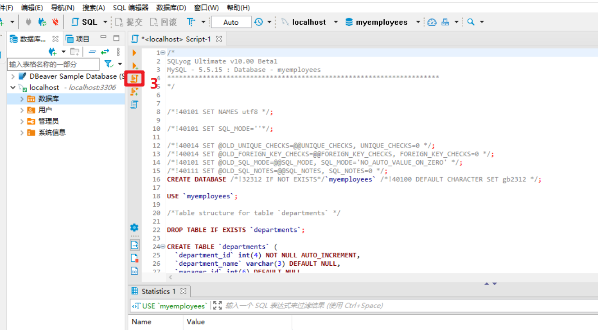

## 1.使用DBeaver数据库管理工具

### 1.创建myemployees数据库

 创建myemployees数据库

```mysql
CREATE DATABASE`girls` /;

USE `girls`;
```

### 2.为myemployees数据库执行外部sql脚本创建练习使用的表以及数据


.





### 3.创建girls数据库库

```mysql
CREATE database `myemployees`;

USE `myemployees`;
```


### 4.为girls数据库创建练习sql语句使用的表以及数据


## 2.使用sqlyog

执行外部sql脚本文件： https://www.cxyzjd.com/article/qq_43468008/105187440