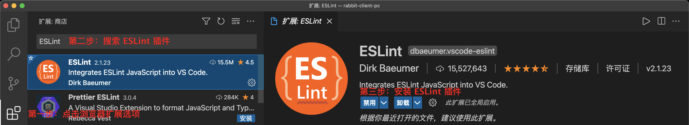
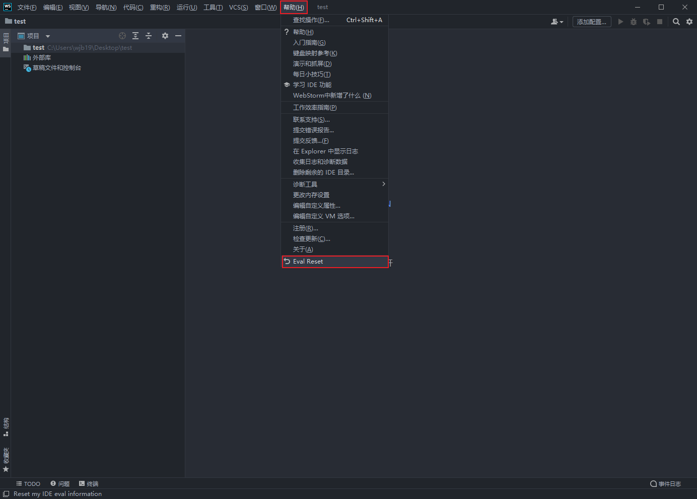

# 项目准备


## 1. 创建项目

> 目标：使用 @vue/cli 创建 vue 应用

------

- [ ] 安装 Vue 脚手架工具 `@vue/cli`
- [ ] 通过脚手架工具创建 Vue 应用
- [ ] 选择要安装的 Vue 应用特性

------

第一步: 安装 Vue 脚手架工具 `@vue/cli`


第二步: 通过脚手架工具创建 Vue 应用


第三步: 选择自定义安装


第四步: 选择要自定义安装的选项


第五步: 选择 Vue 版本


第六步: 选择路由模式


第七步: 选择 CSS 预处理器


第八步: 选择 ESLint 代码风格


第九步: ESLint 配置


第十步: 选择开发工具配置文件的存放位置


第十一步: 选择是否将以上配置作为预置使用


第十二步: 选择安装应用依赖的工具


第十三步: 安装应用依赖


## 2. 编辑器配置

> 目标：安装编辑器插件、配置编辑器，了解每个插件的作用及使用方式

------

- [ ] VSCode 编辑器
- [ ] Webstorm 编辑器

------

### 2.1 VSCode

#### 2.1.1 ESLint

安装 VSCode 插件 [ESLint](https://marketplace.visualstudio.com/items?itemName=dbaeumer.vscode-eslint), 避免代码中出现低级bug，找出可能发生的语法错误.



比如调用了一个需要传递参数的函数而参数却没有传递, 使用了一个没有声明的变量或方法, 尝试修改使用 const 创建的常量, 检测是否存在永远都不会得到执行的代码块.

#### 2.1.2 Prettier

安装 VScode 插件 [Prettier](https://marketplace.visualstudio.com/items?itemName=esbenp.prettier-vscode), 该插件用于代码格式化, 使代码实时保持良好的可阅读状态。


将 Prettier 设置为编辑器默认的代码格式化工具


设置在保存文件时自动格式化代码


#### 2.1.3 jsconfig

通过 jsconfig 文件实现 `@/`路径的代码提示。

```javascript
import something from '../../../../../utils/something';
import something from '_utils/something;
```

通过配置使 "@/" 后面产生路由提示。


在应用的根目录下创建 `jsconfig.json` 文件并添加以下内容

```
 {
   "compilerOptions": {
     "baseUrl": ".",
     "paths": {
       "@/*": ["./src/*"],
     }
   },
   "exclude": [
     "node_modules",
     "dist"
   ]
 }
```

baseUrl: 指定项目的根目录, 当导入的模块使用绝对路径时, baseUrl 选项指定的路径就是绝对路径的开始位置。

paths: 基于 baseUrl 选项配置路径别名

### 2.2 webstorm 2021.2.1

#### 2.2.1 安装 webstorm 


#### 2.2.2 无限期试用





#### 2.2.3 安装中文语言


#### 2.2.4 安装界面美化主题


#### 2.2.5 启动时显示欢迎界面


#### 2.2.6 Prettier

在 webstorm 中 Prettier 是内置的不需要单独安装，而且它是默认的代码格式化工具，我们要做的就是告诉 webstorm, 在我们保存文件时自动进行代码格式化。


#### 2.2.7 ESLint

设置保存代码时自动修复错误。


#### 2.2.8 创建项目


## 3. 浏览器插件

> 目标: 安装 Vue 开发者工具

------

- [ ] Google Chrome
- [ ] Microsoft Edge

------

### 3.1 Google Chrome

#### 3.1.1 [Vue.js devtools](https://chrome.google.com/webstore/detail/vuejs-devtools/ljjemllljcmogpfapbkkighbhhppjdbg)

Vue3 开发者工具, 可以插件组件结构、组件状态，可以查看 vuex 状态。


### 3.2 Microsoft Edge

#### 3.2.1 [Vue.js devtools beta ax]([Vue.js devtools beta ax - Microsoft Edge Addons](https://microsoftedge.microsoft.com/addons/detail/vuejs-devtools-beta-ax/khampijcelfojpjcmmiibmhfkhacjhhj))


## 4. 组建项目结构

> 目标：了解项目结构中每个文件夹的作用，创建项目所需结构。

<div style="overflow: hidden; background: #FFF">
	
	
</div>


## 5. 项目远端推送

> 目标: 将本地仓库推送到远程仓库

------

- [ ] 登录码云后，点击新建仓库
- [ ] 完善仓库信息并创建仓库
- [ ] 实现将本地仓库推送到远端仓库
- [ ] 推送完成后, 刷新页面, 验证是否推送成功

------

第一步：登录码云后，点击新建仓库


第二步：完善仓库信息并创建仓库


第三步：实现将本地仓库推送到远端仓库


第三步：实现将本地仓库推送到远端仓库 (webstorm)


第四步：推送完成后, 刷新页面, 验证是否推送成功


## 6. Vuex 持久化

> 目标：将 vuex 中存储的状态实时同步到本地的 localStorage 中

------

- [ ] 分析 Vuex 数据持久化是什么及它的应用场景
- [ ] 下载 Vuex 插件, 用于实现 Vuex 持久化功能
- [ ] 声明状态, 分别创建用户模块, 购物车模块, 分类模块
- [ ] 配置 vuex 数据持久化插件, 指定需要缓存的 Vuex 模块
- [ ] 验证插件是否配置成功

------

在应用中，有些共享数据除了要存储在 vuex 中以外还需要存储在本地，要将数据存储在两个不同的地方需要进行不同的操作，比较麻烦, 所以我们决定将数据存储在 vuex 中, 然后通过插件的方式将 vuex 中的数据同步到本地. [vuex-persistedstate](https://www.npmjs.com/package/vuex-persistedstate)


用户模块状态、购物车模块状态、分类模块状态需要被存储在 vuex 中，用户和购物车需要存储在本地，分类不需要。

第一步: 下载 `npm install vuex-persistedstate@4.1.0`


第二步: 声明状态, 分别创建用户模块, 购物车模块, 分类模块

`src/store/user.js`: 用户模块状态 

```javascript
export default {
  // 使用具有命名空间的 vuex 模块
  namespaced: true,
  // 返回该模块下存储的应用状态
  state() {
    return {
      // 用户信息
      profile: {
        // 用户id
        id: "",
        // 用户头像
        avatar: "",
        // 用户昵称
        nickname: "",
        // 用户账号
        account: "",
        // 用户手机号
        mobile: "",
        // 用户登录凭证
        token: "",
      },
    };
  }
};
```

`store/cart.js`: 购物车模块状态

```javascript
export default {
  namespaced: true,
  state() {
    return {
      // 存储购物车列表
      list: [],
    };
  },
};
```

`store/category.js`: 分类模块状态

```javascript
export default {
  // 使用具有命名空间的 vuex 模块
  namespaced: true,
  state() {
    return {
      // 存储分类列表
      list: [],
    };
  },
};
```

第三步：创建 Store, 配置模块 

`store/index.js`

```javascript
import { createStore } from "vuex";
import user from "@/store/user";
import cart from "@/store/cart";
import category from "@/store/category";

export default createStore({
  modules: {
    user,
    cart,
    category,
  },
});
```


第四步：配置 vuex-persistedstate 插件

`store/index.js`

```javascript
import createPersistedState from 'vuex-persistedstate'

export default createStore({
  plugins: [
    createPersistedState({
      // 数据存储在 localStorage 时的 key
      key: 'rabbit-client-pc',
      // 指定将哪些模块中的数据同步到本地
      paths: ['user', 'cart']
    })
  ]
})
```

第五步: 验证插件是否配置成功

`store/user.js`

```javascript
export default {
  mutations: {
    /**
     * 设置用户信息
     * @param state 状态对象
     * @param user  用户信息
     */
    setUser(state, user) {
      // 判断 user 对象是否是空对象
      if (Object.keys(user).length > 0) {
        // 不是空对象的情况, 表示要进行用户信息的修改
        state.profile = { ...state.profile, ...user };
      } else {
        // 是空对象, 表示要进行用户信息的清除
        state.profile = {};
      }
    },
  },
};
```

`src/App.vue`: 以下为测试代码

```vue
<template>
  <div>{{ user }}</div>
  <button @click="onClickHandler">button</button>
</template>
<script>
import { useStore } from "vuex";

export default {
  name: "App",
  setup() {
    // 获取 store 对象
    const store = useStore();
    // 按钮点击事件的事件处理函数
    const onClickHandler = () => {
      // 设置用户信息
      store.commit("user/setUser", { token: "test" });
    };
    // 获取用户信息
    const user = store.state.user;
    return { onClickHandler, user };
  },
};
</script>
```


## 7. 封装请求函数

### 7.1 封装 request 方法

> 目标：封装一个易于使用的向服务器端发送请求的方法，将和请求相关的代码封装起来，避免重复代码

1. 创建新的 axios 实例对象, 专门用于编写和小兔仙服务器端相关的请求配置
2. 在新创建的实例对象中添加 baseURL 选项, 将请求的基准地址抽取成公共配置
2. 添加请求拦截器, 在请求发送之前检查本地是否存在token, 如果有将其添加到请求头中
3. 添加响应拦截器, 精简数据层级 (response.data => data), 检查 token 是否过期
4. 导出用于发送请求的函数

第一步: 下载指定版本的 axios


第二步：创建新的 axios 实例对象

当前创建的新的 axios 实例及实例的相关配置都是和小兔仙应用的自身服务器端相关的, 在任何项目中都难免会向第三方服务器端发送请求, 如果直接使用 axios 实例而不去新建的话, 当前配置是不适用的, 就是说当前配置污染了全局的 axios 实例.

`utils/request.js`

```javascript
// 导入用户发送请求的底层库
import axios from 'axios'
// 导出它, 因为在其他地方会使用
// 线上环境: https://apipc-xiaotuxian-front.itheima.net/
// 开发环境: http://pcapi-xiaotuxian-front-devtest.itheima.net/
export const baseURL = "http://pcapi-xiaotuxian-front-devtest.itheima.net/";
// 创建请求实例对象 (不包含token)
const instanceWithoutToken = axios.create({ baseURL });
// 创建请求实例对象 (包含token)
const instanceWithToken = axios.create({ baseURL });
```

第三步：为 `instanceWithToken` 配置请求拦截器和响应拦截器

```javascript
import store from "@/store";
import router from "@/router";

// 通过请求拦截器实现在请求头中加入 token
instanceWithToken.interceptors.request.use((config) => {
  // 获取 token
  const token = store.state.user.profile.token;
  // 如果token存在 在请求头中加入 token
  if (token) config.headers.Authorization = `Bearer ${token}`;
});

// 通过响应拦截器精简数据层级
instanceWithToken.interceptors.response.use(
  (response) => {
    return response.data;
  },
  (error) => {
    // 检查 token 是否过期
    if (error.response.status === 401) {
      // 清空本地存储的用户信息
      store.commit("user/setUser", {});
      // 跳转到登录页面
      router.push("/login").then(() => {});
    }
    return Promise.reject(error);
  }
);
```

第四步：为 `instanceWithoutToken` 配置响应拦截器

```javascript
// 通过响应拦截器精简数据层级
instanceWithoutToken.interceptors.response.use((response) => {
  return response.data;
});
```

第五步：导出用于发送请求的函数

```javascript
function generateReqParams({ url, method, data }) {
  return {
    url,
    method,
    [method === "get" ? "params" : "data"]: data,
  };
}

// 用于发送携带 token 的请求
export function requestWithToken(reqParams) {
  return instanceWithToken(generateReqParams(reqParams));
}
// 用于发送普通请求
export function requestWithoutToken(reqParams) {
  return instanceWithoutToken(generateReqParams(reqParams));
}
```

第六步: 测试请求是否可以发送

```vue
<script>
import { requestWithoutToken } from "@/utils/request";

export default {
  setup() {
    requestWithoutToken({
      url: "https://jsonplaceholder.typicode.com/posts",
      method: "get",
    }).then((data) => {
      console.log(data);
    });
  },
};
</script>
```

### 7.2 扩展: 拦截器

> 目标: 弄清楚请求拦截器中的 onRejected 回调函数的执行时机

第一步: 复习 Promise, 前置知识点

```javascript
async function p1() {
  return "p1 success";
  // throw new Error("p1 error");
}

async function p2() {
  // return "p2 success";
  throw new Error("p2 error");
}

p1()
  .then(
  (value) => {
    console.log(value);
    return p2();
  },
  (reason) => {
    console.log(reason);
  }
)
  .then(
  (value) => {
    console.log(value);
  },
  (reason) => {
    console.log(reason);
  }
);
```

```javascript
promise.then(f1, f2).then(f3, f4)
```

第二步: 当注册多个请求拦截器时, 后注册的先执行

```javascript
const axios = require("axios");

axios.interceptors.request.use((config) => {
  console.log("first define");
  return config;
});

axios.interceptors.request.use((config) => {
  console.log("second define");
  return config;
});

axios.get("https://jsonplaceholder.typicode.com/todos/1").then((response) => {
  console.log(response.data);
});
```

第三步: 如果当前请求拦截器中的代码发生错误, 代码将会跳到下一个请求拦截器的 onRejected

```javascript
axios.interceptors.request.use(f1, f2)
axios.interceptors.request.use(f3, f4)
```

```javascript
const axios = require("axios");

axios.interceptors.request.use(
  (config) => {
    console.log("first define");
    return config;
  },
  () => {
    return Promise.reject("发生了错误");
  }
);

axios.interceptors.request.use(() => {
  throw new Error();
});

axios
  .get("https://jsonplaceholder.typicode.com/todos/1")
  .then((response) => {
    console.log(response.data);
  })
  .catch((error) => {
    console.log(error);
  });
```

## 7. 路由设计

> 掌握布局容器 Layout 组件的用法, 创建首页路由组件及规则。

------

- [ ] 分析项目中的路由配置规则
- [ ] 创建页面级公共组件, 顶部通栏、头部、底部。
- [ ] 创建布局组件并引入页面级公共路由组件
- [ ] 创建页面级路由组件，首页页面组件
- [ ] 配置首页页面组件的路由规则

------

| 路径              | 组件（功能）   | 嵌套级别 |
| :---------------- | :------------- | :------- |
| /                 | 首页           | 1级      |
| /category/:id     | 一级分类       | 1级      |
| /category/sub/:id | 二级分类       | 1级      |
| /goods/:id        | 商品详情       | 1级      |
| /cart             | 购物车         | 1级      |
| /login            | 登录           | 1级      |
| /login/callback   | 第三方登录回调 | 1级      |
| /checkout/order   | 结算           | 1级      |
| /checkout/pay     | 支付           | 1级      |
| /pay/callback     | 支付结果       | 1级      |
| /member/home      | 个人中心       | 1级      |
| /member/order     | 订单页面       | 1级      |
| /member/order     | 订单列表       | 2级      |
| /member/order/:id | 订单详情       | 2级      |

第一步: 创建页面级公共组件, 顶部通栏、头部、底部。

`components/AppTopNav.vue`

```vue
<template>
  <div>顶部通栏</div>
</template>
<script>
export default {
  name: "AppTopNav",
};
</script>
```

`components/AppHeader.vue`

```vue
<template>
  <div>头部</div>
</template>
<script>
export default {
  name: "AppHeader",
};
</script>
```

`components/AppFooter.vue`

```vue
<template>
  <div>底部</div>
</template>
<script>
export default {
  name: "AppFooter",
};
</script>
```

第二步: 在布局组件 `AppLayout` 中引入页面级公共路由组件

`components/AppLayout.vue`

```vue
<template>
  <AppTopNav />
  <AppHeader />
  <slot />
  <AppFooter />
</template>
<script>
import AppTopNav from "@/components/AppTopNav";
import AppFooter from "@/components/AppFooter";
import AppHeader from "@/components/AppHeader";
export default {
  name: "LayoutTemplate",
  components: { AppHeader, AppFooter, AppTopNav },
};
</script>
```

第三步: 创建页面级路由组件，首页页面组件

`views/home/HomePage.vue`

```vue
<template>
	<LayoutTemplate>
  	<div>首页</div>
  </LayoutTemplate>
</template>
<script>
import LayoutTemplate from "@/views/LayoutTemplate";
export default {
  name: "HomePage",
  components: { LayoutTemplate }
};
</script>
```

第四步: 配置首页页面组件的路由规则

`router/index.js`

```javascript
import { createRouter, createWebHashHistory } from "vue-router";

const HomePage = () => import(/*webpackChunkName: 'HomePage'*/ "@/views/home/HomePage");

const routes = [
  { path: "/", component: HomePage },
];

const router = createRouter({ history: createWebHashHistory(), routes });

export default router;
```

第五步: 启用路由

`main.js`

```javascript
import router from "@/router";

createApp(App).use(router)
```

## 9. Less 文件自动注入

> 目标: 了解为什么要实现 less 文件的自动注入, 掌握 less 文件自动注入的实现方式。

`assets/styles/variables.less`: 存储应用中的公共颜色变量。

```less
// 主题
@xtxColor: #27BA9B;
// 辅助
@helpColor: #E26237;
// 成功
@sucColor: #1DC779;
// 警告
@warnColor: #FFB302;
// 价格
@priceColor: #CF4444;
```

`assets/styles/mixin.less`: 存储公共的less混入样式。

```less
// 鼠标经过上移阴影动画
.hoverShadow () {
  transition: all .5s;
  &:hover {
    transform: translate3d(0,-3px,0);
    box-shadow: 0 3px 8px rgba(0,0,0,0.2);
  }
}
```

在 less 代码中若要使用其他文件中定义的变量, 必须通过 `@import` 的方式进行文件的引入. 

```vue
<template>
  <div class="box">test box</div>
</template>
<style scoped lang="less">
@import "./assets/styles/variables";
.box {
  color: @xtxColor;
}
</style>
```

Vue 使用组件化的开发方式, 很多组件都会使用到公共的颜色变量, 若要在每一个使用到该变量的文件中都进入文件的引入, 太麻烦了. 

所以我们要通过 `webpack loader` 的方式进行 less 文件的自动注入。

第一步: 通过脚手架工具安装 `style-resources-loader` 插件，在命令行工具中执行 `vue add style-resources-loader` 命令。

`Vue add` 命令其实就是帮助我们下载包, 运行包，通过命令的方式为项目创建文件或添加代码, 省去固定的配置或操作。

以下命令执行完成后会在应用的根目录下产生 `vue.config.js` 文件 


第二步: 在 vue.config.js 文件中指定要自定注入的 less 文件

```javascript
const path = require('path')

module.exports = {
  pluginOptions: {
    'style-resources-loader': {
      preProcessor: 'less',
      // 指定要自动注入的 less 文件
      patterns: [
        path.join(__dirname, 'src', 'assets', 'styles', 'variables.less'),
        path.join(__dirname, "src", "assets", "styles", "mixin.less"),
      ]
    }
  }
}
```

注意：配置文件修改完成后需要重新启动应用

虽然 less 文件自动注入的问题解决了，但是由于没有显式引入 less 文件, 编辑器的语法检查无法通过, 通过以下方式解决。


## 10. 样式重置与公共样式

> 目标: 在项目中添加重置样式及应用级公共样式

第一步: 下载 `normalize.css` 第三方样式重置库 `npm install normalize.css@8.0.1`


第二步: 在 `src/assets/styles` 文件件中创建 `common.less` 文件用于存放我们自己的样式重置及公共样式

```less
// 重置样式
* {
  box-sizing: border-box;
 }
 
 html {
   height: 100%;
   font-size: 14px;
 }
 body {
   height: 100%;
   color: #333;
   min-width: 1240px;
   font: 1em/1.4 'Microsoft Yahei', 'PingFang SC', 'Avenir', 'Segoe UI', 'Hiragino Sans GB', 'STHeiti', 'Microsoft Sans Serif', 'WenQuanYi Micro Hei', sans-serif
 }
 
 ul,
 h1,
 h3,
 h4,
 p,
 dl,
 dd {
   padding: 0;
   margin: 0;
 }
 
 a {
   text-decoration: none;
   color: #333;
   outline: none;
 }
 
 i {
   font-style: normal;
 }
 
 input[type="text"],
 input[type="search"],
 input[type="password"], 
 input[type="checkbox"]{
   padding: 0;
   outline: none;
   border: none;
   -webkit-appearance: none;
   &::placeholder{
     color: #ccc;
   }
 }
 
 img {
   max-width: 100%;
   max-height: 100%;
   vertical-align: middle;
 }
 
 ul {
   list-style: none;
 }
 
 #app {
   background: #f5f5f5;
   // user-select: none;
 }
 
 .container {
   width: 1240px;
   margin: 0 auto;
   position: relative;
 }
 
 .ellipsis {
   white-space: nowrap;
   text-overflow: ellipsis;
   overflow: hidden;
 }
 
 .ellipsis-2 {
   word-break: break-all;
   text-overflow: ellipsis;
   display: -webkit-box;
   -webkit-box-orient: vertical;
   -webkit-line-clamp: 2;
   overflow: hidden;
 }
 
 .fl {
   float: left;
 }
 
 .fr {
   float: right;
 }
 
 .clearfix:after {
   content: ".";
   display: block;
   visibility: hidden;
   height: 0;
   line-height: 0;
   clear: both;
 }
```

第三步: 在 `main.js` 文件中引入以上两个文件，因为以上两个文件都属于全局样式所以在 `main.js` 文件中进行引入。

```javascript
// src/main.js
import 'normalize.css'
import '@/assets/styles/common.less'
```