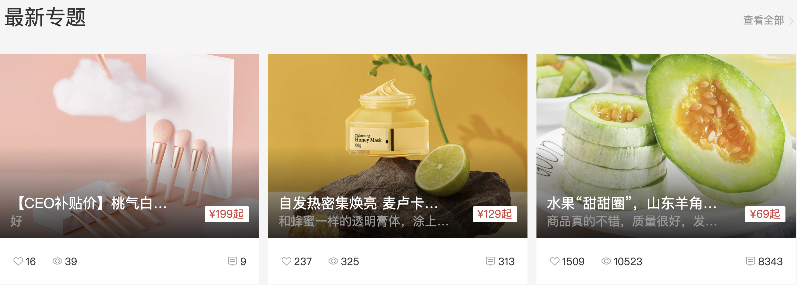

# 首页模块

## 1. 顶部通栏布局

> 目标：实现顶部通栏的基础布局


------

- [ ] 引用字体图标库, 顶部通栏中的图标都是字体图标
- [ ] 创建顶部通栏组件 `AppTopNav`, 实现基础布局
- [ ] 根据登录状态切换显示用户名和登录按钮

------

第一步: 引入字体图标库

`public/index.html`

```html
<link rel="stylesheet" href="//at.alicdn.com/t/font_2143783_iq6z4ey5vu.css">
```

第二步: 在 `components` 文件夹中新建 `AppTopNav.vue` 文件并加入如下布局样式代码

```html
<template>
  <nav class="app-top-nav">
    <div class="container">
      <ul>
        <li>
          <a href="javascript:"><i class="iconfont icon-user"></i>周杰伦</a>
        </li>
        <li><a href="javascript:">退出登录</a></li>
        <li><a href="javascript:">请先登录</a></li>
        <li><a href="javascript:">免费注册</a></li>
        <li><a href="javascript:">我的订单</a></li>
        <li><a href="javascript:">会员中心</a></li>
        <li><a href="javascript:">帮助中心</a></li>
        <li><a href="javascript:">关于我们</a></li>
        <li>
          <a href="javascript:"><i class="iconfont icon-phone"></i>手机版</a>
        </li>
      </ul>
    </div>
  </nav>
</template>
<script>
export default {
  name: "AppTopNav",
};
</script>
<style scoped lang="less">
.app-top-nav {
  background: #333;
  ul {
    display: flex;
    height: 53px;
    justify-content: flex-end;
    align-items: center;
    li {
      a {
        padding: 0 15px;
        color: #cdcdcd;
        line-height: 1;
        display: inline-block;
        i {
          font-size: 14px;
          margin-right: 2px;
        }
        &:hover {
          color: @xtxColor;
        }
      }
      ~ li {
        a {
          border-left: 2px solid #666;
        }
      }
    }
  }
}
</style>
```

第三步: 根据当前登录状态切换显示用户名和退出登录

```vue
<script>
import { useStore } from "vuex";
export default {
  name: "AppTopNav",
  setup() {
    const store = useStore();
    const user = store.state.user;
    return { user };
  },
};
</script>
```

```html
<template v-if="user.profile.token">
  <li>
    <a href="javascript:"><i class="iconfont icon-user"></i>{{ user.profile.account }}</a>
  </li>
  <li><a href="javascript:">退出登录</a></li>
</template>
<template v-else>
  <li><a href="javascript:">请先登录</a></li>
  <li><a href="javascript:">免费注册</a></li>
</template>
```

## 2. 头部布局

> 目标: 完成应用公共头部组件布局


------

- [ ] 创建头部组件 `AppHeader`, 实现基础布局
- [ ] 拷贝应用所需静态图片到 `assets/images` 文件夹, 静态图片存储在课程资料文件夹

------

第一步: 在 `components` 文件夹中新建 `AppHeader.vue` 文件并加入如下布局和样式代码。

```html
<template>
  <header class="app-header">
    <div class="container">
      <h1 class="logo"><RouterLink to="/"></RouterLink></h1>
      <ul class="app-header-nav">
        <li class="home">
          <RouterLink to="/">首页</RouterLink>
        </li>
        <li><a href="#">美食</a></li>
        <li><a href="#">餐厨</a></li>
        <li><a href="#">艺术</a></li>
        <li><a href="#">电器</a></li>
        <li><a href="#">居家</a></li>
        <li><a href="#">洗护</a></li>
        <li><a href="#">孕婴</a></li>
        <li><a href="#">服装</a></li>
        <li><a href="#">杂货</a></li>
      </ul>
      <div class="search">
        <i class="iconfont icon-search"></i>
        <input type="text" placeholder="搜一搜" />
      </div>
      <div class="cart">
        <a class="curr" href="#">
          <i class="iconfont icon-cart"></i><em>2</em>
        </a>
      </div>
    </div>
  </header>
</template>

<script>
export default {
  name: "AppHeader",
};
</script>

<style scoped lang="less">
.app-header {
  background: #fff;
  .container {
    display: flex;
    align-items: center;
  }
  .logo {
    width: 200px;
    a {
      display: block;
      height: 132px;
      width: 100%;
      text-indent: -9999px;
      background: url(../assets/images/logo.png) no-repeat center 18px / contain;
    }
  }
  .app-header-nav {
    width: 820px;
    display: flex;
    justify-content: space-around;
    padding-left: 40px;
    position: relative;
    z-index: 998;

    > li {
      margin-right: 40px;
      width: 38px;
      text-align: center;

      > a {
        font-size: 16px;
        line-height: 32px;
        height: 32px;
        display: inline-block;
      }

      &:hover {
        > a {
          color: @xtxColor;
          border-bottom: 1px solid @xtxColor;
        }

        > .layer {
          height: 132px;
          opacity: 1;
        }
      }
    }
  }
  .search {
    width: 170px;
    height: 32px;
    position: relative;
    border-bottom: 1px solid #e7e7e7;
    line-height: 32px;
    .icon-search {
      font-size: 18px;
      margin-left: 5px;
    }
    input {
      width: 140px;
      padding-left: 5px;
      color: #666;
    }
  }
  .cart {
    width: 50px;
    .curr {
      height: 32px;
      line-height: 32px;
      text-align: center;
      position: relative;
      display: block;
      .icon-cart {
        font-size: 22px;
      }
      em {
        font-style: normal;
        position: absolute;
        right: 0;
        top: 0;
        padding: 1px 6px;
        line-height: 1;
        background: @helpColor;
        color: #fff;
        font-size: 12px;
        border-radius: 10px;
        font-family: Arail, serif;
      }
    }
  }
}
</style>
```

注意: 此时应用运行后会报错，因为头部组件中引入了图片，而目前应用中那些图片还不存在。

第二步: 找到`课程资料`文件夹，将`头部和底部所需图片`文件夹中的图片拷贝到 `src/assets/images` 文件夹中


## 3. 底部布局

> 目标: 完成应用公共底部组件布局


------

- [ ] 创建底部组件 `AppFooter`, 实现基础布局

------

第一步: 在 `components` 文件夹下新建 `AppFooter.vue` 文件并加入布局样式代码

```html
<template>
  <footer class="app-footer">
    <!-- 联系我们 -->
    <div class="contact">
      <div class="container">
        <dl>
          <dt>客户服务</dt>
          <dd><i class="iconfont icon-kefu"></i> 在线客服</dd>
          <dd><i class="iconfont icon-question"></i> 问题反馈</dd>
        </dl>
        <dl>
          <dt>关注我们</dt>
          <dd><i class="iconfont icon-weixin"></i> 公众号</dd>
          <dd><i class="iconfont icon-weibo"></i> 微博</dd>
        </dl>
        <dl>
          <dt>下载APP</dt>
          <dd class="qrcode">
            
          </dd>
          <dd class="download">
            <span>扫描二维码</span>
            <span>立马下载APP</span>
            <a href="javascript:">下载页面</a>
          </dd>
        </dl>
        <dl>
          <dt>服务热线</dt>
          <dd class="hotline">
            400-0000-000 <small>周一至周日 8:00-18:00</small>
          </dd>
        </dl>
      </div>
    </div>
    <!-- 其它 -->
    <div class="extra">
      <div class="container">
        <div class="slogan">
          <a href="javascript:">
            <i class="iconfont icon-footer01"></i>
            <span>价格亲民</span>
          </a>
          <a href="javascript:">
            <i class="iconfont icon-footer02"></i>
            <span>物流快捷</span>
          </a>
          <a href="javascript:">
            <i class="iconfont icon-footer03"></i>
            <span>品质新鲜</span>
          </a>
        </div>
        <!-- 版权信息 -->
        <div class="copyright">
          <p>
            <a href="javascript:">关于我们</a>
            <a href="javascript:">帮助中心</a>
            <a href="javascript:">售后服务</a>
            <a href="javascript:">配送与验收</a>
            <a href="javascript:">商务合作</a>
            <a href="javascript:">搜索推荐</a>
            <a href="javascript:">友情链接</a>
          </p>
          <p>CopyRight © 小兔鲜儿</p>
        </div>
      </div>
    </div>
  </footer>
</template>

<script>
export default {
  name: "AppFooter",
};
</script>

<style scoped lang="less">
.app-footer {
  overflow: hidden;
  background-color: #f5f5f5;
  padding-top: 20px;
  .contact {
    background: #fff;
    .container {
      padding: 60px 0 40px 25px;
      display: flex;
    }
    dl {
      height: 190px;
      text-align: center;
      padding: 0 72px;
      border-right: 1px solid #f2f2f2;
      color: #999;
      &:first-child {
        padding-left: 0;
      }
      &:last-child {
        border-right: none;
        padding-right: 0;
      }
    }
    dt {
      line-height: 1;
      font-size: 18px;
    }
    dd {
      margin: 36px 12px 0 0;
      float: left;
      width: 92px;
      height: 92px;
      padding-top: 10px;
      border: 1px solid #ededed;
      .iconfont {
        font-size: 36px;
        display: block;
        color: #666;
      }
      &:hover {
        .iconfont {
          color: @xtxColor;
        }
      }
      &:last-child {
        margin-right: 0;
      }
    }
    .qrcode {
      width: 92px;
      height: 92px;
      padding: 7px;
      border: 1px solid #ededed;
    }
    .download {
      padding-top: 5px;
      font-size: 14px;
      width: auto;
      height: auto;
      border: none;
      span {
        display: block;
      }
      a {
        display: block;
        line-height: 1;
        padding: 10px 25px;
        margin-top: 5px;
        color: #fff;
        border-radius: 2px;
        background-color: @xtxColor;
      }
    }
    .hotline {
      padding-top: 20px;
      font-size: 22px;
      color: #666;
      width: auto;
      height: auto;
      border: none;
      small {
        display: block;
        font-size: 15px;
        color: #999;
      }
    }
  }
  .extra {
    background-color: #333;
  }
  .slogan {
    height: 178px;
    line-height: 58px;
    padding: 60px 100px;
    border-bottom: 1px solid #434343;
    display: flex;
    justify-content: space-between;
    a {
      height: 58px;
      line-height: 58px;
      color: #fff;
      font-size: 28px;
      i {
        font-size: 50px;
        vertical-align: middle;
        margin-right: 10px;
        font-weight: 100;
      }
      span {
        vertical-align: middle;
        text-shadow: 0 0 1px #333;
      }
    }
  }
  .copyright {
    height: 170px;
    padding-top: 40px;
    text-align: center;
    color: #999;
    font-size: 15px;
    p {
      line-height: 1;
      margin-bottom: 20px;
    }
    a {
      color: #999;
      line-height: 1;
      padding: 0 10px;
      border-right: 1px solid #999;
      &:last-child {
        border-right: none;
      }
    }
  }
}
</style>
```

## 4. 抽取导航组件

> 目标: 将导航组件抽取为公共组件，完成导航下拉菜单基础布局


默认头部和吸顶头部都使用到了导航菜单，所以我们应该将导航菜单抽取成公共组件。

------

- [ ] 新建导航组件 `AppHeaderNav`, 拷贝组件所需结构和样式
- [ ] 完成导航下拉菜单基础布局

------

第一步: 将导航抽取成公共组件，在 `components` 文件夹中新建 `AppHeaderNav` 组件

```html
<template>
  <ul class="app-header-nav">
    <li class="home">
      <RouterLink to="/">首页</RouterLink>
    </li>
    <li><a href="#">美食</a></li>
    <li><a href="#">餐厨</a></li>
    <li><a href="#">艺术</a></li>
    <li><a href="#">电器</a></li>
    <li><a href="#">居家</a></li>
    <li><a href="#">洗护</a></li>
    <li><a href="#">孕婴</a></li>
    <li><a href="#">服装</a></li>
    <li><a href="#">杂货</a></li>
  </ul>
</template>

<script>
export default {
  name: "AppHeaderNav",
};
</script>

<style scoped lang="less">
.app-header-nav {
  width: 820px;
  display: flex;
  justify-content: space-around;
  padding-left: 40px;
  position: relative;
  z-index: 998;

  > li {
    margin-right: 40px;
    width: 38px;
    text-align: center;

    > a {
      font-size: 16px;
      line-height: 32px;
      height: 32px;
      display: inline-block;
    }

    &:hover {
      > a {
        color: @xtxColor;
        border-bottom: 1px solid @xtxColor;
      }

      > .layer {
        height: 132px;
        opacity: 1;
      }
    }
  }
}
</style>
```

第二步: 在一级分类下添加二级分类布局

当鼠标移入一级导航分类时要显示二级分类，所以我们应该在一级分类下添加二级分类, 将 `.layer` 放置在一级分类中 `a` 标记的后面。

```html
<div class="layer">
  <ul>
    <li v-for="i in 10" :key="i">
      <a href="#">
        
        <p>果干</p>
      </a>
    </li>
  </ul>
</div>
```

```html
<style lang="less">
  .layer {
    width: 1240px;
    background-color: #fff;
    position: absolute;
    left: -200px;
    top: 56px;
    height: 0;
    overflow: hidden;
    opacity: 0;
    box-shadow: 0 0 5px #ccc;
    transition: all .2s .1s;
    ul {
      display: flex;
      flex-wrap: wrap;
      padding: 0 70px;
      align-items: center;
      height: 132px;
      li {
        width: 110px;
        text-align: center;
        img {
          width: 60px;
          height: 60px;
        }
        p {
          padding-top: 10px;
        }
        &:hover {
          p {
            color: @xtxColor;
          }
        }
      }
    }
  }
</style>
```

## 5. 导航组件数据填充

> 目标: 完成导航组件的真实数据填充工作

------

- [ ] 创建用于向服务器端发送请求获取分类列表数据的 API 接口函数
- [ ] 在 Vuex 中创建用于获取分类数据的 `action` 方法, 创建用于设置本地分类列表状态的 `mutation` 方法
- [ ] 在 `AppLayout` 组件中触发 vuex 中的用于获取分类列表数据的 `action` 方法
- [ ] 在 `AppHeaderNav` 组件中获取 vuex 中的分类列表数据并填充至模板
- [ ] 准备一级分类静态数据并将其设置为 vuex 中分类列表数据的默认值

------

向服务器端发送请求获取导航数据，将真实导航数据填充到组件中。

第一步: 在 `api` 文件夹中新建 `category.js`，在文件中创建并导出获取分类数据的方法

[首页-全部分类(包含推荐商品)](http://zhoushugang.gitee.io/erabbit-client-pc-document/api.html#u9996u9875-u5168u90e8u5206u7c7buff08u5305u542bu63a8u8350u5546u54c1uff090a3ca20id3du9996u9875-u5168u90e8u5206u7c7buff08u5305u542bu63a8u8350u5546u54c1uff093e203ca3e)

```javascript
import request from "@/utils/request";

/**
 * @typedef {object} Category - 分类对象
 * @property {string} id - 分类id
 * @property {string} name - 分类名称
 * @property {string} picture - 分类封面图片
 * @property {Category} children - 子级分类对象
 * @property {RecommendGoods} goods - 该分类下的推荐商品
 */

/**
 * @typedef {object} RecommendGoods 推荐商品
 * @property {string} id - 商品id
 * @property {string} name 商品名称
 * @property {string} desc 商品描述
 * @property {null | number} discount - 折扣信息
 * @property {number} orderNum - 销量
 * @property {string} picture - 商品图片
 * @property {string} price - 商品价格
 */

/**
 * 获取分类列表
 * @return {Promise<{result: Array<Category>}>}
 */
export function getCategoriesReq() {
  return request("/home/category/head", "get");
}
```

第二步: 在 `src/store/category.js` 文件中创建获取分类状态的 `action` 方法，创建设置分类状态的 `mutation` 方法。

```javascript
import { getCategoriesReq } from "@/api/category";

export default {
  mutations: {
    /**
     * 设置分类列表数据
     * @param state
     * @param {Array<Category>} categories - 分类列表
     */
    setCategories(state, categories) {
      state.list = categories;
    },
  },
  actions: {
    /**
     * 向服务器端发送请求获取分类列表数据
     * @param commit
     * @return {Promise<void>}
     */
    async getCategories({ commit }) {
      // 发送请求获取数据
      const data = await getCategoriesReq();
      // 将数据存储在 vuex 中
      commit("setCategories", data.result);
    },
  },
}
```

第三步: 在 `LayoutTemplate` 组件中获取分类数据

不能在 `AppHeaderNav` 组件中获取分类数据，因为该组件将来会被调用两次, 普通头部组件调用一次，固定头部组件调用一次，如果在该组件中发送请求获取分类数据，那么该请求将会被调用两次。

```javascript
import { useStore } from 'vuex'

export default {
  setup () {
    // 获取 store 对象
    const store = useStore()
    // 发送请求获取分类数据
    store.dispatch("category/getCategories");
  }
}
```

第四步: 打开 `AppHeaderNav` 组件，从 `store` 中获取分类状态，并将其填充至模板。

```javascript
import { useStore } from "vuex";

export default {
  name: "AppHeaderNav",
  setup() {
    // 获取 store 对象
    const store = useStore();
    // 获取分类模块状态
    const category = store.state.category;
    // 返回组件所需状态
    return { category };
  },
};
```

```html
<ul class="app-header-nav">
  <li class="home">
    <router-link to="/">首页</router-link>
  </li>
  <li v-for="topCategory in category.list" :key="topCategory.id">
    <a href="#">{{ topCategory.name }}</a>
    <div class="layer">
      <ul>
        <li v-for="subCategory in topCategory.children" :key="subCategory.id">
          <a href="#">
            
            <p>{{ subCategory.name }}</p>
          </a>
        </li>
      </ul>
    </div>
  </li>
</ul>
```

第五步: 在 `api` 文件夹下创建 `constants.js` 文件，用于应用级静态数据，在该文件中声明一份一级分类的静态数据并将它设为 vuex 中分类数据的初始值。

因为客户端向服务器端发送请求获取分类数据需要花费时间，而在数据没有请求成功之前，页面导航区域空白用户体验不好，而一般应用中的一级分类是不会随意发生变化的，所以在请求过程中先为用户展示本地数据，提升用户体验，请求完成后再展示服务器端数据。

`api/constants.js`

```javascript
// 一级分类
export const topCategories = [
  "居家",
  "美食",
  "服饰",
  "母婴",
  "个护",
  "严选",
  "数码",
  "运动",
  "杂货",
];
```

```javascript
import { topCategories } from "@/api/constants";

export default {
  state () {
    return {
      list: topCategories.map((categoryName) => ({ name: categoryName })),
    }
  }
}
```

## 6. 创建分类路由

> 目标: 创建一级分类页面组件和二级分类页面, 配置一级分类页面和二级分类页面的路由规则

------

- [ ] 创建一级分类、二级分类页面组件
- [ ] 配置一级分类路由及二级分类路由对应的路由规则
- [ ] 在导航 `AppHeaderNav` 组件中添加路由跳转链接

------

一级分类页面展示二级分类列表及二级分类推荐商品。


二级分类页面展示该分类下的商品列表。


第一步: 创建一级分类、二级分类路由页面组件。

`views/category/TopCategoryPage.vue`: 一级分类页面路由组件

```html
<template>
  <LayoutTemplate>
  	<div>TopCategoryPage</div>
  </LayoutTemplate>
</template>

<script>
import LayoutTemplate from "@/views/LayoutTemplate";
export default {
  name: "TopCategoryPage",
  components: { LayoutTemplate }
};
</script>
```

`views/category/SubCategoryPage.vue`: 二级分类页面路由组件

```html
<template>
  <LayoutTemplate>
  	<div>SubCategoryPage</div>
  </LayoutTemplate>
</template>

<script>
import LayoutTemplate from "@/views/LayoutTemplate";
export default {
  name: "SubCategoryPage",
  components: { LayoutTemplate }
};
</script>
```

第二步: 配置一级分类路由及二级分类路由对应的路由规则

```javascript
import TopCategoryPage from "@/views/category/TopCategoryPage";
import SubCategoryPage from "@/views/category/SubCategoryPage";

const routes = [
  { path: "/category/:id", component: TopCategoryPage },
  { path: "/category/sub/:id", component: SubCategoryPage },
];
```

第三步: 在导航组件中添加分类链接

`components/AppHeaderNav.vue`

```html
<!-- 一级分类链接 -->
<RouterLink :to="`/category/${top.id}`">{{ top.name }}</RouterLink>
<!-- 二级分类链接 -->
<RouterLink :to="`/category/sub/${sub.id}`">{{ sub.name }}</RouterLink>
```

## 7. 控制导航下拉菜单显示隐藏

> 目标: 使用 JavaScript 的方式控制导航下拉菜单的显示和隐藏

------

目前导航下拉菜单的显示和隐藏是通过样式的方式控制的, 通过样式控制存在一个问题, 就是当点击链接跳转后，导航下拉菜单不隐藏，所以此处我们要通过 JavaScript 控制二级分类菜单的显示和隐藏。

------

- [ ] 去除控制导航下拉菜单显示隐藏的 hover 样式代码
- [ ] 编写 open 类名, 通过 JS 为元素添加或删除open类名来控制元素的显示和隐藏
- [ ] 在 vuex 中为每一个一级分类数据添加 open 布尔值状态以控制是否显示导航下拉菜单
- [ ] 在 vuex 中创建用于控制导航下拉菜单显示隐藏的方法 (修改布尔值数据)
- [ ] 在组件中根据 open 布尔值状态为下拉菜单动态绑定控制其显示和隐藏的类名
- [ ] 在组件中为元素添加事件最终实现导航下拉菜单的显示和隐藏

------

第一步: 去除通过样式控制导航下拉菜单显示隐藏的样式代码

`components/AppHeaderNav.vue`

```less
.app-header-nav {
  > li {
    // 去除以下代码
    &:hover {
      > .layer {
        height: 132px;
        opacity: 1;
      }
    }
  }
}
```

第二步: 通过动态为 `.layer` 元素添加删除 `.open 类名` 的方式控制它的显示和隐藏

`components/AppHeaderNav.vue`

```less
.layer {
  // 添加以下代码
  &.open {
    height: 132px;
    opacity: 1;
  }
}
```

第三步: 在 vuex 中为每一个一级分类数据添加 open 属性，用于控制其对应的二级分类下拉菜单的显示和隐藏

`store/category.js`

```javascript
actions: {
  async getCategories({ commit }) {
    // 为每一个一级分类数据添加 open 属性, 用于控制其对应的二级分类下拉菜单的显示和隐藏
    data.result.forEach((category) => (category.open = false));
  },
},
```

第四步: 在 vuex 中添加用于控制导航下拉菜单显示隐藏的 `open` `close` 方法

`store/category.js`

```javascript
mutations: {
  /**
  * 控制导航下拉菜单的显示
  * @param state 状态对象
  * @param id 一级分类ID
  */
  open(state, id) {
    const target = state.list.find((item) => item.id === id);
    target.open = true;
  },
  /**
  * 控制导航下拉菜单的隐藏
  * @param state 状态对象
  * @param id 一级分类ID
  */
  close(state, id) {
    const target = state.list.find((item) => item.id === id);
    target.open = false;
  },
}
```

第五步: 为 `.layer` 元素动态绑定 `open` 类名

`components/AppHeaderNav.vue`

```vue
<div class="layer" :class="{ open: top.open }"></div>
```

第六步: 在组件中添加 `open、close` 方法用于触发 vuex 中的 `open、close` 方法

`components/AppHeaderNav.vue`

```javascript
/**
* 控制指定导航下拉菜单的显示
* @param id 一级分类ID
*/
const open = (id) => store.commit("category/open", id);
/**
* 控制指定导航下拉菜单的隐藏
* @param id 一级分类ID
*/
const close = (id) => store.commit("category/close", id);
```

第七步: 在组件中为元素添加事件控制下拉菜单的显示和隐藏

`components/AppHeaderNav.vue`

```vue
<template>
  <ul class="app-header-nav">
    <li @mouseenter="open(top.id)" @mouseleave="close(top.id)">
      <RouterLink @click="close(top.id)" :to="`/category/${top.id}`"></RouterLink>
      <div>
        <ul>
          <li>
            <RouterLink @click="close(top.id)" :to="`/category/sub/${sub.id}`"></RouterLink>
          </li>
        </ul>
      </div>
    </li>
  </ul>
</template>
```

## 8. 实现吸顶导航(传统)

> 目标：使用传统的方式实现吸顶导航功能

------

- [ ] 创建吸顶导航组件 `AppHeaderSticky`, 完成基础布局
- [ ] 在 `AppLayout` 组件中调用吸顶导航组件
- [ ] 为吸顶导航组件添加样式, 让它在默认情况下隐藏
- [ ] 封装一个通用的获取滚动距离的方法 `useScrollTop`
- [ ] 在组件中调用 `useScrollTop` 方法获取滚动距离, 根据滚动距离控制吸顶导航的显示和隐藏

------

第一步: 创建吸顶导航组件 `components/AppHeaderSticky.vue`

```html
<template>
  <div class="app-header-sticky">
    <div class="container">
      <RouterLink to="/" class="logo" />
      <AppHeaderNav />
      <div class="right">
        <RouterLink to="/">品牌</RouterLink>
        <RouterLink to="/">专题</RouterLink>
      </div>
    </div>
  </div>
</template>

<script>
import AppHeaderNav from "@/components/AppHeaderNav";
export default {
  name: "AppHeaderSticky",
  components: { AppHeaderNav },
};
</script>

<style scoped lang="less">
.app-header-sticky {
  width: 100%;
  height: 80px;
  position: fixed;
  left: 0;
  top: 0;
  z-index: 999;
  background-color: #fff;
  border-bottom: 1px solid #e4e4e4;
  .container {
    display: flex;
    align-items: center;
  }
  .logo {
    width: 200px;
    height: 80px;
    background: url(../assets/images/logo.png) no-repeat right 2px;
    background-size: 160px auto;
  }
  .right {
    width: 220px;
    display: flex;
    text-align: center;
    padding-left: 40px;
    border-left: 2px solid @xtxColor;
    a {
      width: 38px;
      margin-right: 40px;
      font-size: 16px;
      line-height: 1;
      &:hover {
        color: @xtxColor;
      }
    }
  }
}
</style>
```

第二步: 在 `LayoutTemplate` 组件中调用 `AppHeaderSticky` 组件

```html
<template>
  <AppHeader />
  <AppHeaderSticky />
</template>
<script>
import AppHeaderSticky from "@/components/AppHeaderSticky";
export default {
  components: { AppHeaderSticky },
}
</script>
```

第三步: 为吸顶导航添加默认样式及过渡，默认情况下让元素移出屏幕.

```less
.app-header-sticky {
  transform: translateY(-100%);
  opacity: 0;
  &.show {
    transform: none;
    opacity: 1;
    transition: all 0.3s linear;
  }
}
```

第四步: 封装 `useScrollTop` 方法, 返回组件所需要的 `scrollTop` 属性。

`hooks/useScrollTop.js`

```javascript
import { onMounted, onUnmounted, ref } from "vue";

export default function useScrollTop() {
  // 存储滚高距离, 用于在模板中作为元素显示隐藏的依据
  const scrollTop = ref(0);
  // 滚动事件的事件处理函数
  const onScrollHandler = () => {
    //  存储滚动距离
    scrollTop.value = document.documentElement.scrollTop;
  };
  // 组件挂载完成后
  onMounted(() => {
    // 为 window 添加滚动事件
    window.addEventListener("scroll", onScrollHandler);
  });
  // 组件卸载完成后
  onUnmounted(() => {
    // 为 window 移除滚动事件
    window.removeEventListener("scroll", onScrollHandler);
  });
  return scrollTop;
}
```

第五步: 在组件中根据滚动距离控制吸顶导航的显示和隐藏

```javascript
import useScrollTop from "@/hooks/useScrollTop";
export default {
  name: "AppHeaderSticky",
  components: { AppHeaderNav },
  setup() {
    return { scrollTop: useScrollTop() };
  },
};
```

在实现以上步骤以后, 我们会发现它仍然有 bug, 当鼠标移入一级分类以后显示了二级分类, 当鼠标上移以后, 二级分类应该隐藏, 但是并没有.


原因在于普通导航和吸顶导航使用了同一个 open 控制二级菜单的显示与隐藏, 当鼠标移入一级分类以后, 不仅普通导航的二级菜单显示了, 吸顶导航的二级菜单也显示了, 只不过透明度为0, 肉眼看不到. 当鼠标上移以后, 鼠标正好落入了吸顶导航的二级菜单上, 所以普通二级菜单也不会隐藏.

可以通过临时将吸顶导航的透明度改为1来查看问题.

解决办法是只有当 `scrollTop > 78` 时再将吸顶导航的内容显示出来. 当鼠标移入普通导航的一级分类时吸顶导航的二级菜单就不会显示了, 鼠标上移以后就鼠标就落不到吸顶导航的二级分类上了, 普通导航的二级分类就可以隐藏了.

```html
<template>
	<!-- 控制吸顶导航的动画 (上下移动和透明度) -->
  <div class="app-header-sticky" :class="{show: scrollTop > 78}">
  	<!-- 控制吸顶导航内容的显示与隐藏 -->
    <div class="container" v-show="scrollTop > 78"></div>
  </div>
</template>
```

## 9. 实现吸顶导航(工具库)

> 目标：使用 `@vueuse/core` 工具库提供的方法实现吸顶导航功能 [文档](https://vueuse.org/)

------

- [ ] 下载 `@vueuse/core`
- [ ] 使用工具库提供的 `useWindowScroll` 方法获取页面滚动距离

------

第一步: 下载工具库 `npm install @vueuse/core@6.1.0`


第二步: 使用工具库中的 `useWindowScroll` 获取浏览器滚动高度

```javascript
import { useWindowScroll } from '@vueuse/core'
export default {
  setup () {
    const { y: scrollTop } = useWindowScroll()
    return { scrollTop }
  }
}
```

## 10. 左侧分类结构渲染

> 目标: 完成左侧分类列表基础布局及数据渲染


------

- [ ] 创建首页左侧分类列表组件, 实现基础布局
- [ ] 在首页页面组件中调用左侧分类列表组件
- [ ] 根据分类列表数据计算出新的左侧分类列表组件所需要的数据
- [ ] 渲染新的分类列表数据至模板
- [ ] 将计算左侧分类列表的逻辑抽取成单独的方法

------

第一步: 创建首页左侧分类组件, 实现基础布局

`views/home/components/HomeCategory.vue`

```html
<template>
  <div class="home-category">
    <ul class="menu">
      <li v-for="i in 10" :key="i">
        <RouterLink to="/">居家</RouterLink>
        <RouterLink to="/">洗漱</RouterLink>
        <RouterLink to="/">清洁</RouterLink>
      </li>
    </ul>
  </div>
</template>

<script>
export default {
  name: "HomeCategory",
};
</script>
<style scoped lang="less">
.home-category {
  width: 250px;
  height: 500px;
  background: rgba(0, 0, 0, 0.8);
  position: relative;
  z-index: 99;
  .menu {
    li {
      padding-left: 40px;
      height: 50px;
      line-height: 50px;
      &:hover {
        background-color: @xtxColor;
      }
      a {
        margin-right: 4px;
        color: #fff;
        &:first-child {
          font-size: 16px;
        }
      }
    }
  }
}
</style>
```

第二步: 在首页页面组件中调用左侧分类组件

`views/home/HomePage.vue`

```html
<template>
  <AppLayout>
    <div class="container">
      <HomeCategory />
    </div>
  </AppLayout>
</template>
<script>
import HomeCategory from "@/views/home/components/HomeCategory";
export default {
  name: "HomePage",
  components: { HomeCategory },
};
</script>
```

第三步: 根据分类列表数据计算出新的左侧分类列表数据

```javascript
import { useStore } from "vuex";
import { computed, ref } from "vue";

export default {
  name: "HomeCategory",
  setup() {
   // 获取 store 对象
    const store = useStore();
    // 存储品牌
    const brand = ref({
      id: "brand",
      name: "品牌",
      children: [{ id: "child-brand", name: "推荐品牌" }],
      brands: []
    });
    // 获取左侧分类所需数据
    const menuList = computed(() => {
      // 截取一级分类中的二级分类个数
      const list = store.state.category.list.map((item) => ({
        ...item,
        children: item.children ? item.children.slice(0, 2) : [],
      }));
      // 向分类列表中添加品牌
      list.push(brand.value);
      // 返回处理好的分类列表数据
      return list;
    });
    return { menuList };
  },
};
```

第四步: 渲染新的分类列表数据至模板

```vue
<ul class="menu">
  <li v-for="topCategory in menuList" :key="topCategory.id">
    <RouterLink :to="`/category/${topCategory.id}`">{{topCategory.name}}</RouterLink>
    <RouterLink
      :to="`/category/sub/${subCategory.id}`"
      v-for="subCategory in topCategory?.children"
      :key="subCategory.id"
    >{{ subCategory.name }}</RouterLink>
  </li>
</ul>
```


第五步: 将计算左侧分类列表的逻辑抽取成单独的方法

```javascript
function useMenuList() {
  // 获取 store 对象
  const store = useStore();
  // 存储品牌
  const brand = ref({
    id: "brand",
    name: "品牌",
    children: [{ id: "child-brand", name: "推荐品牌" }],
    brands: [],
  });
  // 获取左侧分类所需数据
  return computed(() => {
    // 截取一级分类中的二级分类个数
    const list = store.state.category.list.map((item) => ({
      ...item,
      children: item.children ? item.children.slice(0, 2) : [],
    }));
    // 向分类列表中添加品牌
    list.push(brand.value);
    // 返回处理好的分类列表数据
    return list;
  });
}
```

```javascript
export default {
  name: "HomeCategory",
  setup() {
    // 获取左侧分类列表数据
    return { menuList: useMenuList() };
  },
};
```

## 11. 实现左侧分类列表商品推荐

> 目标: 完成左侧分类弹层中的分类商品推荐基础布局及数据渲染


------

- [ ] 在 `HomeCategory` 组件中添加弹层基础结构和样式
- [ ] 当鼠标移入分类列表时记录当前移入的分类
- [ ] 根据当前移入的分类渲染对应的推荐商品至模板

------

第一步: 在 `HomeCategory` 组件中添加弹层基础结构和样式

`views/home/components/HomeCategory.vue`

```html
<!-- 注意: 此弹层结构放在 ul.menu 下面 -->
<div class="layer">
  <h4>分类商品推荐 <small>根据您的购买或浏览记录推荐</small></h4>
  <ul>
    <li v-for="i in 9" :key="i">
      <RouterLink to="/">
        
        <div class="info">
          <p class="name ellipsis-2">【定金购】严选零食大礼包（12件）</p>
          <p class="desc ellipsis">超值组合装，满足馋嘴欲</p>
          <p class="price"><i>¥</i>100.00</p>
        </div>
      </RouterLink>
    </li>
  </ul>
</div>
```

```less
// 注意: 此弹层样式放置在 .home-category 内部
.layer {
  width: 990px;
  height: 500px;
  background: rgba(255, 255, 255, 0.8);
  position: absolute;
  left: 250px;
  top: 0;
  display: none;
  padding: 0 15px;
  h4 {
    font-size: 20px;
    font-weight: normal;
    line-height: 80px;
    small {
      font-size: 16px;
      color: #666;
    }
  }
  ul {
    display: flex;
    flex-wrap: wrap;
    li {
      width: 310px;
      height: 120px;
      margin-right: 15px;
      margin-bottom: 15px;
      border: 1px solid #eee;
      border-radius: 4px;
      background: #fff;
      &:nth-child(3n) {
        margin-right: 0;
      }
      a {
        display: flex;
        width: 100%;
        height: 100%;
        align-items: center;
        padding: 10px;
        &:hover {
          background: #e3f9f4;
        }
        img {
          width: 95px;
          height: 95px;
        }
        .info {
          padding-left: 10px;
          line-height: 24px;
          width: 190px;
          .name {
            font-size: 16px;
            color: #666;
          }
          .desc {
            color: #999;
          }
          .price {
            font-size: 22px;
            color: @priceColor;
            i {
              font-size: 16px;
            }
          }
        }
      }
    }
  }
}
&:hover {
  .layer {
    display: block;
  }
}
```

第二步: 记录用户鼠标移入的分类对象

`views/home/components/HomeCategory.vue`

```vue
<li v-for="top in menuList" @mouseenter="current = topCategory"></li>
```

```javascript
// 用于存储当前用户鼠标移入的左侧一级分类
const current = ref(null);
```

第三步: 渲染当前分类推荐商品至模板

`views/home/components/HomeCategory.vue`

```vue
<div class="layer" v-if="current">
  <ul v-if="current.goods">
    <li v-for="goods in current.goods" :key="goods.id">
      <RouterLink to="/">
        
        <div class="info">
          <p class="name ellipsis-2">{{ goods.name }}</p>
          <p class="desc ellipsis">{{ goods.desc }}</p>
          <p class="price"><i>¥</i>{{ goods.price }}</p>
        </div>
      </RouterLink>
    </li>
  </ul>
</div>
```

## 12. 实现左侧分类品牌推荐

> 目标: 实现品牌推荐数据的获取和渲染


------

- [ ] 在 `HomeCategory` 组件中添加品牌推荐的基础布局
- [ ] 创建用于获取品牌推荐数据的API接口函数
- [ ] 获取品牌推荐数据并渲染至模板
- [ ] 实现移入分类的选中效果

------

第一步: 在 `HomeCategory` 组件中添加品牌推荐基础布局和样式

```html
<!-- 注意: 此布局放置在 .layer 中, 放置在商品推荐 ul 的后面 -->
<ul>
  <li class="brand" v-for="i in 6" :key="i">
    <RouterLink to="/">
      
      <div class="info">
        <p class="place"><i class="iconfont icon-dingwei"></i>北京</p>
        <p class="name ellipsis">DW</p>
        <p class="desc ellipsis-2">DW品牌闪购</p>
      </div>
    </RouterLink>
  </li>
</ul>
```

```less
// 注意: 此样式方式在 .layer/ul 中
li.brand {
  height: 180px;
  a {
    align-items: flex-start;
    img {
      width: 120px;
      height: 160px;
    }
    .info {
      p {
        margin-top: 8px;
      }
      .place {
        color: #999;
      }
    }
  }
}
```

第二步: 创建用于获取品牌推荐数据的 API 接口函数

`api/home.js` [首页-热门品牌](http://zhoushugang.gitee.io/erabbit-client-pc-document/api.html#u9996u9875-u70edu95e8u54c1u724c0a3ca20id3du9996u9875-u70edu95e8u54c1u724c3e203ca3e)

```javascript
import request from "@/utils/request";

/**
 * @typedef {Object} Brand 品牌
 * @property {string} id 品牌ID
 * @property {string} picture 品牌封面
 * @property {string} name 品牌名称
 * @property {string} nameEn 品牌英文名称
 * @property {string} place 地点
 */

/**
 * 获取热门品牌
 * @param {number} limit - 请求多少条数据
 * @return {Promise<{result: Array<Brand>}>}
 */
export function getHotBrands(limit = 10) {
  return request("/home/brand", "get", { limit });
}
```

第三步: 在 `HomeCategory` 组件中调用 `getHotBrands` 方法获取品牌数据并将其存储在 `brand.value.brands` 数组中

```javascript
import { getHotBrands } from "@/api/home";

function useMenuList() {
  // 用于存储品牌
  const brand = ref({
    brands: [],
  });
  // 获取品牌数据
  getHotBrands(9).then((data) => {
    brand.value.brands = data.result;
  });
}
```

第四步: 渲染品牌推荐数据

```html
<div class="layer" v-if="current">
  <h4>{{ current.goods ? "商品" : "品牌" }}推荐</h4>
  <ul v-if="current.goods"></ul>
  <ul v-if="current.brands">
    <li class="brand" v-for="brand in current.brands" :key="brand.id">
      <RouterLink to="/">
        
        <div class="info">
          <p class="place">
          	<i class="iconfont icon-dingwei"></i>{{ brand.place }}
          </p>
          <p class="name ellipsis">{{ brand.name }}</p>
          <p class="desc ellipsis-2">{{ brand.nameEn }}</p>
        </div>
      </RouterLink>
    </li>
  </ul>
</div>
```

第五步: 实现左侧分类的鼠标移入选中样式

```less
.menu {
    li {
      &:hover, &.active {
        background-color: @xtxColor;
      }
    }
  }
```

```html
<div class="home-category" @mouseleave="current = null">
    <ul class="menu">
      <!-- 如果鼠标移入的分类就是当前分类就为当前li添加 active 类名 -->
      <li :class="{ active: current && current.id === topCategory.id }"></li>
		<ul>
</div>
```

## 13. 实现左侧分类骨架效果

> 目标: 创建一个通用的用于实现骨架效果的组件, 实现左侧分类骨架效果


------

- [ ] 创建骨架屏组件, 实现基础布局
- [ ] 将骨架屏组件通过 Vue 插件注册为全局可以使用的组件
- [ ] 使用骨架屏组件实现左侧二级分类菜单加载等待效果

------

骨架屏效果就是在数据加载过程中为用户提供的加载等待提示效果, 用于提升用户体验。 

第一步: 创建骨架屏组件, 实现基础布局

`components/library/XtxSkeleton.vue`

```vue
<template>
  <div class="xtx-skeleton" :style="{ width, height }" :class="animated">
    <!-- 1 盒子-->
    <div class="block" :style="{ backgroundColor: bg }"></div>
    <!-- 2 闪效果 xtx-skeleton 伪元素 --->
  </div>
</template>
<script>
export default {
  name: "XtxSkeleton",
  // 使用的时候需要动态设置 高度，宽度，背景颜色，动画效果
  props: {
    bg: {
      type: String,
      default: "#efefef",
    },
    width: {
      type: String,
      default: "100px",
    },
    height: {
      type: String,
      default: "100px",
    },
    animated: {
      type: String,
      default: "scroll", // 'fade'
    },
  },
};
</script>
<style scoped lang="less">
.xtx-skeleton {
  display: inline-block;
  position: relative;
  overflow: hidden;
  vertical-align: middle;
  .block {
    width: 100%;
    height: 100%;
    border-radius: 2px;
  }
}
@keyframes scroll {
  0% {
    left: -100%;
  }
  100% {
    left: 120%;
  }
}
@keyframes fade {
  from {
    opacity: 0.2;
  }
  to {
    opacity: 1;
  }
}
.scroll {
  &::after {
    content: "";
    position: absolute;
    animation: scroll 1.5s ease 0s infinite;
    top: 0;
    width: 50%;
    height: 100%;
    background: linear-gradient(
      to left,
      rgba(255, 255, 255, 0) 0,
      rgba(255, 255, 255, 0.3) 50%,
      rgba(255, 255, 255, 0) 100%
    );
    transform: skewX(-45deg);
  }
}
.fade {
  animation: fade 1s linear infinite alternate;
}
</style>
```

第二步: 将骨架屏组件通过 Vue 插件注册为全局可以使用的组件

`components/library/index.js`

```javascript
import XtxSkeleton from "@/components/library/XtxSkeleton";

export default {
  install (app) {
    app.component(XtxSkeleton.name, XtxSkeleton)
  }
}
```

在应用入口文件中注册插件

```javascript
import UI from "@/components/library";

createApp(App).use(store).use(router).use(UI).mount('#app')
```

第三步: 使用骨架屏组件实现左侧二级分类菜单加载等待效果

```html
<ul class="menu">
  <li>
    <template v-if="topCategory.children?.length"></template>
    <template v-else>
      <XtxSkeleton animated="fade" width="60px" height="18px" bg="rgba(255,255,255,0.2)" style="margin-right: 5px"></XtxSkeleton>
      <XtxSkeleton animated="fade" width="60px" height="18px" bg="rgba(255,255,255,0.2)"></XtxSkeleton>
    </template>
  </li>
</ul>
```

## 14. 首页轮播图布局

> 目标: 实现轮播图基础布局


------

- [ ] 新建轮播图组件, 实现基础布局
- [ ] 将轮播图组件注册为应用级全局组件
- [ ] 创建 `HomeBanner` 组件，在该组件中调用轮播图组件, 用于限制轮播组件的大小及位置
- [ ] 在 `HomePage` 首页组件中调用 `HomeBanner` 组件, 实现静态轮播图结构展示

------

第一步: 新建轮播图组件, 实现基础布局

`components/library/XtxCarousel.vue`

```html
<template>
  <div class="xtx-carousel">
    <ul class="carousel-body">
      <li class="carousel-item fade">
        <RouterLink to="/">
          
        </RouterLink>
      </li>
    </ul>
    <a href="javascript:" class="carousel-btn prev"
      ><i class="iconfont icon-angle-left"></i
    ></a>
    <a href="javascript:" class="carousel-btn next"
      ><i class="iconfont icon-angle-right"></i
    ></a>
    <div class="carousel-indicator">
      <span v-for="i in 5" :key="i"></span>
    </div>
  </div>
</template>

<script>
export default {
  name: "XtxCarousel",
};
</script>
<style scoped lang="less">
.xtx-carousel {
  width: 100%;
  height: 100%;
  min-width: 300px;
  min-height: 150px;
  position: relative;
  .carousel {
    &-body {
      width: 100%;
      height: 100%;
    }
    &-item {
      width: 100%;
      height: 100%;
      position: absolute;
      left: 0;
      top: 0;
      opacity: 0;
      transition: opacity 0.5s linear;
      &.fade {
        opacity: 1;
        z-index: 1;
      }
      img {
        width: 100%;
        height: 100%;
      }
    }
    &-indicator {
      position: absolute;
      left: 0;
      bottom: 20px;
      z-index: 2;
      width: 100%;
      text-align: center;
      span {
        display: inline-block;
        width: 12px;
        height: 12px;
        background: rgba(0, 0, 0, 0.2);
        border-radius: 50%;
        cursor: pointer;
        ~ span {
          margin-left: 12px;
        }
        &.active {
          background: #fff;
        }
      }
    }
    &-btn {
      width: 44px;
      height: 44px;
      background: rgba(0, 0, 0, 0.2);
      color: #fff;
      border-radius: 50%;
      position: absolute;
      top: 228px;
      z-index: 2;
      text-align: center;
      line-height: 44px;
      opacity: 0;
      transition: all 0.5s;
      &.prev {
        left: 20px;
      }
      &.next {
        right: 20px;
      }
    }
  }
  &:hover {
    .carousel-btn {
      opacity: 1;
    }
  }
}
</style>
```

第二步: 将轮播图组件注册为应用级全局组件

`components/library/index.js`

```javascript
import XtxCarousel from "@/components/library/XtxCarousel";

export default {
  install (app) {
    app.component(XtxCarousel.name, XtxCarousel)
  }
}
```

第三步: 创建 `HomeBanner` 组件，在该组件中调用轮播图组件, 用于限制轮播组件的大小及位置

在 `HomeBanner` 组件中调用 `XtxCarousel` 组件

`views/home/components/HomeBanner`

```html
<template>
  <div class="home-banner">
    <XtxCarousel />
  </div>
</template>
<script>
export default {
  name: "HomeBanner",
};
</script>
<style scoped lang="less">
.home-banner {
  width: 1240px;
  height: 500px;
  position: absolute;
  left: 0;
  top: 0;
  z-index: 98;
  .xtx-carousel {
    :deep(.carousel-btn.prev) {
      left: 270px;
    }
    :deep(.carousel-indicator) {
      padding-left: 250px;
    }
  }
}
</style>
```

第四步: 在 `HomePage` 首页组件中调用 `HomeBanner` 组件, 实现静态轮播图结构展示

`views/home/HomePage.vue`

```html
<template>
  <div class="container">
    <HomeCategory />
    <HomeBanner />
  </div>
</template>
<script>
import HomeCategory from "@/views/home/components/HomeCategory";
import HomeBanner from "@/views/home/components/HomeBanner";
export default {
  name: "HomePage",
  components: { HomeBanner, HomeCategory },
};
</script>
```

## 15. 首页轮播图渲染结构

> 目标: 获取轮播图数据, 根据轮播图数据渲染轮播图组件

------

- [ ] 创建用于获取轮播图数据的 API 接口函数
- [ ] 获取轮播图数据并将其传递到轮播图组件中
- [ ] 在轮播图组件内部根据数据渲染轮播图结构

------

第一步: 定义获取轮播图数据的请求函数

`api/home.js`

[首页-广告区域(pc-小程序)](http://zhoushugang.gitee.io/erabbit-client-pc-document/api.html#u9996u9875-u5e7fu544au533au57df28pc-u5c0fu7a0bu5e8f290a3ca20id3du9996u9875-u5e7fu544au533au57df28pc-u5c0fu7a0bu5e8f293e203ca3e)

```javascript
/**
 * @typedef {Object} Banner
 * @property {string} id - 数据id
 * @property {string} imgUrl - 跳转链接
 * @property {string} hrefUrl - 跳转链接
 * @property {number} type - 跳转类型 1、页面2、H5 3、小程序
 *
 */

/**
 * 获取轮播图数据
 * @param {number} distributionSite - 广告投放位置 1 首页 2 分类页面
 * @return {Promise<{result: Array<Banner>}>} 广告图列表
 */
export function getBanners(distributionSite = 1) {
  return request("/home/banner", "get", { distributionSite });
}
```

第二步: 获取轮播图数据并将其传递到轮播图组件中

`views/home/components/homeBanner.vue`

```vue
<template>
  <div class="home-banner">
    <XtxCarousel v-if="carousels" :carousels="carousels" />
  </div>
</template>
<script>
import { ref } from "vue";
import { getBanners } from "@/api/home";

export default {
  name: "HomeBanner",
  setup() {
    const banners = useBanners();
    return { banners };
  },
};
  // 获取轮播图数据
function useBanners() {
  // 用于存储轮播图数据
  const banners = ref(null);
  // 获取轮播图数据
  getBanners().then((data) => {
    // 存储轮播图数据
    banners.value = data.result;
  });
  // 返回轮播图数据
  return banners;
}
</script>
```

第三步: 在轮播图组件内部根据数据渲染轮播图结构

`components/library/XtxCarousel.vue`

```html
<template>
  <div class="xtx-carousel">
    <ul class="carousel-body">
      <li
        class="carousel-item"
        :class="{ fade: index === currentIndex }"
        v-for="(item, index) in carousels"
        :key="item.id"
      >
        <RouterLink :to="item.hrefUrl">
          
        </RouterLink>
      </li>
    </ul>
    <div class="carousel-indicator">
      <span
        :class="{ active: index === currentIndex }"
        v-for="(item, index) in carousels"
        :key="item.id"
      ></span>
    </div>
  </div>
</template>

<script>
import { ref } from "vue";

export default {
  name: "XtxCarousel",
  props: {
    carousels: {
      type: Array,
    },
  },
  setup() {
    const currentIndex = ref(0);
    return { currentIndex };
  },
};
</script>
```

## 16. 首页轮播图逻辑封装

> 目标: 实现轮播图轮播及自动轮播逻辑

------

- [ ] 实现点击轮播图左右按钮切换轮播图功能
- [ ] 实现点击导航原点轮播
- [ ] 实现轮播图的自动轮播功能

------

第一步: 实现点击左右按钮切换轮播图，就是创建轮播方法供供左右按钮调用

`components/library/xtx-carousel.vue`

```javascript
export default {
  name: "XtxCarousel",
  setup(props) {
    // 轮播图当前索引
    const currentIndex = ref(0);
    // 轮播图切换
    const toggle = (step = 1) => {
      // 计算索引
      const nextIndex = currentIndex.value + step;
      // 如果索引值小于了第一张图片的索引
      if (nextIndex < 0) {
        // 让索引值为最后一张图片的索引
        currentIndex.value = props.carousels.length - 1;
        // 如果索引值大于了最后一张图片的索引
      } else if (nextIndex > props.carousels.length - 1) {
        // 让索引值为第一张图片的索引
        currentIndex.value = 0;
      } else {
        // 索引值范围正常
        currentIndex.value = nextIndex;
      }
    };
    return { currentIndex, toggle };
  },
};
```

`components/library/xtx-carousel.vue`

```html
<a @click="toggle(-1)" class="carousel-btn prev"></a>
<a @click="toggle(1)" class="carousel-btn next"><</a>
```

第二步: 实现点击导航原点轮播

```html
<span
	:class="{ active: index === currentIndex }"
	v-for="(item, index) in carousels"
	:key="item.id"
  @click="currentIndex = index"
></span>
```

第三步: 实现自动轮播

接收轮播图外部传递的选项并设置默认值

`components/library/xtx-carousel.vue`

```javascript
export default {
  name: "XtxCarousel",
  props: {
    carousels: {
      type: Array,
    },
    autoPlay: {
      type: Boolean,
      default: false,
    },
    duration: {
      type: Number,
      default: 3000,
    },
  },
}
```

创建开启自动轮播的方法, 创建关闭自动轮播的方法. 组件挂载完成后开启自动轮播, 组件卸载后关闭自动轮播, 鼠标移入轮播图区域关闭自动轮播, 鼠标移出轮播图区域开启自动轮播.

`components/library/xtx-carousel.vue`

```javascript
import { ref, onMounted, onUnmounted } from 'vue'

export default {
  name: 'XtxCarousel',
  setup (props) {
    // 轮播图当前索引
    const currentIndex = ref(0);
    // 用于存储定时器
    const timer = ref(null);
    // 开启自动轮播
    const runAutoPlay = () => {
      // 判断调用者是否开启了自动轮播
      // 判断是否有轮播图数据
      if (props.autoPlay && props.carousels.length > 1) {
        // 开启
        timer.value = setInterval(toggle, props.duration);
      }
    };
    // 停止自动轮播
    const stopAutoPlay = () => {
      clearInterval(timer.value);
    };
    // 组件挂载完成后试图开启自动轮播
    onMounted(runAutoPlay);
    // 组件卸载之后停止自动轮播
    onUnmounted(stopAutoPlay);
    return { currentIndex, toggle, runAutoPlay, stopAutoPlay };
  }
}
```

`components/library/xtx-carousel.vue`

```html
<div class="xtx-carousel" @mouseenter="stopAutoPlay" @mouseleave="runAutoPlay"></div>
```

在调用轮播图组件的时候传递是否轮播选项

`views/home/components/HomeBanner.vue`

```vue
<XtxCarousel v-if="carousels" :carousels="carousels" :autoPlay="true" />
```


## 17. 封装面板组件

> 目标: 封装首页公共面板组件, 封装查看更多组件

------

- [ ] 分析面板组件的组成以及实现思路
- [ ] 封装查看更多组件
- [ ] 封装面板组件

------

头部: 标题和副标题由props传入, 右侧内容由插槽传入, [查看更多]使用次数多封装成全局组件

主体: 全部由插槽传入


第一步: 创建 `HomePanel` 面板组件

```vue
<template>
  <div class="home-panel">
    <div class="container">
      <div class="head">
        <h3>
          {{ title }}<small>{{ subTitle }}</small>
        </h3>
        <slot name="right"></slot>
      </div>
      <slot name="default"></slot>
    </div>
  </div>
</template>

<script>
export default {
  name: "HomePanel",
  props: {
    title: {
      type: String,
      default: "",
    },
    subTitle: {
      type: String,
      default: "",
    },
  },
};
</script>

<style scoped lang="less">
.home-panel {
  background-color: #fff;
  .head {
    padding: 40px 0;
    display: flex;
    align-items: flex-end;
    h3 {
      flex: 1;
      font-size: 32px;
      font-weight: normal;
      margin-left: 6px;
      height: 35px;
      line-height: 35px;
      small {
        font-size: 16px;
        color: #999;
        margin-left: 20px;
      }
    }
  }
}
</style>
```

第二步: 将 `查看更多` 封装为一个单独的小组件

`components/library/xtxMore.vue`

```vue
<template>
  <RouterLink :to="path" class="xtx-more">
    <span>查看全部</span>
    <i class="iconfont icon-angle-right"></i>
  </RouterLink>
</template>

<script>
export default {
  name: "XtxMore",
  props: {
    path: {
      type: String,
      default: "/",
    },
  },
};
</script>

<style scoped lang="less">
.xtx-more {
  margin-bottom: 2px;
  span {
    font-size: 16px;
    vertical-align: middle;
    margin-right: 4px;
    color: #999;
  }
  i {
    font-size: 14px;
    vertical-align: middle;
    position: relative;
    top: 2px;
    color: #ccc;
  }
  &:hover {
    span,
    i {
      color: @xtxColor;
    }
  }
}
</style>
```

全局注册查看更多组件

`components/library/index.js`

```javascript
import XtxMore from "@/components/library/XtxMore";

export default {
  install (app) {
    app.component(XtxMore.name, XtxMore);
  }
}
```

## 18. 实现新鲜好物

> 目标: 实现新鲜好物组件数据渲染


------

- [ ] 创建用于获取新鲜好物的 API 接口函数
- [ ] 创建新鲜好物组件并在首页组件中进行调用
- [ ] 在新鲜好物组件中获取数据
- [ ] 渲染新鲜好物数据到模板中

------

第一步: 创建用于获取新鲜好物的 API 函数

`api/home.js`

[首页-新鲜好物](http://zhoushugang.gitee.io/erabbit-client-pc-document/api.html#u9996u9875-u65b0u9c9cu597du72690a3ca20id3du9996u9875-u65b0u9c9cu597du72693e203ca3e)

```javascript
/**
 * @typedef {Object} newGoods - 新鲜好物
 * @property {string} id - 数据ID
 * @property {string} picture - 商品图片
 * @property {string} name - 商品名称
 * @property {string} price - 商品价格
 * @property {string} desc - 商品描述
 */

/**
 * 获取新鲜好物
 * @param {number} limit 限制获取的数据条数
 * @return {Promise<{result: Array<newGoods>}>}
 */
export function getNewGoods(limit = 4) {
  return request("/home/new", "get", { limit });
}
```

第二步: 创建新鲜好物组件并在首页组件中进行调用

`views/home/components/HomeNew.vue`

```html
<template>
  <HomePanel title="新鲜好物" subTitle="新鲜出炉 品质靠谱">
    <template v-slot:right>
      <XtxMore />
    </template>
    <template v-slot:default>
      <ul class="goods-list">
        <li>
          <RouterLink to="/">
            
            <p class="name ellipsis">户外休闲防滑徒步鞋轻量速干G-GRIP大底</p>
            <p class="price">&yen;339.00</p>
          </RouterLink>
        </li>
      </ul>
    </template>
  </HomePanel>
</template>
<script>
import HomePanel from "@/views/home/components/HomePanel";
export default {
  name: "HomeNew",
  components: { HomePanel },
};
</script>
<style scoped lang="less">
.goods-list {
  display: flex;
  justify-content: space-between;
  height: 406px;
  li {
    width: 306px;
    height: 406px;
    background: #f0f9f4;
    .hoverShadow();
    img {
      width: 306px;
      height: 306px;
    }
    p {
      font-size: 22px;
      padding: 12px 30px 0 30px;
      text-align: center;
    }
    .price {
      color: @priceColor;
    }
  }
}
</style>
```

`views/home/HomePage.vue`

```html
<template>
  <!-- 新鲜好物 -->
  <HomeNew />
</template>
<script>
import HomeNew from "@/views/home/components/HomeNew";
export default {
  components: { HomeNew }
}
</script>
```

第三步: 在新鲜好物组件中获取数据

`views/home/components/HomeNew.vue`

```javascript
import { ref } from "vue";
import { getNewGoods } from "@/api/home";
export default {
  setup() {
    const goods = useNewGoods();
    return { goods };
  },
};

function useNewGoods() {
  const goods = ref();
  getNewGoods().then((data) => (goods.value = data.result));
  return goods;
}
```

第四步: 渲染新鲜好物数据到模板中

```html
<ul class="goods-list" v-if="goods">
  <li v-for="item in goods" :key="item.id">
    <RouterLink to="/">
      
      <p class="name ellipsis">{{ item.name }}</p>
      <p class="price">&yen;{{ item.price }}</p>
    </RouterLink>
  </li>
</ul>
```

## 19. 实现人气推荐

> 目标: 实现渲染人气推荐组件


------

- [ ] 创建用于获取人气推荐的 API 接口函数
- [ ] 创建人气推荐组件实现基础布局并在首页组件中进行调用
- [ ] 在人气推荐组件中获取人气推荐数据
- [ ] 将获取到的人气推荐数据渲染至模板

------

第一步: 创建用于获取人气推荐的 API 函数

在 `api/home.js` 中导出 `findHot` 方法用于获取数据

[首页-人气推荐](http://zhoushugang.gitee.io/erabbit-client-pc-document/api.html#u9996u9875-u4ebau6c14u63a8u83500a3ca20id3du9996u9875-u4ebau6c14u63a8u83503e203ca3e)

```javascript
/**
 * @typedef {Object} hotGoods
 * @property {string} id - 数据ID
 * @property {string} picture - 商品图片
 * @property {string} title - 商品标题
 * @property {string} alt - 商品描述
 */

/**
 * 获取人气推荐
 * @return {Promise<{result: Array<hotGoods>}>}
 */

export function getHomeHot() {
  return request("/home/hot", "get");
}
```

第二步: 创建人气推荐组件实现基础布局并在首页组件中进行调用

`views/home/components/HomeHot.vue`

```html
<template>
  <HomePanel title="人气推荐" sub-title="人气爆款 不容错过">
    <ul class="goods-list">
      <li>
        <RouterLink to="/">
          
          <p class="name">特惠推荐</p>
          <p class="desc">它们最实惠</p>
        </RouterLink>
      </li>
    </ul>
  </HomePanel>
</template>

<script>
import HomePanel from "@/views/home/components/HomePanel";
export default {
  name: "HomeHot",
  components: { HomePanel },
};
</script>
<style scoped lang="less">
.goods-list {
  display: flex;
  justify-content: space-between;
  height: 426px;
  li {
    width: 306px;
    height: 406px;
    .hoverShadow();
    img {
      width: 306px;
      height: 306px;
    }
    p {
      font-size: 22px;
      padding-top: 12px;
      text-align: center;
    }
    .desc {
      color: #999;
      font-size: 18px;
    }
  }
}
</style>
```

在首页组件中调用人气推荐组件

`views/home/HomePage.vue`

```vue
<template>
  <!-- 人气推荐 -->
  <HomeHot />
</template>
<script>
import HomeHot from "@/views/home/components/HomeHot";
export default {
  name: "HomePage",
  components: { HomeHot, HomeNew, HomeBanner, HomeCategory },
};
</script>
```

第三步: 获取人气推荐数据

`views/home/components/HomeHot.vue`

```javascript
import { getHotGoods } from "@/api/home";
import { ref } from "vue";
export default {
  name: "HomeHot",
  components: { HomePanel },
  setup() {
    const homeHot = useHomeHot();
    return { homeHot };
  },
};
function useHomeHot() {
  // 用于存储人气推荐数据
  const homeHot = ref();
  // 获取并存储人气推荐数据
  getHomeHot().then((data) => (homeHot.value = data.result));
  return homeHot;
}
```

第四步: 渲染人气推荐数据至模板

```vue
<ul class="goods-list" v-if="homeHot">
  <li v-for="item in homeHot" :key="item.id">
    <RouterLink to="/">
      
      <p class="name">{{ item.title }}</p>
      <p class="desc">{{ item.alt }}</p>
    </RouterLink>
  </li>
</ul>
```

## 20. 实现数据懒加载

> 目标: 实现新鲜好物和人气推荐两个区块的数据懒加载功能


------

- [ ] 了解 `useIntersectionObserver` 方法的基本使用
- [ ] 封装数据懒加载通用逻辑
- [ ] 实现新鲜好物区块数据懒加载
- [ ] 实现热门推荐区块数据懒加载

------

数据懒加载指的是用户初始访问页面时可视区以外的数据暂时不加载，当用户将该区域内容滚动到可视区以内再进行加载，此技术可提高页面加载速度，提高用户体验。

第一步: 监控目标元素是否进入可视区

```html
<div ref="target"> Hello world</div>
```

```javascript
import { ref } from 'vue'
import { useIntersectionObserver } from '@vueuse/core'

export default {
  setup() {
    // target 目标监听元素
    const target = ref(null)
    // 调用方法监听元素是否进入可视区
    // 调用 stop 方法可停止元素的监听
    const { stop } = useIntersectionObserver(
      // 目标监听元素
      target,
      // isIntersecting 布尔类型 true 元素进入可视区 false 元素离开可视区
      // observerElement 被监听元素
      ([{ isIntersecting }], observerElement) => {}
    )
    return { target }
  }
}
```

第二步: 将数据懒加载逻辑封装起来, 方便复用。

`hooks/useLazyData.js`

```javascript
import { ref } from "vue";
import { useIntersectionObserver } from "@vueuse/core";

/**
 * 监听元素进入可视区, 进行数据加载
 * @param apiFunction 用于获取数据的 api 函数
 * @return {{result: ToRef<null>, target: ToRef<null>}}
 */
export default function useLazyData(apiFunction) {
  // 创建元素引用对象
  const target = ref(null);
  // 存储数据
  const result = ref(null);
  // 监听元素进入可视区
  const { stop } = useIntersectionObserver(target, ([{ isIntersecting }]) => {
    // 元素进入可视区
    if (isIntersecting) {
      // 停止监听
      stop();
      // 获取数据
      apiFunction().then((data) => (result.value = data.result));
    }
  });
  return { target, result };
}
```

第三步: 在新鲜好物组件中应用数据懒加载

`views/home/components/HomeNew.vue`

```javascript
import useLazyData from "@/hooks/useLazyData";
export default {
  name: "HomeNew",
  setup() {
    // 监听元素进入可视区时加载新鲜好物数据
    const { target, result } = useLazyData(getNewGoods);
    // 获取新鲜好物并存储新鲜好物
    return { newGoods: result, target };
  },
};
```

```vue
<HomePanel title="新鲜好物" subTitle="新鲜出炉 品质靠谱" ref="target"></HomePanel>
```

第四步: 在人气推荐组件中应用数据懒加载

`views/home/components/HomeHot.vue`

```javascript
import useLazyData from "@/hooks/useLazyData";
export default {
  name: "HomeHot",
  setup() {
    const { target, result } = useLazyData(getHotGoods);
    return { hotGoods: result, target };
  },
};
```

```vue
<HomePanel title="人气推荐" sub-title="人气爆款 不容错过" ref="target"></HomePanel>
```

## 21. 实现面板骨架效果

> 目标: 实现新鲜好物和人气推荐的骨架屏效果


------

- [ ] 创建新鲜好物和人气推荐要使用的骨架布局组件
- [ ] 在新鲜好物组件中添加骨架屏效果
- [ ] 为骨架屏组件添加离场动画
- [ ] 在人气推荐组件中添加骨架屏效果

------

第一步: 创建骨架布局组件

`views/home/components/HomeSkeleton.vue`

```html
<template>
  <div class="home-skeleton">
    <div class="item" v-for="i in 4" :key="i" :style="{ backgroundColor: bg }">
      <XtxSkeleton
        bg="#e4e4e4"
        width="306px"
        height="306px"
        animated="scroll"
      />
      <XtxSkeleton bg="#e4e4e4" width="160px" height="24px" animated="scroll" />
      <XtxSkeleton bg="#e4e4e4" width="120px" height="24px" animated="scroll" />
    </div>
  </div>
</template>

<script>
export default {
  name: "HomeSkeleton",
  props: {
    bg: {
      type: String,
      default: "#fff",
    },
  },
};
</script>

<style scoped lang="less">
.home-skeleton {
  width: 1240px;
  height: 406px;
  display: flex;
  justify-content: space-between;
  .item {
    width: 306px;
    .xtx-skeleton ~ .xtx-skeleton {
      display: block;
      margin: 16px auto 0;
    }
  }
}
</style>
```

第二步: 在新鲜好物组件中添加骨架屏效果

`views/home/components/HomeNew.vue`

```vue
<ul class="goods-list" v-if="newGoods"></ul>
<HomeSkeleton v-else />
```

```javascript
import HomeSkeleton from "@/views/home/components/HomeSkeleton";

export default {
  components: { HomeSkeleton }
}
```

第三步: 为骨架屏的隐藏添加 Transition 动画

`assets/styles/common.less`

```less
.fade {
  &-leave {
    &-active {
      position: absolute;
      width: 100%;
      transition: opacity 0.5s 0.2s;
      z-index: 1;
    }
    &-to {
      opacity: 0;
    }
  }
}
// .fade-leave-active {}
// .fade-leave-to {}
```

```vue
<Transition name="fade">
  <ul class="goods-list" v-if="newGoods"></ul>
  <HomeSkeleton v-else />
</Transition>
```

第四步: 在人气推荐组件中添加骨架屏效果

`views/home/components/HomeHot.vue`

```html
<Transition name="fade">
  <ul class="goods-list" v-if="hotGoods"></ul>
  <HomeSkeleton v-else />
</Transition>
<script>
import HomeSkeleton from "@/views/home/components/HomeSkeleton";
export default {
  components: { HomeSkeleton }
}
</script>
```

## 22. 实现热门品牌

> 目标: 实现热门品牌组件渲染


------

- [ ] 创建热门品牌组件, 实现基础布局
- [ ] 获取热门品牌数据并展示 (数据懒加载)
- [ ] 实现热门品牌左右滚动效果
- [ ] 实现热门品牌骨架屏效果
- [ ] 抽取将图片切换逻辑

------

第一步: 创建热门品牌组件, 实现基础布局

`views/home/components/HomeBrand.vue`

```html
<template>
  <HomePanel title="热门品牌" subTitle="国际经典 品质保证">
    <template v-slot:right>
      <a href="javascript:" class="iconfont icon-angle-left prev"></a>
      <a href="javascript:" class="iconfont icon-angle-right next"></a>
    </template>
    <template v-slot:default>
      <div class="box">
        <ul class="list">
          <li v-for="i in 10" :key="i">
            <RouterLink to="/">
              
            </RouterLink>
          </li>
        </ul>
      </div>
    </template>
  </HomePanel>
</template>

<script>
import HomePanel from "@/views/home/components/HomePanel";
export default {
  name: "HomeBrand",
  components: { HomePanel },
};
</script>

<style scoped lang="less">
.home-panel {
  background: #f5f5f5;
}
.iconfont {
  width: 20px;
  height: 20px;
  background: #ccc;
  color: #fff;
  display: inline-block;
  text-align: center;
  margin-left: 5px;
  background: @xtxColor;
  &::before {
    font-size: 12px;
    position: relative;
    top: -2px;
  }
  &.disabled {
    background: #ccc;
    cursor: not-allowed;
  }
}
.box {
  display: flex;
  width: 100%;
  height: 345px;
  overflow: hidden;
  padding-bottom: 40px;
  .list {
    width: 200%;
    display: flex;
    transition: all 1s;
    li {
      margin-right: 10px;
      width: 240px;
      &:nth-child(5n) {
        margin-right: 0;
      }
      img {
        width: 240px;
        height: 305px;
      }
    }
  }
}
</style>
```

在首页组件中调用热门品牌组件

`views/home/HomePage.vue`

```html
<template>
  <!-- 热门品牌 -->
  <HomeBrand />
</template>
<script>
import HomeBrand from "@/views/home/components/HomeBrand";
export default {
  components: { HomeBrand }
}
</script>
```

第二步: 获取热门品牌数据并展示

[首页-热门品牌](http://zhoushugang.gitee.io/erabbit-client-pc-document/api.html#u9996u9875-u70edu95e8u54c1u724c0a3ca20id3du9996u9875-u70edu95e8u54c1u724c3e203ca3e)

`views/home/components/HomeBrand.vue`

```javascript
import { getHotBrands } from "@/api/home";
import useLazyData from "@/hooks/useLazyData";

export default {
  setup() {
    const { target, result } = useLazyData(getHotBrands);
    return { target, result };
  },
};
```

```vue
<li v-for="item in result" :key="item.id">
  <RouterLink to="/">
    
  </RouterLink>
</li>
```

第三步: 实现热门品牌左右滚动效果

`views/home/components/HomeBrand.vue`

```javascript
// src/views/home/components/home-brand.vue
export default {
  setup () {
    // 切换索引
    const currentIndex = ref(0);
    // 控制切换索引
    const toggle = (step) => {
      // 计算索引
      const nextIndex = currentIndex.value + step;
      // 控制索引返回
      if (nextIndex < 0 || nextIndex > 1) return;
      // 如果索引在正常范围就更改索引
      currentIndex.value = nextIndex;
    };
    return { toggle, currentIndex }
  }
}
```

```html
<a @click="toggle(-1)" :class="{ disabled: currentIndex === 0 }"></a>
<a @click="toggle(1)" :class="{disabled: currentIndex === 1}"></a>

<ul class="list" :style="{ transform: `translateX(${-currentIndex * 1240}px)` }"></ul>
```

第四步: 实现热门品牌骨架屏效果

`views/home/components/HomeBrand.vue`

```html
<transition name="fade">
    <ul v-if="result"></ul>
    <div v-else class="skeleton">
      <xtx-skeleton class="item" v-for="i in 5" :key="i" animated="scroll" bg="#e4e4e4" width="240px" height="305px" />
    </div>
</transition>
```

```less
.skeleton {
  width: 100%;
  display: flex;
  .item {
    margin-right: 10px;
    &:nth-child(5n) {
      margin-right: 0;
    }
  }
}
```

第五步: 抽取将图片切换逻辑

```javascript
function useToggle() {
  // 切换索引
  const currentIndex = ref(0);
  // 控制切换索引
  const toggle = (step) => {
    // 计算索引
    const nextIndex = currentIndex.value + step;
    // 控制索引返回
    if (nextIndex < 0 || nextIndex > 1) return;
    // 如果索引在正常范围就更改索引
    currentIndex.value = nextIndex;
  };
  return { currentIndex, toggle };
}
```

```javascript
setup() {
    return { hotBrands: result, target, ...useToggle() };
  },
```

## 23. 实现产品区块

> 目标: 实现产品区块组件渲染


------

- [ ] 将商品盒子封装成一个单独的可复用组件
- [ ] 创建产品区块组件实现基础布局
- [ ] 在首页组件中调用产品区块组件
- [ ] 创建用于获取产品区块数据的 API 接口函数
- [ ] 实现产品区块数据懒加载并将数据渲染至模板中
- [ ] 了解 `useIntersectionObserver` 方法中 `threshold` 的作用

------

第一步: 将商品盒子封装成一个单独的可复用组件

`views/home/components/HomeGoods.vue`

```html
<template>
  <div class="goods-item">
    <RouterLink to="/" class="image">
      
    </RouterLink>
    <p class="name ellipsis-2">美威 智利原味三文鱼排 240g/袋 4片装</p>
    <p class="desc ellipsis">海鲜年货</p>
    <p class="price">&yen;108.00</p>
    <div class="extra">
      <RouterLink to="/">
        <span>找相似</span>
        <span>发现现多宝贝 &gt;</span>
      </RouterLink>
    </div>
  </div>
</template>

<script>
export default {
  name: "HomeGoods",
};
</script>

<style scoped lang="less">
.goods-item {
  width: 240px;
  height: 300px;
  padding: 10px 30px;
  position: relative;
  overflow: hidden;
  border: 1px solid transparent;
  transition: all 0.5s;
  .image {
    display: block;
    width: 160px;
    height: 160px;
    margin: 0 auto;
    img {
      width: 100%;
      height: 100%;
    }
  }
  p {
    margin-top: 6px;
    font-size: 16px;
    &.name {
      height: 44px;
    }
    &.desc {
      color: #666;
      height: 22px;
    }
    &.price {
      margin-top: 10px;
      font-size: 20px;
      color: @priceColor;
    }
  }
  .extra {
    position: absolute;
    left: 0;
    bottom: 0;
    height: 86px;
    width: 100%;
    background: @xtxColor;
    text-align: center;
    transform: translate3d(0, 100%, 0);
    transition: all 0.5s;
    span {
      display: block;
      color: #fff;
      width: 120px;
      margin: 0 auto;
      line-height: 30px;
      &:first-child {
        font-size: 18px;
        border-bottom: 1px solid #fff;
        line-height: 40px;
        margin-top: 5px;
      }
    }
  }
  &:hover {
    border-color: @xtxColor;
    .extra {
      transform: none;
    }
  }
}
</style>
```

第二步: 创建产品区块组件实现基础布局

`views/home/components/HomeProduct.vue`

```html
<template>
  <div class="home-product">
    <HomePanel title="生鲜" v-for="i in 4" :key="i">
      <template v-slot:right>
        <div class="sub">
          <RouterLink to="/">海鲜</RouterLink>
          <RouterLink to="/">水果</RouterLink>
          <RouterLink to="/">蔬菜</RouterLink>
          <RouterLink to="/">水产</RouterLink>
          <RouterLink to="/">禽肉</RouterLink>
        </div>
        <XtxMore />
      </template>
      <template v-slot:default>
        <div class="box">
          <RouterLink class="cover" to="/">
            
            <strong class="label">
              <span>生鲜馆</span>
              <span>全场3件7折</span>
            </strong>
          </RouterLink>
          <ul class="goods-list">
            <li v-for="i in 8" :key="i">
              <HomeGoods />
            </li>
          </ul>
        </div>
      </template>
    </HomePanel>
  </div>
</template>

<script>
import HomeGoods from "@/views/home/components/HomeGoods";
import HomePanel from "@/views/home/components/HomePanel";
import XtxMore from "@/components/library/XtxMore";
export default {
  name: "HomeProduct",
  components: { XtxMore, HomePanel, HomeGoods },
};
</script>

<style scoped lang="less">
.home-product {
  background: #fff;
  height: 2900px;
  .sub {
    margin-bottom: 2px;
    a {
      padding: 2px 12px;
      font-size: 16px;
      border-radius: 4px;
      &:hover {
        background: @xtxColor;
        color: #fff;
      }
      &:last-child {
        margin-right: 80px;
      }
    }
  }
  .box {
    display: flex;
    .cover {
      width: 240px;
      height: 610px;
      margin-right: 10px;
      position: relative;
      img {
        width: 100%;
        height: 100%;
        object-fit: cover;
      }
      .label {
        width: 188px;
        height: 66px;
        display: flex;
        font-size: 18px;
        color: #fff;
        line-height: 66px;
        font-weight: normal;
        position: absolute;
        left: 0;
        top: 50%;
        transform: translate3d(0, -50%, 0);
        span {
          text-align: center;
          &:first-child {
            width: 76px;
            background: rgba(0, 0, 0, 0.9);
          }
          &:last-child {
            flex: 1;
            background: rgba(0, 0, 0, 0.7);
          }
        }
      }
    }
    .goods-list {
      width: 990px;
      display: flex;
      flex-wrap: wrap;
      li {
        width: 240px;
        height: 300px;
        margin-right: 10px;
        margin-bottom: 10px;
        &:nth-last-child(-n + 4) {
          margin-bottom: 0;
        }
        &:nth-child(4n) {
          margin-right: 0;
        }
      }
    }
  }
}
</style>
```

第三步: 在首页组件中调用产品区块组件

`views/home/HomePage.vue`

```html
<template>
  <!-- 产品区块 -->
  <HomeProduct />
</template>
<script>
import HomeProduct from "@/views/home/components/HomeProduct";
export default {
  components: {
    HomeProduct
  }
}
</script>
```

第四步: 在 `api/home.js` 中导出用于获取产品区块数据的 API 函数

[首页-产品区块](http://zhoushugang.gitee.io/erabbit-client-pc-document/api.html#u9996u9875-u4ea7u54c1u533au57570a3ca20id3du9996u9875-u4ea7u54c1u533au57573e203ca3e)

`api/home.js`

```javascript
/**
 * @typedef {Object} Product  产品区块数据
 * @property {string} id - 分类id
 * @property {string} name - 分类名称
 * @property {string} picture - 分类封面图片
 * @property {string} saleInfo - 售卖信息
 * @property {Array<RecommendGoods>} goods - 产品信息
 * @property {Array<SubCategory>} children - 二级分类信息
 */

/**
 * @typedef {Object} SubCategory - 二级分类
 * @property {string} id - 数据id
 * @property {string} name - 分类名称
 */

/**
 * 获取产品区块数据
 * @return {Promise<{result: Array<Product>}>}
 */
export function getProducts() {
  return request("/home/goods", "get");
}
```

第五步: 实现产品区块数据懒加载并将数据渲染至模板中

`views/home/components/HomeProduct.vue`

```html
<template>
  <div class="home-product" ref="target">
    <HomePanel :title="item.name" v-for="item in goods" :key="item.id">
      <template v-slot:right>
        <div class="sub">
          <RouterLink
            :to="`/category/sub/${sub.id}`"
            v-for="sub in item.children"
            :key="sub.id"
            >{{ sub.name }}</RouterLink
          >
        </div>
        <XtxMore :path="`/category/${item.id}`" />
      </template>
      <div class="box">
        <RouterLink class="cover" to="/">
          
          <strong class="label">
            <span>{{ item.name }}馆</span>
            <span>{{ item.saleInfo }}</span>
          </strong>
        </RouterLink>
        <ul class="goods-list" v-if="item.goods">
          <li v-for="goods in item.goods" :key="goods.id">
            <HomeGoods :goods="goods" />
          </li>
        </ul>
      </div>
    </HomePanel>
  </div>
</template>

<script>
import useLazyData from "@/hooks/useLazyData";
import { getProducts } from "@/api/home";
export default {
  setup() {
    const { target, result } = useLazyData(getProducts);
    return { goods: result, target };
  },
};
</script>
```

渲染商品数据

`views/home/components/HomeGoods.vue`

```vue
<template>
  <div class="goods-item">
    <RouterLink :to="`/product/${goods.id}`" class="image">
      
    </RouterLink>
    <p class="name ellipsis-2">{{ goods.name }}</p>
    <p class="desc ellipsis">{{ goods.desc }}</p>
    <p class="price">&yen;{{ goods.price }}</p>
    <div class="extra">
      <RouterLink to="/">
        <span>找相似</span>
        <span>发现现多宝贝 &gt;</span>
      </RouterLink>
    </div>
  </div>
</template>

<script>
export default {
  name: "HomeGoods",
  props: {
    goods: {
      type: Object,
    },
  },
};
</script>
```

第五步: 设置元素进入可视区的临界值，让元素只要进入可视区就进行数据懒加载

如果被监听元素的大小小于可视区大小时, 只要元素一进入可视区就可以被监听到. 

如果被监听元素的大小大于可视区的大小, 元素大小和可视区大小之间会有一个相交比例, 只有达到这个相交比例时, 元素才算真正进入可视区. 比如我们可以设置当元素进入可视区的 20% 时, 元素才算进入可视区

可以通过 `threshold` 配置项更改这个默认行为, 0 表示只要元素进入可视区, 就被监听到

```javascript
// src/hooks/useLazyData.js
useIntersectionObserver(target, () => {}, { threshold: 0 })
```

## 24. 实现图片懒加载

> 目标: 封装一个用于图片懒加载的自定义指令

------

- [ ] 学习 `IntersectionObserver` 类的使用
- [ ] 创建一个用于图片懒加载的指令
- [ ] 将指令注册到应用全局范围内
- [ ] 在产品区块应用图片懒加载指令

```vue

```

第一步: 预先学习一个前置 API, `IntersectionObserver`, 用于监听 DOM 元素进入离开可视区。

`/test/IntersectionObserver.html`

```javascript
// 创建观察对象
const observer = new IntersectionObserver(callback)
// callback: 被观察 dom 对象进入可视区离开可视区都会触发

// 实例提供两个方法
// observe(dom) 观察哪个dom
// unobserve(dom) 停止观察那个dom
```

```javascript
// 获取要监听的元素
const box = document.getElementById('box')
// 创建监听对象
const observer = new IntersectionObserver(([{isIntersecting}]) => {
  // 判断元素是否进入可视区
  if (isIntersecting) {
    // 停止监听
    observer.unobserve(box)
    console.log('进入可视区')
  }
})
// 指定要监听的元素
observer.observe(box)
```

第二步: 创建一个用于图片懒加载的指令

`components/directive/lazy.js`

```javascript
// 导入默认产品图片
import defaultImage from "@/assets/images/default.png";

const lazy = {
  // 指令所在元素挂载完成后
  mounted(el, binding) {
    // 创建元素监听对象
    const observer = new IntersectionObserver(([{ isIntersecting }]) => {
      // 判断元素是否进入可视区
      if (isIntersecting) {
        // 停止监听元素
        observer.unobserve(el);
        // 动态加载图片
        el.src = binding.value;
        // 当图片加载出错时
        el.onerror = () => {
          // 显示默认产品图片
          el.src = defaultImage;
        };
      }
    });
    // 指定要监听的元素
    observer.observe(el);
  },
};

export default lazy;
```

第三步: 将指令注册到应用全局范围内

`components/library/index.js`

```javascript
import lazy from "@/components/directive/lazy";

const UI = {
  install(app) {
    app.directive("lazy", lazy);
  },
};
```

第三步: 在产品区块应用图片懒加载指令

`views/home/components/HomeProduct.vue`

`views/home/components/HomeGoods.vue`

```html


```

## 25. 实现最新专题

> 目标: 实现最新专题组件渲染



------

- [ ] 创建最新专题组件, 实现基础布局
- [ ] 在首页组件中应用最新专题组件
- [ ] 创建用于获取最新专题数据的 API 函数
- [ ] 获取最新专题数据并渲染至模板中

------

第一步: 创建最新专题组件实现基础布局

`views/home/components/HomeSpecial`

```html
<template>
  <HomePanel title="最新专题">
    <template v-slot:right>
      <XtxMore />
    </template>
    <template v-slot:default>
      <div class="special-list">
        <div class="special-item" v-for="i in 3" :key="i">
          <RouterLink to="/">
            
            <div class="meta">
              <p class="title">
                <span class="top ellipsis">看到撒娇的撒娇的凯撒就</span>
                <span class="sub ellipsis">倒萨倒萨倒萨</span>
              </p>
              <span class="price">&yen;19.99起</span>
            </div>
          </RouterLink>
          <div class="foot">
            <span class="like"><i class="iconfont icon-hart1"></i>100</span>
            <span class="view"><i class="iconfont icon-see"></i>100</span>
            <span class="reply"><i class="iconfont icon-message"></i>100</span>
          </div>
        </div>
      </div>
    </template>
  </HomePanel>
</template>

<script>
import HomePanel from "@/views/home/components/HomePanel";
export default {
  name: "HomeSpecial",
  components: { HomePanel },
};
</script>

<style scoped lang="less">
.home-panel {
  background: #f5f5f5;
}
.special-list {
  height: 380px;
  padding-bottom: 20px;
  display: flex;
  justify-content: space-between;
  .special-item {
    width: 404px;
    background: #fff;
    .hoverShadow();
    a {
      display: block;
      width: 100%;
      height: 288px;
      position: relative;
      img {
        width: 100%;
        height: 100%;
        object-fit: cover;
      }
      .meta {
        background-image: linear-gradient(
          to top,
          rgba(0, 0, 0, 0.8),
          transparent 50%
        );
        position: absolute;
        left: 0;
        top: 0;
        width: 100%;
        height: 288px;
        .title {
          position: absolute;
          bottom: 0;
          left: 0;
          padding-left: 16px;
          width: 70%;
          height: 70px;
          .top {
            color: #fff;
            font-size: 22px;
            display: block;
          }
          .sub {
            display: block;
            font-size: 19px;
            color: #999;
          }
        }
        .price {
          position: absolute;
          bottom: 25px;
          right: 16px;
          line-height: 1;
          padding: 4px 8px 4px 7px;
          color: @priceColor;
          font-size: 17px;
          background-color: #fff;
          border-radius: 2px;
        }
      }
    }
    .foot {
      height: 72px;
      line-height: 72px;
      padding: 0 20px;
      font-size: 16px;

      i {
        display: inline-block;
        width: 15px;
        height: 14px;
        margin-right: 5px;
        color: #999;
      }
      .like,
      .view {
        float: left;
        margin-right: 25px;
        vertical-align: middle;
      }
      .reply {
        float: right;
        vertical-align: middle;
      }
    }
  }
}
</style>
```

第二步: 在首页组件中应用最新专题组件

```html
<template>
  <!-- 最新专题 -->
  <HomeSpecial />
</template>
<script>
import HomeSpecial from "@/views/home/components/HomeSpecial";
export default {
  name: 'Home',
  components: { HomeSpecial }
}
</script>
```

第三步: 在 `src/api/home.js` 中导出用于获取最新专题数据的 API 函数

[首页-最新专题](http://zhoushugang.gitee.io/erabbit-client-pc-document/api.html#u9996u9875-u6700u65b0u4e13u98980a3ca20id3du9996u9875-u6700u65b0u4e13u98983e203ca3e)

`src/api/home.js`

```javascript
/**
 * @typedef {object} Special - 专题
 * @property {string} id - 数据ID
 * @property {string} title - 标题
 * @property {summary} summary - 副标题
 * @property {number} lowestPrice - 最低价格
 * @property {string} cover - 专题封面
 * @property {string} detailsUrl - 详情链接
 * @property {number} collectNum - 收藏数
 * @property {number} viewNum - 浏览数
 * @property {number} replyNum - 评论数量
 */

/**
 * 获取最新专题
 * @param {number} limit 限制请求数据的数量
 * @return {Promise<{result: Array<Special>}>}
 */
export function getSpecial(limit) {
  return request("/home/special", "get", { limit });
}
```

第四步: 在最新专题组件中获取数据并渲染

`views/home/components/HomeSpecial.vue`

```html
<template>
  <HomePanel title="最新专题" ref="target">
    <template v-slot:default>
      <div class="special-list">
        <div class="special-item" v-for="item in specials" :key="item.id">
          <RouterLink to="/">
            
            <div class="meta">
              <p class="title">
                <span class="top ellipsis">{{ item.title }}</span>
                <span class="sub ellipsis">{{ item.summary }}</span>
              </p>
              <span class="price">&yen;{{ item.lowestPrice }}起</span>
            </div>
          </RouterLink>
          <div class="foot">
            <span class="like"
              ><i class="iconfont icon-hart1"></i>{{ item.collectNum }}</span
            >
            <span class="view"
              ><i class="iconfont icon-see"></i>{{ item.viewNum }}</span
            >
            <span class="reply"
              ><i class="iconfont icon-message"></i>{{ item.replyNum }}</span
            >
          </div>
        </div>
      </div>
    </template>
  </HomePanel>
</template>

<script>
import useLazyData from "@/hooks/useLazyData";
import { getSpecial } from "@/api/home";
export default {
  name: "HomeSpecial",
  setup() {
    const { target, result } = useLazyData(getSpecial);
    return { target, specials: result };
  },
};
</script>
```

