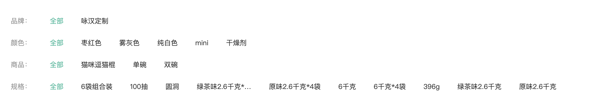
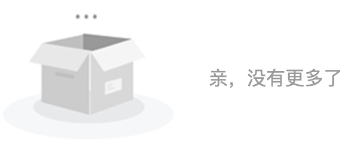

# 分类模块

## 1. 渲染函数

> 目标: 掌握 Vue 中渲染函数的使用方式

------

- [ ] 解释什么是渲染函数
- [ ] 演示如何使用渲染函数
- [ ] 通过需求演示渲染函数的使用场景

------

第一步: 解释什么是渲染函数

渲染函数就是组件中的一个配置选项, 允许开发者通过 JavaScript 的方式创建组件模板。

使用 JavaScript 的方式创建模板, 这种方式更加灵活。

```javascript
export default {
  render () {}
}
```

------

第二步: 演示如何使用渲染函数

渲染函数的使用方式如下:

```html
<script>
// 在 vue 中导入 h 方法, 用于创建元素
import { h } from 'vue'
export default {
  // render 函数返回什么, 页面中就显示什么
  render: function () {
    // h(元素名称, 元素属性, 子元素)
    // 元素属性为对象类型, 没有属性填 null
    // 如果子元素只有一个, 直接传入, 如果有多个, 放入数组中
    // return h('div', { class: 'haha' }, 'hello world')
    return h('div', { id: 'box' }, [
      h('h2', null, '我是h2'),
      h('h3', null, '我是h3')
    ])
  }
}
</script>
```

------

第三步: 通过需求演示渲染函数的使用场景

需求: 渲染标题组件, level 值表示标题级别.

```html
<XtxHeading level="3">h3</XtxHeading>
```
```html
<template>
  <h1 v-if="level == '1'"><slot></slot></h1>
  <h2 v-else-if="level == '2'"><slot></slot></h2>
  <h3 v-else-if="level == '3'"><slot></slot></h3>
  <h4 v-else-if="level == '4'"><slot></slot></h4>
  <h5 v-else-if="level == '5'"><slot></slot></h5>
  <h6 v-else-if="level == '6'"><slot></slot></h6>
</template>
<script>
export default {
  name: 'XtxHeading',
  props: ['level']
}
</script>
```

使用渲染函数解决标题组件模板代码重复问题

```html
<script>
// 在 vue 中导入 h 方法, 用于创建元素
import { h } from 'vue'
export default {
  name: 'XtxHeading',
  props: ['level'],
  // render 函数返回什么, 页面中就显示什么
  render: function () {
    return h(`h${this.level}`, null, this.$slots.default())
  }
}
</script>
```

## 2. 实现面包屑导航组件

> 目标: 掌握封装面包屑导航组件的方式


------

- [ ] 了解什么是面包屑导航
- [ ] 分析面包屑组件的实现思路
- [ ] 了解面包屑导航区块的 HTML 结构
- [ ] 创建面包屑组件
- [ ] 全局注册面包屑组件
- [ ] 渲染一级分类面包屑组件
- [ ] 渲染二级分类面包屑组件

------

第一步: 了解什么是面包屑导航

面包屑组件用于提示用户他所访问的当前位置: `首页 > 一级分类 > 二级分类 > 商品名称`

------

第二步: 分析面包屑组件的实现思路

```vue
<XtxBread>
  <XtxBreadItem path="/">首页</XtxBreadItem>
  <XtxBreadItem path="/category/1005000">居家</XtxBreadItem>
  <XtxBreadItem path="/category/sub/1017000">宠物食品</XtxBreadItem>
  <XtxBreadItem>多重口味，清煮肉罐（猫）85克*12罐</XtxBreadItem>
</XtxBread>
```

1. XtxBreadItem 组件用于渲染每一个具体的面包屑选项
2. 在调用 XtxItem 组件时, path 属性可传可不传, 传了在内部渲染链接, 不传在内部渲染普通文本
3. 用户所处的当前位置不加链接, 因为他已经在这个位置了，不再需要链接进行跳转
4. XtxBread 组件用于重新组织布局结构, 因为并不是所有的面包屑名称后面都有 ">"

------

第三步: 了解面包屑导航区块的 HTML 结构

```html
<!-- src/components/library/xtx-bread.vue -->
<template>
  <div class='xtx-bread'>
    <div class="xtx-bread-item">
      <RouterLink to="/">首页</RouterLink>
    </div>
    <i class="iconfont icon-angle-right"></i>
    <div class="xtx-bread-item">
      <RouterLink to="/category/10000">电器</RouterLink>
    </div>
    <i class="iconfont icon-angle-right"></i>
    <div class="xtx-bread-item">
      <span>空调</span>
    </div>
  </div>
</template>

<script>
export default {
  name: 'XtxBread'
}
</script>

<style scoped lang="less">
.xtx-bread {
  display: flex;
  padding: 25px 10px;
  &-item {
    a {
      color: #666;
      transition: all 0.4s;
      &:hover {
        color: @xtxColor;
      }
    }
  }
  i {
    font-size: 12px;
    margin-left: 5px;
    margin-right: 5px;
    line-height: 22px;
  }
}
</style>
```

------

第四步: 创建 XtxBreadItem 组件, 渲染面包屑选项

`components/library/XtxBreadItem.vue`

```vue
<template>
  <div class="xtx-bread-item">
    <RouterLink v-if="path" :to="path"><slot></slot></RouterLink>
    <span v-else><slot></slot></span>
  </div>
</template>
<script>
export default {
  name: "XtxBreadItem",
  props: ["path"],
};
</script>
<style lang="less" scoped>
.xtx-bread-item {
  a {
    color: #666;
    transition: all 0.4s;
    &:hover {
      color: @xtxColor;
    }
  }
}
</style>
```

------

第五步: 创建 XtxBread 组件, 重新组织面包屑的HTML结构, 动态渲染 ">"

`components/library/XtxBread.vue`

```vue
<script>
import { h } from "vue";

export default {
  name: "XtxBread",
  render() {
    // 获取组件默认插槽内容, 获取 XtxBreadItem 组件
    const items = this.$slots.default();
    // 存储子组件内容, 因为 icon 需要动态生成
    const children = [];
    // 遍历插槽内容
    items.forEach((item, index) => {
      // 将当前遍历插槽内容存储起来
      children.push(item);
      // 如果当前不是最后一项, 动态生成 icon
      if (index < items.length - 1)
        children.push(h("i", { className: "iconfont icon-angle-right" }));
    });
    // 创建面包屑最外层元素
    return h("div", { className: "xtx-bread" }, children);
  },
};
</script>

<style scoped lang="less">
.xtx-bread {
  display: flex;
  padding: 25px 10px;
  i {
    font-size: 12px;
    margin-left: 5px;
    margin-right: 5px;
    line-height: 22px;
  }
}
</style>
```

------

第六步: 全局注册面包屑导航组件

`components/library/index.js`

```javascript
import XtxBread from "@/components/library/XtxBread";
import XtxBreadItem from "@/components/library/XtxBreadItem";

export default {
  install (app) {
    app.component(XtxBread.name, XtxBread);
    app.component(XtxBreadItem.name, XtxBreadItem);
  }
}
```


第七步: 渲染一级分类面包屑组件

`views/category/TopCategoryPage.vue`

```vue
<template>
  <div class="container">
    <XtxBread>
      <XtxBreadItem path="/">首页</XtxBreadItem>
      <XtxBreadItem :path="`/category/${category?.id}`">{{
        category?.name
      }}</XtxBreadItem>
    </XtxBread>
  </div>
</template>

<script>
import { useRoute } from "vue-router";
import { useStore } from "vuex";
import { computed } from "vue";

export default {
  name: "TopCategoryPage",
  setup() {
    return { category: useBread() };
  },
};

// 获取面包屑组件数据
function useBread() {
  // 获取路由信息对象
  const route = useRoute();
  // 获取 store 对象
  const store = useStore();
  // 获取当前访问的分类信息
  // 为什么使用计算属性
  // 因为刚开始 category.list 里面只有 name 没有 id, 只有真实数据请求过来以后才有 id, 所以需要通过计算监控数据变化, 当数据发生变化后重新查找分类数据
  return computed(() => {
    return store.state.category.list.find(
      (category) => category.id === route.params.id
    );
  });
}
</script>
```

第五步: 渲染二级分类面包屑组件

```vue
<template>
  <div class="container">
    <XtxBread>
      <XtxBreadItem path="/">首页</XtxBreadItem>
      <XtxBreadItem :path="`/category/${category?.TopCategory?.id}`">{{
        category?.TopCategory?.name
      }}</XtxBreadItem>
      <XtxBreadItem :path="`/category/sub/${category?.SubCategory?.id}`">{{
        category?.SubCategory?.name
      }}</XtxBreadItem>
    </XtxBread>
  </div>
</template>

<script>
import { useRoute } from "vue-router";
import { computed } from "vue";
import { useStore } from "vuex";
export default {
  name: "SubCategoryPage",
  setup() {
    return { category: useBread() };
  },
};

// 返回面包屑所需数据
function useBread() {
  // 获取路由信息对象
  const route = useRoute();
  // 获取 store 对象
  const store = useStore();
  // 获取面包屑需要的分类信息
  return computed(() => {
    // 临时存储一级分类
    let TopCategory = null;
    // 临时存储二级分类
    let SubCategory = null;
    // 遍历一级分类
    store.state.category.list.forEach((top) => {
      // 遍历二级分类
      top.children?.forEach((sub) => {
        // 判断是否是当前分类
        if (sub.id === route.params.id) {
          // 存储一级分类
          TopCategory = top;
          // 存储二级分类
          SubCategory = sub;
        }
      });
    });
    // 返回分类数据
    return { TopCategory, SubCategory };
  });
}
</script>
```

## 3. 实现面包屑导航动画

> 目标: 为面包屑导航添加动画

------

- [ ] 为面包屑导航添加动画
- [ ] 掌握过渡模式的使用
- [ ] 掌握动画执行的必要条件

------

```html
<Transition name="fade-right" mode="out-in">
    <!-- 
        为什么加 key ?
        动画执行的先决条件是元素的卸载和挂载, 而每次导航切换时, 变化的只是 category.name, 
        标签是没有变化的, 加 key 就是为了让元素发生变化, 从而执行动画, 每个分类的 ID 都不一样,
        所以分类 ID 变化, 元素必定重新渲染
    -->
    <xtx-bread-item :key="category?.id">{{ category?.name }}</xtx-bread-item>
  	<!-- 
			mode: 指定过渡模式
			默认情况下入场元素的动画和离场元素的动画是同时执行的, 通过过渡模式可以更改这一默认行为
			in-out: 入场元素的动画先执行, 离场元素的动画后执行
			out-in: 离场元素的动画先执行, 入场元素的动画后执行
		-->
</Transition>
```

在 `common.less` 文件中加入动画样式.

```less
.fade-right-enter-from,
.fade-right-leave-to {
  transform: translateX(20px);
  opacity: 0;
}
.fade-right-enter-active,
.fade-right-leave-active {
  transition: all 0.5s;
}
.fade-right-enter-to,
.fade-right-leave-from {
  transform: none;
  opacity: 1;
}
```

[过渡模式](https://v3.cn.vuejs.org/guide/transitions-enterleave.html#%E8%BF%87%E6%B8%A1%E6%A8%A1%E5%BC%8F)

## 4. 批量注册组件

> 目标: 实现组件自动批量注册功能 (自动批量注册 library 文件夹下的组件)

------

- [ ] 批量获取所有组件的路径
- [ ] 遍历组件路径数组, 在遍历过程中通过组件路径导入组件
- [ ] 在导入组件后, 注册组件

------

```javascript
// require.context 批量导入模块
// 1. 目录  2. 是否在子目录的查找模块  3. 通过正则匹配文件
// 方法的返回值是一个导入函数, 通过这个导入函数导入组件
const importFn = require.context('./', false, /\.vue$/)
// 导入函数下有一个方法叫做 keys, 通过该方法可以获取匹配到的所有文件路径, 数组类型
const keys = importFn.keys()

export default {
  install (app) {
    // 遍历文件路径
    keys.forEach(key => {
      // 导入组件
      const component = importFn(key).default
      // 注册组件
      app.component(component.name, component)
    })
  }
}
```

## 5. 一级分类-轮播图展示

> 目标: 实现轮播图组件渲染


------

- [ ] 获取轮播图组件所需数据
- [ ] 将获取到的数据传递到轮播图组件内部
- [ ] 调整轮播图组件样式(高度)

------

`views/category/TopCategoryPage.vue`

```html
<template>
  <div class="container">
    <!-- 
			为组件设置行内样式, 样式会被添加到组件模板的根标记身上
			如果组件模板没有根标记, Vue 报警告
    -->
    <XtxCarousel :carousels="carousels" :style="{ height: '500px' }" />
  </div>
</template>
<script>
import { getBanners } from "@/api/home";
import { ref } from "vue"
export default {
  name: 'TopCategoryPage',
  setup () {
    return { carousels: useBanner() };
  }
}

// 获取轮播图数据
function useBanner() {
  // 存储轮播图数据
  const carousels = ref(null);
  // 获取轮播图数据
  getBanners(2).then((data) => (carousels.value = data.result));
  // 返回轮播图数据
  return carousels;
}
</script>
```

## 6. 一级分类-展示二级分类列表

> 目标: 渲染全局二级分类组件


------

- [ ] 创建全部二级分类列表组件, 实现基础布局
- [ ] 从已有的面包屑数据中获取当前一级分类对应的二级分类数据
- [ ] 使用已有数据渲染全部二级分类列表组件

------

第一步: 创建 `ShowSubCategoryList` 组件, 实现展示二级分类列表布局

`views/category/components/ShowSubCategoryList.vue`

```html
<template>
  <div class="sub-list">
    <h3>全部分类</h3>
    <ul>
      <li v-for="i in 6" :key="i">
        <a href="javascript:">
          
          <p>空调</p>
        </a>
      </li>
    </ul>
  </div>
</template>
<script>
export default {
  name: "ShowSubCategoryList",
};
</script>
<style lang="less" scoped>
.sub-list {
  margin-top: 20px;
  background-color: #fff;
  h3 {
    font-size: 28px;
    color: #666;
    font-weight: normal;
    text-align: center;
    line-height: 100px;
  }
  ul {
    display: flex;
    padding: 0 32px;
    flex-wrap: wrap;
    li {
      width: 168px;
      height: 160px;
      a {
        text-align: center;
        display: block;
        font-size: 16px;
        img {
          width: 100px;
          height: 100px;
        }
        p {
          line-height: 40px;
        }
        &:hover {
          color: @xtxColor;
        }
      }
    }
  }
}
</style>
```

第二步: 从面包屑导航数据中获取到当前一级分类对应的二级分类列表数据, 渲染组件

`views/category/TopCategoryPage.vue`

```vue
<ShowSubCategoryList :subCategories="category.children" v-if="category" />
```

`views/category/components/ShowSubCategoryList.vue`

```vue
<template>
  <div class="sub-list">
    <h3>全部分类</h3>
    <ul>
      <li v-for="subCategory in subCategories" :key="subCategory.id">
        <RouterLink :to="`/category/sub/${subCategory.id}`">
          
          <p>{{ subCategory.name }}</p>
        </RouterLink>
      </li>
    </ul>
  </div>
</template>
<script>
export default {
  name: "ShowSubCategoryList",
  props: {
    subCategories: {
      type: Array,
    },
  },
};
</script>
```

## 7. 一级分类-实现推荐商品布局

> 目标: 实现推荐商品组件基础布局

------

- [ ] 创建单个商品组件, 实现基础布局
- [ ] 创建推荐商品组件, 实现基础布局

------

第一步: 创建单个商品组件, 实现基础布局

`views/category/components/GoodsItem.vue`

```html
<template>
  <RouterLink to="/" class="goods-item">
    
    <p class="name ellipsis">红功夫 麻辣小龙虾 19.99/500g 实惠到家</p>
    <p class="desc ellipsis">火锅食材</p>
    <p class="price">&yen;19.99</p>
  </RouterLink>
</template>

<script>
export default {
  name: "GoodsItem",
};
</script>

<style scoped lang="less">
.goods-item {
  display: block;
  width: 220px;
  padding: 20px 30px;
  text-align: center;
  .hoverShadow();
  img {
    width: 160px;
    height: 160px;
  }
  p {
    padding-top: 10px;
  }
  .name {
    font-size: 16px;
  }
  .desc {
    color: #999;
    height: 29px;
  }
  .price {
    color: @priceColor;
    font-size: 20px;
  }
}
</style>
```

第二步: 创建推荐商品组件, 实现基础布局

`views/category/components/RecommendGoods.vue`

```html
<template>
  <div class="ref-goods">
    <div class="head">
      <h3>- 海鲜 -</h3>
      <p class="tag">温暖柔软，品质之选</p>
      <XtxMore />
    </div>
    <div class="body">
      <GoodsItem v-for="i in 5" :key="i" />
    </div>
  </div>
</template>

<script>
import GoodsItem from "@/views/category/components/GoodsItem";
export default {
  name: "CommandGoods",
  components: { GoodsItem },
};
</script>
<style lang="less" scoped>
.ref-goods {
  background-color: #fff;
  margin-top: 20px;
  position: relative;
  h3 {
    font-size: 28px;
    color: #666;
    font-weight: normal;
    text-align: center;
    line-height: 100px;
  }
  .head {
    .xtx-more {
      position: absolute;
      top: 20px;
      right: 20px;
    }
    .tag {
      text-align: center;
      color: #999;
      font-size: 20px;
      position: relative;
      top: -20px;
    }
  }
  .body {
    display: flex;
    justify-content: flex-start;
    flex-wrap: wrap;
    padding: 0 65px 30px;
  }
}
</style>
```

## 8. 一级分类-实现推荐商品渲染

> 目标: 实现推荐商品组件渲染

------

- [ ] 创建用于获取一级分类信息的 API 接口函数
- [ ] 根据一级分类ID获取一级分类信息并渲染模板
- [ ] 当本路由参数发生更新时, 重新获取一级分类信息

------

我们当前所处的是一级分类页面, 我们要根据一级分类ID获取一级分类的具体信息, 在一级分类的具体信息中包含了该一级分类下的具体的二级分类信息, 在二级分类信息中包含了二级分类下的商品推荐信息。

------

第一步: 定义获取具体一级类目信息的 API 接口

在 `api/category.js` 下导出 `getTopCategoryById` 方法

[一级类目-PC](http://zhoushugang.gitee.io/erabbit-client-pc-document/api.html#u4e00u7ea7u7c7bu76ee-pc0a3ca20id3du4e00u7ea7u7c7bu76ee-pc3e203ca3e)

`api/category.js`

```javascript
/**
 * 根据一级分类ID获取一级分类下的具体信息
 * @param id 一级分类ID
 * @return {Promise}
 */
export function getTopCategoryById(id) {
  return request("/category", "get", { id });
}
```

第二步: 根据一级分类ID获取一级分类信息并渲染模板

`views/category/components/CommandGoods.vue`

```vue
<template>
  <div class="ref-goods" v-for="sub in topCategory?.children" :key="sub.id">
    <div class="head">
      <h3>- {{ sub.name }} -</h3>
      <p class="tag">{{ sub.saleProperties }}</p>
      <XtxMore />
    </div>
    <div class="body">
      <GoodsItem :goods="goods" v-for="goods in sub.goods" :key="goods.id" />
    </div>
  </div>
</template>

<script>
import GoodsItem from "@/views/category/components/GoodsItem";
import { useRoute } from "vue-router";
import { getTopCategoryById } from "@/api/category";
import { ref } from "vue";
export default {
  name: "CommandGoods",
  components: { GoodsItem },
  setup() {
    // 获取理由信息对象
    const route = useRoute();
    // 用于存储一级分类具体信息
    const topCategory = ref(null);
    // 获取一级分类并存储一级分类
    getTopCategoryById(route.params.id).then((data) => {
      topCategory.value = data.result;
    });
    return { topCategory };
  },
};
</script>
```

渲染具体的商品信息

`views/category/components/GoodsItem.vue`

```html
<template>
  <RouterLink to="/" class="goods-item">
    
    <p class="name ellipsis">{{ goods.name }}</p>
    <p class="desc ellipsis">{{ goods.desc }}</p>
    <p class="price">&yen;{{ goods.price }}</p>
  </RouterLink>
</template>

<script>
export default {
  name: "GoodsItem",
  props: {
    goods: { type: Object, default: () => ({}) },
  },
};
</script>
```

第三步: 当本路由参数发生更新时, 重新获取一级分类信息

以上代码在分类发生变化后不会重新获取数据，因为路由规则没有发生变化，组件没有重新渲染，所以必须手动监控 url 变化。

```javascript
import { onBeforeRouteUpdate } from "vue-router";

// 获取一级分类并存储一级分类
function getData(id) {
  getTopCategoryById(id).then((data) => {
  	topCategory.value = data.result;
  });
}
// 首次进入路由时获取一级分类信息
getData(route.params.id);
// 当路由参数发生变化后再次获取一级分类信息
onBeforeRouteUpdate((to) => {
	getData(to.params.id);
});
```


## 9. 路由切换页面滚动至顶部

> 目标: 实现页面组件切换时, 滚动条重置回顶部


------

- [ ] 通过路由配置指定滚动条的重置功能

------

比如在浏览首页时将页面滚动到了底部, 然后切换到二级分类页, 此时二级分类页页面也是滚动到底部的状态, 目的是路由切换后让页面回到顶部

`router/index.js`

```javascript
const router = createRouter({
  scrollBehavior: () => ({ top: 0 }),
});
```

## 10. 二级分类-筛选组件-数据渲染

> 目标: 实现二级分类筛选区域数据渲染

------

- [ ]  创建筛选区域组件, 实现基础布局
- [ ]  在二级分类页面组件中调用筛选区域组件组件
- [ ]  创建用于获取筛选条件信息的 API 接口函数
- [ ]  在筛选区域组件中发送请求获取筛选条件数据并渲染模板
- [ ]  手动添加`全部`筛选条件选项




第一步: 创建筛选区域组件, 实现基础布局

`views/category/components/SubFilter.vue`

```html
<template>
  <!-- 筛选区 -->
  <div class="sub-filter">
    <div class="item" v-for="i in 4" :key="i">
      <div class="head">品牌：</div>
      <div class="body">
        <a href="javascript:">全部</a>
        <a href="javascript:" v-for="i in 4" :key="i">小米</a>
      </div>
    </div>
  </div>
</template>
<script>
export default {
  name: "SubFilter",
};
</script>
<style scoped lang="less">
// 筛选区
.sub-filter {
  background: #fff;
  padding: 25px;
  .item {
    display: flex;
    line-height: 40px;
    .head {
      width: 80px;
      color: #999;
    }
    .body {
      flex: 1;
      a {
        margin-right: 36px;
        transition: all 0.3s;
        display: inline-block;
        &.active,
        &:hover {
          color: @xtxColor;
        }
      }
    }
  }
}
</style>
```

第二步: 在二级分类页面组件中调用筛选区域组件

`views/category/SubCategoryPage.vue`

```html
<template>
  <!-- 筛选条件 -->
  <SubFilter />
</template>
<script>
import SubFilter from "@/views/category/components/SubFilter";
export default {
  components: { SubFilter }
}
</script>
```

第三步: 创建用于获取筛选信息的 API 接口

`api/category.js`

[二级类目-筛选条件-PC](http://zhoushugang.gitee.io/erabbit-client-pc-document/api.html#u4e8cu7ea7u7c7bu76ee-u7b5bu9009u6761u4ef6-pc0a3ca20id3du4e8cu7ea7u7c7bu76ee-u7b5bu9009u6761u4ef6-pc3e203ca3e)

```javascript
/**
 * 根据二级分类id获取筛选条件
 * @param id 二级分类id
 * @return {Promise}
 */
export function getSubCategoryFilterById(id) {
  return request("/category/sub/filter", "get", { id });
}
```

第四步: 在 `SubFilter` 组件中获取筛选条件数据并渲染模板

`views/category/components/SubFilter.vue`

```javascript
import { ref } from "vue";
import { getSubCategoryFilterByIdApi } from "@/api/category";
import { useRoute } from "vue-router";

export default {
  name: "SubFilter",
  setup() {
    const { filters } = useSubCategoryFilter();
    return { filters };
  },
};

// 获取筛选条件
function useSubCategoryFilter() {
  // 获取路由信息对象
  const route = useRoute();
  // 用于存储所有筛选条件数据
  const filters = ref(null);
  // 获取筛选条件
  getSubCategoryFilterByIdApi(route.params.id).then((data) => {
    // 在品牌筛选条件的前面加上 `全部` 筛选选项
    data.result.brands.unshift({ id: null, name: "全部" });
    // 在其他筛选条件的前面加上 `全部` 筛选选项
    data.result.saleProperties.forEach((item) =>
      item.properties.unshift({ id: null, name: "全部" })
    );
    // 存储筛选条件
    filters.value = data.result;
  });
  return { filters };
}
```

```html
<div class="sub-filter" v-if="filters">
  <div class="item">
    <div class="head">品牌：</div>
    <div class="body">
      <a v-for="brand in filters.brands" :key="brand.id">{{brand.name}}</a>
    </div>
  </div>
  <div class="item" v-for="item in filters.saleProperties" :key="item.id">
    <div class="head">{{ item.name }}：</div>
    <div class="body">
      <a v-for="property in item.properties" :key="property.id">{{ property.name }}</a>
    </div>
  </div>
</div>
```

## 11. 二级分类-筛选组件-收集筛选条件

> 目标: 实现收集用户选择的筛选条件

------

- [ ] 当用户选择筛选条件时临时存储用户选择的筛选条件
- [ ] 汇总用户选择的所有筛选条件
- [ ] 为用户选择的筛选条件添加选中效果
- [ ] 将用户选择的筛选条件数据传递到父组件备用

------

第一步: 当用户选择筛选条件时临时存储用户选择的筛选条件 (存什么, 存在哪)

`views/category/components/SubFilter.vue`

```javascript
// 获取筛选条件
function useSubCategoryFilter() {
  // 获取筛选条件
  getSubCategoryFilterByIdApi(route.params.id).then((data) => {
    data.result.saleProperties.forEach((item) => {
      // 用于存储用户选择的筛选条件
      item.selectedFilterName = "全部";
    });
    // 用于存储用户选择的品牌id
    data.result.selectedBrandId = null;
  });
}
```

选中哪一个筛选条件就存储哪一个筛选条件的id值

```html
<a @click="filters.selectedBrandId = brand.id">{{ brand.name }}</a>
<a @click="item.selectedFilterName = property.name">{{ property.name }}</a>
```

第二步: 汇总用户选择的所有筛选条件

在向服务器端发送请求获取商品列表数据时, 用户选择的筛选条件将会作为请求的请求参数, 所以当前我们在收集筛选条件时, 数据的格式及名称要符合接口的要求, 接口中要求的数据格式如下:

```json
{
  // 用户选择的品牌的ID
  'brandId': null,
  // 用户选择的其他筛选条件集合
  // groupName: 筛选类别名称, 比如颜色, 尺码
  // propertyName: 具体的筛选条件名称, 比如黑色, 120cm
  'attrs': [{ groupName: '', propertyName:'' }]
}
```

`views/category/components/SubFilter.vue`

创建用于存储用户选择的筛选条件的对象 `selectedFilters`

创建用于更新用户选择的筛选条件的方法 `updateSelectedFilters`

```javascript
function useSubCategoryFilter() {
  // 用于存储用户选择的筛选条件
  const selectedFilters = {
    brandId: null,
    attrs: [],
  };
  // 用于更新用户选择的筛选条件
  const updateSelectedFilters = () => {
    // 更新用户选择的品牌id
    selectedFilters.brandId = filters.value.selectedBrandId;
    // 重置用户选择的筛选条件
    selectedFilters.attrs = [];
    // 更新用户选择的筛选条件
    filters.value.saleProperties.forEach((item) => {
      // 如果用户选择了当前筛选类别的筛选条件
      if (item.selectedFilterName && item.selectedFilterName !== "全部") {
        // 收集用户选择的筛选条件类别名称和具体的筛选条件名称
        selectedFilters.attrs.push({
          groupName: item.name,
          propertyName: item.selectedFilterName,
        });
      }
    });
  };
}
```

当用户选择筛选条件时执行 `updateSelectedFilters` 方法收集用户选择的筛选条件

`views/category/components/SubFilter.vue`

```javascript
export default {
  name: "SubFilter",
  setup() {
    const { filters, updateSelectedFilters } = useSubCategoryFilter();
    return { filters, updateSelectedFilters };
  },
};
```

```vue
<a @click="filters.selectedBrandId = brand.id; updateSelectedFilters();"></a>
<a @click="item.selectedFilterName = property.name; updateSelectedFilters();"></a>
```

第三步: 为用户选择的筛选条件添加选中效果

```vue
<a :class="{ active: filters.selectedBrandId === brand.id }">{{ brand.name }}</a>
<a :class="{ active: item.selectedFilterName === property.name }">{{ property.name }}</a>
```

第四步: 将用户选择的筛选条件数据传递到父组件备用

`views/category/components/SubFilter.vue`

```javascript
function useSubCategoryFilter(emit) {
  const updateSelectedFilters = () => {
    // 将用户选择的筛选条件传递到父组件
    emit("onFilterParamsChanged", selectedFilters);
  }
}
```

`views/category/SubCategory.vue`

```vue
<!-- 筛选区块 -->
<SubFilter @onFilterParamsChanged="onParamsChanged" />
```

```javascript
export default {
  setup() {
    // 获取用户选择的筛选条件
    const onParamsChanged = (target) => {
      console.log(target);
    };
    return {
      onParamsChanged,
    };
  },
};
```

## 12. 二级分类-筛选组件-数据更新

> 目标: 实现在二级分类页面之间跳转时进行筛选条件数据的更新

------

- [ ] 分析为什么在二级分类页面之间跳转时筛选数据不更新
- [ ] 实现在二级分类页面之间跳转时更新筛选条件数据

------

第一步: 分析为什么在二级分类页面之间跳转时筛选数据不更新

1. 为什么从一个二级分类跳转到另一个二级分类以后, 页面中不显示最新的筛选条件数据?

   因为只有 `setup` 方法重新执行, 重新调用获取筛选条件数据的方法以后, 程序才会向服务器端发送请求获取最新筛选数据, 而 `setup` 方法只有在组件重新渲染时才会重新执行, 当我们从一个二级分类跳转到另一个二级分类以后, 实际上组件并没有重新渲染, 所以此时页面中并没有显示最新的筛选条件数据.

2. 为什么在从一个二级分类跳转到另一个二级分类页面, 组件不重新渲染?

   因为路由规则本身并没有发生变化, 只有路由规则本身发生了变化, 组件才会重新渲染, 比如从一级分类跳转到二级分类, 路由规则从 `/category/:id` 变成了 `/category/sub/:id`, 比如从首页跳转到一级分类页面, 路由规则从 `/` 变成了 `/category/:id`, 此时路由规则发生了变化, 组件才会重新渲染.
   
   当路由在二级分类页面之间跳转时只是路由参数发生了变化, 此时路由组件是不会重新渲染的. 
   
   `/category/sub/1` -> `/category/sub/2`

第二步: 实现在二级分类页面之间跳转时更新筛选条件数据

通过 `onBeforeRouteUpdate` 方法监听路由更新, 路由更新时调用获取筛选条件的方法更新数据就可以了.

```javascript
// 获取筛选条件
function useSubCategoryFilter() {
  // 获取筛选条件
  function getSubCategoryFilterById(id) {
    getSubCategoryFilterByIdApi(id).then();
  }
  // 初始获取筛选条件数据
  getSubCategoryFilterById(route.params.id);
  // 路由更新时获取筛选条件数据
  onBeforeRouteUpdate((to) => getSubCategoryFilterById(to.params.id));
}
```

## 13. 二级分类-筛选组件-骨架屏

> 目标: 实现在加载筛选数据时的骨架屏效果

------

- [ ] 添加骨架屏结构和样式
- [ ] 添加筛选数据加载状态
- [ ] 通过状态控制骨架屏结构的渲染与销毁

------

第一步: 添加骨架屏结构和样式

`views/category/components/SubFilter.vue`

```html
<div class="sub-filter">
  <XtxSkeleton class="item" width="800px" height="40px" />
  <XtxSkeleton class="item" width="800px" height="40px" />
  <XtxSkeleton class="item" width="600px" height="40px" />
  <XtxSkeleton class="item" width="600px" height="40px" />
  <XtxSkeleton class="item" width="600px" height="40px" />
</div>
```

```less
.xtx-skeleton {
  padding: 10px 0;
}
```

第二步: 添加筛选数据加载状态

为什么骨架屏效果需要 filtersLoading 加载状态?

当从一个二级分类切换到另一个二级分类时, 此时如果只判断 filters 是否有值的话, 那么此时 filters 是一定有值的, 但是在切换到另一个二级分类的过程中, 程序确实又向服务器端发送了请求获取了最新的筛选条件数据, 此时是需要显示骨架屏的, 但 filters 一直有数据骨架屏显示不出来, 所以此处不能只判断 filters, 所以此处加入了加载状态 `filtersLoading`

`views/category/components/SubFilter.vue`

```javascript
// 获取筛选条件数据
function useSubCategoryFilter() {
  // 用于存储筛选数据的加载状态
  const filtersLoading = ref(false);
  // 获取筛选条件
  function getSubCategoryFilterById(id) {
    // 更新筛选数据的加载状态
    filtersLoading.value = true;
    // 发送请求
    getSubCategoryFilterByIdApi(id).then((data) => {
      // 更新筛选数据的加载状态
      filtersLoading.value = false;
    });
  }
  return { filtersLoading };
}
```

```javascript
setup () {
  const { filtersLoading } = useSubCategoryFilter(emit);
  return { filtersLoading };
}
```

第三步: 通过状态控制骨架屏结构的渲染与销毁

```html
<div class="sub-filter" v-if="filters && !filtersLoading"></div>
<div class="sub-filter" v-else></div>
```

## 14. 封装复选框组件

> 目标: 封装 XtxCheckbox 复选框组件

------

为什么要封装复选框组件: 网站中的所有的复选框样式风格是统一的, 而 HTML 中默认的复选框不支持样式的完全自定义.

------

- [ ] 创建复选框组件, 实现基础布局

- [ ] 实现复选框的选中与取消选中逻辑
- [ ] 实现复选框的双向数据绑定功能 (手动实现)
- [ ] 实现复选框的双向数据绑定功能 (通过 `@vueuse/core` 实现)

------

第一步: 创建复选框组件, 实现基础布局

`components/library/XtxCheckbox.vue`

```html
<template>
  <div class="xtx-checkbox">
    <i class="iconfont icon-checked"></i>
    <i class="iconfont icon-unchecked"></i>
    <span></span>
  </div>
</template>
<script>
export default {
  name: "XtxCheckbox",
};
</script>
<style scoped lang="less">
.xtx-checkbox {
  display: inline-block;
  margin-right: 2px;
  .icon-checked {
    color: @xtxColor;
    ~ span {
      color: @xtxColor;
    }
  }
  i {
    position: relative;
    top: 1px;
  }
  span {
    margin-left: 2px;
  }
}
</style>
```

第二步: 实现复选框状态更改逻辑

```html
<template>
  <div class="xtx-checkbox" @click="toggle">
    <i class="iconfont icon-checked" v-if="isChecked"></i>
    <i class="iconfont icon-unchecked" v-else></i>
    <!-- 如果插槽存在内容 $slots.default 为真 否则为假 -->
    <span v-if="$slots.default"><slot></slot></span>
  </div>
</template>
<script>
import { ref } from 'vue'
export default {
  name: 'XtxCheckbox',
  setup () {
    // 用于存储复选框是否选中的状态
    const isChecked = ref(true);
    // 更改复选框选中状态
    const toggle = () => {
      isChecked.value = !isChecked.value;
    };
    return { isChecked, toggle };
  }
}
</script>
```

第三步: 实现复选框的双向数据绑定功能 (手动实现)

```javascript
import { ref, watchEffect } from "vue";

export default {
  name: "XtxCheckbox",
  props: {
    modelValue: {
      type: Boolean,
      default: false,
    },
  },
  setup(props, { emit }) {
    // 用于存储复选框是否选中的状态
    const isChecked = ref(false);
    // 更改复选框选中状态
    const toggle = () => {
      // 对当前复选框的值进行取反, 就是让它变成当前值的反向值
      isChecked.value = !isChecked.value;
      // 监听内部值的变化, 同步给外部值
      emit("update:modelValue", isChecked.value);
    };
    // 监听外部值的变化, 将其同步给内部值
    watchEffect(() => {
      isChecked.value = props.modelValue;
    });
    return { isChecked, toggle };
  },
};
```

```html
<!-- 外部调用测试代码 -->
<XtxCheckbox v-model="test"></XtxCheckbox>
<button @click="test = !test"></button>
```
```javascript
// 外部调用测试代码
setup() {
  const test = ref(false);
  return { test };
}
```

第四步: 实现复选框的双向数据绑定功能 (通过 `@vueuse/core` 实现)

```javascript
import { useVModel } from '@vueuse/core'
export default {
  name: 'XtxCheckbox',
  props: {
    modelValue: {
      type: Boolean,
      default: false
    }
  },
  setup (props, { emit }) {
    // useVModel 实现双向数据绑定
    // 将 props 中的 modelValue 实现双向数据绑定
    // useModel 的返回值是一个新的响应式数据, 可以在当前模板中直接使用
    const isChecked = useVModel(props, "modelValue", emit);
    // 更改复选框选中状态
    const toggle = () => {
      isChecked.value = !isChecked.value;
    };
    return { isChecked, toggle }
  }
}
```

## 15. 二级分类-排序组件

> 目标: 实现排序组件基础布局、实现排序组件的排序参数选择


------

- [ ] 创建排序组件, 实现基础布局
- [ ] 在二级分类页面组件中调用排序组件
- [ ] 收集用户选择的排序条件并将它传递到父组件中

------

第一步: 创建排序组件, 实现基础布局

`views/category/components/SubSort.vue`

```html
<template>
  <div class="sub-sort">
    <div class="sort">
      <a href="javascript:">默认排序</a>
      <a href="javascript:">最新商品</a>
      <a href="javascript:">最高人气</a>
      <a href="javascript:">评论最多</a>
      <a href="javascript:">
        价格排序
        <i class="arrow up"></i>
        <i class="arrow down"></i>
      </a>
    </div>
    <div class="check">
      <XtxCheckbox>仅显示有货商品</XtxCheckbox>
      <XtxCheckbox>仅显示特惠商品</XtxCheckbox>
    </div>
  </div>
</template>
<script>
export default {
  name: "SubSort",
};
</script>
<style scoped lang="less">
.sub-sort {
  height: 80px;
  display: flex;
  align-items: center;
  justify-content: space-between;
  .sort {
    display: flex;
    a {
      height: 30px;
      line-height: 28px;
      border: 1px solid #e4e4e4;
      padding: 0 20px;
      margin-right: 20px;
      color: #999;
      border-radius: 2px;
      position: relative;
      transition: all 0.3s;
      &.active {
        background: @xtxColor;
        border-color: @xtxColor;
        color: #fff;
      }
      .arrow {
        position: absolute;
        border: 5px solid transparent;
        right: 8px;
        &.up {
          top: 3px;
          border-bottom-color: #bbb;
          &.active {
            border-bottom-color: @xtxColor;
          }
        }
        &.down {
          top: 15px;
          border-top-color: #bbb;
          &.active {
            border-top-color: @xtxColor;
          }
        }
      }
    }
  }
  .check {
    .xtx-checkbox {
      margin-left: 20px;
      color: #999;
    }
  }
}
</style>
```

第二步: 在二级分类页面组件 `SubCategoryPage` 中调用 `SubSort` 组件

`views/category/SubCategorPage.vue`

```html
<!-- 商品区块 -->
<div class="goods-list">
  <!-- 商品排序 -->
  <SubSort />
</div>
<script>
import SubSort from "@/views/category/components/SubSort";
export default {
  components: { SubSort }
}
</script>
<style scoped lang="less">
.goods-list {
  background: #fff;
  padding: 0 25px;
  margin-top: 25px;
}
</style>
```

第三步: 收集用户选择的排序条件

无论是筛选条件还是排序条件, 最终都是服务于商品列表的, 当用户点击筛选条件或者排序条件后, 都要向服务器端发送请求获取筛选结果和排序结果, 也就是说, 我们要将用户选择的筛选条件和排序条件通过请求参数的方式发送给服务器端, 这样服务器端才能基于我们的请求参数响应给我们所需的数据. 所以接下来我们要做的事情就是组织排序请求参数, 当用户点击按钮更改排序方式时, 同步排序请求参数.

| sortField   |          |        |
| ----------- | -------- | ------ |
| publishTime | 最新商品 | String |
| orderNum    | 最高人气 | String |
| price       | 价格排序 | String |
| evaluateNum | 评论最多 | String |

| sortMethod  |      |        |
| :---------- | ---- | ------ |
| asc         | 升序 | String |
| desc (默认) | 倒序 | String |

| inventory | 是否只显示有货商品 | Boolean |
| --------- | ------------------ | ------- |

| onlyDiscount | 是否只显示特惠商品 | Boolean |
| ------------ | ------------------ | ------- |

`views/category/components/SubSort.vue`

`sortParams`: 用于存储排序条件

`updateSortParams`: 用于更新排序条件, 传递筛选条件

```javascript
import { ref } from "vue";

export default {
  name: "SubSort",
  setup(props, { emit }) {
    // 用于存储排序条件
    const sortParams = ref({
      sortField: "",
      sortMethod: "desc",
      inventory: false,
      onlyDiscount: false,
    });
    // 用于更新排序条件
    const updateSortParams = (target) => {
      // 更新筛选条件
      sortParams.value = { ...sortParams.value, ...target };
      // 将筛选条件传递到父组件
      emit("onSortParamsChanged", sortParams.value);
    };
    return { sortParams, updateSortParams };
  },
};
```

```html
<a @click="updateSortParams({ sortField: '', sortMethod: 'desc' })">默认排序</a>
<a @click="updateSortParams({ sortField: 'publishTime' })">最新商品</a>
<a @click="updateSortParams({ sortField: 'orderNum' })">最高人气</a>
<a @click="updateSortParams({ sortField: 'evaluateNum' })">评论最多</a>
<a @click="updateSortParams({ sortField: 'price', sortMethod: sortParams.sortMethod === 'desc' ? 'asc' : 'desc' })">
  价格排序
  <i class="arrow up"></i>
  <i class="arrow down"></i>
</a>
<XtxCheckbox
  v-model="sortParams.inventory"
  @update:modelValue="updateSortParams({ inventory: $event })"
>仅显示有货商品</XtxCheckbox>
<XtxCheckbox
  v-model="sortParams.onlyDiscount"
  @update:modelValue="updateSortParams({ inventory: $event })"
>仅显示特惠商品</XtxCheckbox>
```

第四步: 为排序按钮添加选中效果

`views/category/components/SubSort.vue`

```vue
<a :class="{ active: sortParams.sortField === '' }">默认排序</a>
<a :class="{ active: sortParams.sortField === 'publishTime' }">最新商品</a>
<a :class="{ active: sortParams.sortField === 'orderNum' }">最高人气</a>
<a :class="{ active: sortParams.sortField === 'evaluateNum' }">评论最多</a>
<a>
  价格排序
  <i :class="{ active: sortParams.sortMethod === 'asc' }"></i>
  <i :class="{ active: sortParams.sortMethod === 'desc' }"></i>
</a>
```

## 16. 二级分类-商品列表渲染

> 目标: 渲染商品列表组件


------

- [ ] 新建商品列表组件 `GoodsList`, 实现基础布局
- [ ] 在二级分类页面组件中调用 `GoodsList` 组件
- [ ] 在 `api/category.js` 中创建用于获取商品列表数据的 API 函数
- [ ] 在二级分类页面组件中调用接口获取商品数据
- [ ] 使用获取到商品数据渲染组件
- [ ] 实现路由更新重新获取商品列表数据

------

第一步: 新建商品列表组件, 实现基础布局

`views/category/components/GoodsList.vue`

```html
<template>
  <ul>
    <li v-for="i in 20" :key="i">
      <GoodsItem :goods="{}" />
    </li>
  </ul>
</template>
<script>
import GoodsItem from "@/views/category/components/GoodsItem";
export default {
  name: "GoodsList",
  components: { GoodsItem },
  props: {
    goods: {
      type: Array,
      default: () => [],
    },
  }
};
</script>

<style scoped lang="less">
ul {
  display: flex;
  flex-wrap: wrap;
  padding: 0 5px;
  li {
    margin-right: 20px;
    margin-bottom: 20px;
    &:nth-child(5n) {
      margin-right: 0;
    }
  }
}
</style>
```

第二步: 在二级分类页面组件 `SubCategoryPage` 中调用 `GoodsList` 组件

```vue
<div class="goods-list">
  <!-- 商品排序 -->
  <SubSort />
  <!-- 商品列表 -->
  <GoodsList />
</div>
```

第三步: 创建用于获取商品列表数据的 API 函数

`api/category.js`  

[商品列表_临时](http://zhoushugang.gitee.io/erabbit-client-pc-document/api.html#u5546u54c1u5217u8868-u4e34u65f60a3ca20id3du5546u54c1u5217u8868-u4e34u65f63e203ca3e)

[商品列表--分页查询](http://zhoushugang.gitee.io/erabbit-client-pc-document/api.html#u5546u54c1u5217u8868-u5206u9875u67e5u8be20a3ca20id3du5546u54c1u5217u8868-u5206u9875u67e5u8be23e203ca3e)

```javascript
/**
 * 获取商品列表
 * @param params 分类id、筛选条件、排序条件、分页信息
 * @return {Promise}
 */
export function getGoodsReq(params) {
  return request("/category/goods", "post", params);
}
```

第四步: 在二级分类页面组件 `SubCategoryPage` 中调用接口获取商品数据

```javascript
import { getGoodsReq } from "@/api/category";
import { onBeforeRouteUpdate, useRoute } from "vue-router";

export default {
  setup() {
    const { result } = useGoods();
    return { result };
  },
};

// 获取商品数据
function useGoods() {
  // 获取路由信息对象
  const route = useRoute();
  // 用于存储商品数据
  const result = ref(null);
  // 用于存储请求参数
  let reqParams = ref({
    categoryId: route.params.id,
  });
  // 用于获取商品数据 (初始进入页面, 筛选条件变化, 排序条件变化都要调用 getGoods)
  const getGoods = () => {
    // 获取商品数据
    getGoodsReq(reqParams.value).then((data) => {
      result.value = data.result;
    });
  };
  // 监听请求参数变化, 重新获取数据
  watch(
    () => reqParams.value,
    () => {
      getGoods();
    },
    {
      // 初始进入页面获取商品数据
      immediate: true
    }
  );
  return { result };
}
```

第五步: 使用刚刚获取到的商品列表数据渲染组件模板

将获取到的商品列表数据传递到 `GoodsList` 组件中

`views/category/SubCategoryPage.vue`

```vue
<!-- 商品列表区块 -->
<GoodsList :goods="result.items" v-if="result" />
```

将具体的商品数据对象传递到 `GoodsItem` 组件中

`views/category/components/GoodsList.vue`

```vue
<li v-for="item in goods" :key="item.id">
  <GoodsItem :goods="item" />
</li>
```

第六步: 实现路由更新重新获取商品列表数据

```javascript
function useGoods() {
  // 路由更新, 更新请求参数中的分类id
  onBeforeRouteUpdate((to) => {
    reqParams.value = { ...reqParams.value, categoryId: to.params.id };
  });
}
```

## 17. 二级分类-商品排序与筛选

> 目标: 实现商品排序功能

------

- [ ] 声明 `updateReqParams` 方法, 供组件使用, 用于更新请求参数
- [ ] 在 `setup` 方法中将 `updateReqParams` 方法导出, 让组件可以使用
- [ ] 当排序条件发生变化时调用 `updateReqParams` 方法更新请求参数, 重新获取商品数据

------

第一步: 声明 `updateReqParams` 方法, 供组件使用, 用于更新请求参数

`views/category/SubCategoryPage.vue`

```javascript
function useGoods() {
  // 用于更新请求参数
  const updateReqParams = (target) => {
    reqParams.value = { ...reqParams.value, ...target };
  };
  return { updateReqParams }
}
```

第二步: 在 `setup` 方法中将 `updateReqParams` 方法导出, 让组件可以使用

```javascript
export default {
  setup() {
    const { updateReqParams } = useGoods();
    return { updateReqParams };
  },
};
```

第三步: 当排序条件和筛选条件发生变化时调用 `updateReqParams` 方法更新请求参数, 重新获取商品数据

```vue
<!-- 排序区块 -->
<SubSort @onSortParamsChanged="updateReqParams" />
<!-- 筛选区块 -->
<SubFilter @onFilterParamsChanged="updateReqParams" />
```

## 18. 二级分类-加载更多数据

> 目标: 实现商品列表下拉滚动到底部加载更多数据逻辑




------

- [ ] 创建无限列表加载组件, 实现基础布局
- [ ] 在二级分类页面组件中调用无限列表加载组件, 查看静态效果
- [ ] 无限列表加载组件接收 `loading` 控制正在加载UI状态的显示与隐藏, 接收 `finished` 控制无更多数据UI状态的显示与隐藏
- [ ] 监听元素是否进入可视区, 当元素进入可视区以后触发自定义事件通知父组件, 屏幕触底了你可以做你想做的事情了
- [ ] 在二级分类页面组件中声明 `loading` 和 `finished` 用于动态控制无限加载组件内部的UI状态
- [ ] 实现加载更多商品数据逻辑
  1. 页面滚动到底部更改页码重新加载数据
  2. 筛选条件和排序条件发生变化以后, 从第一页开始获取数据, 所以页码需要重置.
  3. 当我们从一个二级分类跳转到另一个二级分类以后, 所有数据需要重新获取, 所有页码需要重置
  4. 发生以上两种情况时, finished 状态需要重置为 false

------

第一步: 创建无限列表加载组件, 实现基础布局

`components/library/XtxInfiniteLoading.vue`

```vue
<template>
  <div class="xtx-infinite-loading">
    <div class="loading">
      <span class="img"></span>
      <span class="text">正在加载...</span>
    </div>
    <div class="none">
      <span class="img"></span>
      <span class="text">亲，没有更多了</span>
    </div>
  </div>
</template>
<script>
export default {
  name: "XtxInfiniteLoading",
};
</script>
<style scoped lang="less">
.xtx-infinite-loading {
  .loading {
    display: flex;
    align-items: center;
    justify-content: center;
    height: 200px;
    .img {
      width: 50px;
      height: 50px;
      background: url(../../assets/images/load.gif) no-repeat center / contain;
    }
    .text {
      color: #999;
      font-size: 16px;
    }
  }
  .none {
    display: flex;
    align-items: center;
    justify-content: center;
    height: 200px;
    .img {
      width: 200px;
      height: 134px;
      background: url(../../assets/images/none.png) no-repeat center / contain;
    }
    .text {
      color: #999;
      font-size: 16px;
    }
  }
}
</style>
```

第二步: 在二级分类页面组件 `SubCategoryPage` 中调用无限列表加载组件, 查看静态效果

```html
<div class="goods-list">
  <XtxInfiniteLoading />
</div>
```

第三步: 接收 `loading` 控制正在加载UI状态的显示与隐藏, 接收 `finished` 控制无更多数据UI状态的显示与隐藏

```vue
<template>
  <div class="loading" v-if="loading"></div>
  <div class="none" v-if="finished"></div>
</template>
<script>
export default {
  name: "XtxInfiniteLoading",
  props: {
    // 是否正在加载
    loading: {
      type: Boolean,
      default: false,
    },
    // 是否全部数据都已加载完成
    finished: {
      type: Boolean,
      default: false,
    },
  },
};
</script>
```

第四步: 监听元素是否进入可视区, 当元素进入可视区以后触发自定义事件通知父组件, 屏幕触底了你可以做你想做的事情了

```vue
<template>
  <div class="xtx-infinite-loading" ref="target"></div>
</template>
<script>
import { useIntersectionObserver } from "@vueuse/core";
import { ref } from "vue";

export default {
  setup(props, { emit }) {
    // 被监听元素
    const target = ref(null);
    // 执行监听元素的操作
    useIntersectionObserver(target, ([{ isIntersecting }]) => {
      // 如果元素进入了可视区
      if (isIntersecting) {
        // 如果没有正在加载并且还有数据可以加载
        if (!props.loading && !props.finished) {
          // 通过触发自定义事件告诉父组件, 元素进入可视区了.
          emit("infinite");
        }
      }
    });
    return { target };
  },
};
</script>
```

注意: 当查看效果以后, 自定义事件 `infinite` 会初始执行一次, 因为初始状态页面什么都没有, 元素直接就在可视区中. 

第五步: 声明 `loading` 和 `finished` 用于控制无限加载组件内部的UI状态

`views/category/SubCategoryPage.vue`

```javascript
function useGoods() {
  // 用于标识加载状态
  const loading = ref(false);
  // 用于标识是否全部数据都已经加载完成
  const finished = ref(false);
  // 用于获取商品数据 (初始进入页面, 筛选条件变化, 排序条件变化都要调用 getGoods)
  const getGoods = (params) => {
    // 加载中
    loading.value = true;
    // 获取商品数据
    getGoodsReq(params).then((data) => {
      // 加载完成
      loading.value = false;
    });
  };
  return { loading, finished };
}
```

```vue
 <XtxInfiniteLoading :loading="loading" :finished="finished"/>
```

第六步: 实现加载更多数据逻辑

```vue
<template>
  <div class="container">
    <!-- 无限列表加载组件 -->
    <XtxInfiniteLoading @infinite="loadMore"/>
    </div>
  </div>
</template>

<script>
export default {
  setup() {
    const { loadMore } = useGoods();
    // 获取用户选择的筛选条件
    return {
      loadMore,
    };
  },
};

// 获取商品数据
function useGoods() {
  // 用于存储请求参数
  let reqParams = ref({
    categoryId: route.params.id,
    // 当前页
    page: 1,
    // 每次请求获取的数据条数
    pageSize: 10,
  });
  // 用于获取商品数据 (初始进入页面, 筛选条件变化, 排序条件变化都要调用 getGoods)
  const getGoods = (params) => {
    // 获取商品数据
    getGoodsReq(params).then((data) => {
      // 如果当前是第一页, 直接赋值
      if (reqParams.value.page === 1) {
        result.value = data.result;
      } else {
        // 如果当前不是第一页, 做商品列表数据的累加
        result.value = {
          ...result.value,
          items: [...result.value.items, ...data.result.items],
        };
      }
      // 如果当前页已经是最后一页
      if (reqParams.value.page === data.result.pages) {
        // 所有数据已加载完成
        finished.value = true;
      }
    });
  };
  // 加载更多
  const loadMore = () => {
    reqParams.value.page++;
  };
  return { loadMore };
}
</script>
```

当筛选条件和排序条件发生变化以后, 需要从第一页开始获取数据, 所以页码需要重置.

```javascript
// 用于更新请求参数
const updateReqParams = (target) => {
	reqParams.value = { ...reqParams.value, ...target, page: 1 };
};
```

当我们从一个二级分类跳转到另一个二级分类以后, 所有数据需要重新获取, 所有页码需要重置

```javascript
// 路由更新, 重置页码
onBeforeRouteUpdate((to) => {
  reqParams.value = { ...reqParams.value, categoryId: to.params.id, page: 1 };
});
```

发生以上两种情况时, finished 状态需要重置,如果 finished 不重置的话就无法触发 infinite 自定义事件, 就算页面被滚动到底部, 也不会去加载更多数据.

```javascript
if (reqParams.value.page === 1) {
	finished.value = false;
}
```


当筛选条件、排序条件发生变化时重置页码
当路由参数发生变化时重置页码

页码重置后解锁finished状态

