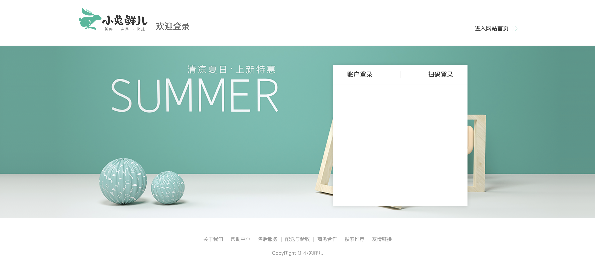
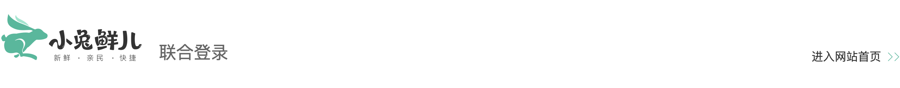
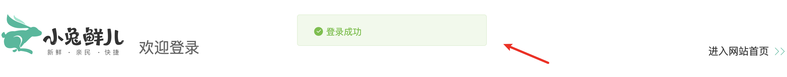
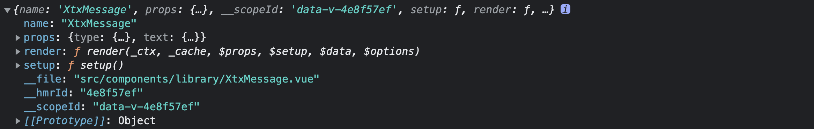
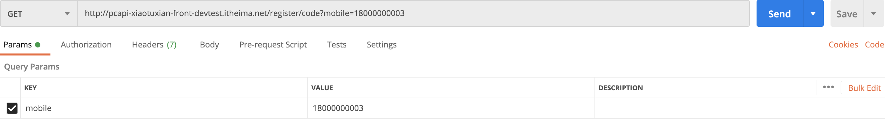
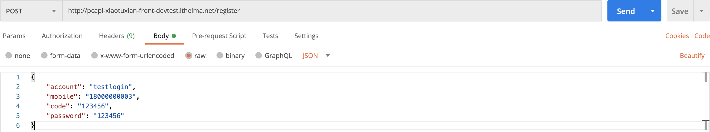
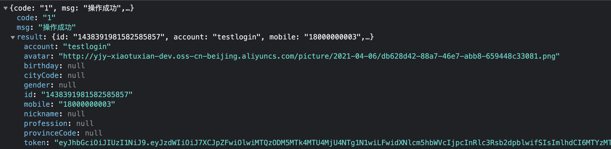
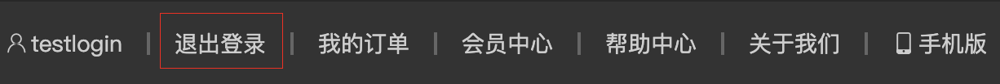
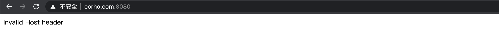

# 登录模块

## 01. 登录-配置路由规则

> 目标: 创建登录页页面组件, 配置登录页页面组件路由规则

------

- [ ] 创建登录页页面组件, 实现基础布局
- [ ] 配置登录页页面的路由规则
- [ ] 为顶部通栏中的 `请先登录` 按钮添加跳转链接

------

第一步：创建登录页面组件, 实现基础布局

`views/login/LoginPage.vue`

```html
<template>
  <div class="page-login">Login</div>
</template>
<script>
export default {
  name: "LoginPage",
};
</script>
<style scoped lang="less"></style>
```

第二步：配置登录页面的路由规则

`router/index.js`

```javascript
import LoginPage from "@/views/login/LoginPage";
const routes = [
  {
    path: "/login",
    component: LoginPage,
  },
];
```

第三步：为顶部通栏中的 `请先登录` 按钮添加跳转链接

`components/AppTopNav.vue`

```html
<RouterLink to="/login">请先登录</RouterLink>
```

## 02. 登录-基础布局

> 目标: 实现登录页页面组件的基础布局





------

- [ ] 创建登录页面头部组件, 实现基础布局
- [ ] 创建登录页面底部组件, 实现基础布局
- [ ] 在登录页面组件中调用头部组件和底部组件并添加登录页面主体区块布局容器
- [ ] 实现账户登录和扫码登录两个面板的切换效果

------

第一步：创建登录页面中的头部组件, 实现基础布局

`views/login/components/LoginHeader.vue`

```vue
<template>
  <header class="login-header">
    <div class="container">
      <h1 class="logo"><RouterLink to="/">小兔鲜</RouterLink></h1>
      <h3 class="sub"><slot></slot></h3>
      <RouterLink class="entry" to="/">
        进入网站首页
        <i class="iconfont icon-angle-right"></i>
        <i class="iconfont icon-angle-right"></i>
      </RouterLink>
    </div>
  </header>
</template>

<script>
export default {
  name: "LoginHeader",
};
</script>

<style scoped lang="less">
.login-header {
  background: #fff;
  border-bottom: 1px solid #e4e4e4;
  .container {
    display: flex;
    align-items: flex-end;
    justify-content: space-between;
  }
  .logo {
    width: 200px;
    a {
      display: block;
      height: 132px;
      width: 100%;
      text-indent: -9999px;
      background: url(../../../assets/images/logo.png) no-repeat center 18px /
        contain;
    }
  }
  .sub {
    flex: 1;
    font-size: 24px;
    font-weight: normal;
    margin-bottom: 38px;
    margin-left: 20px;
    color: #666;
  }
  .entry {
    width: 120px;
    margin-bottom: 38px;
    font-size: 16px;
    i {
      font-size: 14px;
      color: @xtxColor;
      letter-spacing: -5px;
    }
  }
}
</style>
```

第二步：创建登录页面底部组件, 实现基础布局

`views/login/components/LoginFooter.vue`

```vue
<template>
  <footer class="login-footer">
    <div class="container">
      <p>
        <a href="javascript:">关于我们</a>
        <a href="javascript:">帮助中心</a>
        <a href="javascript:">售后服务</a>
        <a href="javascript:">配送与验收</a>
        <a href="javascript:">商务合作</a>
        <a href="javascript:">搜索推荐</a>
        <a href="javascript:">友情链接</a>
      </p>
      <p>CopyRight &copy; 小兔鲜儿</p>
    </div>
  </footer>
</template>

<script>
export default {
  name: "LoginFooter",
};
</script>

<style scoped lang="less">
.login-footer {
  padding: 30px 0 50px;
  background: #fff;
  p {
    text-align: center;
    color: #999;
    padding-top: 20px;
    a {
      line-height: 1;
      padding: 0 10px;
      color: #999;
      display: inline-block;
      ~ a {
        border-left: 1px solid #ccc;
      }
    }
  }
}
</style>
```

第三步：在登录页面组件中调用头部组件和底部组件并添加登录页面主体区块布局容器

`views/login/LoginPage.vue`

```html
<template>
  <LoginHeader>欢迎登录</LoginHeader>
  <section class="login-section">
    <div class="wrapper">
      <nav>
        <a href="javascript:">账户登录</a>
        <a href="javascript:">扫码登录</a>
      </nav>
      <!-- 即将放置账号登录表单组件, 此处使用div先占个位 -->
      <div class="account-box">此处即将放置账号登录表单组件</div>
      <!-- 二维码登录 -->
      <div class="qrcode-box">
        
        <p>打开 <a href="javascript:">小兔鲜App</a> 扫码登录</p>
      </div>
    </div>
  </section>
  <LoginFooter />
</template>
<script>
import LoginHeader from "@/views/login/components/LoginHeader";
import LoginFooter from "@/views/login/components/LoginFooter";
export default {
  name: "LoginPage",
  components: { LoginFooter, LoginHeader },
};
</script>
<style scoped lang="less">
.login-section {
  background: url(../../assets/images/login-bg.png) no-repeat center / cover;
  height: 488px;
  position: relative;
  .wrapper {
    width: 380px;
    background: #fff;
    min-height: 400px;
    position: absolute;
    left: 50%;
    top: 54px;
    transform: translate3d(100px, 0, 0);
    box-shadow: 0 0 10px rgba(0, 0, 0, 0.15);
    .qrcode-box {
      text-align: center;
      padding-top: 40px;
      p {
        margin-top: 20px;
        a {
          color: @xtxColor;
          font-size: 16px;
        }
      }
    }
    nav {
      height: 55px;
      border-bottom: 1px solid #f5f5f5;
      display: flex;
      padding: 0 40px;
      text-align: right;
      align-items: center;
      a {
        flex: 1;
        line-height: 1;
        display: inline-block;
        font-size: 18px;
        position: relative;
        &:first-child {
          border-right: 1px solid #f5f5f5;
          text-align: left;
        }
        &.active {
          color: @xtxColor;
          font-weight: bold;
        }
      }
    }
  }
}
</style>
```

第四步: 实现账户登录和扫码登录两个面板的切换效果

`views/login/LoginPage.vue`

```html
<a @click="activeName = 'account'" :class="{ active: activeName === 'account' }">账户登录</a>
<a @click="activeName = 'qrcode'" :class="{ active: activeName === 'qrcode' }">扫码登录</a>

<div v-if="activeName === 'account'" class="account-box">表单</div>
<div v-if="activeName === 'qrcode'" class="qrcode-box"></div>

<script>
import { ref } from 'vue'
export default {
  setup () {
    // account 账号登录
    // qrcode 二维码登录
    const activeName = ref("account");
    return { activeName };
  }
}
</script>
```

## 03. 登录-表单组件

>目标: 实现登录表单基础布局, 实现账号登录和短信登录的切换效果


------

- [ ] 创建登录表单组件, 实现基础布局 (包含账号登和验证码登录)
- [ ] 在登录页面组件中调用登录表单组件
- [ ] 实现账户登单和短信登的切换效果

------

第一步: 创建登录表单组件, 实现基础布局

`views/login/components/LoginForm.vue`

```html
<template>
  <div class="account-box">
    <div class="toggle">
      <button><i class="iconfont icon-user"></i> 使用账号登录</button>
      <button><i class="iconfont icon-msg"></i> 使用短信登录</button>
    </div>
    <div class="form">
      <!-- 账户登录 -->
      <template>
        <form>
          <div class="form-item">
            <div class="input">
              <i class="iconfont icon-user"></i>
              <input type="text" placeholder="请输入用户名" />
            </div>
            <div class="error">
              <i class="iconfont icon-warning"></i>
            </div>
          </div>
          <div class="form-item">
            <div class="input">
              <i class="iconfont icon-lock"></i>
              <input type="password" placeholder="请输入密码" />
            </div>
            <div class="error">
              <i class="iconfont icon-warning"></i>
            </div>
          </div>
          <div class="form-item">
            <div class="agree">
              <XtxCheckbox />
              <span>我已同意</span>
              <a href="javascript:">《隐私条款》</a>
              <span>和</span>
              <a href="javascript:">《服务条款》</a>
            </div>
            <div class="error">
              <i class="iconfont icon-warning"></i>
            </div>
          </div>
          <button type="submit" class="btn">登录</button>
        </form>
      </template>
      <!-- 短信登录 -->
      <template>
        <form>
          <div class="form-item">
            <div class="input">
              <i class="iconfont icon-user"></i>
              <input type="text" placeholder="请输入手机号" />
            </div>
            <div class="error">
              <i class="iconfont icon-warning"></i>
            </div>
          </div>
          <div class="form-item">
            <div class="input">
              <i class="iconfont icon-code"></i>
              <input type="password" placeholder="请输入验证码" />
              <span class="code">发送验证码</span>
            </div>
            <div class="error">
              <i class="iconfont icon-warning"></i>
            </div>
          </div>
          <div class="form-item">
            <div class="agree">
              <XtxCheckbox />
              <span>我已同意</span>
              <a href="javascript:">《隐私条款》</a>
              <span>和</span>
              <a href="javascript:">《服务条款》</a>
            </div>
            <div class="error">
              <i class="iconfont icon-warning"></i>
            </div>
          </div>
          <button type="submit" class="btn">登录</button>
        </form>
      </template>
    </div>
    <div class="action">
      
      <div class="url">
        <a href="javascript:">忘记密码</a>
        <a href="javascript:">免费注册</a>
      </div>
    </div>
  </div>
</template>
<script>
export default {
  name: "LoginForm",
};
</script>
<style lang="less" scoped>
.account-box {
  .toggle {
    padding: 15px 40px;
    text-align: right;
    button {
      color: @xtxColor;
      background: none;
      border: none;
      cursor: pointer;
      i {
        font-size: 14px;
      }
    }
  }
  .form {
    padding: 0 40px;
    &-item {
      margin-bottom: 28px;
      .input {
        position: relative;
        height: 36px;
        > i {
          width: 34px;
          height: 34px;
          background: #cfcdcd;
          color: #fff;
          position: absolute;
          left: 1px;
          top: 1px;
          text-align: center;
          line-height: 34px;
          font-size: 18px;
        }
        input {
          padding-left: 44px;
          border: 1px solid #cfcdcd;
          height: 36px;
          line-height: 36px;
          width: 100%;
          &.error {
            border-color: @priceColor;
          }
          &.active,
          &:focus {
            border-color: @xtxColor;
          }
        }
        .code {
          position: absolute;
          right: 1px;
          top: 1px;
          text-align: center;
          line-height: 34px;
          font-size: 14px;
          background: #f5f5f5;
          color: #666;
          width: 90px;
          height: 34px;
          cursor: pointer;
        }
        .code.disabled {
          cursor: wait;
        }
      }
      > .error {
        position: absolute;
        font-size: 12px;
        line-height: 28px;
        color: @priceColor;
        i {
          font-size: 14px;
          margin-right: 2px;
        }
      }
    }
    .agree {
      a {
        color: #069;
      }
    }
    .btn {
      display: block;
      width: 100%;
      height: 40px;
      color: #fff;
      text-align: center;
      line-height: 40px;
      background: @xtxColor;
      border: none;
      &.disabled {
        background: #cfcdcd;
      }
    }
  }
  .action {
    padding: 20px 40px;
    display: flex;
    justify-content: space-between;
    align-items: center;
    .url {
      a {
        color: #999;
        margin-left: 10px;
      }
    }
  }
}
</style>
```

第二步: 在登录页面组件中调用登录表单组件

`views/login/LoginPage.vue`

```html
<!-- 表单 -->
<LoginForm v-if="activeName === 'account'"></LoginForm>
```

第三步：实现账户登录表单和短信登录表单的切换效果

```html
<script>
import { ref } from 'vue'
export default {
  name: 'LoginForm',
  setup () {
    // 是否为短信登录 默认为 false 因为页面中默认显示的是账户登录
    const isMsgLogin = ref(false)
    return { isMsgLogin }
  }
}
</script>
```

```html
<!-- 如果当前是短信登录, 显示账号登录按钮 -->
<button v-if="isMsgLogin" @click="isMsgLogin = false">
	<i class="iconfont icon-user"></i> 使用账号登录
</button>
<!-- 如果当前不是短信登录, 显示短信登录按钮 -->
<button v-if="!isMsgLogin" @click="isMsgLogin = true">
	<i class="iconfont icon-msg"></i> 使用短信登录
</button>
```

```html
<!-- 如果不是短信登录 显示账户登录 -->
<template v-if="!isMsgLogin"></template>
<!-- 如果是短信登录 显示短信登录 -->
<template v-if="isMsgLogin"></template>
```

## 04. 登录-表单验证

> 目标: 掌握 vee-validate 表单验证库的使用, 能够对登录表单进行验证

[表单验证库 vee-validate](https://vee-validate.logaretm.com/v4/)


安装 vee-validate：`npm install vee-validate@4.4.11`

注意: 目前它有两个版本, 一个是 `4.4.11`, 另一个是 `3.4.12`, vue3 使用 4 版本, vue2 使用 3 版本

------

- [ ] 创建表单项的验证规则
- [ ] 使用表单验证库对表单进行校验

------

第一步：创建表单字段验证函数: 用户名、密码、手机号、验证码、是否同意隐私条款

验证规则函数: 参数为待验证的值, 验证通过返回 true, 验证未通过返回未通过原因.

`utils/vee-validate-schema.js`

```javascript
export function account(value) {
  if (!value) return "请输入用户名";
  if (!/^[a-zA-Z]\w{5,19}$/.test(value)) return "字母开头且6-20个字符";
  return true;
}
export function password(value) {
  if (!value) return "请输入密码";
  if (!/^\w{6,24}$/.test(value)) return "密码是6-24个字符";
  return true;
}
export function mobile(value) {
  if (!value) return "请输入手机号";
  if (!/^1[3-9]\d{9}$/.test(value)) return "手机号格式错误";
  return true;
}
export function code(value) {
  if (!value) return "请输入验证码";
  if (!/^\d{6}$/.test(value)) return "验证码是6个数字";
  return true;
}
export function isAgree(value) {
  if (!value) return "请勾选同意用户协议";
  return true;
}
```

第二步：创建账号登录表单验证对象

`views/login/components/LoginForm.vue`

```javascript
import { useField, useForm } from "vee-validate";
import { account, password, isAgree } from "@/utils/vee-validate-schema";

// 账号登录表单验证
function useAccountFormValidate() {
  // 创建表单验证对象
  const { handleSubmit: accountFormHandleSubmit } = useForm({
    // 指定表单中包含的验证规则, 只有以下规则都验证通过了表单才可以提交
    validationSchema: {
      account,
      password,
      isAgree,
    },
  });
  // 验证用户名
  const { value: accountField, errorMessage: accountError } =
    useField("account");
  // 验证密码
  const { value: passwordField, errorMessage: passwordError } =
    useField("password");
  // 验证是否同意协议
  const { value: accountIsAgreeField, errorMessage: accountIsAgreeError } =
    useField("isAgree");

  return {
    accountField,
    accountError,
    passwordField,
    passwordError,
    accountIsAgreeField,
    accountIsAgreeError,
    accountFormHandleSubmit,
  };
}
```

第三步: 实现账号表单验证, 处理表单提交

`views/login/components/LoginForm.vue`

```javascript
export default {
  setup() {
    // accountFormHandleSubmit: 处理账号登录表单提交
    // accountFormValid: 包含其他验证字段
    const { accountFormHandleSubmit, ...accountFormValid } = useAccountFormValidate();
    // 处理账号登录表单提交, 当表单发生提交行为时, 方法内部会做整体表单验证
    // 只有表单验证通过以后, 指定的回调函数才会执行, 回调函数的参数是用户在表单中输入的内容
    const onAccountFormSubmit = accountFormHandleSubmit((value) => {
      console.log(value);
    });
    return { ...accountFormValid, onAccountFormSubmit };
  },
};
```

```vue
<!-- 账户登录 -->
<form @submit="onAccountFormSubmit">
  <input type="text" placeholder="请输入用户名" v-model="accountField" />
  <div class="error" v-if="accountError">{{ accountError }}</div>
  <input type="password" placeholder="请输入密码" v-model="passwordField" />
  <div class="error" v-if="passwordError">{{ passwordError }}</div>
  <XtxCheckbox v-model="accountIsAgreeField" />
  <div class="error" v-if="accountIsAgreeError">{{ accountIsAgreeError }}</div>
  <button type="submit" class="btn">登录</button>
</form>
```

第四步: 创建手机号登录表单验证对象

`views/login/components/LoginForm.vue`

```javascript
// 手机号登录表单验证
function useMobileFormValidate() {
  // 创建表单验证对象
  const { handleSubmit: mobileFormHandleSubmit } = useForm({
    validationSchema: { mobile, code, isAgree },
  });
  // 验证手机号
  const { value: mobileField, errorMessage: mobileError } = useField("mobile");
  // 验证短信验证码的格式
  const { value: codeField, errorMessage: codeError } = useField("code");
  // 验证是否同意协议
  const { value: mobileIsAgreeField, errorMessage: mobileIsAgreeError } =
    useField("isAgree");

  return {
    mobileField,
    mobileError,
    codeField,
    codeError,
    mobileIsAgreeField,
    mobileIsAgreeError,
    mobileFormHandleSubmit,
  };
}
```

第五步: 实现手机号登录表单验证, 处理表单提交

```javascript
export default {
  setup() {
    // mobileFormHandleSubmit: 处理手机号登录表单提交
    // mobileFormValid: 包含其他验证字段
    const { mobileFormHandleSubmit, ...mobileFormValid } = useMobileFormValidate();
    // 处理手机号登录表单提交
    const onMobileFormSubmit = mobileFormHandleSubmit((value) => {
      console.log(value);
    });
    return { ...mobileFormValid, onMobileFormSubmit };
  },
};
```

```vue
<form @submit="onMobileFormSubmit">
	<input type="text" placeholder="请输入手机号" v-model="mobileField" />
	<div class="error" v-if="mobileError">{{ mobileError }}</div>
	<input type="password" placeholder="请输入验证码" v-model="codeField" />
	<div class="error" v-if="codeError">{{ codeError }}</div>
	<XtxCheckbox v-model="mobileIsAgreeField" />
	<div class="error" v-if="mobileIsAgreeError">{{ mobileIsAgreeError }}</div>
	<button type="submit" class="btn">登录</button>
</form>
```


## 05. 消息提示组件

> 目标: 封装消息提示组件, 供逻辑随时调用



------

- [ ] 创建消息提示组件, 实现基础布局
- [ ] 调用消息提示组件时传递消息类型及提示信息
- [ ] 为组件添加出场动画
- [ ] 通过函数调用的方式渲染组件
- [ ] 扩展: 将渲染组件的方法添加到全局属性, 组件可通过实例对象进行访问

------

第一步：创建消息提示组件, 实现基础布局

`components/library/XtxMessage.vue`

```vue
<template>
  <div class="xtx-message">
    <i class="iconfont"></i>
    <span class="text">提示信息</span>
  </div>
</template>
<script>
export default {
  name: "XtxMessage",
  setup() {
    const style = {
      // 警告类型的提示
      warn: {
        icon: "icon-warning",
        color: "#E6A23C",
        backgroundColor: "rgb(253, 246, 236)",
        borderColor: "rgb(250, 236, 216)",
      },
      // 错误类型的提示
      error: {
        icon: "icon-shanchu",
        color: "#F56C6C",
        backgroundColor: "rgb(254, 240, 240)",
        borderColor: "rgb(253, 226, 226)",
      },
      // 成功类型的提示
      success: {
        icon: "icon-queren2",
        color: "#67C23A",
        backgroundColor: "rgb(240, 249, 235)",
        borderColor: "rgb(225, 243, 216)",
      },
    };
    return { style };
  },
};
</script>
<style scoped lang="less">
.xtx-message {
  width: 300px;
  height: 50px;
  position: fixed;
  z-index: 9999;
  left: 50%;
  margin-left: -150px;
  top: 25px;
  line-height: 50px;
  padding: 0 25px;
  border: 1px solid #e4e4e4;
  background: #f5f5f5;
  color: #999;
  border-radius: 4px;
  i {
    margin-right: 4px;
    vertical-align: middle;
  }
  .text {
    vertical-align: middle;
  }
}
</style>
```

第二步：调用消息提示组件时传递消息类型及提示信息

```html
<XtxMessage type="success" text="登录成功" />
```

```html
<template>
  <div class="xtx-message" :style="style[type]">
    <i class="iconfont" :class="style[type].icon"></i>
    <span class="text">{{ text }}</span>
  </div>
</template>
<script>
export default {
  props: {
    // 消息提示类型 warn、error、success
    type: {
      type: String,
      default: "error",
    },
    // 消息提示内容
    text: {
      type: String,
      default: "",
    },
  }
};
</script>
```

第三步：为组件添加出场动画

```html
<Transition name="down">
	<div class="xtx-message" :style="style[type]" v-if="show"></div>
</Transition>
```

```javascript
import { onMounted, ref } from 'vue'
export default {
  setup() {
    // 元素要想执行动画, 必须有渲染行为
    // 默认不渲染元素
    const show = ref(false);
    // 组件挂载完成后渲染元素
    onMounted(() => (show.value = true));
    return { show };
  },
};
```

```less
.down {
  &-enter {
    &-from {
      transform: translate3d(0, -75px, 0);
      opacity: 0;
    }
    &-active {
      transition: all 0.5s;
    }
    &-to {
      transform: none;
      opacity: 1;
    }
  }
}
```

第四步：通过函数调用的方式渲染组件

通过函数调用的方式渲染组件可以决定将组件渲染到哪, 可以决定什么时候渲染组件。

`components/library/Message.js`

```javascript
// 1. 导入单文件组件对象
// 2. 将单文件组件转换为虚拟节点对象
// 3. 将虚拟节点对象渲染到真实DOM中
// 4. 3秒后销毁组件

// 1. 导入单文件组件对象
import XtxMessage from "@/components/library/XtxMessage";
import { createVNode, render } from "vue";

// 创建组件渲染的目标容器
const container = document.createElement("div");
document.body.appendChild(container);
// 用于存定时器
let timer = null;

// 用于渲染组件的方法
export default function Message({ type, text }) {
  // 2. 将单文件组件转换为虚拟节点对象
  const vNode = createVNode(XtxMessage, { type, text });
  // 3. 将虚拟节点对象渲染到真实DOM中
  render(vNode, container);
  // 4. 3秒后销毁组件
  clearTimeout(timer);
  timer = setTimeout(() => render(null, container), 3000);
}
```



```javascript
import Message from "@/components/library/Message";

export default {
  setup () {
    const showMessage = () => {
      Message({ type: "success", text: "登录成功" });
    }
    return { showMessage }
  }
}
```

```vue
<button @click="showMessage">showMessage</button>
```


扩展：将 `Message` 方法添加到全局属性, 组件可通过实例对象进行访问

`components/library/index.js`

```javascript
import Message from "@/components/library/Message";

export default {
  install (app) {
    app.config.globalProperties.$message = Message;
  }
}
```

```vue
<button @click="$message({ type: 'success', text: '测试' })" >登录</button>
```

```javascript
export default {
	methods: {
		showMessage () {
			this.$message({ type: 'warn', text: '测试' })
		}
	}
}
```

```javascript
import { getCurrentInstance } from "vue";

export default {
	setup () {
		// 获取当前组件实例
		const { proxy } = getCurrentInstance();
		const showMessage = () => {
      proxy.$message({ type: "warn", text: "测试" });
    };
	}
}
```

```vue
<template>
	<button @click="showMessage(this)">button</button>
</template>
<script>
  export default {
    setup () {
      const showMessage = (instance) => {
        instance.$message({ type: "success", text: "测试" });
      };
      return { showMessage }
    }
  }
</script>
```

## 06. 登录-账号密码登录

> 目标: 实现账号密码登录功能

------

- [ ] 使用 POSTMAN 接口测试工具临时注册账号供登录功能使用
- [ ] 创建用于实现账号密码登录的API接口函数
- [ ] 当用户提交账号登录表单时向服务器端发送请求实现账号登录
- [ ] 处理登录成功和登录失败的结果

------

第一步: 使用 POSTMAN 接口测试工具临时注册账号供登录功能使用

[获取注册验证码](http://pcapi-xiaotuxian-front-devtest.itheima.net/register/code?mobile=18000000002)



[注册账号](http://pcapi-xiaotuxian-front-devtest.itheima.net/register)



```json
{
  "account": "testLogin04",
  "password": "123456",
  "code": "123456",
  "mobile": "18000000004"
}
```

第二步：创建用于实现账号密码登录的API接口函数

`api/user.js` [登录-用户名和密码](http://zhoushugang.gitee.io/erabbit-client-pc-document/api.html#u767bu5f55-u7528u6237u540du548cu5bc6u78010a3ca20id3du767bu5f55-u7528u6237u540du548cu5bc6u78013e203ca3e)

```javascript
/**
 * 账号密码登录
 * @param account 用户名或手机号
 * @param password 密码
 * @return {AxiosPromise}
 */
export function loginByAccountAndPassword({ account, password }) {
  return request("/login", "post", { account, password });
}
```

第三步：当用户提交账号登录表单时向服务器端发送请求实现账号登录

```javascript
import { userAccountLogin } from '@/api/user'
import useLoginAfter from '../logic/useLoginAfter'

export default {
  name: 'LoginForm',
  setup () {
  	// 由于应用中有多种方式登录, 登录成功和登录失败之后要做的事情都是一样的
  	// 所以我们将登录成功和登录失败的回调函数抽取成公共方法
  	// 获取登录成功回调函数和登录失败回调函数
    const { loginSuccessful, loginFailed } = useLoginAfter();
  	// 账号登录表单提交
    const onAccountFormSubmit = accountFormHandleSubmit(
      ({ account, password }) => {
        // 发送请求进行账号密码登录
        loginByAccountAndPassword({ account, password })
          // 登录成功
          .then(loginSuccessful)
          //  登录失败
          .catch(loginFailed);
      }
    );
  }
}
```

第四步: 处理登录成功和登录失败的结果

登录成功: 1. 存储用户信息 2. 登录成功的用户提示信息 3.跳转到首页

登录失败: 显示登录失败的提示信息



`hooks/useLoginAfter.js`

```javascript
import { useStore } from "vuex";
import Message from "@/components/library/Message";
import { useRouter } from "vue-router";

export default function useLoginAfter() {
  // 获取 store 对象
  const store = useStore();
  // 获取 router 对象
  const router = useRouter();
  // 登录成功之后做的事情
  const loginSuccessful = ({ result }) => {
    // 存储用户信息
    store.commit("user/setUser", {
      // 用户id
      id: result.id,
      // 用户头像
      avatar: result.avatar,
      // 用户昵称
      nickname: result.nickname,
      // 用户账号
      account: result.account,
      // 用户手机号
      mobile: result.mobile,
      // 用户登录凭证
      token: result.token,
    });
    // 跳转到首页
    router.push("/").then(() => {
      // 登录成功之后的提示信息
      Message({ type: "success", text: "登录成功" });
    });
  };
  // 登录失败之后做的事情
  const loginFailed = (error) => {
    // 登录失败之后的提示信息
    Message({ type: "error", text: error.response.data.message });
  };

  return { loginSuccessful, loginFailed };
}
```

## 07. 登录-手机号登录-验证码

> 目标: 实现获取手机短信验证码, 实现验证码发送后的倒计时效果

------

- [ ] 创建用于获取手机短信验证码的API接口函数
- [ ] 为`获取验证码`按钮添加点击事件, 事件发生后调用API接口函数获取手机短信验证码
- [ ] 封装公用的倒计时方法
- [ ] 验证码发送成功以后, 开始倒计时

------


第一步：创建用于获取手机验证码的API接口函数

`api/user.js` [获取短信验证码-登录-PC](http://zhoushugang.gitee.io/erabbit-client-pc-document/api.html#u83b7u53d6u77edu4fe1u9a8cu8bc1u7801-u767bu5f55-pc0a3ca20id3du83b7u53d6u77edu4fe1u9a8cu8bc1u7801-u767bu5f55-pc3e203ca3e)

```javascript
/**
 * 获取验证码 (手机号登录)
 * @param mobile
 * @return {AxiosPromise}
 */
export function getLoginMsgCode(mobile) {
  return request("/login/code", "get", { mobile });
}
```

第二步: 点击`获取验证码`按钮, 获取手机验证码

在发送获取手机验证码的请求之前, 需要先验证用户是否输入了手机号, 所以先声明一个验证用户是否输入了手机号的方法.

`views/login/components/LoginForm.vue`

```javascript
// 手机号登录表单验证
function useMobileFormValidate() {
	// 验证手机号
  const { validate: mobileValidate } = useField("mobile");
  // 获取手机号是否验证通过
  const getMobileIsValidate = async () => {
    // 验证手机号, 获取验证结果
    let { valid } = await mobileValidate();
    // 返回验证结果
    return { isValid: valid, mobile: mobileField.value };
  };
  return { getMobileIsValidate }
}
```

为 `获取验证码` 按钮添加点击事件, 事件被触发时验证用户是否输入了手机号, 如果输入了就发送请求获取验证码

```vue
<span class="code" @click="getMsgCode">发送验证码</span>
```

```javascript
import { getLoginMsgCode } from "@/api/user";

export default {
  name: "LoginForm",
  setup() {
  	// 获取单独验证手机号是否通过的方法
  	const { getMobileIsValidate } = useMobileFormValidate();
  	// 获取验证码
    const getMsgCode = async () => {
      // 对手机号进行验证
      let { isValid, mobile } = await getMobileIsValidate();
      // 如果用户输入了手机号
      if (isValid) {
        try {
          // 发送请求获取手机验证码
          await getLoginMsgCode(mobile);
          // 验证码发送成功提示
          Message({ type: "success", text: "验证码发送成功" });
        } catch (error) {
          // 验证码发送失败提示
          Message({ type: "error", text: error.response.data.message });
        }
      }
    };
  }
}
```

第三步: 封装公用的倒计时方法

`hooks/useCountDown.js`

```javascript
import { onUnmounted, ref } from "vue";
import { useIntervalFn } from "@vueuse/core";

export default function useCountDown() {
  // 计时器数值
  const count = ref(0);
  // 创建计时器对象
  const { pause, isActive, resume } = useIntervalFn(
    () => {
      // 如果数值等于0
      if (count.value <= 0) {
        // 停止倒计时
        pause();
      } else {
        // 否则就是数值在原有值的基础上减一
        count.value--;
      }
    },
    1000,
    { immediate: false }
  );
  // 执行开始操作, 开始倒计时
  const start = (value) => {
    // 如果倒计时正在运行
    if (!isActive.value) {
      // 重新设置倒计时数值
      count.value = value;
      // 开始执行倒计时
      resume();
    }
  };
  // 组件卸载后清除定时器
  onUnmounted(pause);
  // 返回计时器数值
  return { count, start };
}
```

第四步: 验证码发送成功以后, 开始倒计时

`views/login/components/loginForm.vue`

```javascript
export default {
	setup () {
		const { count, start } = useCountDown();
		// 获取验证码
    const getMsgCode = async () => {
      // 验证码发送成功后开启倒计时
      start(60);
    };
    return { count }
	}
}
```

```vue
<span :class="{ disabled: count !== 0 }" @click="getMsgCode()">
	{{ count === 0 ? "发送验证码" : `剩余${count}秒` }}
</span>
```

## 08. 登录-手机号登录-登录

> 目标: 实现使用手机号进行登录

------

- [ ] 创建用于实现手机号登录的API接口函数
- [ ] 实现验证码登录

------

第一步: 创建用于实现手机号登录的API接口函数

`api/user.js` [手机验证码登录](http://zhoushugang.gitee.io/erabbit-client-pc-document/api.html#u624bu673au9a8cu8bc1u7801u767bu5f550a3ca20id3du624bu673au9a8cu8bc1u7801u767bu5f553e203ca3e)

```javascript
/**
 * 手机号登录
 * @param mobile 手机号
 * @param code 验证码
 * @return {AxiosPromise}
 */
export function loginByMobileMsgCode({ mobile, code }) {
  return request("/login/code", "post", { mobile, code });
}
```

第二步：实现验证码登录

`views/login/components/LoginForm.vue`

```javascript
import { loginByMobileMsgCode } from "@/api/user";
export default {
  setup () {
    // 处理手机号登录表单提交
    const onMobileFormSubmit = mobileFormHandleSubmit(({ mobile, code }) => {
      // 发送请求进行账号密码登录
      loginByMobileMsgCode({ mobile, code })
        // 登录成功
        .then(loginSuccessful)
        // 登录失败
        .catch(loginFailed);
    });
  }
}
```

## 09. 退出登录

> 目标: 实现用户退出登录功能



------

- [ ] 为退出登录按钮添加点击事件, 事件触发后执行退出登录方法
- [ ] 执行退出操作, 清除用户信息, 跳转到登录页

------

第一步: 为退出登录按钮添加点击事件, 事件触发后执行退出登录方法

`components/AppTopNav.vue`

```vue
<li><a @click="logout" href="javascript:;">退出登录</a></li>
```

第二步: 执行退出操作, 清除用户信息, 跳转到登录页

```javascript
export default {
  name: 'AppTopNav',
  setup () {
    const store = useStore()
    const router = useRouter()
    // 退出登录
    // 1. 清除 store 中的 user/profile (localStorage 中的也会跟着清除)
    // 2. 跳转到登录页
    const logout = () => {
      store.commit('user/setUser', {})
      router.push('/login')
    }
    return { logout }
  }
}
```

## 10. QQ登录-流程分析

QQ登录就是为站点添加的一种快捷登录方式, 当用户想要登录站点的时候, 可以使用QQ扫码进行登录。

1. 省去了输入用户名和密码的过程。
2. 就算用户忘记了站点的注册账号和密码也可以登录。

用户要使用QQ登录, 前提是已经在本站点注册了账号, 使用站点账号和QQ号进行绑定, 绑定以后就可以使用QQ扫码进行登录了。


描述一下我们要做的事情：

- 在小兔仙应用的登录页面，生成 QQ 登录按钮
- 在 QQ 登录授权成功后的回跳页面中, 获取 QQ 用户的唯一标识 (openid)
- 在小兔仙应用中向服务器端发送请求根据 openid 查询用户
- 如果能够通过 openid 查询到用户, 说明该 QQ 已经和本站点中的账号进行绑定, 直接跳转到首页, 表明该用户已经登录成功
- 如果不能够通过 openid 查询到用户, 则有以下两种场景供用户自己选择
  - 使用已有站点账号和 QQ 号进行绑定, 绑定成功后, 跳转到首页, 表明登录成功
  - 注册一个新的站点账号, 使用新的站点账号和 QQ 号进行绑定, 绑定成功后, 跳转到首页, 表明登录成功

## 11. QQ登录-准备工作

[QQ互联准备工作的参考文档](https://wiki.connect.qq.com/%E5%87%86%E5%A4%87%E5%B7%A5%E4%BD%9C_oauth2-0)

[接入QQ互联参考文档](https://wiki.connect.qq.com/js_sdk%E4%BD%BF%E7%94%A8%E8%AF%B4%E6%98%8E)

- 小兔仙应用上线 (可以通过域名的方式进行应用的访问)
- 在QQ互联上进行开发者身份验证 (需要审核通过才能继续向下)
- 在QQ互联上创建应用，填写域名、备案号、QQ登录授权后应用的回跳地址
- 创建成功后应用会有一个在QQ互联中的唯一标识 `appid`

要实现QQ登录, 我们的小兔仙应用需要可以通过网络域名的方式进行访问.

实际上我们已经在QQ互联中注册了小兔仙应用，填入的回调地址是 `http://www.corho.com:8080/#/login/callback`，为了在本地开发环境中完成开发工作我们要做的是，在跳转到以上地址时，将以上域名解析为 `127.0.0.1`，即对应到我们本地的小兔仙应用。也就是说，当访问以上域名时，访问的实际上就是我们本地开发环境中的小兔仙应用。

回顾域名解析过程

```bash
# 测试用appid 
# 100556005
# 测试用redirect_uri
# http://www.corho.com:8080/#/login/callback
```

修改本机 host 文件进行域名解析工作

`windows`

```
1. 找到 C:\Windows\System32\drivers\etc 下hosts文件
2. 在文件中加入  127.0.0.1       www.corho.com
3. 保存即可。
# 如果提示没有权限
1. 将hosts文件移到桌面，然后进行修改，确认保存。
2. 将桌面hosts文件替换c盘文件
```

`mac OS`

```
1. 打开命令行窗口
2. 输入：sudo vim /etc/hosts
3. 按下：i 键
4. 输入：127.0.0.1       www.corho.com
5. 按下：esc
6. 按下：shift + :
7. 输入：wq 回车即可
```



修改了域名解析规则以后我们发现仍然访问不到本地小兔仙应用，这是因为本机的 Vue 应用是运行在 webpack-dev-server 开启的服务器下的，这个服务器默认会有一个访问地址检查，如果是本机访问，即 `localhost` 访问，这是允许的，如果是通过其他域名访问，禁止。所以接下来我们要做的事情就是关闭这个检查。

```javascript
// vue.config.js
chainWebpack: config => {
  // 禁用域名检查
  config.devServer.disableHostCheck(true)
}
```

配置完成后重新启动应用。


## 12. QQ登录-创建登录按钮

> 目标: 生成访问QQ登录页面的链接地址

------

- [ ] 在应用中的HTML模板中添加导入QQ互联的JS库文件
- [ ] 临时使用以下代码替换写死在组件模板的中QQ登录图片
- [ ] 在组件挂载完成后创建QQ登录按钮(临时)
- [ ] 拷贝生成的链接地址, 创建一个新的链接标记, 填充链接地址, 包裹原有的QQ登录图片.
- [ ] 删除在以上步骤中生成的临时代码

------

第一步：在应用中的HTML模板中添加导入QQ互联的JS库文件

`public/index.html`

```html
<script src="http://connect.qq.com/qc_jssdk.js" data-appid="100556005" data-redirecturi="http://www.corho.com:8080/#/login/callback"></script>
```

第二步：临时使用以下代码替换写死在组件模板的中QQ登录图片

`views/login/components/LoginForm.vue`

```html
<span id="qqLoginBtn"></span>
<!--  -->
```

第三步：在组件挂载完成后创建QQ登录按钮(临时)

```javascript
import { onMounted } from 'vue'
export default {
  setup () {
    onMounted(() => {
      window.QC.Login({
        btnId: 'qqLoginBtn'
      })
    })
  }
}
```


第四步: 拷贝生成的链接地址, 创建一个新的链接标记, 填充链接地址, 包裹原有的QQ登录图片.

```vue
<a href="https://graph.qq.com/oauth2.0/authorize?client_id=100556005&response_type=token&scope=all&redirect_uri=http%3A%2F%2Fwww.corho.com%3A8080%2F%23%2Flogin%2Fcallback">
  
</a>
```

第五步: 删除在以上步骤中生成的临时代码

`views/login/components/LoginForm.vue`

```vue
<span id="qqLoginBtn"></span>
```

```javascript
onMounted(() => {
  window.QC.Login({
    btnId: 'qqLoginBtn'
  })
})
```

## 13. QQ登录-准备回调路由组件

> 目标: 准备QQ登录回调页面组件、准备绑定手机号组件、准备完善信息组件


------

- [ ] 创建回调页面路由组件, 实现基础布局
- [ ] 配置登录回调页面的路由规则
- [ ] 创建用于实现绑定手机号的表单组件
- [ ] 创建用于实现完善用户信息表单组件 (注册账号, 绑定QQ)
- [ ] 添加表单公共表单样式
- [ ] 实现绑定手机号和完善用户信息两个组件的切换效果

------

第一步：创建回调页面路由组件, 实现基础布局

`views/login/LoginCallbackPage.vue`

```html
<template>
  <LoginHeader>联合登录</LoginHeader>
  <section class="container">
    <nav class="tab">
      <a class="active" href="javascript:">
        <i class="iconfont icon-bind"></i>
        <span>已有小兔鲜账号，请绑定手机</span>
      </a>
      <a href="javascript:">
        <i class="iconfont icon-edit"></i>
        <span>没有小兔鲜账号，请完善资料</span>
      </a>
    </nav>
    <div class="tab-content"></div>
    <div class="tab-content"></div>
  </section>
  <LoginFooter />
</template>

<script>
import LoginHeader from "@/views/login/components/LoginHeader";
import LoginFooter from "@/views/login/components/LoginFooter";
export default {
  name: "LoginCallbackPage",
  components: { LoginFooter, LoginHeader },
};
</script>

<style scoped lang="less">
.container {
  padding: 25px 0;
}
.tab {
  background: #fff;
  height: 80px;
  padding-top: 40px;
  font-size: 18px;
  text-align: center;
  a {
    color: #666;
    display: inline-block;
    width: 350px;
    line-height: 40px;
    border-bottom: 2px solid #e4e4e4;
    i {
      font-size: 22px;
      vertical-align: middle;
    }
    span {
      vertical-align: middle;
      margin-left: 4px;
    }
    &.active {
      color: @xtxColor;
      border-color: @xtxColor;
    }
  }
}
.tab-content {
  min-height: 600px;
  background: #fff;
}
</style>
```

第二步：配置登录回调页面的路由规则

`router/index.js`

```javascript
const LoginCallbackPage = () => import("@/views/login/components/LoginCallbackPage");

const routes = [
  { path: "/login/callback", component: LoginCallbackPage },
]
```

第三步：创建用于实现绑定手机号的表单组件

`views/login/components/LoginCallbackBindPhone.vue`

```html
<template>
  <form class="xtx-form">
    <div class="user-info">
      
      <p>Hi，Tom 欢迎来小兔鲜，完成绑定后可以QQ账号一键登录哦~</p>
    </div>
    <div class="xtx-form-item">
      <div class="field">
        <i class="icon iconfont icon-phone"></i>
        <input class="input" type="text" placeholder="绑定的手机号" />
      </div>
      <div class="error"></div>
    </div>
    <div class="xtx-form-item">
      <div class="field">
        <i class="icon iconfont icon-code"></i>
        <input class="input" type="text" placeholder="短信验证码" />
        <span class="code">发送验证码</span>
      </div>
      <div class="error"></div>
    </div>
    <input type="submit" class="submit" value="立即绑定" />
  </form>
</template>

<script>
export default {
  name: "LoginCallbackBindPhone",
};
</script>

<style scoped lang="less">
.user-info {
  width: 320px;
  height: 70px;
  display: flex;
  background: #f2f2f2;
  align-items: center;
  padding: 0 10px;
  margin: 0 auto 20px;
  img {
    background: #f2f2f2;
    width: 50px;
    height: 50px;
  }
  p {
    padding-left: 10px;
  }
}
.code {
  position: absolute;
  right: 0;
  top: 0;
  line-height: 50px;
  width: 80px;
  color: #999;
  &:hover {
    cursor: pointer;
  }
}
</style>
```

第四步：创建用于实现完善用户信息表单组件 (注册账号, 绑定QQ)

`views/login/components/LoginCallbackPatch.vue`

```html
<template>
  <form class="xtx-form">
    <div class="xtx-form-item">
      <div class="field">
        <i class="icon iconfont icon-user"></i>
        <input class="input" type="text" placeholder="请输入用户名" />
      </div>
      <div class="error"></div>
    </div>
    <div class="xtx-form-item">
      <div class="field">
        <i class="icon iconfont icon-phone"></i>
        <input class="input" type="text" placeholder="请输入手机号" />
      </div>
      <div class="error"></div>
    </div>
    <div class="xtx-form-item">
      <div class="field">
        <i class="icon iconfont icon-code"></i>
        <input class="input" type="text" placeholder="请输入验证码" />
        <span class="code">发送验证码</span>
      </div>
      <div class="error"></div>
    </div>
    <div class="xtx-form-item">
      <div class="field">
        <i class="icon iconfont icon-lock"></i>
        <input class="input" type="password" placeholder="请输入密码" />
      </div>
      <div class="error"></div>
    </div>
    <div class="xtx-form-item">
      <div class="field">
        <i class="icon iconfont icon-lock"></i>
        <input class="input" type="password" placeholder="请确认密码" />
      </div>
      <div class="error"></div>
    </div>
    <input type="submit" class="submit" value="立即绑定" />
  </form>
</template>

<script>
export default {
  name: "LoginCallbackBindPatch",
};
</script>

<style scoped lang="less">
.code {
  position: absolute;
  right: 0;
  top: 0;
  line-height: 50px;
  width: 80px;
  color: #999;
  &:hover {
    cursor: pointer;
  }
}
</style>
```

第五步: 添加表单公共表单样式

绑定手机号表单和完善信息表单所使用的表单样式是一样的, 所以我们将样式添加到公共样式文件中

`assets/styles/common.less`

```less
// 表单
.xtx-form {
  padding: 50px 0;
  &-item {
    display: flex;
    align-items: center;
    width: 700px;
    margin: 0 auto;
    padding-bottom: 25px;
    .label {
      width: 180px;
      padding-right: 10px;
      text-align: right;
      color: #999;
      ~ .field {
        margin-left: 0;
      }
    }
    .field {
      width: 320px;
      height: 50px;
      position: relative;
      margin-left: 190px;
      .icon {
        position: absolute;
        left: 0;
        top: 0;
        width: 40px;
        height: 50px;
        text-align: center;
        line-height: 50px;
        color: #999;
        ~ .input {
          padding-left: 40px;
        }
      }
      .input{
        border: 1px solid #e4e4e4;
        width: 320px;
        height: 50px;
        line-height: 50px;
        padding: 0 10px;
        &.err {
          border-color: @priceColor;
        }
        &:focus,&:active{
          border-color: @xtxColor;
        }
      }
      .checkbox {
        width: 20px;
        height: 20px;
        border: 1px solid #e4e4e4;
        margin-top: 15px;
        &:checked {
          border-color: transparent;
          color: @xtxColor;
        }
        &:checked::after {
          content: "✅";
        }
      }
    }
    .error {
      width: 180px;
      padding-left: 10px;
      color: @priceColor;
    }
  }
  .submit {
    width: 320px;
    height: 50px;
    border-radius: 4px;
    background: @xtxColor;
    line-height: 50px;
    text-align: center;
    font-size: 16px;
    color: #fff;
    display: block;
    margin: 0 auto;
    border: none;
  }
}
```

第六步：实现绑定手机号和完善用户信息两个组件的切换效果

`views/login/components/LoginCallback.vue`

```html
<a @click="hasAccount = true" :class="{ active: hasAccount }">
  <i class="iconfont icon-bind"></i>
  <span>已有小兔鲜账号，请绑定手机</span>
</a>
<a @click="hasAccount = false" :class="{ active: !hasAccount }">
  <i class="iconfont icon-edit"></i>
  <span>没有小兔鲜账号，请完善资料</span>
</a>
<div class="tab-content" v-if="hasAccount">
  <LoginCallbackBindPhone />
</div>
<div class="tab-content" v-if="!hasAccount">
  <LoginCallbackBindPatch />
</div>

<script>
import { ref } from 'vue'
import LoginCallbackBindPhone from "@/views/login/components/LoginCallbackBindPhone";
import LoginCallbackBindPatch from "@/views/login/components/LoginCallbackBindPatch";

export default {
  name: 'LoginCallback',
  components: { LoginCallbackBindPatch, LoginCallbackBindPhone },
  setup () {
    const hasAccount = ref(true)
    return { hasAccount }
  }
}
</script>
```

## 14. QQ登录-获取openid

> 目标: QQ登录授权成功后在回跳页面组件中获取QQ用户的唯一标识 openid

------

- [ ] 为什么要获取 openid
- [ ] 如何获取 openid

------

当用户使用QQ登录授权成功以后, 会跳转到 LoginCallback 回调页面, 在该页面中我们要做的事情是通过QQ互联提供的API获取用户的唯一的标识, 然后使用该标识去我们自己应用的数据库中查找用户, 如果能够查找到, 说明该用户已经注册过并已经绑定了QQ账号, 此时不需要展示 LoginCallback 组件中的内容直接跳转到首页即可. 如果没有查找到有两种可能, 一是已注册未绑定, 二是未注册, 此时就展示 LoginCallback 组件中的内容. 供用户自己选择, 要么将手机号和QQ号进行绑定, 要么完善信息注册新账号.

根据QQ互联提供的API获取用户的openid

`views/login/components/LoginCallback.vue`

```javascript
export default {
	setup () {
		// 获取QQ联合中和登录相关的API
		const Login = window.QC.Login;
    // 检测地址栏中是否存在 access_token
    if (Login.check()) {
      // 1. 获取地址栏中的 access_token 值
      // 2. 向QQ互联服务器发送请求使用 access_token 换取用户的唯一标识 openid
      // https://graph.qq.com/oauth2.0/me?access_token=B204C56879FC0C2818AF844746BD6959
      Login.getMe((openid) => {
        console.log(openid);
      });
    }
	}
}
```

## 15. QQ登录-检索已绑定账号

> 目标: 使用 openid 在小兔仙应用的数据库中检索站点账号

------

- [ ] 创建用于检索账号的API接口函数
- [ ] 在获取到用户openid以后检测是否存在绑定了该QQ的小兔仙账号
- [ ] 为检测账号的过程添加 loading 状态

------

第一步: 创建用于检测绑定了QQ的小兔仙账号的API方法

`api/user.js` [三方登录](http://zhoushugang.gitee.io/erabbit-client-pc-document/api.html#u4e09u65b9u767bu5f550a3ca20id3du4e09u65b9u767bu5f553e203ca3e)

```javascript
/**
 * 在小兔仙应用中检索绑定该QQ号的账号
 * @param unionId QQ用户唯一标识
 * @param source 注册来源
 * @return {AxiosPromise}
 */
export function findAccountByQQOpenid({ unionId, source = 1 }) {
  return request("/login/social", "post", { unionId, source });
}
```

第二步: 在获取到用户openid以后检测是否存在绑定了该QQ的小兔仙账号

`views/goods/components/LoginCallback.vue`

```javascript
export default {
	setup(){
		const { loginSuccessful } = useLoginAfter();
    // 获取用户唯一标识
		Login.getMe((openid) => {
      // 检测QQ绑定账户
      findAccountByQQOpenid({ unionId: openid })
      	// 检测到账号, 走 then 回调函数, 执行登录成功之后的逻辑
        .then(loginSuccessful)
        // 没有检测到账号, 走 catch 回调函数
        .catch(() => {
          
        });
  	});
	}
}
```

第三步: 为检测账号的过程添加 loading 状态

检测过程中隐藏 LoginCallback 组件中的选项卡, 显示 loading 状态, 如果账号检测成功, 直接跳转, 检测失败, 显示选项卡中的内容

```javascript
export default {
  name: 'LoginCallback',
  setup () {
    // 先假设该用户已经使用 QQ 绑定了账号
    const isBind = ref(false)
    const loading = ref(false);
    if (Login.check()) {
      loading.value = true;
      // 检测
      findAccountByQQOpenid(() => {
          isBind.value = true;
          loading.value = false;
        }).catch(() => {
          // 用户没有使用QQ绑定账号
          isBind.value = false;
          loading.value = false;
        });
        return {  isBind }
      }
    }
}
```

```vue
<!-- 加载提示 -->
<section class="container" v-if="loading">
  <div class="unbind">
    <div class="loading"></div>
  </div>
</section>
<section class="container" v-if="!loading && !isBind">原有组件内容</section>
```

```less
.container {
  padding: 25px 0;
  position: relative;
  height: 730px;
  .unbind {
    position: absolute;
    left: 0;
    top: 0;
    width: 100%;
    height: 100%;
    padding: 25px 0;
    z-index: 99;
    .loading {
      height: 100%;
      background: #fff url(../../../assets/images/load.gif) no-repeat center / 100px 100px;
    }
  }
}
```

## 16. QQ登录-绑定已有账号

> 目标: 实现将手机号和QQ账号进行绑定


------

- [ ] 获取用户头像和昵称
- [ ] 表单验证
- [ ] 获取手机验证码, 显示倒计时
- [ ] 实现手机号和QQ号进行绑定
- [ ] 测试, 体验QQ快捷登录

------

第一步: 获取用户头像和昵称

`views/login/components/LoginCallbackBindPhone.vue`

```javascript
import { ref } from 'vue'
export default {
  name: 'LoginCallbackBindPhone',
  setup () {
    // 获取QQ用户昵称和头像
    const { nickname, avatar } = useQQUserInfo()
    return { nickname, avatar }
  }
}
// 获取QQ用户昵称和头像
function useQQUserInfo () {
  // 获取QQ互联对象
  const QC = window.QC
  // 存储QQ用户昵称
  const nickname = ref('')
  // 存储QQ用户头像
  const avatar = ref('')
  // 检测地址栏中是否存在 access_token, 因为接下来的操作要基于 access_token
  if (QC.Login.check()) {
    // 向QQ互联服务器中发送请求获取QQ用户信息
    // https://graph.qq.com/user/get_user_info?oauth_consumer_key=100556005&access_token=B204C56879FC0C2818AF844746BD6959&openid=8C37393606D6958F240A6B96DFF453E1&format=json
    QC.api('get_user_info').success(response => {
      // 存储QQ用户昵称
      nickname.value = response.data.nickname
      // 存储QQ用户头像
      avatar.value = response.data.figureurl_1
    })
  }
  // 返回QQ用户昵称和头像
  return { nickname, avatar }
}
```

`views/login/components/LoginCallbackBindPhone.vue`

```html
<div class="user-info">
  
  <p>Hi，{{nickname}} 欢迎来小兔鲜，完成绑定后可以QQ账号一键登录哦~</p>
</div>
```

第二步：表单验证

```javascript
import { useField, useForm } from "vee-validate";
import { mobile, code } from "@/utils/vee-validate-schema";

// 表单验证
function useBindPhoneFormValid() {
  // 创建表单验证对象
  const { handleSubmit } = useForm({
    validationSchema: { mobile, code },
  });
  // 手机号验证
  const {
    value: mobileField,
    errorMessage: mobileError,
    validate,
  } = useField("mobile");
  // 验证码验证
  const { value: codeField, errorMessage: codeError } = useField("code");

  // 单独验证手机号
  const getMobileIsValidate = async () => {
    const { valid } = await validate();
    return { isValid: valid, mobile: mobileField.value };
  };

  return {
    handleSubmit,
    mobileField,
    mobileError,
    codeField,
    codeError,
    getMobileIsValidate,
  };
}
```

```javascript
export default {
  setup() {
    // 获取和表单验证相关的内容
    const { handleSubmit, getMobileIsValidate, ...bindPhoneValid } =
      useBindPhoneFormValid();
    // 表单提交
    const onSubmitHandler = handleSubmit((value) => {
      console.log(value);
    });

    const getMsgCode = () => {
       getMobileIsValidate()
          .then(({ isValid, mobile }) => {
            // 如果手机号验证通过
            if (isValid) {}
          })
    };
    return { ...bindPhoneValid, onSubmitHandler, getMsgCode };
  },
};
```

```html
<form class="xtx-form" @submit="onSubmitHandler">
  <input v-model="mobileField" placeholder="绑定的手机号"/>
  <div class="error" v-if="mobileError">{{ mobileError }}
  <input v-model="codeField" placeholder="短信验证码"/>
  <div class="error" v-if="codeError">{{ codeError }}</div>    
</form>
```

第三步：获取手机验证码, 显示倒计时

创建用于获取绑定手机号的验证码

`api/user.js` [三方登录_发送已有账号短信](http://zhoushugang.gitee.io/erabbit-client-pc-document/api.html#u4e09u65b9u767bu5f55-u53d1u9001u5df2u6709u8d26u53f7u77edu4fe10a3ca20id3du4e09u65b9u767bu5f55-u53d1u9001u5df2u6709u8d26u53f7u77edu4fe13e203ca3e)

```javascript
/**
 * 获取手机验证码 (QQ登录, 绑定已有账号手机号)
 * @param mobile
 * @return {Promise}
 */
export function getBindMobileMsgCode(mobile) {
  return request("/login/social/code", "get", { mobile });
}
```

```html
<span class="code" @click="getMsgCode">{{ count === 0 ? "发送验证码" : `剩余${count}秒`}}</span>
```

```javascript
import Message from '@/components/library/Message'
import useCountDown from '../logic/countDown'
import { getBindMobileMsgCode } from "@/api/user";

export default {
  setup () {
    // 获取倒计时
    const { count, start } = useCountDown();
    // 获取验证码
    const getMsgCode = async () => {
      getMobileIsValidate()
        .then(({ isValid, mobile }) => {
          // 如果手机号验证通过
          if (isValid) return getBindMobileMsgCode(mobile);
        })
        .then(() => {
          Message({ type: "success", text: "验证码发送成功" });
          // 开启倒计时
          start(60);
        })
        .catch((error) =>
          Message({
            type: "error",
            text: `验证码发送失败 ${error.response.data.message}`,
          })
        );
    };
    return { count };
  }
}
```

第四步：实现手机号和QQ号进行绑定

创建用于将手机号和QQ号进行绑定的API函数

`api/user.js` [三方登录_账号绑定](http://zhoushugang.gitee.io/erabbit-client-pc-document/api.html#u4e09u65b9u767bu5f55-u8d26u53f7u7ed1u5b9a0a3ca20id3du4e09u65b9u767bu5f55-u8d26u53f7u7ed1u5b9a3e203ca3e)

```javascript
/**
 * QQ登录, 将手机号和QQ号进行绑定
 * @param unionId 用户的唯一标识(openid)
 * @param mobile 手机号
 * @param code 手机验证码
 * @return {Promise}
 */
export function bindMobileAndQQ({ unionId, mobile, code }) {
  return request("/login/social/bind", "post", { unionId, mobile, code });
}
```

`views/login/components/LoginCallbackBindPhone.vue`

```javascript
import { bindMobileAndQQ } from "@/api/user";
import useLoginAfter from "@/hooks/useLoginAfter";

export default {
  name: 'LoginCallbackBind',
  props: {
    unionId: {
      type: String,
      default: ''
    }
  },
  setup (props) {
    // 获取登录成功的回调函数和登录失败的回调函数
    const { loginSuccessful, loginFailed } = useLoginAfter();
    // 表单提交方法
    // 表单提交
    const onSubmitHandler = handleSubmit((value) => {
      // 将手机号和QQ号进行绑定
      // 绑定成功即登录成功
      bindMobileAndQQ({ ...value, unionId: props.unionId })
        .then(loginSuccessful)
        .catch(loginFailed);
    });
  }
}
```

`views/login/components/LoginCallback.vue`

```javascript
export default {
  setup () {
    // 用于存储QQ用户的唯一标识
    const unionId = ref(null);
    // 获取登录用户的 appid, 就是用户的唯一标识
    QC.Login.getMe((unionId) => {
      // 存储用户唯一标识
      unionId.value = openid;
    })
    return { unionId }
  }
}
```

`views/login/components/LoginCallback.vue`

```vue
<LoginCallbackBindPhone :unionId="unionId" />
```

## 17. QQ登录-绑定新注册账号

> 目标: 实现使用新注册的站点账号绑定QQ号


------

- [ ] 创建用于检查用户名是否已存在的API方法
- [ ] 添加两条验证规则, 验证用户名和两次输入密码是否相同
- [ ] 创建表单验证对象, 实现表单验证
- [ ] 实现获取手机验证码功能
- [ ] 完善信息(创建新账号)、绑定QQ号

------

[三方登录_账号解绑（解绑qq信息）- 接口说明](http://zhoushugang.gitee.io/erabbit-client-pc-document/api.html#u4e09u65b9u767bu5f55-u8d26u53f7u89e3u7ed1uff08u89e3u7ed1qqu4fe1u606fuff090a3ca20id3du4e09u65b9u767bu5f55-u8d26u53f7u89e3u7ed1uff08u89e3u7ed1qqu4fe1u606fuff093e203ca3e) 

[三方登录_账号解绑（解绑qq信息）- 接口地址](http://pcapi-xiaotuxian-front-devtest.itheima.net/login/social/unbind?mobile=18000000002)

第一步：创建用于检查用户名是否已存在的API方法

`api/user.js` [注册-校验用户名唯一](http://zhoushugang.gitee.io/erabbit-client-pc-document/api.html#u6ce8u518c-u6821u9a8cu7528u6237u540du552fu4e000a3ca20id3du6ce8u518c-u6821u9a8cu7528u6237u540du552fu4e003e203ca3e)

```javascript
/**
 * 检测用户名是否唯一
 * @param account 用户名
 * @return {Promise}
 */
export function checkUsernameIsUnique(account) {
  return request("/register/check", "get", { account });
}
```

第二步：添加两条验证规则, 验证用户名和两次输入密码是否相同

`utils/vee-validate-schema.js`

```javascript
import { checkUsernameIsUnique } from "@/api/user";

export async function checkUserAccount(value) {
  if (!value) return "请输入用户名";
  if (!/^[a-zA-Z]\w{5,19}$/.test(value)) return "字母开头且6-20个字符";
  // 服务端校验
  const { result } = await checkUsernameIsUnique(value);
  if (result.valid) return "用户名已存在";
  return true;
}
export function rePassword(value, { form }) {
  if (!value) return "请输入密码";
  if (!/^\w{6,24}$/.test(value)) return "密码是6-24个字符";
  // 校验密码是否一致  form表单数据对象
  if (value !== form.password) return "两次输入的密码不一致";
  return true;
}
```

第三步：创建表单验证对象, 实现表单验证

`views/login/components/LoginCallbackBindPatch.vue`

```javascript
import { useField, useForm } from "vee-validate";
import { checkUserAccount, code, mobile, password, rePassword } from "@/utils/vee-validate-schema";

function useBindNewAccountFormValid() {
  // 创建表单验证对象
  const { handleSubmit } = useForm({
    validationSchema: { checkUserAccount, mobile, code, password, rePassword },
  });
  // 创建用于验证用户名的表单项验证对象
  const { value: accountField, errorMessage: accountError } =
    useField("checkUserAccount");
  // 创建用户验证手机号的表单项验证对象
  const { value: mobileField, errorMessage: mobileError } = useField("mobile");
  // 创建用于验证手机验证码格式的表单项验证对象
  const { value: codeField, errorMessage: codeError } = useField("code");
  // 创建用于验证密码的表单项验证对象
  const { value: passwordField, errorMessage: passwordError } =
    useField("password");
  // 创建用于验证两次密码是否输入一直的表单验证项对象
  const { value: rePasswordField, errorMessage: rePasswordError } =
    useField("rePassword");
  return {
    handleSubmit,
    accountField,
    accountError,
    mobileField,
    mobileError,
    codeField,
    codeError,
    passwordField,
    passwordError,
    rePasswordField,
    rePasswordError,
  };
}
```

在组件的 setup 方法中获取表单验证相关信息并返回给模板使用

`views/login/components/LoginCallbackBindPatch.vue`

```javascript
export default {
  name: "LoginCallbackBindPatch",
  setup() {
    // 单独获取处理表单提交的方法, 将其他属性放入单独的对象中
    const { handleSubmit, ...rest } = useBindNewAccountFormValid();
		// 表单提交处理
    const onSubmitHandler = handleSubmit((value) => {
      console.log(value);
    });
    return { ...rest, onSubmitHandler };
  },
};
```

在模板中绑定表单表单验证信息

```vue
<form class="xtx-form" @submit="onSubmitHandler">
  <input v-model="accountField" placeholder="请输入用户名" />
  <div v-if="accountError">{{ accountError }}</div>
  <input v-model="mobileField" placeholder="请输入手机号" />
  <div v-if="mobileError">{{ mobileError }}</div>
  <input v-model="codeField" placeholder="请输入验证码" />
  <div class="error" v-if="codeError">{{ codeError }}</div>
  <input v-model="passwordField" placeholder="请输入密码" />
  <div v-if="passwordError">{{ passwordError }}</div>
  <input v-model="rePasswordField" placeholder="请确认密码" />
  <div v-if="rePasswordError">{{ rePasswordError }}</div>
</form>
```

第四步：实现获取手机验证码功能

导出用于获取注册时候的手机验证码API方法

`api/user.js` [获取短信验证码-注册-PC](http://zhoushugang.gitee.io/erabbit-client-pc-document/api.html#u83b7u53d6u77edu4fe1u9a8cu8bc1u7801-u6ce8u518c-pc0a3ca20id3du83b7u53d6u77edu4fe1u9a8cu8bc1u7801-u6ce8u518c-pc3e203ca3e)

```javascript
/**
 * 获取手机验证码 (注册)
 * @param mobile 手机号
 * @return {AxiosPromise}
 */
export function getRegisterMsgCode(mobile) {
  return request("/register/code", "get", { mobile });
}
```

创建用于单独验证手机号的验证方法

`views/login/components/LoginCallbackBindPatch.vue`

```javascript
function useBindNewAccountFormValid() {
  // 单独验证手机号
  const getMobileIsValidate = async () => {
    // 验证用户输入的手机号格式是否正确
    let { valid } = await validate();
    // 将验证结果和手机号返回出去
    return { isValid: valid, mobile: mobileField.value };
  };
  return { getMobileIsValidate }
}
```

实现验证码发送功能

`views/login/components/LoginCallbackBindPatch.vue`

```html
<span class="code" @click="getMsgCode">{{ isActive ? `剩余${count}秒` : "发送验证码" }}</span>
```

```javascript
import { getRegisterMsgCode } from "@/api/user";
import Message from "@/components/library/Message";
import useCountDown from "@/hooks/useCountDown";
export default {
  setup () {
    // 表单验证
    const { getMobileIsValidate } = useBindNewAccountFormValid()
    // 获取倒计时值及开始方法
    const { count, start, isActive } = useCountDown()
    // 获取手机验证码
    const getMsgCode = () => {
      // 如果倒计时正在执行, 阻止程序向下执行
      if (isActive.value) return;
      // 验证手机号
      getMobileIsValidate()
        .then(({ isValid, mobile }) => {
          // 如果手机号验证通过
          if (isValid) return getRegisterMsgCode(mobile);
        })
        .then(() => {
          Message({ type: "success", text: "验证码发送成功" });
          // 开启倒计时
          start(60);
        })
        .catch((error) =>
          Message({
            type: "error",
            text: `验证码发送失败 ${error.response.data.message}`,
          })
        );
    };
    return { getMsgCode, count }
  }
}
```

第五步: 完善信息(创建新账号)、绑定QQ号

定义用于创建新账户并绑定QQ的API接口函数

`api/user.js` [三方登录-完善信息](http://zhoushugang.gitee.io/erabbit-client-pc-document/api.html#u4e09u65b9u767bu5f55-u5b8cu5584u4fe1u606f0a3ca20id3du4e09u65b9u767bu5f55-u5b8cu5584u4fe1u606f3e203ca3e)

```javascript
/**
 * 创建新账户并绑定QQ
 * @param unionId QQ用户唯一标识
 * @param account 用户名
 * @param mobile 手机号
 * @param code 验证码
 * @param password 密码
 * @return {AxiosPromise}
 */
export function createNewAccountBindQQ({
  unionId,
  account,
  mobile,
  code,
  password,
}) {
  return request(`/login/social/${unionId}/complement`, "POST", {
    account,
    mobile,
    code,
    password,
  });
}
```

创建新账号、绑定QQ号、成功后跳转到首页(登录成功)

```javascript
import useLoginAfter from "@/hooks/useLoginAfter";
import { createNewAccountBindQQ } from "@/api/user";

export default {
	setup() {
		// 获取登录成功回调函数、获取登录失败回调函数
    const { loginSuccessful, loginFailed } = useLoginAfter();
    // 处理表单提交
    const onSubmitHandler = handleSubmit((value) => {
      // 实现注册新账户并绑定QQ号, 完成后就是登录状态
      createNewAccountBindQQ({
        unionId: props.unionId,
        account: value.checkUserAccount,
        mobile: value.mobile,
        code: value.code,
        password: value.password,
      })
        // 成功
        .then(loginSuccessful)
        // 失败
        .catch(loginFailed);
    });
	}
}
```

`views/login/components`

```vue
<LoginCallbackBindPatch :unionId="unionId" />
```
