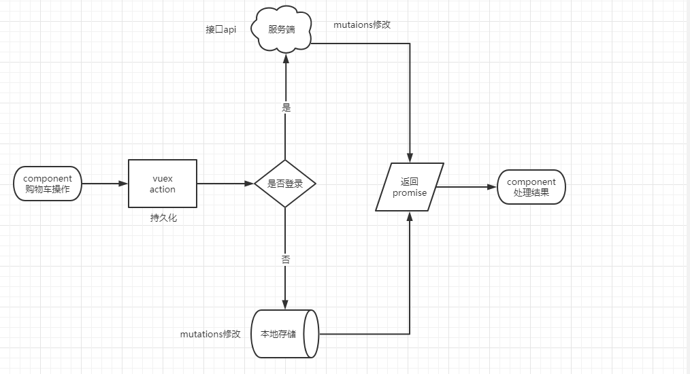

# 购物车

## 01. 购物车功能分析

> 目标: 了解购物车功能的实现逻辑

- 应用中的购物车分为两种，一种是本地购物车，一种是服务器端购物车
- 在用户未登录状态下操作本地购物车，在用户登录状态下操作服务器端购物车
- 无论是操作本地购物车还是操作服务器端购物车, 操作本身都在 vuex 中进行，组件不需要关心当前操作的是哪个购物车, 它只需要触发 action 方法即可 
- 无论是操作本地购物车还是操作服务器端购物车, 操作完成后数据都要被存储到 vuex 中一份, vuex 中的购物车数据将会被作为组件获取数据的唯一来源
- 操作本地购物车是同步的，操作服务器端购物车是异步的，为使组件能够以统一的方式获取API返回结果, 和购物车操作相关的方法统一返回 Promise
- 用户登录后，将本地购物车数据合并到服务器端, 删除本地购物车数据, 再将最新的服务器端购物车数据同步到本地
- 用户退出后，需要清空本地购物车，因为本地购物车中的数据已经同步到服务器端
- 本地购物车中的数据存储在 localStorage 中, 由于 vuex 中的数据会被插件实时同步到本地的 localstorage 中, 所以对于操作本地购物车而言，不需要除 vuex 操作以外的操作



## 02. 加入购物车-未登录

> 目标: 实现将商品添加到本地购物车


------

- [ ] 收集购物车中需要的当前商品的信息
- [ ] 在 vuex 中实现加入购物车逻辑
- [ ] 组件中调用 vuex 中的 action 方法, 实现加入购物车功能

------

第一步: 收集购物车中需要的商品信息

本地购物车中需要的商品数据

```javascript
{
  // 商品id
  id: String,
  // 商品 skuId
  skuId: String,
  // 商品名称
  name: String,
  // 商品规格属性文字
  attrsText: String,
  // 商品图片
  picture: String,
  // 商品原价
  price: String,
  // 商品现价
  nowPrice: String,
  // 是否选中
  selected: Boolean,
  // 商品库存
  stock: Number,
  // 用户选择的商品数量
  count: Number,
  // 是否为有效商品
  isEffective: Boolean
}
```

`views/goods/GoodsDetailPage.vue`

```vue
<XtxButton @click="addCart">加入购物车</XtxButton>
```

```javascript
export default {
  setup () {
    // 接收规格信息的变化
    const onSpecChanged = (data) => {
      result.value.price = data.price;
      result.value.oldPrice = data.oldPrice;
      result.value.inventory = data.inventory;
      result.value.currentSelectedSkuId = data.skuId;
      result.value.currentSelectedSkuText = data.specsText;
    };
    // 加入购物车
    const addCart = () => {
      // 判断用户是否选择了规格
      if (!result.value.currentSelectedSkuId) {
        return Message({ type: "error", text: "请选择商品规格" });
      }
      const goods = {
        // 商品id
        id: result.value.id,
        // 商品 skuId
        skuId: result.value.currentSelectedSkuId,
        // 商品名称
        name: result.value.name,
        // 商品规格属性文字
        attrsText: result.value.currentSelectedSkuText,
        // 商品图片
        picture: result.value.mainPictures[0],
        // 商品原价
        price: result.value.oldPrice,
        // 商品现价
        nowPrice: result.value.price,
        // 是否选中
        selected: true,
        // 商品库存
        stock: result.value.inventory,
        // 用户选择的商品数量
        count: count.value,
        // 如果用户选择了规格, 该商品就一定是有效商品, 因为能够选择的规格都是有库存的
        isEffective: true,
      };
    };
  }
}
```

第二步: 在 vuex 中实现加入购物车逻辑

`store/cart.js`

```javascript
// src/store/cart.js
export default {
  mutations: {
    // 将商品加入购物车
    addGoodsToCart(state, goods) {
      /*
       * 需求:
       *   如果购物车中已经存在该商品, 那就累加购物中该商品的数量
       *   新添加到购物车中的商品应该被自动显示在列表顶部 (包括累加数量的商品)
       * */
      // 在购物车列表中查找当前要添加的商品
      const index = state.list.findIndex((item) => item.skuId === goods.skuId);
      // 如果购物车中已经存在该商品
      if (index > -1) {
        // 商品数量累加
        state.list[index].count += goods.count;
        // 将商品从购物车中删除
        // 再将它重新添加到购物车顶端
        // splice 方法的返回值是包含被删除元素的数组
        state.list.unshift(state.list.splice(index, 1)[0]);
      } else {
        // 将商品直接添加到购物车中
        state.list.unshift(goods);
      }
    },
  },
  actions: {
    // 将商品加入购物车
    async addGoodsToCart({ rootState, commit }, goods) {
      // 判断用户是否登录
      if (rootState.user.profile.token) {
        // 登录
      } else {
        // 未登录
        commit("addGoodsToCart", goods);
      }
    },
  },
}
```

第三步: 在组件中调用 vuex 中的 action 方法, 实现加入购物车功能

`views/goods/GoodsDetailPage.vue`

```javascript
import { useStore } from "vuex";

export default {
  name: 'XtxGoodsPage',
  setup () {
    // 获取 store 对象
    const store = useStore();
    // 加入购物车
    const addCart = () => {
      // 将商品添加到购物车中
      store
        .dispatch("cart/addGoodsToCart", goods)
      	// 添加成功
        .then(() => {
          Message({ type: "success", text: "商品已经成功被添加到购物车中" });
        })
      	// 添加失败
        .catch((error) => {
          Message({ type: "error", text: `${error.response.data.message}` });
        });
    };
  }
}
```

## 03. 头部购物车-商品列表渲染-未登录

> 目标: 创建头部购物车组件, 渲染头部购物车组件


------

- [ ] 创建头部购物车组件, 实现基础布局
- [ ] 在头部组件中调用头部购物车组件
- [ ] 在 vuex 中准备购物车所需数据, 可购买商品列表, 可购买商品总价, 可购买商品数量
- [ ] 在头部购物车组件中从 vuex 中获取所需数据
- [ ] 根据数据渲染头部购物车组件

------

第一步: 创建头部购物车组件, 实现基础布局

`components/AppHeaderCart.vue`

```html
<template>
  <div class="cart">
    <a class="curr" href="#"> <i class="iconfont icon-cart"></i><em>2</em> </a>
    <div class="layer">
      <div class="list">
        <div class="item" v-for="i in 4" :key="i">
          <RouterLink to="">
            
            <div class="center">
              <p class="name ellipsis-2">和手足干裂说拜拜 手足皲裂修复霜</p>
              <p class="attr ellipsis">颜色：修复绿瓶 容量：150ml</p>
            </div>
            <div class="right">
              <p class="price">&yen;45.00</p>
              <p class="count">x2</p>
            </div>
          </RouterLink>
          <i class="iconfont icon-close-new"></i>
        </div>
      </div>
      <div class="foot">
        <div class="total">
          <p>共 3 件商品</p>
          <p>&yen;135.00</p>
        </div>
        <XtxButton type="plain">去购物车结算</XtxButton>
      </div>
    </div>
  </div>
</template>
<script>
export default {
  name: "AppHeaderCart",
};
</script>
<style scoped lang="less">
.cart {
  width: 50px;
  position: relative;
  z-index: 600;
  .curr {
    height: 32px;
    line-height: 32px;
    text-align: center;
    position: relative;
    display: block;
    .icon-cart {
      font-size: 22px;
    }
    em {
      font-style: normal;
      position: absolute;
      right: 0;
      top: 0;
      padding: 1px 6px;
      line-height: 1;
      background: @helpColor;
      color: #fff;
      font-size: 12px;
      border-radius: 10px;
      font-family: Arial, serif;
    }
  }
  &:hover {
    .layer {
      opacity: 1;
      transform: none;
    }
  }
  .layer {
    opacity: 0;
    transition: all 0.4s 0.2s;
    transform: translateY(-200px) scale(1, 0);
    width: 400px;
    height: 400px;
    position: absolute;
    top: 50px;
    right: 0;
    box-shadow: 0 0 10px rgba(0, 0, 0, 0.2);
    background: #fff;
    border-radius: 4px;
    padding-top: 10px;
    &::before {
      content: "";
      position: absolute;
      right: 14px;
      top: -10px;
      width: 20px;
      height: 20px;
      background: #fff;
      transform: scale(0.6, 1) rotate(45deg);
      box-shadow: -3px -3px 5px rgba(0, 0, 0, 0.1);
    }
    .foot {
      position: absolute;
      left: 0;
      bottom: 0;
      height: 70px;
      width: 100%;
      padding: 10px;
      display: flex;
      justify-content: space-between;
      background: #f8f8f8;
      align-items: center;
      .total {
        padding-left: 10px;
        color: #999;
        p {
          &:last-child {
            font-size: 18px;
            color: @priceColor;
          }
        }
      }
    }
  }
  .list {
    height: 310px;
    overflow: auto;
    padding: 0 10px;
    &::-webkit-scrollbar {
      width: 10px;
      height: 10px;
    }
    &::-webkit-scrollbar-track {
      background: #f8f8f8;
      border-radius: 2px;
    }
    &::-webkit-scrollbar-thumb {
      background: #eee;
      border-radius: 10px;
    }
    &::-webkit-scrollbar-thumb:hover {
      background: #ccc;
    }
    .item {
      border-bottom: 1px solid #f5f5f5;
      padding: 10px 0;
      position: relative;
      i {
        position: absolute;
        bottom: 38px;
        right: 0;
        opacity: 0;
        color: #666;
        transition: all 0.5s;
      }
      &:hover {
        i {
          opacity: 1;
          cursor: pointer;
        }
      }
      a {
        display: flex;
        align-items: center;
        img {
          height: 80px;
          width: 80px;
        }
        .center {
          padding: 0 10px;
          width: 200px;
          .name {
            font-size: 16px;
          }
          .attr {
            color: #999;
            padding-top: 5px;
          }
        }
        .right {
          width: 100px;
          padding-right: 20px;
          text-align: center;
          .price {
            font-size: 16px;
            color: @priceColor;
          }
          .count {
            color: #999;
            margin-top: 5px;
            font-size: 16px;
          }
        }
      }
    }
  }
}
</style>
```

第二步: 在头部组件中调用头部购物车组件

`components/AppHeader.vue`

```html
<template>
  <AppHeaderCart />
</template>

<script>
import AppHeaderCart from "@/components/AppHeaderCart";
export default {
  components: { AppHeaderCart },
}
</script>
<!-- 注意: 在样式中移除 .cart  -->
```

第三步: 准备购物车所需数据, 可购买商品列表, 可购买商品总价, 可购买商品数量

`store/cart.js`

```javascript
export default {
  getters: {
    // 可购买商品列表 (有效商品 + 商品库存数量大于0)
    effectiveGoodsList(state) {
      return state.list.filter((item) => item.isEffective && item.stock > 0);
    },
    // 可购买商品总价
    effectiveGoodsCount(state, getters) {
      return getters.effectiveGoodsList.reduce(
        (count, item) => count + item.count,
        0
      );
    },
    // 可购买商品数量
    effectiveGoodsPrice(state, getters) {
      return getters.effectiveGoodsList.reduce(
        (price, item) => price + Number(item.nowPrice) * item.count,
        0
      );
    },
  },
}
```

第四步: 在头部购物车组件中获取所需数据

`components/AppHeaderCart.vue`

```javascript
import { useStore } from "vuex";
import { computed } from "vue";

export default {
	setup() {
    // 获取 store 对象
    const store = useStore();
    // 获取可购买商品列表
    const effectiveGoodsList = computed(
      () => store.getters["cart/effectiveGoodsList"]
    );
    // 获取可购买商品数量
    const effectiveGoodsCount = computed(
      () => store.getters["cart/effectiveGoodsCount"]
    );
    // 获取可购买商品总价
    const effectiveGoodsPrice = computed(
      () => store.getters["cart/effectiveGoodsPrice"]
    );
    return { effectiveGoodsList, effectiveGoodsCount, effectiveGoodsPrice };
  }
}
```

第五步: 根据数据渲染头部购物车组件

`components/AppHeaderCart.vue`

```html
<template>
  <div class="cart">
    <a class="curr" href="#">
      <i class="iconfont icon-cart"></i><em>{{ effectiveGoodsCount }}</em>
    </a>
    <div class="layer">
      <div class="list">
        <div class="item" v-for="goods in effectiveGoodsList" :key="goods.id">
          <RouterLink to="">
            
            <div class="center">
              <p class="name ellipsis-2">{{ goods.name }}</p>
              <p class="attr ellipsis">{{ goods.attrsText }}</p>
            </div>
            <div class="right">
              <p class="price">&yen;{{ goods.nowPrice }}</p>
              <p class="count">x{{ goods.count }}</p>
            </div>
          </RouterLink>
          <i class="iconfont icon-close-new"></i>
        </div>
      </div>
      <div class="foot">
        <div class="total">
          <p>共 {{ effectiveGoodsCount }} 件商品</p>
          <p>&yen;{{ effectiveGoodsPrice }}</p>
        </div>
        <XtxButton type="plain">去购物车结算</XtxButton>
      </div>
    </div>
  </div>
</template>
```

## 04. 头部购物车-删除-未登录

> 目标: 实现删除本地购物车中的商品功能

------

- [ ] 在 vuex 中定义用于删除购物车中商品的 action 方法以及 mutation 方法
- [ ] 在组件中实现删除购物车商品功能

------

第一步: 在 vuex 中定义用于删除购物车中商品的 action 方法以及 mutation 方法

`store/cart.js`

```javascript
export default {
  mutations: {
    // 根据 skuId 删除商品
    deleteGoodsOfCartBySkuId(state, skuId) {
      // 获取要被删除商品的索引
      const index = state.list.findIndex((item) => item.skuId === skuId);
      // 删除商品
      state.list = [
        ...state.list.slice(0, index),
        ...state.list.slice(index + 1),
      ];
    },
  },
  actions: {
    // 根据 skuId 删除商品
    async deleteCart ({ commit, rootState }, payload) {
      // 判断用户是否登录
      if (rootState.user.profile.token) {
        // 已登录
      } else {
        // 未登录
        commit('deleteCart', payload)
      }
    }
  }
}
```

第二步: 在组件中实现删除购物车商品功能

`components/AppHeaderCart.vue`

```vue
<i @click="deleteGoodsOfCartBySkuId(goods.skuId)" class="iconfont icon-close-new"></i>
```

```javascript
export default {
  setup () {
    // 根据 skuId 删除购物车中的商品
    const deleteGoodsOfCartBySkuId = (skuId) => {
      store.dispatch("cart/deleteGoodsOfCartBySkuId", skuId).then(() => {
        Message({ type: "success", text: "购物车的商品删除成功" });
      });
    };
    return { deleteGoodsOfCartBySkuId }
  }
}
```

## 05. 头部购物车-细节处理

> 目标: 完善头部购物车中的一些细节

------

- [ ] 购物车中没有商品或者已经处于购物车页面时隐藏头部购物车列表
- [ ] 点击头部购物车链接时跳转到购物页面
- [ ] 点击购物车中的商品跳转到商品详情页面
- [ ] 点击去购物车结算按钮跳转到购物车

------


1. 当购物车中没有商品或者当前已经处于购物车页面时隐藏头部购物车列表

`components/AppHeaderCart.vue`

```javascript
export default {
  setup () {
    // 获取路由信息对象
    const route = useRoute();
    // 是否是购物车页面
    const isCartPage = ref(route.path === "/cart");
    // 路由发生更新时重新判断当前页面是否是购物车页面
    onBeforeRouteUpdate((to) => {
      isCartPage.value = to.path === "/cart";
    });
    return { isCartPage }
  }
}
```

```vue
<div class="layer" v-if="effectiveGoodsCount > 0 && !isCartPage"></div>
```

2. 点击头部购物车链接时跳转到购物页面

```html
<RouterLink class="curr" to="/cart"></RouterLink>
```

3. 点击购物车中的商品跳转到商品详情页面

```html
<RouterLink :to="`/goods/${goods.id}`"></RouterLink>
```

4. 点击去购物车结算按钮跳转到购物车

```vue
<XtxButton type="plain"><RouterLink to="/cart">去购物车结算</RouterLink></XtxButton>
```

## 06. 购物车-基础布局

> 目标: 创建购物车页面组件, 实现基础布局, 配置页面路由规则


------

- [ ] 创建购物车页面组件, 实现基础布局
- [ ] 配置购物车页面路由规则

------

第一步: 创建购物车页面组件, 实现基础布局

`views/cart/cartPage.vue`

```html
<template>
  <AppLayout>
  	<div class="cart-page">
      <div class="container">
        <XtxBread>
          <XtxBreadItem path="/">首页</XtxBreadItem>
          <XtxBreadItem>购物车</XtxBreadItem>
        </XtxBread>
        <div class="cart">
          <table>
            <thead>
              <tr>
                <th><XtxCheckbox>全选</XtxCheckbox></th>
                <th>商品信息</th>
                <th>单价</th>
                <th>数量</th>
                <th>小计</th>
                <th>操作</th>
              </tr>
            </thead>
            <!-- 有效商品 -->
            <tbody>
              <tr v-for="i in 3" :key="i">
                <td><XtxCheckbox /></td>
                <td>
                  <div class="goods">
                    <RouterLink to="/"
                      ></RouterLink>
                    <div>
                      <p class="name ellipsis">和手足干裂说拜拜 手足皲裂修复霜</p>
                      <!-- 选择规格组件 -->
                    </div>
                  </div>
                </td>
                <td class="tc">
                  <p>&yen;200.00</p>
                  <p>比加入时降价 <span class="red">&yen;20.00</span></p>
                </td>
                <td class="tc">
                  <XtxNumberBox></XtxNumberBox>
                </td>
                <td class="tc"><p class="f16 red">&yen;200.00</p></td>
                <td class="tc">
                  <p><a href="javascript:">移入收藏夹</a></p>
                  <p><a class="green" href="javascript:">删除</a></p>
                  <p><a href="javascript:">找相似</a></p>
                </td>
              </tr>
            </tbody>
            <!-- 无效商品 -->
            <tbody>
              <tr>
                <td colspan="6"><h3 class="tit">失效商品</h3></td>
              </tr>
              <tr v-for="i in 3" :key="i">
                <td></td>
                <td>
                  <div class="goods">
                    <RouterLink to="/"
                      ></RouterLink>
                    <div>
                      <p class="name ellipsis">和手足干裂说拜拜 手足皲裂修复霜</p>
                      <p class="attr">颜色：粉色 尺寸：14cm 产地：中国</p>
                    </div>
                  </div>
                </td>
                <td class="tc"><p>&yen;200.00</p></td>
                <td class="tc">1</td>
                <td class="tc"><p>&yen;200.00</p></td>
                <td class="tc">
                  <p><a class="green" href="javascript:">删除</a></p>
                  <p><a href="javascript:">找相似</a></p>
                </td>
              </tr>
            </tbody>
          </table>
        </div>
        <!-- 操作栏 -->
        <div class="action">
          <div class="batch">
            <XtxCheckbox>全选</XtxCheckbox>
            <a href="javascript:">删除商品</a>
            <a href="javascript:">移入收藏夹</a>
            <a href="javascript:">清空失效商品</a>
          </div>
          <div class="total">
            共 7 件商品，已选择 2 件，商品合计：
            <span class="red">¥400</span>
            <XtxButton type="primary">下单结算</XtxButton>
          </div>
        </div>
        <!-- 猜你喜欢 -->
        <GoodsRelevant />
      </div>
    </div>
  </AppLayout>
</template>
<script>
import GoodsRelevant from "@/views/goods/components/GoodsRelevant";
import AppLayout from "@/components/AppLayout";
export default {
  name: "CartPage",
  components: { GoodsRelevant, AppLayout },
};
</script>
<style scoped lang="less">
.tc {
  text-align: center;
  .xtx-number-box {
    margin: 0 auto;
    width: 120px;
  }
}
.red {
  color: @priceColor;
}
.green {
  color: @xtxColor;
}
.f16 {
  font-size: 16px;
}
.goods {
  display: flex;
  align-items: center;
  img {
    width: 100px;
    height: 100px;
  }
  > div {
    width: 280px;
    font-size: 16px;
    padding-left: 10px;
    .attr {
      font-size: 14px;
      color: #999;
    }
  }
}
.action {
  display: flex;
  background: #fff;
  margin-top: 20px;
  height: 80px;
  align-items: center;
  font-size: 16px;
  justify-content: space-between;
  padding: 0 30px;
  .xtx-checkbox {
    color: #999;
  }
  .batch {
    a {
      margin-left: 20px;
    }
  }
  .red {
    font-size: 18px;
    margin-right: 20px;
    font-weight: bold;
  }
}
.tit {
  color: #666;
  font-size: 16px;
  font-weight: normal;
  line-height: 50px;
}
.cart-page {
  .cart {
    background: #fff;
    color: #666;
    table {
      border-spacing: 0;
      border-collapse: collapse;
      line-height: 24px;
      width: 100%;
      th,
      td {
        padding: 10px;
        border-bottom: 1px solid #f5f5f5;
        &:first-child {
          text-align: left;
          padding-left: 30px;
          color: #999;
        }
      }
      th {
        font-size: 16px;
        font-weight: normal;
        line-height: 50px;
      }
    }
  }
}
</style>
```

第二步: 配置购物车页面路由规则

`router/index.js`

```javascript
import CartPage from "@/views/cart/CartPage";

const routes = [
  { path: "/cart", component: CartPage },
]
```

## 07. 购物车-数据渲染-未登录

> 目标: 实现购物车页面组件的数据渲染

------

- [ ] 准备页面渲染所需数据 (无效商品列表, 用户选择的商品列表, 用户选择的商品数量, 用户选择的商品总价)
- [ ] 在购物车页面组件中获取组件所需数据并进行渲染

------

第一步: 准备页面渲染所需数据

```javascript
// src/store/cart.js
export default {
  getters: {
    // 不可购买的商品列表 (无效商品列表)
    invalidGoodsList(state) {
      return state.list.filter((item) => !item.isEffective || item.stock === 0);
    },
    // 用户选择的商品列表
    userSelectedGoodsList(state, getters) {
      return getters.effectiveGoodsList.filter((item) => item.selected);
    },
    // 用户选择的商品数量
    userSelectedGoodsCount(state, getters) {
      return getters.userSelectedGoodsList.reduce((count, item) => {
        return item.count + count;
      }, 0);
    },
    // 用户选择的商品总价
    userSelectedGoodsPrice(state, getters) {
      return getters.userSelectedGoodsList
        .reduce((price, item) => {
          return price + Number(item.nowPrice) * item.count;
        }, 0)
        .toFixed(2);
    }
  }
}
```

第二步：在购物车页面组件中获取组件所需数据并进行渲染

`views/cart/CartPage.vue`

```javascript
export default {
  setup() {
    const store = useStore();
    // 获取有效商品列表
    const effectiveGoodsList = computed(
      () => store.getters["cart/effectiveGoodsList"]
    );
    // 获取有效商品数量
    const effectiveGoodsCount = computed(
      () => store.getters["cart/effectiveGoodsCount"]
    );
    // 获取无效商品列表
    const invalidGoodsList = computed(
      () => store.getters["cart/invalidGoodsList"]
    );
    // 获取用户选择的商品数量
    const userSelectedGoodsCount = computed(
      () => store.getters["cart/userSelectedGoodsCount"]
    );
    // 获取用户选择的商品总价
    const userSelectedGoodsPrice = computed(
      () => store.getters["cart/userSelectedGoodsPrice"]
    );
    return {
      effectiveGoodsList,
      effectiveGoodsCount,
      invalidGoodsList,
      userSelectedGoodsCount,
      userSelectedGoodsPrice,
    };
  },
}
```

```vue
<template>
  <div class="cart-page">
    <div class="container">
      <XtxBread>
        <XtxBreadItem to="/">首页</XtxBreadItem>
        <XtxBreadItem>购物车</XtxBreadItem>
      </XtxBread>
      <div class="cart">
        <table>
          <thead>
            <tr>
              <th><XtxCheckbox>全选</XtxCheckbox></th>
              <th>商品信息</th>
              <th>单价</th>
              <th>数量</th>
              <th>小计</th>
              <th>操作</th>
            </tr>
          </thead>
          <!-- 有效商品 -->
          <tbody>
            <tr v-for="goods in effectiveGoodsList" :key="goods.id">
              <td><XtxCheckbox /></td>
              <td>
                <div class="goods">
                  <RouterLink :to="`/goods/${goods.id}`"
                    ></RouterLink>
                  <div>
                    <p class="name ellipsis">{{ goods.name }}</p>
                    <!-- 选择规格组件 -->
                  </div>
                </div>
              </td>
              <td class="tc">
                <p>&yen;{{ goods.nowPrice }}</p>
                <p v-if="goods.price - goods.nowPrice > 0">
                  比加入时降价
                  <span class="red"
                    >&yen;{{ (goods.price - goods.nowPrice).toFixed(2) }}</span
                  >
                </p>
              </td>
              <td class="tc">
                <XtxNumberBox></XtxNumberBox>
              </td>
              <td class="tc">
                <p class="f16 red">
                  &yen;{{ (goods.nowPrice * goods.count).toFixed(2) }}
                </p>
              </td>
              <td class="tc">
                <p><a href="javascript:">移入收藏夹</a></p>
                <p><a class="green" href="javascript:">删除</a></p>
                <p><a href="javascript:">找相似</a></p>
              </td>
            </tr>
          </tbody>
          <!-- 无效商品 -->
          <tbody>
            <tr>
              <td colspan="6"><h3 class="tit">失效商品</h3></td>
            </tr>
            <tr v-for="goods in invalidGoodsList" :key="goods.id">
              <td><XtxCheckbox style="color: #eee" /></td>
              <td>
                <div class="goods">
                  <RouterLink :to="`/goods/${goods.id}`"
                    ></RouterLink>
                  <div>
                    <p class="name ellipsis">{{ goods.name }}</p>
                    <p class="attr">{{ goods.attrsText }}</p>
                  </div>
                </div>
              </td>
              <td class="tc">
                <p>&yen;{{ goods.nowPrice }}</p>
              </td>
              <td class="tc">{{ goods.count }}</td>
              <td class="tc">
                <p>&yen;{{ (goods.nowPrice * goods.count).toFixed(2) }}</p>
              </td>
              <td class="tc">
                <p><a class="green" href="javascript:">删除</a></p>
                <p><a href="javascript:">找相似</a></p>
              </td>
            </tr>
          </tbody>
        </table>
      </div>
      <!-- 操作栏 -->
      <div class="action">
        <div class="batch">
          <XtxCheckbox>全选</XtxCheckbox>
          <a href="javascript:">删除商品</a>
          <a href="javascript:">移入收藏夹</a>
          <a href="javascript:">清空失效商品</a>
        </div>
        <div class="total">
          共 {{ effectiveGoodsCount }} 件商品，已选择
          {{ userSelectedGoodsCount }} 件，商品合计：
          <span class="red">¥{{ userSelectedGoodsPrice }}</span>
          <XtxButton type="primary">下单结算</XtxButton>
        </div>
      </div>
      <!-- 猜你喜欢 -->
      <GoodsRelevant />
    </div>
  </div>
</template>
```

如何测试无效商品列表是否渲染成功?

在商品相亲页中将商品添加到购物车时, 手动将商品是否有效选项改成无效, 测试完成后改回即可。

## 08. 购物车-更新商品列表-未登录

> 目标: 再次访问应用时, 更新本地购物车列表中的商品信息 (目的就是检测本地购物车中的商品是否还可以购买)

------

- [ ] 创建用于更新本地购物车商品的API接口函数
- [ ] 创建用于实现更新本地购物车商品的action方法及mutation方法
- [ ] 在组件中触发action进行购物车中商品信息的更新

------

第一步: 创建用于更新本地购物车商品的API接口

`api/cart.js`  [商品信息-库存价格是否有效(支持本地购物车)](http://zhoushugang.gitee.io/erabbit-client-pc-document/api.html#u5546u54c1u4fe1u606f-u5e93u5b58u4ef7u683cu662fu5426u6709u6548uff08u652fu6301u672cu5730u8d2du7269u8f66uff090a3ca20id3du5546u54c1u4fe1u606f-u5e93u5b58u4ef7u683cu662fu5426u6709u6548uff08u652fu6301u672cu5730u8d2du7269u8f66uff093e203ca3e)

```javascript
import request from "@/utils/request";

/**
 * 更新购物车中的商品信息 (库存, 是否有效, 现价)
 * @param skuId
 * @param id
 * @return {AxiosPromise}
 */
export function updateLocalCart({ skuId, id }) {
  return request(`/goods/stock/${skuId}`, "get", { id });
}
```

第二步: 编写用于实现购物车商品信息更新的方法

在购物车中可能会有多个商品, 意味着我们要同时发送多个请求获取商品信息, 当请求发出以后, 哪一个请求先响应是不确定的, 服务器端返回的商品信息也没有skuId, 也就是说我们不能确定当前请求返回的商品信息到底是哪个商品的信息. 如何解决这个问题呢? 

确保请求的发送顺序和响应顺序保持一致, 通过 Promise.all 方法实现. 先使用 map 方法遍历购物车中的商品数据, 在遍历的过程中发送更新商品信息的请求, 将请求的返回值 Promise 对象按照遍历的顺序放置在一个数组中, 当购物车中的商品遍历完成后, 我们就得到了一个存储 Promise 对象的数组, 接下来将 Promise 对象数组传递到 Promise.all 方法中, 该方法可以让我们按照请求的发送顺序获取到请求的响应结果.

当获取到响应结果以后, 我们仍然要通过 skuId 更新商品信息, 因为这种行为更加通用, 编写出来的方法在其他场景下也可以使用, 比如购物车中的更改商品数量功能也可以使用该方法. 服务器端返回的商品信息中是没有 skuId 的, 所以我们要手动为数据添加 skuId, 如何添加呢? 因为我们确保了请求的顺序和响应的顺序, 所以我们可以通过索引找到对应商品的 skuId. 遍历响应结果数组, 通过遍历索引从原有的购物车商品列表中获取商品的 skuId, 从而为当前遍历的商品添加 skuId.

`store/cart.js`

```javascript
// src/store/cart.js
import { getLastGoodsInCart } from '@/api/cart'

export default {
  mutations: {
    // 根据 skuId 更新商品信息
    // 注意: partOfGoods 中必须有 skuId, 但是服务器端返回的数据中是没有的, 记得手动添加
    updateGoodsBySkuId(state, partOfGoods) {
      // 根据 skuId 查找商品
      const goods = state.list.find((item) => item.skuId === partOfGoods.skuId);
      // 商品存在
      if (goods) {
        // 更新商品信息
        goods = { ...goods, ...partOfGoods };
      }
    },
  },
  actions: {
    // 更新购物车商品(many)
    async updateCartList({ rootState, state, commit }) {
      if (rootState.user.profile.token) {
        // 登录
      } else {
        // 未登录
        // 遍历购物车中的商品, 发送请求获取该商品的最新信息
        const cartListPromises = state.list.map(({ skuId, id }) =>
          // 将方法调用后返回的 Promise 对象存储在一个数组中
          updateLocalCart({ skuId, id })
        );
        // 批量获取多个请求的响应数据, 所有响应数据被存储在一个数组中
        Promise.all(cartListPromises).then((dataCollection) => {
          // 遍历响应结果
          dataCollection.forEach((data, index) => {
            // 为数据添加 skuId
            data.result.skuId = state.list[index].skuId;
            // 更新本地的商品数据
            commit("updateGoodsBySkuId", data.result);
          });
        });
      }
    },
  }
}
```

第三步: 在组件中触发 action 进行购物车中商品信息的更新

`views/cart/CartPage.vue`

```javascript
import { useStore } from 'vuex'

export default {
  setup () {
    // 更新本地购物车商品信息
    store.dispatch("cart/updateCartList").then(() => {
      Message({ type: "success", text: "本地购物车中的商品信息更新成功" });
    });
  }
}
```

## 09. 购物车-单选-未登录

> 目标: 实现购物车中商品的选择功能

------

- [ ] 通过 modelValue 传递商品的默认的是否选中状态, 通过 `@update:modelValue` 指定更新商品状态的方法
- [ ] 在 vuex 中编写更改商品信息的 action 方法

------

第一步: 通过 modelValue 传递商品的默认是否选中状态, 通过 `@update:modelValue` 指定更新商品数量的方法.

注意: 不能直接通过 v-model 进行双向数据绑定, 因为商品数量是 vuex 中的数据, 而 vuex 中的数据不能直接更改.

`views/cart/CartPage.vue`

```vue
<XtxCheckbox :modelValue="goods.selected" @update:modelValue="selectGoods(goods.skuId, $event)"/>
```

```javascript
export default {
  setup () {
    // 单选
    const selectGoods = (skuId, isSelected) => {
    	// 根据 skuId 更新单个商品信息
      store.dispatch("cart/updateGoodsOfCartBySkuId", {
        skuId,
        selected: isSelected,
      });
    };
    return { selectGoods }
  }
}
```

第二步: 在 vuex 中编写更改商品信息的 action 方法

`store/cart.js`

```javascript
export default {
  actions: {
    // 更新购物车商品(one)(支持商品数量和选中状态)
    async updateGoodsOfCartBySkuId({ commit, rootState }, goods) {
      if (rootState.user.profile.token) {
        // 登录
      } else {
        // 未登录
        commit("updateGoodsBySkuId", goods);
      }
    },
  }
}
```

## 10. 购物车-全选-未登录

> 目标: 实现全选、全不选功能

------

- [ ] 计算全选按钮状态
- [ ] 为全选按钮添加数据更新事件, 当事件发生后获取到最新的状态值, 将最新的状态值同步到 vuex 中
- [ ] 在 vuex 中接收全选按钮的最新值, 将值同步到购物车列表中的商品

------

第一步: 计算全选按钮状态

有效商品数量必须大于 0

有效商品的数量和选中商品的数量相等

`store/cart.js`

```javascript
export default {
	getters: {
		// 全选、全不选按钮的状态
    selectAllButtonStatus(state, getters) {
      // 有效商品的数量和选中商品的数量相等意味着所有有效商品已选中
      // 并且有效商品数量必须大于 0
      return (
        getters.effectiveGoodsList.length > 0 &&
        getters.userSelectedGoodsList.length ===
          getters.effectiveGoodsList.length
      );
    },
	}
}
```

第二步: 为全选按钮绑定状态, 为全选按钮添加数据更新事件, 当事件发生后获取到最新的状态值, 将最新的状态值同步到 vuex 中

XtxCheckbox 组件内部实现了双向数据绑定, 当数据发生变化后会触发 `@update:modelValue` 事件, 变化后的数据我们可以通过事件处理函数的参数获取, 该参数使用 $event 表示. 

`views/cart/CartPage.vue`

```javascript
// 获取全选按钮状态
const selectAllButtonStatus = computed(
  () => store.getters["cart/selectAllButtonStatus"]
);
```

```vue
<XtxCheckbox :modelValue="selectAllButtonStatus" @update:modelValue="selectAllGoods($event)">
  全选
</XtxCheckbox>
```

```javascript
export default {
  setup () {
    // 全选、全不选
    const selectAllGoods = (isAll) => {
      store.dispatch("cart/selectIsAll", isAll);
    };
    return { selectAllGoods }
  }
}
```

第三步: 在 vuex 中接收全选按钮的最新值, 将值同步到购物车列表中的商品.

`store/cart.js`

```javascript
export default {
  actions: {
    // 全选、全不选
    async selectIsAll({ rootState, getters, commit }, isAll) {
      if (rootState.user.profile.token) {
        // 登录
      } else {
        // 未登录
        getters.effectiveGoodsList.forEach((item) => {
          commit("updateGoodsBySkuId", { skuId: item.skuId, selected: isAll });
        });
      }
    },
  }
}
```

## 11. 购物车-删除-未登录

> 目标: 实现购物车中商品的删除功能

------

- [ ] 为删除按钮添加点击事件，执行删除操作
- [ ] 如果购物车中没有有效商品, 显示用户提示

------

第一步: 为删除按钮添加点击事件，执行删除操作

```html
<a @click="deleteGoodsOfCartBySkuId(goods.skuId)">删除</a>
```

```javascript
// 删除商品
const deleteGoodsOfCartBySkuId = (skuId) => {
  store.dispatch("cart/deleteGoodsOfCartBySkuId", skuId);
};
```

第二步: 如果购物车中没有有效商品, 显示用户提示


`views/cart/components/EmptyCart.vue`

```html
<template>
  <div class="cart-none">
    
    <p>购物车内暂时没有商品</p>
    <div class="btn">
      <XtxButton type="primary" @click="$router.push('/')">继续逛逛</XtxButton>
    </div>
  </div>
</template>
<script>
export default {
  name: "EmptyCart",
};
</script>
<style scoped lang="less">
.cart-none {
  text-align: center;
  padding: 150px 0;
  background: #fff;
  img {
    width: 180px;
  }
  p {
    color: #999999;
    padding: 20px 0;
  }
}
</style>
```

判断购物车中是否没有商品，如果没有显示以上组件

```html
<tr v-if="effectiveGoodsCount === 0">
  <td colspan="6">
    <EmptyCart />
  </td>
</tr>
<tr v-else v-for="goods in effectiveGoodsList" :key="goods.id"></tr>
```

## 12. 封装确认框组件

> 目标: 封装确认框组件


------

- [ ] 创建确认框组件, 实现基础布局
- [ ] 在调用弹框组件时传递标题和内容
- [ ] 将确认弹出框组件封装成函数调用的形式
- [ ] 为弹框组件提供编写取消和确定逻辑的地方
- [ ] 实现删除购物车商品前和用户进行确认
- [ ] 升级 Confirm 方法, 让其返回 Promise, 确定逻辑放入 then 回调, 取消逻辑放入 catch 回调
- [ ] 为弹层添加动画

------

第一步: 创建确认框组件, 实现基础布局

`components/library/XtxConfirm.vue`

```vue
<template>
  <div class="xtx-confirm">
    <div class="wrapper">
      <div class="header">
        <h3>温馨提示</h3>
        <a href="JavaScript:" class="iconfont icon-close-new"></a>
      </div>
      <div class="body">
        <i class="iconfont icon-warning"></i>
        <span>您确认从购物车删除该商品吗？</span>
      </div>
      <div class="footer">
        <XtxButton size="mini" type="gray">取消</XtxButton>
        <XtxButton size="mini" type="primary">确认</XtxButton>
      </div>
    </div>
  </div>
</template>
<script>
import XtxButton from "@/components/library/XtxButton";
export default {
  name: "XtxConfirm",
  components: { XtxButton }
};
</script>
<style scoped lang="less">
.xtx-confirm {
  position: fixed;
  left: 0;
  top: 0;
  width: 100%;
  height: 100%;
  z-index: 8888;
  background: rgba(0, 0, 0, 0.5);
  transition: all 0.4s;
  &.fade {
    background: rgba(0, 0, 0, 0.5);
  }
  .wrapper {
    width: 400px;
    background: #fff;
    border-radius: 4px;
    position: absolute;
    top: 50%;
    left: 50%;
    transform: translate(-50%, -50%);
		transition: all 0.4s;
    &.fade {
      transform: translate(-50%, -50%);
      opacity: 1;
    }
    .header,
    .footer {
      height: 50px;
      line-height: 50px;
      padding: 0 20px;
    }
    .body {
      padding: 20px 40px;
      font-size: 16px;
      .icon-warning {
        color: @priceColor;
        margin-right: 3px;
        font-size: 16px;
      }
    }
    .footer {
      text-align: right;
      .xtx-button {
        margin-left: 20px;
      }
    }
    .header {
      position: relative;
      h3 {
        font-weight: normal;
        font-size: 18px;
      }
      a {
        position: absolute;
        right: 15px;
        top: 15px;
        font-size: 20px;
        width: 20px;
        height: 20px;
        line-height: 20px;
        text-align: center;
        color: #999;
        &:hover {
          color: #666;
        }
      }
    }
  }
}
</style>
```

第二步: 在调用弹框组件时传递标题和内容

```vue
<XtxConfirm title="测试标题" content="测试内容" />
```

`components/library/Confirm.js`

```javascript
export default {
  props: {
    title: {
      type: String,
      default: "温馨提示",
    },
    content: {
      type: String,
      default: "",
    },
  },
}
```

```html
<h3>{{ title }}</h3>
<span>{{ content }}</span>
```

第三步: 将确认弹出框组件封装成函数调用的形式

`components/library/Confirm.js`

```javascript
import { createVNode, render } from "vue";
import XtxConfirm from "@/components/library/XtxConfirm";

const container = document.createElement("div");
document.body.appendChild(container);

export default function Confirm({ title = "温馨提示", content }) {
  const vNode = createVNode(XtxConfirm, { title, content });
  render(vNode, container);
}
```

第四步: 实现弹框中的取消和确定逻辑

`components/library/Confirm.js`

```javascript
export default function Confirm({ onSureButtonClick, onCancelButtonClick }) {
  const onCancelButtonClickHandler = () => {
    onCancelButtonClick();
    render(null, container);
  };
  const onSureButtonClickHandler = () => {
    onSureButtonClick();
    render(null, container);
  };
  const vNode = createVNode(XtxConfirm, {
    onSureButtonClick: onSureButtonClickHandler,
    onCancelButtonClick: onCancelButtonClickHandler,
  });
  render(vNode, container);
}
```

```javascript
export default {
  props: {
    onSureButtonClick: {
      type: Function,
      default: () => {},
    },
    onCancelButtonClick: {
      type: Function,
      default: () => {},
    },
  }
};
```

```vue
<XtxButton size="mini" type="gray" @click="onCancelButtonClick">取消</XtxButton>
<XtxButton size="mini" type="primary" @click="onSureButtonClick">确认</XtxButton>
<a class="iconfont icon-close-new" @click="onCancelButtonClick"></a>
```

第五步: 实现删除购物车商品前和用户进行确认

`views/cart/CartPage.vue`

```javascript
// 删除商品
const deleteGoodsOfCartBySkuId = (skuId) => {
  Confirm({
    content: "您确定要删除该商品吗?",
    onSureButtonClick: () => {
    	store.dispatch("cart/deleteGoodsOfCartBySkuId", skuId);
    },
  });
};
```

第六步: 升级 Confirm 方法

调用 Confirm 方法后返回 Promise 对象, 用户点击确认按钮之后的逻辑写在 then 方法的回调函数中, 用户点击取消按钮之后的逻写在 catch 方法中.

```javascript
export default function Confirm({ title = "温馨提示", content }) {
  return new Promise(function (resolve, reject) {
    const onCancelButtonClickHandler = () => {
      reject();
      render(null, container);
    };
    const onSureButtonClickHandler = () => {
      resolve();
      render(null, container);
    };
    const vNode = createVNode(XtxConfirm, {
      title,
      content,
      onSureButtonClick: onSureButtonClickHandler,
      onCancelButtonClick: onCancelButtonClickHandler,
    });
    render(vNode, container);
  });
}
```

```javascript
// 删除商品
const deleteGoodsOfCartBySkuId = (skuId) => {
  Confirm({
  	content: "您确定要删除该商品吗?",
  })
    .then(() => {
      store.dispatch("cart/deleteGoodsOfCartBySkuId", skuId);
    })
    .catch(() => {});
};
```

第七步: 为弹层添加动画

当弹框被调用以后为 `.xtx-confirm` 元素添加 `.fade`, 让蒙层渐现, 为 `.wrapper` 元素添加 `.fade`, 让弹框从上到下运动, 渐现.

```less
.xtx-confirm {
  background: rgba(0, 0, 0, 0);
  .wrapper {
    transform: translate(-50%, -60%);
    opacity: 0;
  }
}
```

```javascript
export default function Confirm() {
  return new Promise(function (resolve, reject) {
    const onCancelButtonClickHandler = () => {
    	// 执行离场动画
      vNode.el.classList.remove("fade");
      vNode.el.children[0].classList.remove("fade");
      // 因为离场动画执行了 400ms, 所以此处指定 400ms 以后再删除 DOM
      setTimeout(() => {
        render(null, container);
      }, 400);
    };

    // JavaScript 执行引擎和视图渲染引擎是互斥的, 执行 JavaScript 代码的过程中不会渲染 HTML
    // 就是说下面这句代码并不会立即渲染 HTML, 而是当所有同步 JavaScript 代码执行完成后再去渲染 HTML
    render(vNode, container);

    // 只有元素渲染完成后才能执行动画
    // 若下面代码不被定时器包裹, 代码执行到此处时元素还没有开始渲染, 所以动画不会生效
    // setTimeout 是异步的, 当所有同步代码执行完成后, 浏览器优先渲染 HTML, HTML 渲染完成后才执行异步回调
    // 就是说当执行 setTimeout 方法的回调函数时, HTML 已经渲染完成, 可以添加类名执行动画了
    // 执行入场动画
    setTimeout(() => {
      vNode.el.classList.add("fade");
      vNode.el.children[0].classList.add("fade");
    }, 0);
  });
}
```

## 13. 购物车-批量删除-清空无效-未登录

> 目标: 实现删除选中商品功能、实现清空无效商品功能

------

- [ ] 创建用于实现删除用户选择商品和清空无效商品的 action 方法
- [ ] 在购物车组件模板中为删除商品按钮和清空无效商品按钮添加点击事件
- [ ] 为删除商品功能添加事件处理函数调用 action 方法实现删除操作

------

删除用户选中商品, 就是删除 `userSelectedGoodsList` 列表中的商品

清空无效商品, 就是删除 `invalidGoodsList` 列表中的商品


第一步: 创建用于实现删除用户选择商品和清空无效商品的 action 方法

`store/cart.js`

```javascript
export default {
  actions: {
    // 删除用户选择的商品、清空无效商品
    async deleteGoodsOfCartByUserSelectedOrInvalid(
      { getters, rootState, commit },
      flag
    ) {
      if (rootState.user.profile.token) {
        // 登录
      } else {
        // 未登录
        getters[flag].forEach((item) => {
          commit("deleteGoodsOfCartBySkuId", item.skuId);
        });
      }
    },
  }
}
```

第二步: 在购物车组件模板中为删除商品按钮和清空无效商品按钮添加点击事件

`views/cart/CartPage.vue`

```vue
<a @click="deleteGoodsOfCartByUserSelectedOrInvalid('userSelectedGoodsList')">删除商品</a>
<a @click="deleteGoodsOfCartByUserSelectedOrInvalid('invalidGoodsList')">清空失效商品</a>
```

第三步: 为删除商品功能添加事件处理函数调用 action 方法实现删除操作

`views/cart/CartPage.vue`

```javascript
// 删除用户选择的商品 userSelectedGoodsList、清空无效商品 invalidGoodsList
const deleteGoodsOfCartByUserSelectedOrInvalid = (flag) => {
  // 弹框提示文字
  let content = "";
  // 如果当前操作是删除用户选择的商品
  if (flag === "userSelectedGoodsList") {
    // 判断用户是否选择了商品
    if (userSelectedGoodsCount.value === 0) {
      Message({ type: "error", text: "请选择要删除的商品" });
      return;
    }
    // 设置弹框提示文字
    content = "确定要删除选中的商品吗?";
  }
  // 如果当前操作是清空无效商品
  if (flag === "invalidGoodsList") {
    // 判断当前是否有无效商品
    if (invalidGoodsList.value.length === 0) {
      // 提示
      Message({ type: "error", text: "没有无效商品" });
      return;
    }
    // 设置弹框提示文字
    content = "确定要删除无效商品吗?";
  }
  // 和用户进行确认
  Confirm({ content })
    .then(() => {
      // 执行操作
      store.dispatch("cart/deleteGoodsOfCartByUserSelectedOrInvalid", flag);
    })
    .catch(() => {});
    };
```

## 14. 购物车-更改商品数量-未登录

> 目标: 实现更改购物车中商品数量的功能

------

- [ ] 在调用商品数量选择组件时传递必要属性 (max、modelValue、@update:modelValue)
- [ ] 当用户点击按钮更改商品数量时将值同步到 Vuex 中

------


第一步: 在调用商品数量选择组件时传递必要属性 (max、modelValue、@update:modelValue)

`views/cart/CartPage.vue`

```vue
<XtxNumberBox
 :max="goods.stock"
 :modelValue="goods.count"
 @update:modelValue="changeGoodsCountOfCartBySkuId(goods.skuId, $event)"
></XtxNumberBox>
```

第二步: 当用户点击按钮更改商品数量时将值同步到 Vuex 中

当 Vuex 中的商品数量被更改时, 它会更新视图, 更新视图中的商品数量

`views/cart/CartPage.vue`

```javascript
// 更改购物车中的商品数量
const changeGoodsCountOfCartBySkuId = (skuId, count) => {
	store.dispatch("cart/updateGoodsOfCartBySkuId", { skuId, count });
};
```

## 15. 购物车-规格数据渲染-未登录

> 目标：实现购物车页面中规格数据的渲染


------

- [ ] 创建规格组件, 实现基础布局
- [ ] 在购物车页面组件中调用购物车规格组件
- [ ] 实现规格选择弹层的显示隐藏效果
- [ ] 在调用购物车规格组件时传入默认显示的规格文字
- [ ] 创建用于获取规格信息的API接口函数 (供用户选择的规格选项数据、所有可组合的规格数据)
- [ ] 在规格弹框弹出时发送请求获取规格组件所需数据 (skuId、specs、skus)
- [ ] 在购物车规格组件中调用真正的规格组件并传递规格信息数据
- [ ] 在购物车页面组件中调用购物车规格组件时传递商品的 skuId

------

规格组件测试商品: `http://www.corho.com:8080/#/goods/1369155859933827074`

第一步: 创建规格组件, 实现基础布局

`views/cart/components/CartSku.vue`

```vue
<template>
  <div class="cart-sku">
    <div class="attrs">
      <span class="ellipsis">颜色：粉色 尺寸：14cm 产地：中国</span>
      <i class="iconfont icon-angle-down"></i>
    </div>
    <div class="layer">
      <div class="loading"></div>
    </div>
  </div>
</template>
<script>
export default {
  name: "CartSku",
};
</script>
<style scoped lang="less">
.cart-sku {
  height: 28px;
  border: 1px solid #f5f5f5;
  padding: 0 6px;
  position: relative;
  margin-top: 10px;
  display: inline-block;
  .attrs {
    line-height: 24px;
    display: flex;
    span {
      max-width: 230px;
      font-size: 14px;
      color: #999;
    }
    i {
      margin-left: 5px;
      font-size: 14px;
    }
  }
  .layer {
    position: absolute;
    left: -1px;
    top: 40px;
    z-index: 10;
    width: 400px;
    border: 1px solid @xtxColor;
    box-shadow: 2px 2px 4px lighten(@xtxColor, 50%);
    background: #fff;
    border-radius: 4px;
    font-size: 14px;
    padding: 20px;
    &::before {
      content: "";
      width: 12px;
      height: 12px;
      border-left: 1px solid @xtxColor;
      border-top: 1px solid @xtxColor;
      position: absolute;
      left: 12px;
      top: -8px;
      background: #fff;
      transform: scale(0.8, 1) rotate(45deg);
    }
    .loading {
      height: 224px;
      background: url(../../../assets/images/loading.gif) no-repeat center;
    }
  }
}
</style>
```

第二步: 在购物车页面组件中调用购物车规格组件

`views/cart/CartPage.vue`

```vue
<CartSku />
```

```javascript
import CartSku from "@/views/cart/components/CartSku";
export default {
  components: { CartSku }
}
```

第三步: 实现规格选择弹层的显示隐藏效果

```javascript
import { ref } from "vue";
import { onClickOutside } from "@vueuse/core";

export default {
  name: "CartSku",
  setup() {
    // 控制规格弹层的显示和隐藏
    const visible = ref(false);
    // 获取弹层容器
    const target = ref(null);
    // 显示
    const show = () => {
      visible.value = true;
    };
    // 隐藏
    const hide = () => {
      visible.value = false;
    };
    // 切换
    const toggle = () => {
      visible.value ? hide() : show();
    };
    // 在规格外部点击时
    onClickOutside(target, () => {
      // 如果规格弹框是显示的, 就让他隐藏
      visible.value && hide();
    });
    return { toggle, visible, target };
  },
};
```

```vue
<div class="cart-sku" ref="target">
  <div class="attrs" @click="toggle">
    <span class="ellipsis">颜色：粉色 尺寸：14cm 产地：中国</span>
    <i class="iconfont icon-angle-down"></i>
  </div>
  <div class="layer" v-if="visible">
    <div class="loading"></div>
  </div>
</div>
```

第四步: 在调用购物车规格组件时传入默认显示的规格信息

`views/cart/cartPage.vue`

```vue
<CartSku :attrsText="goods.attrsText" />
```

`views/cart/components/CartSku.vue`

```javascript
<span class="ellipsis">{{ attrsText }}</span>
<script>
export default {
  props: {
    attrsText: {
      type: String,
      default: "",
    },
  },
}
</script>
```

第五步: 创建用于获取规格信息的API接口函数 (供用户选择的规格选项数据、所有可组合的规格组合)

`api/cart.js` [商品信息-sku](http://zhoushugang.gitee.io/erabbit-client-pc-document/api.html#u5546u54c1u4fe1u606f-sku0a3ca20id3du5546u54c1u4fe1u606f-sku3e203ca3e)

```javascript
/**
 * 根据skuId获取规格信息 (供用户选择的规格选项数据、所有可组合的规格组合)
 * @param skuId
 * @return {AxiosPromise}
 */
export function getSkuInfoBySkuId(skuId) {
  return request(`/goods/sku/${skuId}`, "get");
}
```

第六步: 在购物车页面组件中调用购物车规格组件时传递商品的 skuId

`views/cart/CartPage.vue`

```vue
<CartSku :skuId="goods.skuId" />
```

`views/cart/components/CartSku.vue`

```javascript
export default {
	props: {
		skuId: {
      type: String,
      default: "",
    },
	}
}
```

第七步: 在规格弹框弹出时发送请求获取规格组件所需数据 (skuId、specs、skus)

在显示规格弹层的时候获取弹层所需数据并渲染

`views/cart/components/CartSku.vue`

```javascript
import { getSkuInfoBySkuId } from "@/api/cart";

export default {
  setup(props) {
    // 供用户选择的规格选项数据 所有可组合的规格组合
    const specsAndSkus = ref(null);
    // sku 数据的加载状态
    const loadingSku = ref(false);
    // 显示
    const show = async () => {
    	// 显示弹层
      visible.value = true;
      // 更新加载状态
      loadingSku.value = true;
      // 获取 sku 数据
      let data = await getSkuInfoBySkuId(props.skuId);
      // 存储sku数据
      specsAndSkus.value = data.result;
      // 更新加载状态
      loadingSku.value = false;
    };
    // 返回规格信息
    return { specsAndSkus, loadingSku };
  },
};
```

第八步: 在购物车规格组件中调用真正的规格组件并传递规格信息数据

`views/cart/components/CartSku.vue`

```vue
<div class="loading" v-if="loadingSku"></div>
<GoodsSku v-if="!loadingSku" :skuId="skuId" :specs="specsAndSkus.specs" :skus="specsAndSkus.skus" />
```

## 16. 购物车-规格数据修改-未登录

> 目标: 实现购物车页面中规格数据的修改

------

- [ ] 获取并临时存储用户选择的新的规格数据
- [ ] 将用户选择的规格数据通过 action 方法提交到 vuex 中
- [ ] 在 Vuex 中创建用于修改商品规格数据的 action 方法

------

第一步: 获取并临时存储用户选择的新的规格数据

在 `CartSku` 组件中为 `GoodsSku` 组件添加规格接收事件

`views/cart/components/CartSku.vue`

```vue
<GoodsSku @on-spec-changed="onSpecChanged" />
```

```javascript
export default {
	setup () {
		// 存储用户选择的新的商品规格
    let userSelectedNewSku = null;
    // 监听规格信息变化
    const onSpecChanged = (sku) => {
      userSelectedNewSku = sku;
    };
    return { onSpecChanged }
	}
}
```

第二步: 将用户选择的规格数据通过 action 方法提交到 vuex 中

在购物车规格组件中添加 `确定` 按钮并未其添加点击事件

```vue
<div class="layer" v-if="visible">
  <XtxButton @click="submitSku" v-if="specsAndSkus" type="primary" size="mini" style="margin-left: 60px">
  	确定
  </XtxButton>
</div>
```

```javascript
// 提交规格
const submitSku = () => {
  // 如果用户没有重新选择规格, 或者用户选择了规格, 但是选择的规格和之前是一样的
  if (
    !userSelectedNewSku ||
    (userSelectedNewSku && userSelectedNewSku.skuId === props.skuId)
  ) {
    // 用户提示
    Message({ type: "warn", text: "商品规格信息没有发生变化" });
  }
  store.dispatch("cart/updateGoodsOfCartBySkuChanged", {
    oldSkuId: props.skuId,
    userSelectedNewSku,
  });
	hide();
};
```

第三步: 在 Vuex 中创建用于修改商品规格数据的 action 方法

```javascript
export default {
	actions: {
		// 商品规格信息发生变化, 更新商品信息
    async updateGoodsOfCartBySkuChanged(
      { rootState, state, commit },
      { oldSkuId, userSelectedNewSku }
    ) {
      if (rootState.user.profile.token) {
        // 登录
      } else {
        // 未登录
        // 先根据旧的 skuId 查找商品, 根据旧商品生成新商品, 删除旧商品, 插入新商品
        // 查找旧商品
        const oldGoods = state.list.find((item) => item.skuId === oldSkuId);
        // 生成新商品
        const newGoods = {
          ...oldGoods,
          skuId: userSelectedNewSku.skuId,
          stock: userSelectedNewSku.inventory,
          oldPrice: userSelectedNewSku.oldPrice,
          nowPrice: userSelectedNewSku.price,
          attrsText: userSelectedNewSku.specsText,
        };
        // 删除旧商品
        commit("deleteGoodsOfCartBySkuId", oldSkuId);
        // 插入新商品
        commit("addGoodsToCart", newGoods);
      }
    },
	}
}
```

## 17. 购物车-合并购物车-已登录

> 目标: 用户登录成功后, 将本地购物车和服务端购物车进行合并

------

- [ ] 创建用于合并购物车的 API 接口函数
- [ ] 在 vuex 中创建用于合并购物车的 action 方法
- [ ] 在登录成功之后触发合并购物车的 action 方法

------

登录成功后, 将本地购物车数据合并到服务器端购物中, 然后清空本地购物车, 将服务器端购物车数据拉取到本地.

用户退出登录后, 清空本地购物车数据.

第一步: 创建用于合并购物车的 API 接口函数

`api/cart.js` [合并购物车](http://zhoushugang.gitee.io/erabbit-client-pc-document/api.html#u5408u5e76u8d2du7269u8f660a3ca20id3du5408u5e76u8d2du7269u8f663e203ca3e)

```javascript
/**
 * 将本地购物车和服务器端购物车进行合并
 * @param cart {Array<{skuId: string, selected: boolean, count: number}>}
 * @return {Promise}
 */
export function mergeCart(cart) {
  return requestWithToken("/member/cart/merge", "post", cart);
}
```

第二步: 在 vuex 中创建用于合并购物车的 action 方法

`store/cart.js`

```javascript
export default {
  mutations: {
    // 设置购物车列表
    setCart (state, payload) {
      state.list = payload
    }
  },
  actions: {
    // 合并购物车
    async mergeCart({ state, commit }) {
      // 如果本地购物车中没有数据, 不用进行合并
      if (state.list.length === 0) return;
      // 准备合并购物车接口所需参数
      const carts = state.list.map((item) => ({
        skuId: item.skuId,
        selected: item.selected,
        count: item.count,
      }));
      try {
        // 合并购物车
        await mergeCart(carts);
        // 清空本地购物车
        commit("setCart", []);
      } catch (error) {
        // 购物车合并失败, 抛出异常
        throw new Error(error);
      }
    },
  }
}
```

第三步: 在登录成功之后出发合并购物车的 action 方法

`hooks/useLoginAfter.js`

```javascript
const loginSuccessful = async ({ result }) => {
  // 合并购物车
  await store.dispatch("cart/mergeCart");
  // 将服务器端购物车数据同步到本地
  await store.dispatch("cart/updateCartList");
};
```

## 18. 购物车-购物车列表-已登录

> 目标: 实现将服务器端购物车数据同步到本地 vuex 中

------

- [ ] 创建用于获取服务端购物车列表的API接口函数
- [ ] 在登录后获取服务器端列表数据

------

第一步: 创建用于获取购物车列表的API接口函数

`api/cart.js` [购物车列表](http://zhoushugang.gitee.io/erabbit-client-pc-document/api.html#u8d2du7269u8f66u5217u88680a3ca20id3du8d2du7269u8f66u5217u88683e203ca3e)

```javascript
/**
 * 获取服务器端购物车列表数据
 * @return {AxiosPromise}
 */
export function getCartList() {
  return requestWithToken("/member/cart", "get");
}
```

第二步: 在登录后获取服务器端列表数据

`store/cart.js`

```javascript
actions: {
  // 更新购物车商品(many)
  async updateCartList({ rootState, state, commit }) {
    if (rootState.user.profile.token) {
      // 登录
      // 获取服务器端购物车列表数据
      let data = await getCartList();
      // 将服务器端购物车列表数据存储到 vuex 中
      commit("setCart", data.result);
    } else {
      // 未登录
    }
  },
}
```

注意: 在实现本地购物车时，页面一上来我们已经触发了 `updateCartList` 方法，所以此处不再需要再次触发。

## 19. 购物车-加入购物车-已登录

> 目标: 实现将商品添加到服务器端购物车

------

- [ ] 创建用于实现加入购物功能的 API 接口函数
- [ ] 在 vuex 中调用接口实现加入购物车功能

------

第一步: 创建用于实现加入购物功能的API函数

`api/cart.js` [加入购物车](http://zhoushugang.gitee.io/erabbit-client-pc-document/api.html#u52a0u5165u8d2du7269u8f660a3ca20id3du52a0u5165u8d2du7269u8f663e203ca3e)

```javascript
/**
 * 将商品加入购物车
 * @param skuId {string} - 商品 skuId
 * @param count {number} - 商品数量
 * @return {AxiosPromise}
 */
export function addGoodsToCart({ skuId, count }) {
  return request("/member/cart", "post", { skuId, count });
}
```

 第二步: 在vuex中调用接口实现加入购物车功能

`store/cart.js`

 ```javascript
 // src/store/cart.js
 export default {
   actions: {
     // 将商品加入购物车
     async addGoodsToCart({ rootState, commit, dispatch }, goods) {
       // 判断用户是否登录
       if (rootState.user.profile.token) {
         // 登录
         // 发送请求 将商品添加到服务器端购物车
         await addGoodsToCart({
           skuId: goods.skuId,
           count: goods.count,
         });
         // 更新购物车列表
         dispatch("updateCartList");
       } else {
         // 未登录
       }
     },
   }
 }
 ```

 ## 20. 购物车-删除商品-已登录

> 目标: 实现删除服务器端购物车删除

------

- [ ] 创建用于删除购物车商品的API接口函数
- [ ] 在 vuex 中调用接口实现删除商品功能

------

第一步: 创建用于删除购物商品的API接口函数

`api/cart.js` [删除/清空购物车商品](http://zhoushugang.gitee.io/erabbit-client-pc-document/api.html#u5220u9664u6e05u7a7au8d2du7269u8f66u5546u54c10a3ca20id3du5220u9664u6e05u7a7au8d2du7269u8f66u5546u54c13e203ca3e)

 ```javascript
/**
 * 删除购物车中的商品 支持批量删除 支持单个删除
 * @param ids {Array<string>} 商品 skuId 数组
 * @return {AxiosPromise}
 */
export function deleteGoodsOfCartBySkuIds(ids) {
  return request("/member/cart", "delete", { ids });
}
 ```

第二步: 在vuex中调用接口实现删除商品功能

```javascript
import { deleteGoodsOfCartBySkuIds } from "@/api/cart";

export default {
  actions: {
    // 根据 skuId 删除商品
    async deleteGoodsOfCartBySkuId({ rootState, commit, dispatch }, skuId) {
      if (rootState.user.profile.token) {
        // 已登录
        await deleteGoodsOfCartBySkuIds([skuId]);
        // 更新商品列表
        dispatch("updateCartList");
      } else {
        // 未登录
      }
    },
  }
}
```

## 21. 购物车-批量删除商品-已登录

> 目标: 实现批量删除服务器端购物车商品

------

- [ ] 获取要批量删除商品的 skuId 数组
- [ ] 发送请求实现商品的批量删除

------

`store/cart.js`

```javascript
export default {
  actions: {
    // 删除用户选择的商品、清空无效商品
    async deleteGoodsOfCartByUserSelectedOrInvalid(
      { getters, rootState, commit, dispatch },
      flag
    ) {
      if (rootState.user.profile.token) {
        // 登录
        // 获取要批量删除商品的 skuId 数组
        const skuIds = getters[flag].map((item) => item.skuId);
        // 发送请求 批量删除商品
        await deleteGoodsOfCartBySkuIds(skuIds);
        // 更新商品列表
        dispatch("updateCartList");
      } else {
        // 未登录
      }
    },
  }
}
```

## 22. 购物车-选中状态和数量-已登录

> 目标: 实现修改服务器端购物车中的商品数量和选中状态

------

- [ ] 创建用于修改商品信息的API接口
- [ ] 在 vuex 中的 action 方法中调用接口实现修改服务器端购物车商品信息

------

第一步: 创建用于修改商品信息的API接口

`api/cartj.s` [修改购物车商品](http://zhoushugang.gitee.io/erabbit-client-pc-document/api.html#u4feeu6539u8d2du7269u8f66u5546u54c10a3ca20id3du4feeu6539u8d2du7269u8f66u5546u54c13e203ca3e)

```javascript
/**
 * 更新购物车中的商品信息 (支持是否选中和商品数量)
 * @param skuId {string} - 商品 skuId
 * @param selected {boolean} - 是否选中状态
 * @param count {number} - 商品数量
 * @return {AxiosPromise}
 */
export function updateGoodsOfCartBySkuId({ skuId, selected, count }) {
  return request(`/member/cart/${skuId}`, "put", { selected, count });
}
```

第二步: 在 vuex 中的 action 方法中调用接口实现修改服务器端购物车商品信息

`store/cart.js`

```javascript
export default {
  actions: {
    // 更新购物车商品(one)(支持商品数量和选中状态)
    async updateGoodsOfCartBySkuId({ commit, rootState, dispatch }, goods) {
      if (rootState.user.profile.token) {
        // 登录
        // 更新商品信息
        await updateGoodsOfCartBySkuId(goods);
        // 更新购物车列表
        dispatch("updateCartList");
      } else {
        // 未登录
      }
    },
  }
}
```

## 23. 购物车-全选与取消全选-已登录

> 目标: 实现全选、全不选服务器端购物车商品

------

- [ ] 创建用于实现全选和取消全选功能的API接口函数
- [ ] 在 vuex 中调用接口实现商品的全选与取消全选操作

------

第一步: 创建用于实现全选和取消全选功能的API接口函数

`api/cart.js` [购物车全选/取消全选](http://zhoushugang.gitee.io/erabbit-client-pc-document/api.html#u8d2du7269u8f66u5168u9009u53d6u6d88u5168u90090a3ca20id3du8d2du7269u8f66u5168u9009u53d6u6d88u5168u90093e203ca3e)

```javascript
/**
 * 全选、取消全选
 * @param selected 选中状态
 * @param ids skuId 数组
 * @return {AxiosPromise}
 */
export function selectOrUnselectCartGoods({ selected, ids }) {
  return request("/member/cart/selected", "put", { selected, ids });
}
```

第二步: 在 vuex 中调用接口实现商品的全选与取消全选操作

```javascript
export default {
  actions: {
    // 全选、全不选
    async selectIsAll({ rootState, getters, commit, dispatch }, isAll) {
      if (rootState.user.profile.token) {
        // 登录
        // 获取商品 skuId 数组
        const ids = getters.effectiveGoodsList.map((item) => item.skuId);
        // 发送请求执行, 全选、全不选操作
        await selectOrUnselectCartGoods({ ids, selected: isAll });
        // 更新购物车商品列表
        dispatch("updateCartList");
      } else {
        // 未登录
      }
    },
  }
}
```

## 24. 购物车-修改商品规格-已登录

> 目标: 实现修改服务器端购物车中的商品规格信息

------

- [ ] 根据 oldSkuId 查找商品, 获取用户选择的商品数量
- [ ] 发送请求删除原有商品信息
- [ ] 发送请求向购物车中添加新商品
- [ ] 更新购物车列表数据

------

在接口文档中没有提供修改商品规格的接口，修改商品规格可以通过删除商品接口和添加商品接口实现。

`store/cart.js`

```javascript
export default {
  actions: {
    // 商品规格信息发生变化, 更新商品信息
    async updateGoodsOfCartBySkuChanged(
      { rootState, state, commit, dispatch },
      { oldSkuId, userSelectedNewSku }
    ) {
      if (rootState.user.profile.token) {
        // 登录
        // 查找原有商品信息, 通过原有商品信息获取用户选择的商品数据
        const oldGoods = state.list.find((item) => item.skuId === oldSkuId);
        // 删除原有商品
        await deleteGoodsOfCartBySkuIds([oldSkuId]);
        // 添加新商品
        await addGoodsToCart({
          skuId: userSelectedNewSku.skuId,
          count: oldGoods.count,
        });
        // 更新购物车商品列表
        await dispatch("updateCartList");
      } else {
        // 未登录
      }
    },
  }
}
```

## 24. 清空本地购物车-退出登录

> 目标: 实现用户退出后清空本地购物车商品数据

`components/AppTopNav.vue`

```javascript
const logout = () => {
  store.commit("cart/setCart", []);
}
```

## 26. 购物车-下单结算按钮

> 目标: 点击下单结算按钮跳转到下单结算页面

------

- [ ] 点击下单结算按钮进行链接跳转, 跳转的目标地址为结算页面
- [ ] 添加前置路由守卫进行拦截, 判断用户是否登录，如果没有登录, 跳转到登录页面
- [ ] 通过路由查询参数(redirectURL)的方式将用户的目标跳转地址传递到登录页面
- [ ] 当用户登录成功后判断url中是否存在redirectURL参数, 如果有就跳转到对应的地址, 没有就跳转到首页

------

功能需求: 当用户点击下单结算按钮时, 先检测用户是否有选中的有效商品, 如果没有, 提示用户 `请至少选择一件商品才能结算`, 如果用户选择了商品, 跳转到结算页面, 但是访问结算页面的前提是用户已经是登录状态, 如果用户没有登录, 跳转到登录页面并传递用户目标的跳转页, 当用户在登录页面成功登录以后, 跳转到目标跳转页, 当前就是结算页面.

第一步: 点击下单结算按钮进行链接跳转

`views/cart/CartPage.vue`

```html
<XtxButton @click="jumpToCheckout" type="primary">下单结算</XtxButton>
```

```javascript
import { useRouter } from "vue-router";

// 获取路由对象
const router = useRouter();

// 下单结算按钮
const jumpToCheckout = () => {
  // 判断用户是否选择了商品
  if (userSelectedGoodsCount.value === 0) {
    return Message({ type: "error", text: "请至少选择一件商品" });
  }
  // 跳转到结算页面
  router.push("/checkout/order");
};
```

第二步: 添加路由前置守卫, 进行路由拦截, 判断用户是否登录

`router/authGuard.js`

```javascript
import store from "@/store";

export default function authGuard(to, from, next) {
  // 指明需要登录的路由地址
  const requiredLogin = ["checkout", "member"];
  // 将用户访问的路由地址的开始字符串匹配出来
  // 如果用户访问的页面是需要登录的
  if (requiredLogin.includes(to.path.split("/")[1])) {
    // 如果用户没有登录
    if (!store.state.user.profile.token) {
      next({ path: "/login", query: { redirectURL: to.fullPath } });
    } else {
      // 如果用户登录了
      next();
    }
  } else {
    // 用户访问的页面是不需要登录的
    next();
  }
}
```

`router/index.js`

```javascript
import authGuard from "@/router/authGuard";

// 检测用户是否登录
router.beforeEach(authGuard)
```

第三步: 当用户登录成功后判断url中是否存在redirectURL参数, 如果有就跳转到对应的地址

`hooks/useLoginAfter.js`

```javascript
// src/views/login/logic/useAfterLogin.js
import { useRoute } from 'vue-router'

export default function useLoginAfter () {
  // 获取路由信息对象
  const route = useRoute();
  // 登录成功之后做的事情
  const loginSuccessful = async ({ result }) => {
    // 跳转目标地址
    const redirectURL = route.query.redirectURL;
    // 跳转到首页或目标页
    router.push(redirectURL || "/").then(() => {});
  };
}
```

