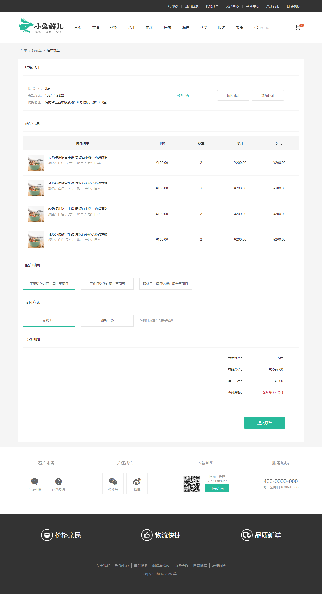
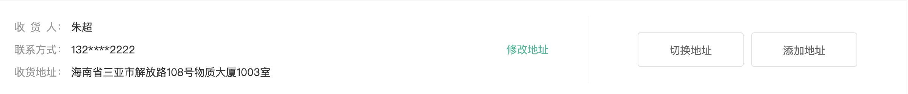
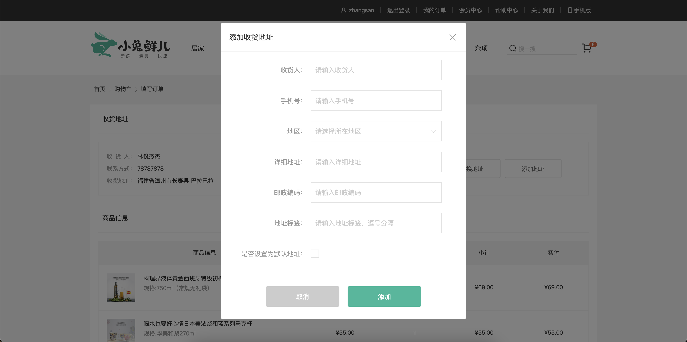
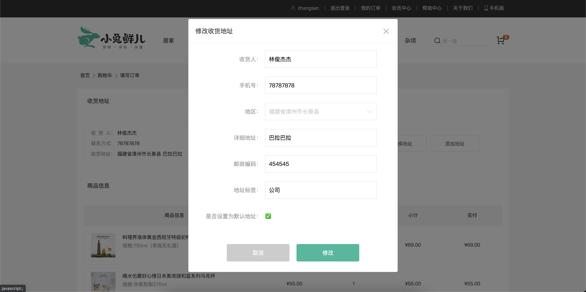
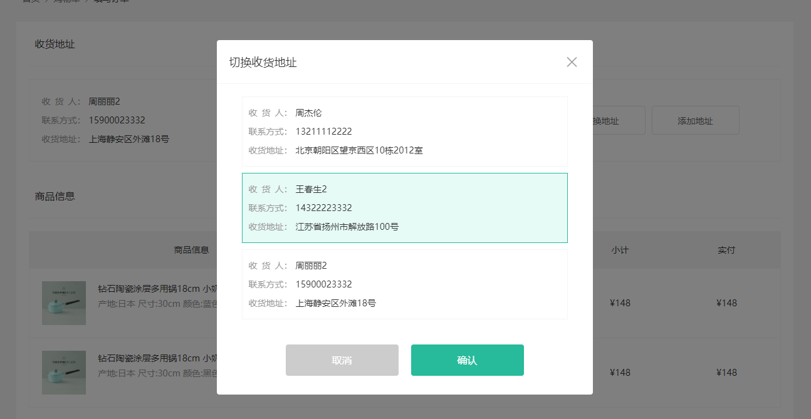
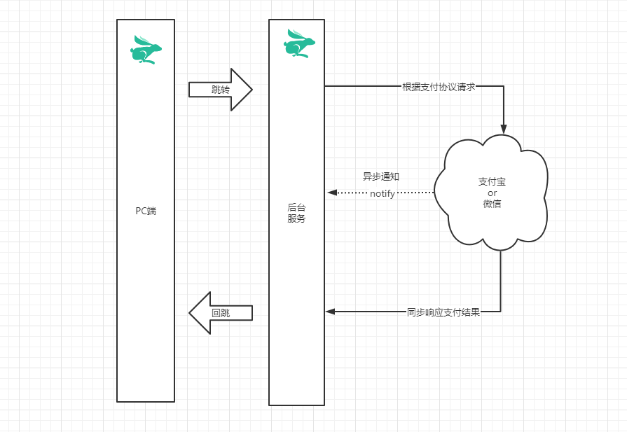
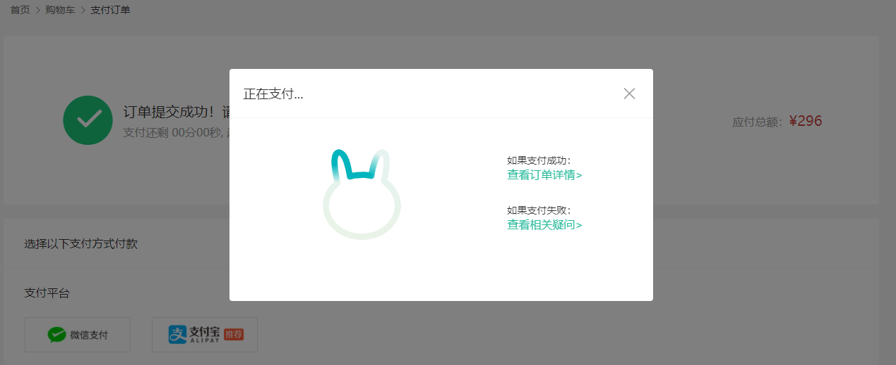
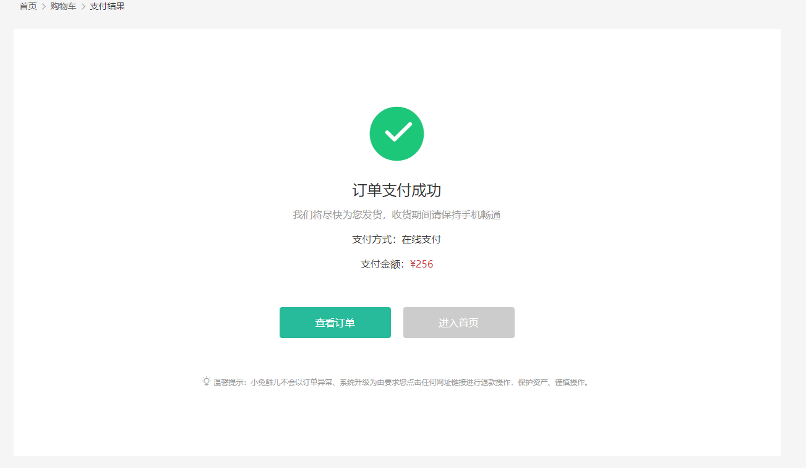

# 结算&支付

## 01. 结算-基础布局

> 目标: 实现结算页面基础布局, 配置结算页面路由规则

------

- [ ] 创建结算页面组件, 实现基础布局
- [ ] 配置结算页面组件的路由规则

------



------

第一步: 创建结算组件, 实现基础布局

`views/pay/CheckoutPage.vue`

```html
<template>
  <AppLayout>
  	<div class="xtx-pay-checkout-page">
      <div class="container">
        <XtxBread>
          <XtxBreadItem path="/">首页</XtxBreadItem>
          <XtxBreadItem path="/cart">购物车</XtxBreadItem>
          <XtxBreadItem>填写订单</XtxBreadItem>
        </XtxBread>
        <div class="wrapper">
          <!-- 收货地址 -->
          <h3 class="box-title">收货地址</h3>
          <div class="box-body">
            <div class="address">
              <div class="text">
                <!-- <div class="none">您需要先添加收货地址才可提交订单。</div> -->
                <ul>
                  <li>
                    <span>收<i />货<i />人：</span>朱超
                  </li>
                  <li><span>联系方式：</span>132****2222</li>
                  <li>
                    <span>收货地址：</span>海南省三亚市解放路108号物质大厦1003室
                  </li>
                </ul>
                <a href="javascript:">修改地址</a>
              </div>
              <div class="action">
                <XtxButton class="btn">切换地址</XtxButton>
                <XtxButton class="btn">添加地址</XtxButton>
              </div>
            </div>
          </div>
          <!-- 商品信息 -->
          <h3 class="box-title">商品信息</h3>
          <div class="box-body">
            <table class="goods">
              <thead>
                <tr>
                  <th>商品信息</th>
                  <th>单价</th>
                  <th>数量</th>
                  <th>小计</th>
                  <th>实付</th>
                </tr>
              </thead>
              <tbody>
                <tr v-for="i in 4" :key="i">
                  <td>
                    <a href="javascript:" class="info">
                      
                      <div class="right">
                        <p>轻巧多用锅雪平锅 麦饭石不粘小奶锅煮锅</p>
                        <p>颜色：白色 尺寸：10cm 产地：日本</p>
                      </div>
                    </a>
                  </td>
                  <td>&yen;100.00</td>
                  <td>2</td>
                  <td>&yen;200.00</td>
                  <td>&yen;200.00</td>
                </tr>
              </tbody>
            </table>
          </div>
          <!-- 配送时间 -->
          <h3 class="box-title">配送时间</h3>
          <div class="box-body">
            <a class="my-btn active" href="javascript:"
              >不限送货时间：周一至周日</a
            >
            <a class="my-btn" href="javascript:">工作日送货：周一至周五</a>
            <a class="my-btn" href="javascript:">双休日、假日送货：周六至周日</a>
          </div>
          <!-- 支付方式 -->
          <h3 class="box-title">支付方式</h3>
          <div class="box-body">
            <a class="my-btn active" href="javascript:">在线支付</a>
            <a class="my-btn" href="javascript:">货到付款</a>
            <span style="color: #999">货到付款需付5元手续费</span>
          </div>
          <!-- 金额明细 -->
          <h3 class="box-title">金额明细</h3>
          <div class="box-body">
            <div class="total">
              <dl>
                <dt>商品件数：</dt>
                <dd>5件</dd>
              </dl>
              <dl>
                <dt>商品总价：</dt>
                <dd>¥5697.00</dd>
              </dl>
              <dl>
                <dt>运<i></i>费：</dt>
                <dd>¥0.00</dd>
              </dl>
              <dl>
                <dt>应付总额：</dt>
                <dd class="price">¥5697.00</dd>
              </dl>
            </div>
          </div>
          <!-- 提交订单 -->
          <div class="submit">
            <XtxButton type="primary">提交订单</XtxButton>
          </div>
        </div>
      </div>
    </div>
  </AppLayout>
</template>
<script>
import AppLayout from "@/components/AppLayout";
export default {
  name: "CheckoutPage",
  components: { AppLayout }
};
</script>
<style scoped lang="less">
.xtx-pay-checkout-page {
  .wrapper {
    background: #fff;
    padding: 0 20px;
    .box-title {
      font-size: 16px;
      font-weight: normal;
      padding-left: 10px;
      line-height: 70px;
      border-bottom: 1px solid #f5f5f5;
    }
    .box-body {
      padding: 20px 0;
    }
  }
}
.address {
  border: 1px solid #f5f5f5;
  display: flex;
  align-items: center;
  .text {
    flex: 1;
    min-height: 90px;
    display: flex;
    align-items: center;
    .none {
      line-height: 90px;
      color: #999;
      text-align: center;
      width: 100%;
    }
    > ul {
      flex: 1;
      padding: 20px;
      li {
        line-height: 30px;
        span {
          color: #999;
          margin-right: 5px;
          > i {
            width: 0.5em;
            display: inline-block;
          }
        }
      }
    }
    > a {
      color: @xtxColor;
      width: 160px;
      text-align: center;
      height: 90px;
      line-height: 90px;
      border-right: 1px solid #f5f5f5;
    }
  }
  .action {
    width: 420px;
    text-align: center;
    .btn {
      width: 140px;
      height: 46px;
      line-height: 44px;
      font-size: 14px;
      &:first-child {
        margin-right: 10px;
      }
    }
  }
}
.goods {
  width: 100%;
  border-collapse: collapse;
  border-spacing: 0;
  .info {
    display: flex;
    text-align: left;
    img {
      width: 70px;
      height: 70px;
      margin-right: 20px;
    }
    .right {
      line-height: 24px;
      p {
        &:last-child {
          color: #999;
        }
      }
    }
  }
  tr {
    th {
      background: #f5f5f5;
      font-weight: normal;
    }
    td,
    th {
      text-align: center;
      padding: 20px;
      border-bottom: 1px solid #f5f5f5;
      &:first-child {
        border-left: 1px solid #f5f5f5;
      }
      &:last-child {
        border-right: 1px solid #f5f5f5;
      }
    }
  }
}
.my-btn {
  width: 228px;
  height: 50px;
  border: 1px solid #e4e4e4;
  text-align: center;
  line-height: 48px;
  margin-right: 25px;
  color: #666666;
  display: inline-block;
  &.active,
  &:hover {
    border-color: @xtxColor;
  }
}
.total {
  dl {
    display: flex;
    justify-content: flex-end;
    line-height: 50px;
    dt {
      i {
        display: inline-block;
        width: 2em;
      }
    }
    dd {
      width: 240px;
      text-align: right;
      padding-right: 70px;
      &.price {
        font-size: 20px;
        color: @priceColor;
      }
    }
  }
}
.submit {
  text-align: right;
  padding: 60px;
  border-top: 1px solid #f5f5f5;
}
</style>
```

第二步: 配置结算页面的路由规则

```javascript
const CheckoutPage = () => import("@/views/pay/CheckoutPage");

const routes = [
  {
    path: "/checkout/order",
    component: CheckoutPage,
  },
]
```

## 02. 结算-渲染页面

> 目标: 创建订单, 渲染订单中的商品数据和金额明细数据

------

- [ ] 创建用于生成订单的API接口函数
- [ ] 在订单页面组件中调用API接口函数生成订单数据
- [ ] 使用服务器端返回的订单数据渲染订单页面组件中的商品信息及金额明细

------

第一步: 创建用于生成订单的API接口函数

`api/order.js` [生成订单](http://zhoushugang.gitee.io/erabbit-client-pc-document/api.html#u751fu6210u8ba2u535528u5373u586bu5199u8ba2u5355u6216u7ed3u7b97u9875290a3ca20id3du751fu6210u8ba2u535528u5373u586bu5199u8ba2u5355u6216u7ed3u7b97u9875293e203ca3e)

生成订单接口不需要传递任何参数, 因为订单要根据购物车中的商品生成 而购物车中的商品已经在服务器端. 服务器端会自动根据购物车中的商品信息生成订单信息.

```javascript
import request from "@/utils/request";

/**
 * 生成订单
 * @return {AxiosPromise}
 */
export function createOrder() {
  return request("/member/order/pre", "get");
}
```

第二步: 在订单页面组件中调用接口生成订单信息

`views/member/pay/CheckoutPage.vue`

```javascript
import { ref } from "vue";
import { createOrder } from "@/api/order";

function getOrderInfo() {
  // 用于存储订单信息
  const order = ref(null);
  // 创建订单并存储订单信息
  createOrder().then((data) => (order.value = data.result));
  // 返回订单信息
  return { order };
}
```

```javascript
export default {
  name: "CheckoutPage",
  setup() {
    // 获取订单信息
    const { order } = getOrderInfo();
    return { order };
  },
};
```

第三步: 渲染订单页面组件中的商品信息及金额明细

```html
<div class="xtx-pay-checkout-page" v-if="order">
  <!-- 商品信息 -->
	<tr v-for="goods in order.goods" :key="goods.id">
    <td>
      <a href="javascript:" class="info">
        
        <div class="right">
          <p>{{ goods.name }}</p>
          <p>{{ goods.attrsText }}</p>
        </div>
      </a>
    </td>
    <td>&yen;{{ goods.price }}</td>
    <td>{{ goods.count }}</td>
    <td>&yen;{{ goods.totalPrice }}</td>
    <td>&yen;{{ goods.totalPayPrice }}</td>
  </tr>
  <!-- 金额明细 -->
  <div class="total">
    <dl>
      <dt>商品件数：</dt>
      <dd>{{ order.summary.goodsCount }}件</dd>
    </dl>
    <dl>
      <dt>商品总价：</dt>
      <dd>¥{{ order.summary.totalPrice }}</dd>
    </dl>
    <dl>
      <dt>运<i></i>费：</dt>
      <dd>¥{{ order.summary.postFee }}</dd>
    </dl>
    <dl>
      <dt>应付总额：</dt>
      <dd class="price">¥{{ order.summary.totalPayPrice }}</dd>
    </dl>
  </div>
</div>
```

## 03. 结算-对话框组件封装

> 目标: 封装对话框组件, 实现基础布局, 实现渲染与销毁

------

- [ ] 创建对话框组件, 实现基础布局

- [ ] 实现对话框组件内容动态化, 标题通过 props 传递, 内容通过默认插槽传递，底部按钮使用具名插槽传递
- [ ] 实现对话框组件的渲染与销毁

------


第一步: 创建对话框组件, 实现基础布局

`components/library/XtxDialog.vue`

```html
<template>
  <div class="xtx-dialog">
    <div class="wrapper">
      <div class="header">
        <h3>切换收货地址</h3>
        <a href="JavaScript:" class="iconfont icon-close-new"></a>
      </div>
      <div class="body">对话框内容</div>
      <div class="footer">
        <XtxButton type="gray" style="margin-right: 20px">取消</XtxButton>
        <XtxButton type="primary">确认</XtxButton>
      </div>
    </div>
  </div>
</template>
<script>
import XtxButton from "@/components/library/XtxButton";
export default {
  name: "XtxDialog",
  components: { XtxButton },
};
</script>
<style scoped lang="less">
.xtx-dialog {
  position: fixed;
  left: 0;
  top: 0;
  width: 100%;
  height: 100%;
  z-index: 8887;
  background: rgba(0, 0, 0, 0);
  &.fade {
    transition: all 0.4s;
    background: rgba(0, 0, 0, 0.5);
  }
  .wrapper {
    width: 600px;
    background: #fff;
    border-radius: 4px;
    position: absolute;
    top: 50%;
    left: 50%;
    transform: translate(-50%, -60%);
    opacity: 0;
    &.fade {
      transition: all 0.4s;
      transform: translate(-50%, -50%);
      opacity: 1;
    }
    .body {
      padding: 20px 40px;
      font-size: 16px;
      .icon-warning {
        color: @priceColor;
        margin-right: 3px;
        font-size: 16px;
      }
    }
    .footer {
      text-align: center;
      padding: 10px 0 30px 0;
    }
    .header {
      position: relative;
      height: 70px;
      line-height: 70px;
      padding: 0 20px;
      border-bottom: 1px solid #f5f5f5;
      h3 {
        font-weight: normal;
        font-size: 18px;
      }
      a {
        position: absolute;
        right: 25px;
        top: 25px;
        font-size: 24px;
        width: 20px;
        height: 20px;
        line-height: 20px;
        text-align: center;
        color: #999;
        &:hover {
          color: #666;
        }
      }
    }
  }
}
</style>
```

第二步: 实现对话框组件内容动态化, 标题通过 props 传递, 内容通过默认插槽传递，底部按钮使用具名插槽传递.

`以下代码为测试代码`

```html
<XtxDialog title="对话框标题">
  <template v-slot:default> 对话框中的提示信息 </template>
  <template v-slot:footer>
    <XtxButton type="gray" style="margin-right: 20px">取消</XtxButton>
    <XtxButton type="primary">确认</XtxButton>
  </template>
</XtxDialog>
```

`components/library/XtxDialog.vue`

```html
<template>
  <div class="header">
    <h3>{{ title }}</h3>
  </div>
  <div class="body">
    <slot name="default"></slot>
  </div>
  <div class="footer">
    <slot name="footer"></slot>
  </div>
</template>
<script>
export default {
  props: {
    title: {
      type: String,
      default: ""
    }
  }
}
</script>
```

第三步：实现对话框组件的渲染与销毁

`components/library/XtxDialog.vue`

```vue
<template>
  <div class="xtx-dialog fade" v-if="isRendering">
    <a @click="destroy" class="iconfont icon-close-new"></a>
  </div>
</template>
<script>
import { useVModel } from "@vueuse/core";

export default {
  name: "XtxDialog",
  props: {
    visible: {
      type: Boolean,
      default: false
    },
  },
  setup(props, { emit }) {
    // 控制弹框是否渲染
    const isRendering = useVModel(props, "visible", emit);
    // 渲染弹框
    const render = () => {
      isRendering.value = true;
    };
    // 销毁弹框
    const destroy = () => {
      isRendering.value = false;
    };
    return { isRendering, render, destroy };
  },
  directives: {
    fade: {
      mounted(el) {
        requestAnimationFrame(() => {
          el.classList.add("fade");
        });
      },
    },
  },
};
</script>
```

`以下代码为测试代码`

```html
<template>
	<XtxDialog v-model:visible="visible" ref="xtxDialogInstance">
    <XtxButton @click="xtxDialogInstance.destroy()">取消</XtxButton>
  </XtxDialog>
</template>
<script>
export default {
  setup() {
    const visible = ref(false);
    const xtxDialogInstance = ref(null);
    return { visible, xtxDialogInstance };
  },
};
</script>
```

## 04. 结算-收货地址-基础布局

> 目标: 将收货地址区块封装成组件



------

- [ ] 创建收货地址组件, 将结算组件中的收货地址部分的结构和样式抽取到该组件中
- [ ] 在结算组件中调用收货地址组件

------

第一步: 创建收货地址组件, 将结算组件中的收货地址部分的结构和样式抽取到该组件中

`views/pay/components/CheckoutAddress.vue`

```html
<template>
  <div class="address">
    <div class="text">
      <!-- <div class="none">您需要先添加收货地址才可提交订单。</div> -->
      <ul>
        <li>
          <span>收<i />货<i />人：</span>朱超
        </li>
        <li><span>联系方式：</span>132****2222</li>
        <li>
          <span>收货地址：</span>海南省三亚市解放路108号物质大厦1003室
        </li>
      </ul>
      <a href="javascript:">修改地址</a>
    </div>
    <div class="action">
      <XtxButton class="btn">切换地址</XtxButton>
      <XtxButton class="btn">添加地址</XtxButton>
    </div>
  </div>
</template>
<script>
export default {
  name: "CheckoutAddress",
}
</script>
<style scoped lang="less">
.address {
  border: 1px solid #f5f5f5;
  display: flex;
  align-items: center;
  .text {
    flex: 1;
    min-height: 90px;
    display: flex;
    align-items: center;
    .none {
      line-height: 90px;
      color: #999;
      text-align: center;
      width: 100%;
    }
    > ul {
      flex: 1;
      padding: 20px;
      li {
        line-height: 30px;
        span {
          color: #999;
          margin-right: 5px;
          > i {
            width: 0.5em;
            display: inline-block;
          }
        }
      }
    }
    > a {
      color: @xtxColor;
      width: 160px;
      text-align: center;
      height: 90px;
      line-height: 90px;
      border-right: 1px solid #f5f5f5;
    }
  }
  .action {
    width: 420px;
    text-align: center;
    .btn {
      width: 140px;
      height: 46px;
      line-height: 44px;
      font-size: 14px;
      &:first-child {
        margin-right: 10px;
      }
    }
  }
}
</style>
```

第二步: 在结算组件中调用收货地址组件

```vue
<template>
	<div class="box-body">
  	<CheckoutAddress />
  </div>
</template>
<script>
import CheckoutAddress from "@/views/member/pay/components/CheckoutAddress";
export default {
  components: { CheckoutAddress },
}
</script>
```

## 04. 结算-收货地址-添加

> 目标: 实现添加收货地址功能



------

- [ ] 创建添加收货地址组件, 实现基础布局
- [ ] 点击添加收货地址按钮渲染添加收获地址组件
- [ ] 处理城市选择组件, 存储用户选择的城市码
- [ ] 收集用户在表单中输入的其他内容
- [ ] 创建用于实现添加收货地址的API接口函数
- [ ] 点击添加按钮向服务器端发送请求实现添加收货地址功能
- [ ] 执行清理操作, 清空用户在表单中输入的内容

------

第一步: 创建添加收货地址组件, 实现基础布局

`views/pay/components/AddressEdit.vue`

```html
<template>
  <XtxDialog v-model:visible="visible" title="添加收货地址">
    <template v-slot:default>
      <div class="address-edit">
        <div class="xtx-form">
          <div class="xtx-form-item">
            <div class="label">收货人：</div>
            <div class="field">
              <input class="input" placeholder="请输入收货人" />
            </div>
          </div>
          <div class="xtx-form-item">
            <div class="label">手机号：</div>
            <div class="field">
              <input class="input" placeholder="请输入手机号" />
            </div>
          </div>
          <div class="xtx-form-item">
            <div class="label">地区：</div>
            <div class="field">
              <XtxCity placeholder="请选择所在地区" />
            </div>
          </div>
          <div class="xtx-form-item">
            <div class="label">详细地址：</div>
            <div class="field">
              <input class="input" placeholder="请输入详细地址" />
            </div>
          </div>
          <div class="xtx-form-item">
            <div class="label">邮政编码：</div>
            <div class="field">
              <input class="input" placeholder="请输入邮政编码" />
            </div>
          </div>
          <div class="xtx-form-item">
            <div class="label">地址标签：</div>
            <div class="field">
              <input class="input" placeholder="请输入地址标签，逗号分隔" />
            </div>
          </div>
          <div class="xtx-form-item">
            <div class="label">是否设置为默认地址：</div>
            <div class="field">
              <input type="checkbox" class="checkbox" />
            </div>
          </div>
        </div>
      </div>
    </template>
    <template v-slot:footer>
      <XtxButton @click="visible=false" type="gray" style="margin-right: 20px">
        取消
      </XtxButton>
      <XtxButton @click="onSureClickHandler" type="primary">确认</XtxButton>
    </template>
  </XtxDialog>
</template>

<script>
import { ref } from "vue";

export default {
  name: "AddressEdit",
  setup() {
    // 用于控制弹框是否显示
    const visible = ref(true);
		// 用于执行用户点击确定按钮之后的逻辑代码
    const onSureClickHandler = () => {};

    return { visible, onSureClickHandler };
  },
};
</script>

<style scoped lang="less">
.xtx-dialog {
  :deep(.wrapper) {
    width: 780px;
    .body {
      font-size: 14px;
    }
  }
  .xtx-city {
    width: 320px;
    :deep(.select) {
      height: 50px;
      line-height: 48px;
      display: flex;
      padding: 0 10px;
      justify-content: space-between;
      .placeholder {
        color: #ccc;
      }
      i {
        color: #ccc;
        font-size: 18px;
      }
      .value {
        font-size: 14px;
      }
    }
    :deep(.option) {
      top: 49px;
    }
  }
}
.xtx-form {
  padding: 0;
  .xtx-form-item {
    width: auto;
    &:last-child {
      padding-bottom: 0;
    }
  }
  input {
    outline: none;
    &::placeholder {
      color: #ccc;
    }
  }
}
</style>
```

第二步:点击添加收货地址按钮渲染添加收获地址组件

`views/pay/components/CheckoutAdress.vue`

```vue
<template>
  <XtxButton class="btn" @click="addAddress">添加地址</XtxButton>
  <AddressEdit ref="addressEditInstance" />
</template>
<script>
import AddressEdit from "@/views/member/pay/components/AddressEdit";
export default {
  name: "CheckoutAddress",
  components: { AddressEdit },
  setup() {
    // 用于存储编辑收货地址组件实例对象
    const addressEditInstance = ref();
    // 添加收货地址
    const addAddress = () => {
      // 打开对话框
      addressEditInstance.value.visible = true;
    };
    return { addressEditInstance, addAddress };
  },
}
</script>
```

第三步: 处理城市选择组件, 存储用户选择的城市编码

`views/pay/components/AddressEdit.vue`

```vue
<XtxCity @onCityChanged="onCityChanged" :location="location" placeholder="请选择所在地区"/>
```

```javascript
export default {
  name: "AddressEdit",
  setup() {
    // 用于存储用户选择的城市文字信息
    const location = ref();
    // 用于存储用户最终填写的收货地址
    const address = ref({
      provinceCode: "",
      cityCode: "",
      countyCode: "",
    });
    // 城市信息发生改变时
    const onCityChanged = (city) => {
      // 存储城市文字信息
      location.value = city.location;
      // 存储城市代码
      address.value.provinceCode = city.provinceCode;
      address.value.cityCode = city.cityCode;
      address.value.countyCode = city.countyCode;
    };
    return { location, onCityChanged };
  },
};
```

第四步: 收集用户在表单中输入的其他内容

`views/pay/components/AddressEdit.vue`

```vue
<input v-model="address.receiver" placeholder="请输入收货人" />
<input v-model="address.contact" placeholder="请输入手机号" />
<input v-model="address.address" placeholder="请输入详细地址" />
<input v-model="address.postalCode" placeholder="请输入邮政编码" />
<input v-model="address.addressTags" placeholder="请输入地址标签，逗号分隔" />
<input v-model="address.isDefault" type="checkbox" class="checkbox" />
<XtxButton @click="onSureClickHandler">确认</XtxButton>
    
<script>
import { ref } from "vue";

export default {
  name: "AddressEdit",
  setup() {
    // 用于存储用户最终填写的收货地址
    const address = ref({
      receiver: "",
      contact: "",
      address: "",
      postalCode: "",
      addressTags: "",
      isDefault: false,
    });
    return { address };
  },
};
</script>
```

第五步: 创建用于实现加收货地址的API接口函数

`api/order.js` [添加收货地址](http://zhoushugang.gitee.io/erabbit-client-pc-document/api.html#u6dfbu52a0u6536u8d27u5730u57400a3ca20id3du6dfbu52a0u6536u8d27u5730u57403e203ca3e)

```javascript
/**
 * 添加收货地址
 * @param address 收货地址信息对象
 * @return {AxiosPromise}
 */
export function addAddress(address) {
  return request("/member/address", "post", address);
}
```

第六步: 点击添加按钮向服务器端发送请求实现添加收货地址功能

`views/pay/components/AddressEdit.vue`

```javascript
import { addAddress } from "@/api/order";
import Message from "@/components/library/Message";

export default {
  name: "AddressEdit",
  setup() {
    // 用于执行用户点击确定按钮之后的逻辑代码
    const onSureClickHandler = async () => {
      // 将会被作为添加收货地址的请求参数
      const target = {
        ...address.value,
        isDefault: address.value.isDefault ? 0 : 1,
      };
      try {
        // 发送请求, 实现添加收货地址
        await addAddress(target);
        // 关闭对话框
        visible.value = false
        // 用户提示
        Message({ type: "success", text: "收货地址添加成功" });
      } catch (error) {
        // 收货地址添加失败
        Message({
          type: "error",
          text: `收货地址添加失败 ${error.response.data.message}`,
        });
      }
    };
  },
};
```

第七步: 执行清理操作, 清空用户在表单中输入的内容

`views/pay/components/CheckoutAdress.vue`

```javascript
// 添加收货地址
const addAddress = () => {
  // 收货地址参数的初始状态
  addressEditInstance.value.address = {
    receiver: "",
    contact: "",
    provinceCode: "",
    cityCode: "",
    countyCode: "",
    address: "",
    postalCode: "",
    addressTags: "",
    isDefault: false,
  };
  // 清空城市信息
  addressEditInstance.value.location = "";
};
```

## 05. 结算-收货地址-渲染

> 目标: 实现收货地址渲染


------

- [ ] 创建用于获取收货地址列表的API接口函数
- [ ] 在收货地址组件中发送请求获取收货地址列表
- [ ] 根据收货地址优先级渲染收货地址
- [ ] 当用户新添加完收货地址以后, 通知父组件渲染当前用户新添加的收货地址

------

第一步: 创建用于获取收货地址列表的API接口函数

`api/order.js` [获取收货地址列表](http://zhoushugang.gitee.io/erabbit-client-pc-document/api.html#u83b7u53d6u6536u8d27u5730u5740u5217u88680a3ca20id3du83b7u53d6u6536u8d27u5730u5740u5217u88683e203ca3e)

```javascript
/**
 * 获取收货地址列表
 * @return {AxiosPromise}
 */
export function getAddressList() {
  return request("/member/address", "get");
}
```

第二步: 在收货地址组件中发送请求获取收货地址列表

`view/pay/components/CheckoutAddress.vue`

```vue
<script>
import { computed, ref } from "vue";
import { getAddressList } from "@/api/order";

// 获取收货地址列表
function getAddresses() {
  // 用于存储收货地址列表
  const addresses = ref(null);
  // 用于获取收货地址列表
  const getData = () => {
    // 获取并存储收货地址列表
    getAddressList().then((data) => (addresses.value = data.result));
  };
  // 初始获取收货地址列表
  getData();
}
</script>
```

第三步: 根据收货地址优先级渲染收货地址

用户选择的收货地址 -> 默认收货地址 -> 收货地址列表中的第一个收货地址 -> 请选择收货地址

```vue
<template>
  <div class="address">
    <div class="text">
      <div v-if="!finalAddress" class="none">
        您需要先添加收货地址才可提交订单。
      </div>
      <ul v-if="finalAddress">
        <li>
          <span>收<i />货<i />人：</span>{{ finalAddress.receiver }}
        </li>
        <li>
          <span>联系方式：</span
          >{{ finalAddress.contact.replace(/(\d{3})\d{4}(\d{4})/g, `$1****$2`) }}
        </li>
        <li>
  				<span>收货地址：</span>
          {{ finalAddress.fullLocation }}
          {{ finalAddress.address }}
  			</li>
      </ul>
    </div>
</template>

<script>
// 获取收货地址列表
function getAddresses() {
  // 用于存储用户新增的收货地址或者切换的收货地址
  const userSelectedAddress = ref();
  // 计算最终能够渲染到页面中的收货地址
  const finalAddress = computed(() => {
     let result = null;
    // 如果用户添加了新的收货地址或者切换了收货地址
    if (userSelectedAddress.value) {
    	// 优先渲染
      result = userSelectedAddress.value;
    } else {
      // 查看收货地址列表中是否存在收货地址
      if (addresses.value && addresses.value.length > 0) {
        // 渲染默认收货地址
        result = addresses.value.find((item) => item.isDefault === 0);
        // 如果默认收货地址不存在
        if (!result) {
          // 渲染收货地址列表中的第一条收货地址
          result = addresses.value[0];
        }
      }
    }
    return result;
  });
  // 返回收货地址列表
  return { finalAddress };
}
</script>
```

第四步: 当用户新添加完收货地址以后, 通知父组件渲染当前用户新添加的收货地址

`view/member/pay/components/AddressEdit.vue`

```javascript
const onSureClickHandler = async () => {
  try {
    // 发送请求, 实现添加收货地址
    let data = await addAddress(target);
    // 通知父组件, 渲染当前用户新添加的收货地址
    emit("onAddressChanged", data.result.id);
  } catch (error) { }
};
```

父组件接收新添加的收货地址ID, 更新在页面中渲染的收货地址

`view/pay/components/CheckoutAddress.vue`

```vue
<AddressEdit @onAddressChanged="updateUserSelectedAddress($event)" />
```

```javascript
export default {
  setup() {
    const { updateUserSelectedAddress } = getAddresses();
    return { updateUserSelectedAddress };
  },
};

// 获取收货地址列表
function getAddresses() {
  // 用于更新用户添加的收货地址或者切换的收货地址
  const updateUserSelectedAddress = (id) => {
    getData(() => {
      userSelectedAddress.value = addresses.value.find(
        (item) => item.id === id
      );
    });
  };
  return { updateUserSelectedAddress };
}
```

## 05. 结算-收货地址-修改

> 目标: 实现收货地址修改功能



------

- [ ] 当用户点击修改收货地址按钮时将当前收货地址信息传递到收货地址编辑组件中并渲染收货地址编辑组件
- [ ] 创建用于修改收货地址的API接口函数
- [ ] 在收货地址编辑组件调用接口实现修改收货地址
- [ ] 在组件模板中区分当前是添加操作还是修改操作

------

第一步: 当用户点击修改收货地址按钮时将当前收货地址信息传递到收货地址编辑组件中并渲染收货地址编辑组件

`views/member/pay/components/CheckoutAddress.vue`

```html
<a @click="modifyAddress()">修改地址</a>
```

```javascript
// 修改收货地址
const modifyAddress = () => {
  // 获取当前要修改的收货地址信息
  const { fullLocation, isDefault, ...rest } = finalAddress.value;
  // 将要修改的收货地址信息显示在弹层中
  addressEditInstance.value.location = fullLocation;
  addressEditInstance.value.address = { ...rest };
  addressEditInstance.value.address.isDefault = isDefault === 0;
  // 显示弹层
  addressEditInstance.value.visible = true;
};
```

第二步: 创建用于修改收货地的API接口函数

`api/order.js` [更新收货地址](http://zhoushugang.gitee.io/erabbit-client-pc-document/api.html#u66f4u65b0u6536u8d27u5730u57400a3ca20id3du66f4u65b0u6536u8d27u5730u57403e203ca3e)

```javascript
/**
 * 修改收货地址
 * @param id 收货地址id
 * @param address 新的收货地址
 * @return {AxiosPromise}
 */
export function updateAddressById(id, address) {
  return request(`/member/address/${id}`, "put", address);
}
```

第三步: 在收货地址编辑组件中调用接口实现修改收货地址

`views/member/pay/components/AddressEdit.vue`

```javascript
 // 用于执行用户点击确定按钮之后的逻辑代码
const onSureClickHandler = async () => {
  // 将会被作为添加收货地址的请求参数
  const target = {
    ...address.value,
    isDefault: address.value.isDefault ? 0 : 1,
  };
  if (target.id) {
    // 修改收货地址
    try {
      await updateAddressById(target.id, target);
      // 关闭对话框
      xtxDialogInstance.value.destroy();
      // 通知父组件, 渲染当前修改的收货地址
      emit("onAddressChanged", target.id);
    } catch (error) {
      // 收货地址添加失败
      Message({
        type: "error",
        text: `收货地址修改失败 ${error.response.data.message}`,
      });
    }
  } else {
    // 添加收货地址
  };
```

第四步: 在组件模板中区分当前是添加操作还是修改操作

`views/member/pay/components/AddressEdit.vue`

```vue
<XtxDialog :title="`${address?.id ? '修改' : '添加'}收货地址`"></XtxDialog>
<XtxButton>{{ address?.id ? "修改" : "添加" }}</XtxButton>
```

## 06. 结算-收货地址-切换

> 目标: 实现切换收货地址功能



------

- [ ] 创建切换收货地址组件, 实现基础布局
- [ ] 在收货地址组件中调用切换收货地址组件、点击切换收货地址按钮渲染切换收货地址组件
- [ ] 实现切换收货地址功能
- [ ] 在切换收货地址列表中为当前选中的收货地址添加高亮效果

------

第一步：创建切换收货地址组件, 实现基础布局

`views/member/pay/components/AddressSwitch.vue`

```html
<template>
  <XtxDialog title="更换收货地址" v-model:visible="visible">
    <template v-slot:default>
      <div class="address-switch">
        <div class="text item" v-for="item in list" :key="item.id">
          <ul>
            <li>
              <span>收<i />货<i />人：</span>{{ item.receiver }}
            </li>
            <li><span>联系方式：</span>{{ item.contact }}</li>
            <li>
              <span>收货地址：</span>{{ item.fullLocation + item.address }}
            </li>
          </ul>
        </div>
      </div>
    </template>
    <template v-slot:footer>
      <XtxButton
        @click="visible = false"
        type="primary"
        style="margin-right: 20px"
        >取消</XtxButton
      >
    </template>
  </XtxDialog>
</template>
<script>
import { ref } from "vue";

export default {
  name: "AddressSwitch",
  props: {
    list: {
      type: Array,
      default: () => [],
    },
  },
  setup() {
    const visible = ref(false);
    return { visible };
  },
};
</script>
<style scoped lang="less">
.address-switch {
  height: 478px;
  overflow-y: auto;
}
.xtx-dialog {
  .text {
    flex: 1;
    min-height: 90px;
    display: flex;
    align-items: center;
    &.item {
      border: 1px solid #f5f5f5;
      margin-bottom: 10px;
      cursor: pointer;
      &.active,
      &:hover {
        border-color: @xtxColor;
        background: lighten(@xtxColor, 50%);
      }
      > ul {
        padding: 10px;
        font-size: 14px;
        line-height: 30px;
      }
    }
  }
}
</style>
```

第二步：在收货地址组件中调用切换收货地址组件、点击切换收货地址按钮渲染切换收货地址组件

`views/member/pay/components/CheckoutAddress.vue`

```vue
<template>
	<XtxButton class="btn" @click="switchAddress">切换地址</XtxButton>
	<AddressSwitch ref="addressSwitchInstance" :list="addresses" />
</template>
<script>
import AddressSwitch from "@/views/member/pay/components/AddressSwitch";
export default {
  components: { AddressSwitch },
  setup () {
    // 用于存储切换收货地址组件实例对象
    const addressSwitchInstance = ref();
    // 获取收货地址列表
    const { addresses } = getAddresses();
    // 切换收货地址
    const switchAddress = () => {
      addressSwitchInstance.value.visible = true;
    };
    return { addressSwitchInstance, addresses,switchAddress };
  }
}
</script>
```

第三步: 实现切换收货地址功能, 将用户选择的收货地址的ID通过自定义事件传递到父组件

`views/member/pay/components/AddressSwitch.vue`

```vue
<div @click="onAddressSwitchHandler(item.id)" v-for="item in list">...</div>
```

```javascript
export default {
  setup(props, { emit }) {
    const onAddressSwitchHandler = (id) => {
      // 通过自定义事件将用户选择的收货地址ID传递到父组件
      // 父组件会根据收货地址ID查找收货地址并优先渲染用户选择的收货地址
      emit("onAddressChanged", id);
      // 关闭对话框
      visible.value = false;
    };
    return { onAddressSwitchHandler };
  },
};
```

第四步: 在切换收货地址列表中为当前选中的收货地址添加高亮效果

`views/member/pay/components/CheckoutAddress.vue`

```vue
<AddressSwitch :activeAddressId="finalAddress?.id" />
```

`views/member/pay/components/AddressSwitch.vue`

```javascript
export default {
  props: {
    activeAddressId: {
      type: String,
      default: "",
    },
  }
}
```

```vue
<div :class="{ active: item.id === activeAddressId }" v-for="item in list">...</div>
```

## 07. 结算-提交订单

> 目标: 实现提交订单功能

------

- [ ] 创建用于提交订单的API接口函数
- [ ] 收集订单信息, 实现提交订单功能

------

第一步: 创建用于提交订单的API接口函数

`api/order.js` [提交订单](http://zhoushugang.gitee.io/erabbit-client-pc-document/api.html#u63d0u4ea4u8ba2u53550a3ca20id3du63d0u4ea4u8ba2u53553e203ca3e)

```javascript
/**
 * 提交订单
 * @param order 订单对象
 * @return {AxiosPromise}
 */
export function submitOrder(order) {
  return request("/member/order", "post", order);
}
```

第二步: 收集订单信息, 实现提交订单功能 (提交订单接口需要什么信息就收集什么信息) 收货地址id, 商品的skuId和数量.

```vue
<XtxButton type="primary" @click="referOrder">提交订单</XtxButton>
```

```vue
<CheckoutAddress ref="checkoutAddressInstance" />
```

```javascript
function getOrderInfo() {
  // 收货地址组件实例对象
  const checkoutAddressInstance = ref();
  // 获取路由对象
  const router = useRouter();
  // 获取 store 对象
  const store = useStore();
  // 用于存储订单信息
  const order = ref(null);
  // 提交订单
  const referOrder = () => {
    // 订单对象
    const orderParams = {
      // 买家留言
      buyerMessage: "",
      // 支付渠道 1 为在线支付
      payChannel: 1,
      // 支付方式 1 支付宝
      payType: 1,
      // 配送时间 1 不限
      deliveryTimeType: 1,
      // 收货地址 id
      addressId: checkoutAddressInstance.value.finalAddress?.id,
      // 商品集合
      goods: order.value.goods.map((item) => ({
        count: item.count,
        skuId: item.skuId,
      })),
    };
    // 判断用户是否选择了收货地址
    if (!orderParams.addressId) {
      return Message({ type: "error", text: "请选择收货地址" });
    }
    // 提交订单
    submitOrder(orderParams)
      .then((data) => {
        // 订单提交成功之后跳转到支付页面
        // 为什么要传递将订单ID?
        // 在支付页面要根据订单ID查询并显示和订单相关的一些信息, 比如支付总金额等
        router.push({
          path: "/checkout/pay",
          query: { orderId: data.result.id },
        });
      	// 更新购物车列表
        // 订单提交后, 购物车就没有数据了, 此时我们要将服务器端购物车状态同步到本地购物车
        store.dispatch("cart/updateCartList");
      })
      .catch(() => {
        Message({ type: "error", text: "订单提交失败" });
      });
  };
  // 返回订单信息
  return { order, referOrder, checkoutAddressInstance };
}
```

```javascript
export default {
  name: "CheckoutPage",
  setup() {
    // 获取订单信息
    const { referOrder, checkoutAddressInstance } = getOrderInfo();
    return { referOrder, checkoutAddressInstance };
  },
};
```

## 08. 支付-基础布局

> 目标: 创建支付页面组件, 实现基础布局, 配置路由规则


------

- [ ] 创建支付页面组件, 实现基础布局
- [ ] 配置支付页面组件的路由规则

------

第一步: 创建支付页面组件, 实现基础布局

`views/pay/PayPage.vue`

```html
<template>
  <AppLayout>
  	<div class="xtx-pay-page">
      <div class="container">
        <XtxBread>
          <XtxBreadItem path="/">首页</XtxBreadItem>
          <XtxBreadItem path="/cart">购物车</XtxBreadItem>
          <XtxBreadItem>支付订单</XtxBreadItem>
        </XtxBread>
        <!-- 付款信息 -->
        <div class="pay-info">
          <span class="icon iconfont icon-queren2"></span>
          <div class="tip">
            <p>订单提交成功！请尽快完成支付。</p>
            <p>支付还剩 <span>24分59秒</span>, 超时后将取消订单</p>
          </div>
          <div class="amount">
            <span>应付总额：</span>
            <span>¥5673.00</span>
          </div>
        </div>
        <!-- 付款方式 -->
        <div class="pay-type">
          <p class="head">选择以下支付方式付款</p>
          <div class="item">
            <p>支付平台</p>
            <a class="btn wx" href="javascript:"></a>
            <a class="btn alipay" href="javascript:"></a>
          </div>
          <div class="item">
            <p>支付方式</p>
            <a class="btn" href="javascript:">招商银行</a>
            <a class="btn" href="javascript:">工商银行</a>
            <a class="btn" href="javascript:">建设银行</a>
            <a class="btn" href="javascript:">农业银行</a>
            <a class="btn" href="javascript:">交通银行</a>
          </div>
        </div>
      </div>
    </div>
  </AppLayout>
</template>
<script>
import AppLayout from "@/components/AppLayout";
export default {
  name: "PayPage",
  components: { AppLayout },
};
</script>
<style scoped lang="less">
.pay-info {
  background: #fff;
  display: flex;
  align-items: center;
  height: 240px;
  padding: 0 80px;
  .icon {
    font-size: 80px;
    color: #1dc779;
  }
  .tip {
    padding-left: 10px;
    flex: 1;
    p {
      &:first-child {
        font-size: 20px;
        margin-bottom: 5px;
      }
      &:last-child {
        color: #999;
        font-size: 16px;
      }
    }
  }
  .amount {
    span {
      &:first-child {
        font-size: 16px;
        color: #999;
      }
      &:last-child {
        color: @priceColor;
        font-size: 20px;
      }
    }
  }
}
.pay-type {
  margin-top: 20px;
  background-color: #fff;
  padding-bottom: 70px;
  p {
    line-height: 70px;
    height: 70px;
    padding-left: 30px;
    font-size: 16px;
    &.head {
      border-bottom: 1px solid #f5f5f5;
    }
  }
  .btn {
    width: 150px;
    height: 50px;
    border: 1px solid #e4e4e4;
    text-align: center;
    line-height: 48px;
    margin-left: 30px;
    color: #666666;
    display: inline-block;
    &.active,
    &:hover {
      border-color: @xtxColor;
    }
    &.alipay {
      background: url(https://cdn.cnbj1.fds.api.mi-img.com/mi-mall/7b6b02396368c9314528c0bbd85a2e06.png)
        no-repeat center / contain;
    }
    &.wx {
      background: url(https://cdn.cnbj1.fds.api.mi-img.com/mi-mall/c66f98cff8649bd5ba722c2e8067c6ca.jpg)
        no-repeat center / contain;
    }
  }
}
</style>
```

第二步: 配置支付页面组件的路由规则

`router/index.js`

```javascript
const PayPage = () => import("@/views/pay/PayPage");

const routes = [
  {
    path: "/checkout/pay",
    component: PayPage,
  },
]
```

## 09. 支付-信息展示

> 目标: 渲染订单总支付金额, 渲染订单倒计时

------

- [ ] 创建用于获取订单详情的API接口函数
- [ ] 在支付页面中获取订单详情并展示应付总金额
- [ ] 实现订单支付倒计时

------

第一步: 创建用于获取订单详情的API函数

`api/order.js` [获取我的订单详情](http://zhoushugang.gitee.io/erabbit-client-pc-document/api.html#u83b7u53d6u6211u7684u8ba2u5355u8be6u60c50a3ca20id3du83b7u53d6u6211u7684u8ba2u5355u8be6u60c53e203ca3e)

```javascript
/**
 * 根据订单id获取订单详情
 * @param id 订单ID
 * @return {AxiosPromise}
 */
export function getOrderInfoById(id) {
  return request(`/member/order/${id}`, "get");
}

```

第二步: 在支付页面中获取订单详情并展示应付总金额

`views/member/pay/PayPage.vue`

```javascript
import { useRoute } from "vue-router";
import { ref } from "vue";
import { getOrderInfoById } from "@/api/order";

export default {
  name: "PayPage",
  setup() {
    // 路由信息对象
    const route = useRoute();
    // 订单信息
    const info = ref(null);
    // 根据订单id获取订单信息
    getOrderInfoById(route.query.orderId).then((data) => {
      // 存储订单信息
      info.value = data.result;
    });
    return { info };
  },
};
```

```html
<div class="amount">
  <span>应付总额：</span>
  <span>¥{{ info?.payMoney.toFixed(2) }}</span>
</div>
```

第三步: 实现订单支付倒计时

`npm install dayjs@1.10.7`

`views/member/pay/PayPage.vue`

```javascript
import { getOrderInfoById } from "@/api/order";
import useCountDown from "@/hooks/useCountDown";
import dayjs from "dayjs";

export default {
  name: "PayPage",
  setup() {
    const { count, start } = useCountDown();
    // 根据订单id获取订单信息
    getOrderInfoById(route.query.orderId).then((data) => {
      // 开启倒计时
      start(data.result.countdown);
    });
    return {
      count,
      dayjs
    };
  },
};
```

```html
<!-- 
	如果在初始访问时订单就已经超时了, count 为 -1
	如果倒计时完成, count 为 0
	所以如果 count > 0, 表示倒计时未完成 
-->
<p v-if="count > 0">
  支付还剩 <span>{{ dayjs.unix(count).format("mm分ss秒") }}</span>, 超时后将取消订单
</p>
<p v-else>订单已超时</p>
<!-- 如果订单没有超时才可以支付 -->
<div class="pay-type" v-if="count > 0"></div>
```

## 10. 支付-支付流程

> 目标: 了解支付流程



1. 客户端跳转到服务器端指定的地址 (订单ID和回调页面地址)
2. 服务器端重定向到支付宝的支付页面
3. 用户支付
4. 支付有了结果后
    1. 支付宝服务端会向我们的服务端发送post请求通知支付结果
    2. 支付宝服务端在浏览器中重定向到我们提前设置到的回跳地址，为用户显示支付结果

```
# 客户端跳转地址
http://pcapi-xiaotuxian-front-devtest.itheima.net/pay/aliPay?orderId=test&redirect=test
```

```
# 支付地址回调地址（可变）
http://www.corho.com:8080/#/pay/callback
```

```
买家账号jfjbwb4477@sandbox.com
登录密码111111
支付密码111111
```

## 11. 支付-跳转支付

> 目标: 实现支付功能

------

- [ ] 准备跳转跳转地址, 实现支付功能
- [ ] 在用户支付过程中显示正在支付弹框

------

第一步: 准备跳转跳转地址, 实现支付功能

`views/pay/PayPage.vue`

```javascript
// 支付结果回调地址
// 回调地址必须经过编码, 否则回调时地址中 # 号后面的内容将支付宝被截取掉
// 比如: http://www.corho.com:8080/?payResult=true&orderId=1440510371952594945#/
const redirect = encodeURIComponent(
  "http://www.corho.com:8080/#/pay/callback"
);
// 跳转到支付地址
const payUrl = `${baseURL}pay/aliPay?orderId=${route.query.orderId}&redirect=${redirect}`;
```

```html
<a class="btn alipay" :href="payUrl" target="_blank"></a>
```

第二步: 在用户支付过程中显示正在支付弹框



`views/pay/PayPage.vue`

```html
<XtxDialog title="正在支付..." v-model:visible="paying">
  <div class="pay-wait">
    
    <div v-if="info">
      <p>如果支付成功：</p>
      <RouterLink :to="`/member/order/${info.id}`">查看订单详情></RouterLink>
      <p>如果支付失败：</p>
      <RouterLink to="/">查看相关疑问></RouterLink>
    </div>
  </div>
</XtxDialog>
<script>
export default {
  setup () {
		// 是否正在支付
    const paying = ref(false);
    return { paying }
  }
}
</script>
<style scoped lang="less">
.pay-wait {
  display: flex;
  justify-content: space-around;
  p {
    margin-top: 30px;
    font-size: 14px;
  }
  a {
    color: @xtxColor;
  }
}
</style>
```

```html
<a class="btn alipay" :href="payUrl" target="_blank" @click="paying = true"></a>
```

## 12. 支付-支付结果展示

> 目标: 实现支付结果信息展示



------

- [ ] 创建支付结果页面组件, 实现基础布局
- [ ] 配置支付结果页面路由规则
- [ ] 查询订单详细信息，展示支付方式和支付金额、填写按钮跳转地址

------

第一步: 创建支付结果页面组件, 实现基础布局

`views/pay/PayResultPage.vue`

```vue
<template>
  <AppLayout>
    <div class="xtx-pay-page">
      <div class="container">
        <XtxBread>
          <XtxBreadItem path="/">首页</XtxBreadItem>
          <XtxBreadItem path="/cart">购物车</XtxBreadItem>
          <XtxBreadItem>支付结果</XtxBreadItem>
        </XtxBread>
        <!-- 支付结果 -->
        <div class="pay-result">
          <span class="iconfont icon-queren2 green"></span>
          <!-- <span class="iconfont icon-shanchu red" ></span> -->
          <p class="tit">订单支付成功</p>
          <p class="tip">我们将尽快为您发货，收货期间请保持手机畅通</p>
          <p>支付方式：<span>微信</span></p>
          <p>支付金额：<span>¥231</span></p>
          <div class="btn">
            <XtxButton type="primary" style="margin-right: 20px"
              >查看订单</XtxButton
            >
            <XtxButton type="gray">进入首页</XtxButton>
          </div>
          <p class="alert">
            <span class="iconfont icon-tip"></span>
            温馨提示：小兔鲜儿不会以订单异常、系统升级为由要求您点击任何网址链接进行退款操作，保护资产、谨慎操作。
          </p>
        </div>
      </div>
    </div>
  </AppLayout>
</template>
<script>
import AppLayout from "@/components/AppLayout";
export default {
  name: "PayResult",
  components: { AppLayout },
};
</script>
<style scoped lang="less">
.pay-result {
  padding: 100px 0;
  background: #fff;
  text-align: center;
  > .iconfont {
    font-size: 100px;
  }
  .green {
    color: #1dc779;
  }
  .red {
    color: @priceColor;
  }
  .tit {
    font-size: 24px;
  }
  .tip {
    color: #999;
  }
  p {
    line-height: 40px;
    font-size: 16px;
  }
  .btn {
    margin-top: 50px;
  }
  .alert {
    font-size: 12px;
    color: #999;
    margin-top: 50px;
  }
}
</style>
```

第二步: 配置支付结果页面路由规则

`router/index.js`

```javascript
const PayResultPage = () => import("@/views/pay/PayResultPage");

const routes = [
  {
    path: "/pay/callback",
    component: PayResultPage,
  },
]
```

第三步：查询订单详细信息，展示支付方式和支付金额

```javascript
import { getOrderInfoById } from "@/api/order";
import { useRoute } from "vue-router";
import { ref } from "vue";

export default {
  name: "PayResult",
  setup() {
    // 获取路由信息对象
    const route = useRoute();
    // 存储订单信息
    const info = ref(null);
    // 获取订单信息
    getOrderInfoById(route.query.orderId).then((data) => {
      // 存储订单信息
      info.value = data.result;
    });
    return { info };
  },
};
```

```vue
<p>支付方式：<span>{{order?.payChannel === 1 ? '支付宝' : '微信'}}</span></p>
<p>支付金额：<span>¥{{order?.payMoney}}</span></p>

<XtxButton @click="$router.push('/member/order')">查看订单</XtxButton>
<XtxButton @click="$router.push('/')">进入首页</XtxButton>
```

