# 个人中心

## 01. 个人中心-布局容器

> 目的：完成个人中心页面基础布局结构，配置路由。

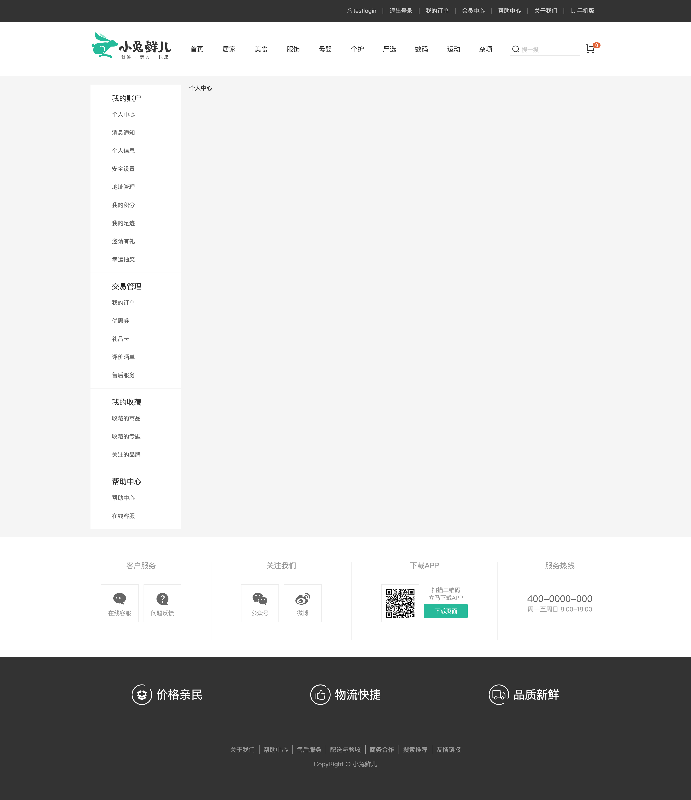

------

- [ ] 创建个人中心左侧菜单组件, 实现基础布局
- [ ] 创建个人中心布局组件, 实现基础布局
- [ ] 创建个人中心首页组件, 实现基础布局
- [ ] 配置个人中心首页页面组件路由规则
- [ ] 在顶部通栏组件中添加跳转到个人中心的链接地址

------

第一步: 创建个人中心左侧菜单组件, 实现基础布局

`components/AppMemberSidebar.vue`

```vue
<template>
  <div class="xtx-member-aside">
    <div class="user-manage">
      <h4>我的账户</h4>
      <div class="links">
        <a href="javascript:">个人中心</a>
        <a href="javascript:">消息通知</a>
        <a href="javascript:">个人信息</a>
        <a href="javascript:">安全设置</a>
        <a href="javascript:">地址管理</a>
        <a href="javascript:">我的积分</a>
        <a href="javascript:">我的足迹</a>
        <a href="javascript:">邀请有礼</a>
        <a href="javascript:">幸运抽奖</a>
      </div>
      <h4>交易管理</h4>
      <div class="links">
        <a href="javascript:">我的订单</a>
        <a href="javascript:">优惠券</a>
        <a href="javascript:">礼品卡</a>
        <a href="javascript:">评价晒单</a>
        <a href="javascript:">售后服务</a>
      </div>
      <h4>我的收藏</h4>
      <div class="links">
        <a href="javascript:">收藏的商品</a>
        <a href="javascript:">收藏的专题</a>
        <a href="javascript:">关注的品牌</a>
      </div>
      <h4>帮助中心</h4>
      <div class="links">
        <a href="javascript:">帮助中心</a>
        <a href="javascript:">在线客服</a>
      </div>
    </div>
  </div>
</template>
<script>
export default {
  name: "AppMemberSidebar",
};
</script>

<style scoped lang="less">
.xtx-member-aside {
  width: 220px;
  margin-right: 20px;
  border-radius: 2px;
  .user-manage {
    background-color: #fff;
    h4 {
      font-size: 18px;
      font-weight: 400;
      padding: 20px 52px 5px;
      border-top: 1px solid #f6f6f6;
    }
    .links {
      padding: 0 52px 10px;
    }
    a {
      display: block;
      line-height: 1;
      padding: 15px 0;
      font-size: 14px;
      color: #666;
      position: relative;
      &:hover {
        color: @xtxColor;
      }
      &.exact-active {
        color: @xtxColor;

        &:before {
          display: block;
        }
      }
      &.fuzzy-active {
        color: @xtxColor;

        &:before {
          display: block;
        }
      }
      &:before {
        content: "";
        display: none;
        width: 6px;
        height: 6px;
        border-radius: 50%;
        position: absolute;
        top: 19px;
        left: -16px;
        background-color: @xtxColor;
      }
    }
  }
}
</style>
```

第二步: 创建个人中心布局组件, 实现基础布局

`components/AppMemberLayout.vue`

```html
<template>
  <AppLayout>
    <div class="container">
      <AppMemberSidebar />
      <article class="article">
        <slot />
      </article>
    </div>
  </AppLayout>
</template>
<script>
import AppMemberSidebar from "@/components/AppMemberSidebar";
import AppLayout from "@/components/AppLayout";
export default {
  name: "AppMemberLayout",
  components: { AppLayout, AppMemberSidebar },
};
</script>
<style scoped lang="less">
.container {
  display: flex;
  padding-top: 20px;
  .article {
    width: 1000px;
    position: relative;
  }
}
</style>
```

第三步: 创建个人中心首页组件

`views/member/home/MemberHomePage.vue`

```html
<template>
  <AppMemberLayout> 个人中心首页 </AppMemberLayout>
</template>
<script>
import AppMemberLayout from "@/components/AppMemberLayout";
export default {
  name: "MemberHomePage",
  components: { AppMemberLayout },
};
</script>

```

第四步: 配置个人中心布局组件路由规则, 配置个人中心首页页面路由规则

`router/index.js`

```javascript
const MemberHomePage = () => import("@/views/member/MemberHomePage");

const routes = [
  {
    path: "/member/home",
    component: MemberHomePage,
  },
];
```

第五步: 在顶部通栏组件中添加跳转到个人中心的链接地址

```html
<RouterLink to="/member/home">
	<i class="iconfont icon-user"></i>
	{{ user.profile.account }}
</RouterLink>
```

## 02. 个人中心-基础布局

> 目标: 实现个人中心页面组件基础布局


------

- [ ] 创建个人信息概览组件, 实现基础布局
- [ ] 创建面板布局组件, 实现基础布局
- [ ] 渲染概览组件、面板组件、猜你喜欢组件

------

第一步: 创建个人信息概览组件, 实现基础布局

`views/member/home/components/MemberHomeOverview.vue`

```vue
<template>
  <!-- 概览 -->
  <div class="home-overview">
    <!-- 用户信息 -->
    <div class="user-meta">
      <div class="avatar">
        
      </div>
      <h4>徐菲菲</h4>
    </div>
    <div class="item">
      <a href="javascript:">
        <span class="iconfont icon-hy"></span>
        <p>会员中心</p>
      </a>
      <a href="javascript:">
        <span class="iconfont icon-aq"></span>
        <p>安全设置</p>
      </a>
      <a href="javascript:">
        <span class="iconfont icon-dw"></span>
        <p>地址管理</p>
      </a>
    </div>
  </div>
</template>
<script>
export default {
  name: "MemberHomeOverview",
};
</script>
<style scoped lang="less">
.home-overview {
  height: 132px;
  background: url(../../../assets/images/center-bg.png) no-repeat center /
    cover;
  display: flex;
  .user-meta {
    flex: 1;
    display: flex;
    align-items: center;
    .avatar {
      width: 85px;
      height: 85px;
      border-radius: 50%;
      overflow: hidden;
      margin-left: 60px;
      img {
        width: 100%;
        height: 100%;
      }
    }
    h4 {
      padding-left: 26px;
      font-size: 18px;
      font-weight: normal;
      color: white;
    }
  }
  .item {
    flex: 1;
    display: flex;
    align-items: center;
    justify-content: space-around;
    &:first-child {
      border-right: 1px solid #f4f4f4;
    }
    a {
      color: white;
      font-size: 16px;
      text-align: center;
      .iconfont {
        font-size: 32px;
      }
      p {
        line-height: 32px;
      }
    }
  }
}
</style>
```

第二步: 创建面板布局组件, 实现基础布局

面板标题通过 props 传入, 商品列表通过 slot 传入.

`views/member/home/components/MemberHomePanel.vue`

```html
<template>
  <div class="home-panel">
    <div class="header">
      <h4>{{ title }}</h4>
      <XtxMore to="/" />
    </div>
    <!-- 商品列表 -->
    <div class="goods-list">
      <slot></slot>
    </div>
  </div>
</template>
<script>
export default {
  name: "MemberHomePanel",
  props: {
    title: {
      type: String,
      default: "",
    },
  },
};
</script>
<style scoped lang="less">
.home-panel {
  background-color: #fff;
  padding: 0 20px;
  margin-top: 20px;
  height: 400px;
  .header {
    height: 66px;
    border-bottom: 1px solid #f5f5f5;
    padding: 18px 0;
    display: flex;
    justify-content: space-between;
    align-items: baseline;
    h4 {
      font-size: 22px;
      font-weight: normal;
    }
  }
  .goods-list {
    display: flex;
    justify-content: space-around;
    padding-top: 20px;
  }
}
</style>
```

第三步: 渲染概览组件、面板组件、猜你喜欢组件

`views/member/home/MemberHomePage.vue`

```vue
<template>
  <div class="member-home">
    <MemberHomeOverview />
    <MemberHomePanel title="我的收藏"></MemberHomePanel>
    <MemberHomePanel title="我的足迹"></MemberHomePanel>
    <GoodsRelevant />
  </div>
</template>
<script>
import MemberHomeOverview from "@/views/member/home/components/MemberHomeOverview";
import MemberHomePanel from "@/views/member/home/components/MemberHomePanel";
import GoodsRelevant from "@/views/goods/components/GoodsRelevant";
export default {
  name: "MemberHomePage",
  components: { GoodsRelevant, MemberHomePanel, MemberHomeOverview },
};
</script>
<style scoped lang="less">
.member-home {
  :deep(.xtx-carousel) .carousel-btn.prev {
    left: 5px;
  }
  :deep(.xtx-carousel) .carousel-btn.next {
    right: 5px;
  }
}
</style>
```
## 03. 模拟接口数据

### 3.1 Mock Service Worker

> 目标: 掌握 Mock Service Worker 的基本使用方式

[Mock Service Worker](https://mswjs.io/): 在网络级别上对请求进行拦截, 对请求进行自定义处理. 

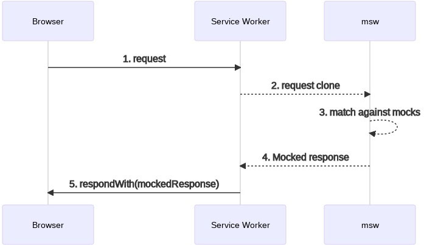

------

- [ ] Mock Service Worker 概述
- [ ] 下载指定版本的请求拦截工具 
- [ ] 生成 service worker 的注册文件
- [ ] 编写请求处理程序
- [ ] 配置请求处理程序
- [ ] 启动请求拦截

------

第一步：下载指定版本的请求拦截工具 

```bash
npm install msw@0.35.0
```

第二步: 生成 service worker 的注册文件

以下命令运行后会在 public 文件夹下生成 `mockServiceWorker.js`, 在每一个项目中生成的文件代码都是一样的. 不需关心.

```bash
npx msw init public/
```

第三步: 编写并配置请求处理程序

`src/mocks/worker.js`

```javascript
import { rest, setupWorker } from "msw";
import { baseURL } from "@/utils/request";

const worker = setupWorker(
  rest.get(`${baseURL}message`, (req, res, ctx) => {
    return res(ctx.json({ msg: "hello" }));
  })
);

export default worker;
```

第五步: 启动请求拦截

`src/main.js`

```javascript
// 判断当前是否为开发环境
if (process.env.NODE_ENV === "development") {
  // 动态引入请求拦截实例对象
  const worker = require("./mocks/worker").default;
  // 启动请求拦截实用程序
  // onUnhandledRequest: 拦截到但是未处理的请求走该函数
  // quiet: true 安静模式, 对于拦截成功的请求不要在控制台中进行输出提示
  worker
    .start({ onUnhandledRequest() {}, quiet: true })
    .then(() => console.log("%c拦截程序启动成功", "color: green"));
}
```

### 3.2 Faker.js

> 目标: 能够使用 faker.js 生成虚假数据

[faker.js](https://www.npmjs.com/package/faker): 用于生成虚假数据. [demo](https://rawgit.com/Marak/faker.js/master/examples/browser/index.html)


------

- [ ] 下载 faker.js
- [ ] 使用 faker.js 生成一条数据
- [ ] 使用 faker.js 生成多条数据

------

第一步: 下载 faker.js

```bash
npm install faker@5.5.3 @types/faker@5.5.9
```

第二步: 使用 faker.js 生成一条数据

```javascript
import faker from "faker";

faker.locale = "zh_CN";

ctx.json({
  name: faker.name.firstName(),
  avatar: faker.internet.avatar(),
  phone: faker.phone.phoneNumber(),
  cityName: faker.address.cityName(),
  email: faker.internet.email(),
})
```

第三步: 使用 faker.js 生成多条数据

```javascript
function makeArray(length, generator) {
  return Array.from({ length }, generator);
}
```

```javascript
ctx.json(
  makeArray(faker.datatype.number(20), () => ({
    name: faker.name.firstName(),
    avatar: faker.internet.avatar(),
    phone: faker.phone.phoneNumber(),
    cityName: faker.address.cityName(),
    email: faker.internet.email(),
  }))
)
```

## 04. 个人中心-我的收藏

> 目标: 使用模拟数据完成我的收藏数据渲染

------

- [ ] 创建用于获取收藏数据的API接口函数
- [ ] 在个人中心首页页面组件中发送请求获取收藏数据
- [ ] 使用 msw 拦截请求, 返回模拟数据
- [ ] 使用模拟数据进行组件渲染

------

第一步: 创建用于获取收藏数据的API函数

`api/member.js` [获取收藏](http://zhoushugang.gitee.io/erabbit-client-pc-document/api.html#u83b7u53d6u6536u85cf0a3ca20id3du83b7u53d6u6536u85cf3e203ca3e)

```javascript
/**
 * 获取我的收藏
 * @param collectType 收藏类型，1为商品，2为专题，3为品牌
 * @param page 页码
 * @param pageSize 每页显示数据条数
 * @return {AxiosPromise}
 */
export function getCollection({ collectType = 1, page = 1, pageSize = 10 }) {
  return request("/member/collect", "get", { collectType, page, pageSize });
}
```

第二步: 在个人中心首页页面组件发送请求获取收藏数据

`views/member/home/MemberHomePage.vue`

```javascript
import { ref } from "vue";
import { getCollection } from "@/api/member";

export default {
  setup() {
    // 获取收藏数据
    const collection = useCollection();
    return { collection };
  },
};
function useCollection() {
  // 用于存储收藏数据
  const collection = ref(null);
  // 获取并存储收藏数据
  getCollection({pageSize: 4}).then((data) => (collection.value = data.result));
  // 返回收藏数据
  return collection;
}
```

通过查看接口返回值，我们发现服务器端真实接口中并没有返回有效数据，意思就是该接口服务器端还没有开发完成。

第三步: 拦截Ajax请求, 返回模拟数据.

`mocks/handlers.js`


```javascript
import { rest } from "msw";
import faker from "faker";
import { baseURL } from "@/utils/request";

faker.locale = "zh_CN";

export default [
  rest.get(`${baseURL}member/collect`, (req, res, ctx) => {
    return res(
      ctx.json({
        msg: "成功",
        result: {
          counts: 50,
          page: req.url.searchParams.get("page"),
          pageSize: req.url.searchParams.get("pageSize"),
          pages: 0,
          items: makeArray(req.url.searchParams.get("pageSize"), () => ({
            id: faker.datatype.uuid(),
            name: faker.internet.userName(),
            desc: faker.commerce.productDescription(),
            price: faker.commerce.price(),
            picture: `http://zhoushugang.gitee.io/erabbit-client-pc-static/uploads/clothes_goods_${faker.datatype.number(
              { min: 1, max: 8 }
            )}.jpg`,
          })),
        },
      })
    );
  }),
];
function makeArray(length, generator) {
  return Array.from({ length }, generator);
}

// http://zhoushugang.gitee.io/erabbit-client-pc-static/uploads/clothes_goods_1.jpg
// http://zhoushugang.gitee.io/erabbit-client-pc-static/uploads/clothes_goods_8.jpg
```

第四步: 使用模拟数据进行组件渲染

```html
<MemberHomePanel title="我的收藏" v-if="collection">
  <GoodsItem v-for="goods in collection.items" :key="goods.id" :goods="goods" />
</MemberHomePanel>
```

## 05. 个人中心-菜单激活

> 终极目标: 动态激活左侧菜单链接

### 05.01 创建订单列表页面

> 目标: 实现个人中心首页和订单列表页面之间的链接跳转

------

- [ ] 创建订单列表页面组件
- [ ] 配置订单列表页面组件的路由规则
- [ ] 在左侧菜单组件中添加链接地址

------

 第一步: 创建订单列表页面组件

`views/member/OrderListPage.vue`

```react
<template>
  <AppMemberLayout>
    <div class="member-order">订单列表</div>
  </AppMemberLayout>
</template>

<script>
import AppMemberLayout from "@/components/AppMemberLayout";
export default {
  name: "OrderListPage.vue",
  components: { AppMemberLayout },
};
</script>

<style lang="less" scoped>
.member-order {
  height: 100%;
  background: #fff;
  position: relative;
}
</style>
```

第二步: 配置订单列表页面组件的路由规则

`router/index.js`

```javascript
const OrderListPage = () => import("@/views/member/OrderListPage");

const routes = [
  {
    path: "/member/order",
    component: OrderListPage,
  },
]
```

第三步: 在左侧菜单组件中添加链接地址

`components/AppMemberSidebar.vue`

```react
<RouterLink to="/member/home">个人中心</RouterLink>
<RouterLink to="/member/order">我的订单</RouterLink>
```

### 05.02 定义精确匹配激活类名

> 目标: 为个人中心首页链接和订单列表页面链接添加激活选中类名

------

- [ ] 什么是精确匹配
- [ ] 精确匹配激活类名
- [ ] 为链接添加自定义精确匹配激活类名

------

当链接的to属性值和访问的路由路径完全匹配时, 就是精确匹配

```bash
# 当前访问的路由路径值
/member/order
```

```vue
<!-- 链接 -->
<RouterLink to="/member/order"></RouterLink>
```

当发生精确匹配时，为链接添加精确匹配激活类名

```vue
<!-- 精确匹配激活类名: router-link-exact-active -->
<a href="#/member/order" class="router-link-exact-active"></a>
```

自定义精确匹配激活类名

```react
<RouterLink exact-active-class="exact-active" to="/member/home">个人中心</RouterLink>
<RouterLink exact-active-class="exact-active" to="/member/order">我的订单</RouterLink>
```

### 05-03 创建订单详情页面

> 目标: 创建订单详情页面组件

------

- [ ] 创建订单详情页面组件
- [ ] 配置订单详情页面组件的路由规则

------

第一步: 创建订单详情页面组件

`views/member/OrderDetailPage.vue`

```react
<template>
  <AppMemberLayout>
    <div class="order-detail-page">
      订单详情
      <!-- 操作栏 -->
      <!-- 步骤条-->
      <!-- 物流栏 -->
      <!-- 订单商品信息 -->
    </div>
  </AppMemberLayout>
</template>
<script>
import AppMemberLayout from "@/components/AppMemberLayout";
export default {
  name: "OrderDetailPage",
  components: { AppMemberLayout },
};
</script>
<style scoped lang="less">
.order-detail-page {
  background: #fff;
  height: 100%;
}
</style>
```

第二步: 配置订单详情页面组件的路由规则

```javascript
const OrderDetailPage = () => import("@/views/member/OrderDetailPage");

const routes = [
  {
    path: "/member/order/:id",
    component: OrderDetailPage,
  },
]
```

### 05.04 定义模糊匹配激活类名

> 目标: 掌握模糊匹配激活类名的添加条件

------

- [ ] 讲解模糊匹配的两个必要条件
- [ ] 了解模糊匹配激活的默认类名是什么
- [ ] 自定义模糊匹配激活类名

------

当链接的to属性值被访问的路由路径包含时就是模糊匹配

```vue
<!-- 链接 -->
<RouterLink to="/member"></RouterLink>
```

```bash
# 当前访问的路由路径值
/member/order
```

模糊匹配成功的先决条件是路由配置存在嵌套关系

```javascript
// 链接的模糊匹配能够成功
const routes = [
	{ 
		path: "/member", 
		component: Member,
		children: [
			{
				path: "/member/order",
				component: Order
			}
		]
	}
]
```

```javascript
// 链接的模糊匹配将不会成功
const routes = [
	{ path: "/member", component: Member},
	{ path: "/member/order", component: Order}
]
```

模糊匹配激活类名: `router-link-active`

自定义模糊匹配激活类名

```react
<RouterLink active-class="test" to="/member/home">个人中心</RouterLink> 
```

### 05-05 实现"我的订单"模糊匹配 

> 目标: 当进入订单详情页面时，使用模糊匹配激活"我的订单"链接

------

- [ ] 为"我的订单"链接添加模糊匹配激活类名
- [ ] 重新定义订单列表页面和订单详情页面的路由规则, 以满足路由嵌套条件
- [ ] 通过路由配置的方式添加激活类名

------

第一步: 为"我的订单"链接添加模糊匹配激活类名

```react
<RouterLink active-class="fuzzy-active" to="/member/order">我的订单</RouterLink>
```

第二步: 重新定义订单列表页面和订单详情页面的路由规则, 以满足路由嵌套条件

`router/index.js`

```javascript
 const OrderView = () => import("@/views/member/OrderView");

const routes = {
    path: "/member/order",
    component: OrderView,
    children: [
      {
        path: "",
        component: OrderListPage,
      },
      {
        path: ":id",
        component: OrderDetailPage,
      },
    ],
  },
```

`views/member/OrderView.vue`

```react
<template>
  <RouterView />
</template>

<script>
export default {
  name: "OrderView",
};
</script>
```

第三步: 通过路由配置的方式添加激活类名

`router/index.js`

```javascript
const router = createRouter({
  linkActiveClass: "fuzzy-active",
  linkExactActiveClass: "exact-active",
});
```

### 05-06 总结

精确匹配激活类名的应用场景是相互排斥的链接, 比如 `个人中心` 和 `我的订单`

模糊匹配激活类名的应用场景是多个具有嵌套关系且不互相排斥的链接, 比如 `个人中心列表` 和 `个人中心详情`, 当访问这两个页面时都要激活 `个人中心` 链接

注意: 如果某个链接符合精确匹配, 那么它也符合模糊匹配.

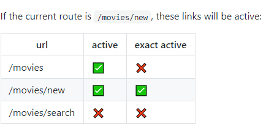

## 06. 在 vue 中使用 JSX

> 目标: 掌握如何在 Vue 中使用 JSX 语法

`test/LearnJsx.vue`

```react
<script>
import { reactive, ref } from "vue";

export default {
  name: "LearnJsx",
  setup() {
    const person = reactive({ name: "张三", age: 20 });
    const onClickHandler = () => {
      person.name = "李四";
      person.age = 40;
    };
    const activeClass = "active";
    const data = ref(["a", "b", "c"]);
    return () => (
      <div className={activeClass} onClick={onClickHandler}>
        <p>
          {person.name} {person.age}
        </p>
        <ul>
          {data.value.map((item) => (
            <li>{item}</li>
          ))}
        </ul>
      </div>
    );
  },
};
</script>
```

## 07. 封装 XtxTabs 组件

> 目标: 封装选项卡功能组件

```vue
<XtxTabs v-model:active="active">
  <XtxTabTitle>测试标题一</XtxTabTitle>
  <XtxTabTitle>测试标题二</XtxTabTitle>
  <XtxTabContent>测试内容一</XtxTabContent>
  <XtxTabContent>测试内容二</XtxTabContent>
</XtxTabs>
<script>
export default {
	setup () {
		const active = ref(0);
		return { active };
	}
}
</script>
```

XtxTabs 组件: 用于收集选项卡的标题和内容, 根据标题和内容渲染选项卡界面, 实现选项卡的切换逻辑

XtxTabTitle 组件: 用于向 XtxTabs 组件传递选项卡标题

XtxTabContent 组件: 用于向 XtxTabs 组件传递选项卡内容

------

- [ ] 创建选项卡标题组件, 接收插槽内容
- [ ] 创建选项卡内容组件, 接收插槽内容
- [ ] 创建选项卡组件, 实现选卡布局及切换效果
- [ ] 选项卡组件升级, 支持组件标题和组件内容的动态渲染

------

第一步: 创建选项卡标题组件

`components/library/XtxTabTitle.vue`

```vue
<template>
  <slot />
</template>

<script>
export default {
  name: "XtxTabTitle",
};
</script>
```

第二步: 创建选项卡内容组件

`components/library/XtxTabContent.vue`

```vue
<template>
  <slot />
</template>

<script>
export default {
  name: "XtxTabContent",
};
</script>
```

第三步: 创建选项卡组件

```vue
<!-- 静态结构和样式 -->
<div className="xtx-tabs">
	<nav>
  	<a href="javascript:">标题一</a>
    <a href="javascript:">标题二</a>
  </nav>
  <div>内容一</div>
  <div>内容二</div>
</div>

<style lang="less" scoped>
.xtx-tabs {
  background: #fff;
  > nav {
    height: 60px;
    line-height: 60px;
    display: flex;
    border-bottom: 1px solid #f5f5f5;
    > a {
      width: 110px;
      border-right: 1px solid #f5f5f5;
      text-align: center;
      font-size: 16px;
      &.active {
        border-top: 2px solid @xtxColor;
        height: 60px;
        background: #fff;
        line-height: 56px;
      }
    }
  }
  > div {
    display: none;
    &.active {
      display: block;
    }
  }
}
</style>
```

`components/library/XtxTabs.vue`

```vue
<script>
import { useVModel } from "@vueuse/core";

export default {
  name: "XtxTabs",
  props: {
    active: {
      type: Number,
      default: 0,
    },
  },
  setup(props, { slots, emit }) {
    // 获取插槽内容
    const defaults = slots.default();
    // 获取选项卡标题
    const titles = defaults.filter((item) => item.type.name === "XtxTabTitle");
    // 获取选项卡内容
    const contents = defaults.filter(
      (item) => item.type.name === "XtxTabContent"
    );
    // 选项卡索引
    const index = useVModel(props, "active", emit);
    // 当选项卡标题被点击时
    const onTabTitleClickHandler = (i) => {
      index.value = i;
    };
    return () => {
      return (
        <div className="xtx-tabs">
          <nav>
            {titles.map((item, i) => (
              <a
                className={i === index.value ? "active" : ""}
                href="javascript:"
                onClick={() => onTabTitleClickHandler(i)}
              >
                {item}
              </a>
            ))}
          </nav>
          {contents.map((item, i) => (
            <div className={i === index.value ? "active" : ""}>{item}</div>
          ))}
        </div>
      );
    };
  },
};
</script>
```

第四步: 选项卡组件升级, 支持组件标题和组件内容的动态渲染

```vue
<!-- 测试调用代码 -->
<XtxTabs v-model:active="active">
  <XtxTabTitle v-for="item in tabsData" :key="item.title">{{item.title}}</XtxTabTitle>
  <XtxTabTitle>测试标题三</XtxTabTitle>
  <XtxTabContent v-for="item in tabsData" :key="item.content">{{item.content}}</XtxTabContent>
  <XtxTabContent>测试内容三</XtxTabContent>
</XtxTabs>
```

```javascript
const tabsData = ref([
  { title: "选项卡标题一", content: "选项卡内容一" },
  { title: "选项卡标题二", content: "选项卡内容二" },
]);
```

`components/library/XtxTabs.vue`

```vue
<script>
import { useVModel } from "@vueuse/core";

export default {
  name: "XtxTabs",
  props: {
    active: {
      type: Number,
      default: 0,
    },
  },
  setup(props, { slots, emit }) {
    // 获取插槽内容
    const defaults = slots.default();
    // 用于存储选项卡标题
    const titles = [];
    // 用于存储选项卡内容
    const contents = [];
    // 收集选项卡标题和内容
    defaults.forEach((item) => {
      if (typeof item.type === "symbol") {
        item.children.forEach((child) => {
          if (child.type.name === "XtxTabTitle") {
            titles.push(child);
          } else {
            contents.push(child);
          }
        });
      } else {
        if (item.type.name === "XtxTabTitle") {
          titles.push(item);
        } else {
          contents.push(item);
        }
      }
    });
    // 选项卡索引
    const index = useVModel(props, "active", emit);
    // 当选项卡标题被点击时
    const onTabTitleClickHandler = (i) => {
      index.value = i;
    };
    return () => {
      return (
        <div className="xtx-tabs">
          <nav>
            {titles.map((item, i) => (
              <a
                className={i === index.value ? "active" : ""}
                href="javascript:"
                onClick={() => onTabTitleClickHandler(i)}
              >
                {item}
              </a>
            ))}
          </nav>
          {contents.map((item, i) => (
            <div className={i === index.value ? "active" : ""}>{item}</div>
          ))}
        </div>
      );
    };
  },
};
</script>
```

## 08. 订单管理-渲染订单标题

> 目标: 使用 XtxTabs 组件实现订单标题渲染

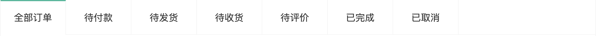

------

- [ ] 准备订单状态常量数组
- [ ] 渲染订单状态标题

------

第一步: 准备订单状态常量数组

`src/api/constants.js`

```javascript
// 订单状态
export const orderStatus = [
  { name: "all", label: "全部订单" },
  { name: "unpay", label: "待付款" },
  { name: "deliver", label: "待发货" },
  { name: "receive", label: "待收货" },
  { name: "comment", label: "待评价" },
  { name: "complete", label: "已完成" },
  { name: "cancel", label: "已取消" },
];
```

第二步: 渲染订单状态标题

`views/member/order/OrderListPage.vue`

```html
<script>
import { orderStatus } from "@/api/constants";
import { ref } from "vue";
export default {
  setup() {
    const active = ref(0);
    return { orderStatus, active };
  },
};
</script>
```

```html
<XtxTabs v-model:active="active">
  <XtxTabTitle v-for="status in orderStatus" :key="status.name">{{status.label}}</XtxTabTitle>
</XtxTabs>
```

## 09. 订单管理-基础布局

> 目的：完成订单列表静态布局。


`views/member/OrderListPage.vue`

```html
<div class="order-list">
  <div class="order-item">
    <div class="head">
      <span>下单时间：2021-09-25 08:33:30</span>
      <span>订单编号：1441561463234760705</span>
      <span class="down-time">
        <i class="iconfont icon-down-time"></i>
        <b>付款截止：28分32秒</b>
      </span>
      <a href="javascript:" class="del">删除</a>
    </div>
    <div class="body">
      <div class="column goods">
        <ul>
          <li v-for="i in 2" :key="i">
            <a class="image" href="javascript:">
              
            </a>
            <div class="info">
              <p class="name ellipsis-2">
                不烫手的茶杯双层隔热茶水杯绿茶杯
              </p>
              <p class="attr ellipsis">
                <span>容量:2只装 </span>
              </p>
            </div>
            <div class="price">¥89</div>
            <div class="count">x1</div>
          </li>
        </ul>
      </div>
      <div class="column state">
        <p>待付款</p>
        <a href="javascript:" class="green">查看物流</a>
        <a href="javascript:" class="green">评价商品</a>
        <a href="javascript:" class="green">查看评价</a>
      </div>
      <div class="column amount">
        <p class="red">¥93</p>
        <p>（含运费：¥4）</p>
        <p>在线付款</p>
      </div>
      <div class="column action">
        <XtxButton type="primary" size="small">立即付款</XtxButton>
        <XtxButton type="primary" size="small">确认收货</XtxButton>
        <p><a href="javascript:">查看详情</a></p>
        <p><a href="javascript:">取消订单</a></p>
        <p><a href="javascript:">再次购买</a></p>
        <p><a href="javascript:">申请售后</a></p>
      </div>
    </div>
  </div>
</div>
```

```less
.order-list {
  background: #fff;
  padding: 20px;
  position: relative;
}
.order-item {
  margin-bottom: 20px;
  border: 1px solid #f5f5f5;
  .head {
    height: 50px;
    line-height: 50px;
    background: #f5f5f5;
    padding: 0 20px;
    overflow: hidden;
    span {
      margin-right: 20px;
      &.down-time {
        margin-right: 0;
        float: right;
        i {
          vertical-align: middle;
          margin-right: 3px;
        }
        b {
          vertical-align: middle;
          font-weight: normal;
        }
      }
    }
    .del {
      margin-right: 0;
      float: right;
      color: #999;
    }
  }
  .body {
    display: flex;
    align-items: stretch;
    .column {
      border-left: 1px solid #f5f5f5;
      text-align: center;
      padding: 20px;
      > p {
        padding-top: 10px;
      }
      &:first-child {
        border-left: none;
      }
      &.goods {
        flex: 1;
        padding: 0;
        align-self: center;
        ul {
          li {
            border-bottom: 1px solid #f5f5f5;
            padding: 10px;
            display: flex;
            &:last-child {
              border-bottom: none;
            }
            .image {
              width: 70px;
              height: 70px;
              border: 1px solid #f5f5f5;
            }
            .info {
              width: 220px;
              text-align: left;
              padding: 0 10px;
              p {
                margin-bottom: 5px;
                &.name {
                  height: 38px;
                }
                &.attr {
                  color: #999;
                  font-size: 12px;
                  span {
                    margin-right: 5px;
                  }
                }
              }
            }
            .price {
              width: 100px;
            }
            .count {
              width: 80px;
            }
          }
        }
      }
      &.state {
        width: 120px;
        .green {
          color: @xtxColor;
        }
      }
      &.amount {
        width: 200px;
        .red {
          color: @priceColor;
        }
      }
      &.action {
        width: 140px;
        a {
          display: block;
          &:hover {
            color: @xtxColor;
          }
        }
      }
    }
  }
}
```

## 10. 订单管理-列表渲染

> 目标：完成订单列表默认渲染


------

- [ ] 创建用于获取订单列表的API接口函数
- [ ] 在订单列表组件中获取订单列表数据
- [ ] 提取订单列表项组件
- [ ] 在订单列表组件中调用订单列表项组件
- [ ] 渲染订单列表数据

------

第一步: 创建用于获取订单列表的API接口函数

`api/member.js` [获取我的订单](http://zhoushugang.gitee.io/erabbit-client-pc-document/api.html#u83b7u53d6u6211u7684u8ba2u53550a3ca20id3du83b7u53d6u6211u7684u8ba2u53553e203ca3e)

```javascript
/**
 * 获取订单列表
 * @param page 页码
 * @param pageSize 每页显示多少数据
 * @param orderState 订单状态 0为全部 1为待付款、2为待发货、3为待收货、4为待评价、5为已完成、6为已取
 * @return {AxiosPromise}
 */
export function getOrderList({ page, pageSize, orderState }) {
  return request("/member/order", "get", { page, pageSize, orderState });
}
```

第二步: 在订单列表组件中获取订单列表数据

`views/member/order/OrderListPage.vue`

```javascript
import { ref, watch } from "vue";
import { getOrderList } from "@/api/member";

export default {
  setup() {
    // 获取订单列表数据
    const { orderList } = useOrderList();
    return { orderList };
  },
};
// 获取订单列表数据
function useOrderList() {
  // 用于存储订单列表数据
  const orderList = ref(null);
  // 请求参数
  const reqParams = ref({ page: 1, pageSize: 10, orderState: 0 });
  // 获取并存储订单列表数据
  const getData = () => {
    getOrderList(reqParams.value).then(
      (data) => (orderList.value = data.result)
    );
  };
  // 监控请求参数变化, 重新获取订单列表数据
  watch(reqParams.value, getData, { immediate: true });
  return { orderList, reqParams };
}
```

第三步: 提取订单列表项组件

`views/member/order/components/OrderItem.vue`

```vue
<template>
  <div class="order-item">
    <div class="head">
      <span>下单时间：2021-09-25 08:33:30</span>
      <span>订单编号：1441561463234760705</span>
      <span class="down-time">
        <i class="iconfont icon-down-time"></i>
        <b>付款截止：28分32秒</b>
      </span>
      <a href="javascript:" class="del">删除</a>
    </div>
    <div class="body">
      <div class="column goods">
        <ul>
          <li v-for="i in 2" :key="i">
            <a class="image" href="javascript:">
              
            </a>
            <div class="info">
              <p class="name ellipsis-2">
                不烫手的茶杯双层隔热茶水杯绿茶杯
              </p>
              <p class="attr ellipsis">
                <span>容量:2只装 </span>
              </p>
            </div>
            <div class="price">¥89</div>
            <div class="count">x1</div>
          </li>
        </ul>
      </div>
      <div class="column state">
        <p>待付款</p>
        <a href="javascript:" class="green">查看物流</a>
        <a href="javascript:" class="green">评价商品</a>
        <a href="javascript:" class="green">查看评价</a>
      </div>
      <div class="column amount">
        <p class="red">¥93</p>
        <p>（含运费：¥4）</p>
        <p>在线付款</p>
      </div>
      <div class="column action">
        <XtxButton type="primary" size="small">立即付款</XtxButton>
        <XtxButton type="primary" size="small">确认收货</XtxButton>
        <p><a href="javascript:">查看详情</a></p>
        <p><a href="javascript:">取消订单</a></p>
        <p><a href="javascript:">再次购买</a></p>
        <p><a href="javascript:">申请售后</a></p>
      </div>
    </div>
  </div>
</template>

<script>
export default {
  name: "OrderItem",
};
</script>

<style lang="less" scoped>
.order-item {
  margin-bottom: 20px;
  border: 1px solid #f5f5f5;
  .head {
    height: 50px;
    line-height: 50px;
    background: #f5f5f5;
    padding: 0 20px;
    overflow: hidden;
    span {
      margin-right: 20px;
      &.down-time {
        margin-right: 0;
        float: right;
        i {
          vertical-align: middle;
          margin-right: 3px;
        }
        b {
          vertical-align: middle;
          font-weight: normal;
        }
      }
    }
    .del {
      margin-right: 0;
      float: right;
      color: #999;
    }
  }
  .body {
    display: flex;
    align-items: stretch;
    .column {
      border-left: 1px solid #f5f5f5;
      text-align: center;
      padding: 20px;
      > p {
        padding-top: 10px;
      }
      &:first-child {
        border-left: none;
      }
      &.goods {
        flex: 1;
        padding: 0;
        align-self: center;
        ul {
          li {
            border-bottom: 1px solid #f5f5f5;
            padding: 10px;
            display: flex;
            &:last-child {
              border-bottom: none;
            }
            .image {
              width: 70px;
              height: 70px;
              border: 1px solid #f5f5f5;
            }
            .info {
              width: 220px;
              text-align: left;
              padding: 0 10px;
              p {
                margin-bottom: 5px;
                &.name {
                  height: 38px;
                }
                &.attr {
                  color: #999;
                  font-size: 12px;
                  span {
                    margin-right: 5px;
                  }
                }
              }
            }
            .price {
              width: 100px;
            }
            .count {
              width: 80px;
            }
          }
        }
      }
      &.state {
        width: 120px;
        .green {
          color: @xtxColor;
        }
      }
      &.amount {
        width: 200px;
        .red {
          color: @priceColor;
        }
      }
      &.action {
        width: 140px;
        a {
          display: block;
          &:hover {
            color: @xtxColor;
          }
        }
      }
    }
  }
}
</style>
```
注意: 不要忘记剪切 `order-item` 样式


第四步: 在订单列表组件中调用订单列表项组件

```html
<div class="order-list" v-if="orderList">
  <OrderItem :order="item" v-for="item in orderList.items" :key="item.id" />
</div>
```

第五步: 渲染订单列表数据

`views/member/order/components/OrderItem.vue`

```html
<template>
  <div class="order-item">
    <div class="head">
      <span>下单时间：{{ order.createTime }}</span>
      <span>订单编号：{{ order.id }}</span>
      <span class="down-time" v-if="order.orderState === 1 && order.countdown !== -1">
        <i class="iconfont icon-down-time"></i>
        <b>付款截止：{{timeText}}</b>
      </span>
      <!-- 订单状态为 已完成(5)或已取消(6)时可以删除订单 -->
      <a
        v-if="[5, 6].includes(order.orderState)"
        href="javascript:;"
        class="del"
        >删除</a
      >
    </div>
    <div class="body">
      <div class="column goods">
        <ul>
          <li v-for="goods in order.skus" :key="goods.id">
            <router-link class="image" :to="`/product/${goods.spuId}`">
              
            </router-link>
            <div class="info">
              <p class="name ellipsis-2">
                {{ goods.name }}
              </p>
              <p class="attr ellipsis">
                {{ goods.attrsText }}
              </p>
            </div>
            <div class="price">¥{{ goods.realPay }}</div>
            <div class="count">x{{ goods.quantity }}</div>
          </li>
        </ul>
      </div>
      <div class="column state">
        <!-- orderStatus是一个数组, 数组的索引和订单状态值是对应关系 -->
        <p>
          {{ orderStatus[order.orderState].label }}
        </p>
        <p v-if="order.orderState === 3">
          <a href="javascript:;" class="green">查看物流</a>
        </p>
        <p v-if="order.orderState === 4">
          <a href="javascript:;" class="green">评价商品</a>
        </p>
        <p v-if="order.orderState === 5">
          <a href="javascript:;" class="green">查看评价</a>
        </p>
      </div>
      <div class="column amount">
        <p class="red">¥{{ order.payMoney }}</p>
        <p>（含运费：¥{{ order.postFee }}）</p>
        <p>在线支付</p>
      </div>
      <div class="column action">
        <XtxButton
          @click="$router.push(`/member/pay?orderId=${order.id}`)"
          type="primary"
          size="small"
          v-if="order.orderState === 1"
          >立即付款</XtxButton
        >
        <XtxButton v-if="order.orderState === 3" type="primary" size="small"
          >确认收货</XtxButton
        >
        <p>
          <RouterLink :to="`/member/order/${order.id}`">查看详情</RouterLink>
        </p>
        <p v-if="order.orderState === 1"><a href="javascript:;">取消订单</a></p>
        <p v-if="[2, 3, 4, 5].includes(order.orderState)">
          <a href="javascript:;">再次购买</a>
        </p>
        <p v-if="[4, 5].includes(order.orderState)">
          <a href="javascript:;">申请售后</a>
        </p>
      </div>
    </div>
  </div>
</template>
<script>
import { orderStatus } from '@/api/constants'
export default {
  setup (props) {
    // 获取倒计时
    const { timeText, start } = useCountDown()
    // 如果当前订单为待付款
    if (props.order.orderState === 1) {
      // 开启计时器
      start(props.order.countdown)
    }
    return { orderStatus, timeText, start }
  }
}
</script>
```

倒计时: 待付款 (1)
删除: 已完成、已取消 (5)(6)

订单状态下面的链接: 
查看物流: 待收货 (3)
评价商品: 待评价 (4)
查看评价: 已完成 (5)

立即付款: 待付款 (1)
确认收货: 待收货 (3)
取消订单: 待付款 (1)
再次购买: 待发货 (2)、待收货 (3)、待评价 (4)、已完成 (5)
申请售后: 待评价 (4)、已完成 (5)
查看详情: 所有状态 (1) (2) (3) (4) (5) (6)

商品发货: GET `http://pcapi-xiaotuxian-front-devtest.itheima.net/member/order/consignment/1394116427400613890`

确认收货: PUT Authorization `http://pcapi-xiaotuxian-front-devtest.itheima.net/member/order/1440512972257497090/receipt`

## 11. 订单管理-条件查询

> 目标: 点击不同状态的订单时, 重新获取订单数据, 显示加载提示状态, 如果没有数据, 显示暂无订单数据, 实现订单列表数据分页

------

- [ ] 当用户点击订单状态选项卡标题时, 重新获取订单数据
- [ ] 在订单数据加载过程中显示加载提示
- [ ] 实现暂无数据用户提示
- [ ] 实现订单列表数据分页显示

------

第一步: 当用户点击订单状态选项卡标题时, 重新获取订单数据

`src/views/member/order/OrderListPage.vue`

```vue
<template>
  <div class="member-order">
    <XtxTabs v-model:active="active">
      <XtxTabTitle v-for="status in orderStatus" :key="status.name">{{
        status.label
      }}</XtxTabTitle>
    </XtxTabs>
    <div class="order-list" v-if="orderList">
      <OrderItem :order="item" v-for="item in orderList.items" :key="item.id" />
    </div>
  </div>
</template>
<script>
import { watch } from "vue";

export default {
  setup() {
    const active = ref(0);
    // 获取订单列表数据
    const { reqParams } = useOrderList();
    // 监听用户点击选项卡的行为
    watch(active, (current) => {
      // 重置订单状态参数
      reqParams.value.orderState = current;
      // 重置页码参数
      reqParams.value.page = 1;
    });
  },
};
// 获取订单列表数据
function useOrderList() {
  watch(reqParams.value, () => getData(), { immediate: true });
  return { reqParams };
}
</script>
```

第二步: 在订单数据加载过程中显示加载提示

`src/views/member/order/OrderListPage.vue`

```vue
<div class="order-list">
  <div class="loading" v-if="loading"></div>
  <div class="order-list" v-if="orderList && !loading">
</div>
```

```less
.loading {
  height: calc(100% - 60px);
  width: 100%;
  min-height: 400px;
  position: absolute;
  left: 0;
  top: 60px;
  background: rgba(255, 255, 255, 0.9) url(../../assets/images/loading.gif)
    no-repeat center 18%;
}
```

```javascript
// 获取订单列表数据
function useOrderList() {
  // 订单列表数据加载状态
  const loading = ref(false);
  // 获取并存储订单列表数据
  const getData = () => {
    // 更新加载状态
    loading.value = true;
    // 请求订单列表数据
    getOrderList(reqParams.value).then((data) => {
      // 更新加载状态
      loading.value = false;
    });
  };
  return { loading };
}
```

```javascript
export default {
  components: { OrderItem },
  setup() {
    const { loading } = useOrderList();
    return { loading };
  },
};
```

第三步: 实现暂无数据用户提示

`src/views/member/order/OrderListPage.vue`

```vue
<div v-if="!loading && orderList?.items.length === 0" class="none">
  暂无数据
</div>
```

```less
.none {
  height: 400px;
  text-align: center;
  line-height: 400px;
  color: #999;
  background: rgba(255, 255, 255, 0.9);
}
```

第四步: 实现订单列表数据分页显示

```html
<XtxPagination
  v-if="orderList && totalPage > 1"
  v-model:page="reqParams.page"
  :pageSize="reqParams.pageSize"
  :count="totalCount"
/>
```

```javascript
// 获取订单列表数据
function useOrderList() {
  // 请求参数
  const reqParams = ref({ page: 1, pageSize: 3, orderState: 0 });
  // 用于存储总数据条数
  const totalCount = ref(0);
  // 用于存储总页数
  const totalPage = ref(0);
  // 获取并存储订单列表数据
  const getData = () => {
    // 获取订单列表数据
    getOrderList(reqParams.value).then((data) => {
      // 更新总数据条数
      totalCount.value = data.result.counts;
      // 更新总页数
      totalPage.value = data.result.pages;
    });
  };
  return { reqParams, totalCount, totalPage };
}
```

```javascript
export default {
  setup() {
    // 获取订单列表数据
    const { reqParams, totalCount, totalPage } = useOrderList();
    return { reqParams, totalCount, totalPage };
  },
};
```

## 12. 订单管理-取消订单

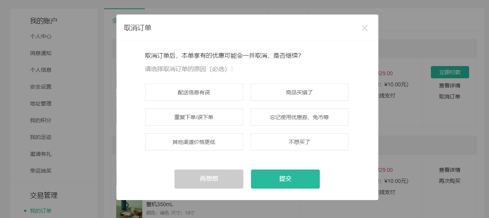

> 目标一: 实现点击取消订单按钮弹出选择取消原因的弹出框

------

- [ ] 创建取消订单弹框组件, 实现基础布局
- [ ] 在订单列表组件中调用取消订单弹框组件
- [ ] 在取消订单弹框中渲染取消原因列表
- [ ] 点击弹框组件中的取消按钮时, 隐藏弹框
- [ ] 点击取消订单按钮渲染取消弹框
- [ ] 在订单列表页面组件中接收自定义事件以渲染弹层

------

第一步: 创建取消订单弹框组件, 实现基础布局

`views/member/order/components/CancelOrder.vue`

```vue
<template>
  <XtxDialog title="取消订单" v-model:visible="visible">
    <!-- 组件内容 -->
    <template #default>
      <div class="cancel-info">
        <p>取消订单后，本单享有的优惠可能会一并取消，是否继续？</p>
        <p class="tip">请选择取消订单的原因（必选）：</p>
        <div class="btn">
          <a>取消原因文字</a>
        </div>
      </div>
    </template>
    <!-- 按钮操作 -->
    <template #footer>
      <XtxButton type="gray" style="margin-right: 20px">取消</XtxButton>
      <XtxButton type="primary">确认</XtxButton>
    </template>
  </XtxDialog>
</template>
<script>
import { ref } from "vue";

export default {
  name: "CancelOrder",
  setup() {
  	// 用于控制弹框是否显示
    const visible = ref(true);
    return { visible };
  },
};
</script>
<style scoped lang="less">
.xtx-dialog :deep(.wrapper) {
  width: 620px;
}
.cancel-info {
  p {
    font-size: 16px;
    line-height: 35px;
    &.tip {
      color: #999;
    }
  }
  .btn {
    padding-top: 21px;
    display: flex;
    flex-wrap: wrap;
    a {
      width: 250px;
      height: 45px;
      line-height: 45px;
      text-align: center;
      background-color: #ffffff;
      border: 1px solid #e4e4e4;
      margin-right: 20px;
      margin-bottom: 20px;
      color: #666;
      &:nth-child(2n) {
        margin-right: 0;
      }
      &:hover,
      &.active {
        background-color: #e3f9f4;
        border-color: @xtxColor;
      }
    }
  }
}
</style>
```

第二步: 在订单列表组件中调用取消订单弹框组件

因为取消订单按钮在 `orderItem` 组件中, 如果将取消订单弹层组件渲染在这个组件中, 那么有多少订单就会渲染多少弹层, 所以我们要将弹层组件放在父组件中, 就是订单列表组件. 

`src/views/member/order/OrderListPage.vue`

```vue
<CancelOrder />
```

第三步: 在取消订单弹框中渲染取消原因列表

`api/constants.js`

```javascript
// 取消订单的原因
export const cancelReason = [
  "配送信息有误",
  "商品买错了",
  "重复下单/误下单",
  "忘记使用优惠券、兔币等",
  "其他渠道价格更低",
  "不想买了",
];
```

`views/member/order/components/CancelOrder.vue`

```vue
<template>
  <a
  	v-for="(reason, index) in cancelReason"
  	:key="index"
  	:class="{ active: reason === selected }"
  	@click="selected = reason"
  >{{ reason }}</a>
</template>
<script>
import { ref } from "vue";
import { cancelReason } from "@/api/constants";

export default {
  setup() {
  	// 用于存储用户选择的原因
    const selected = ref("");
    return { cancelReason, selected };
  },
};
</script>
```

第四步: 点击弹框组件中的取消按钮时, 隐藏弹框

`views/member/order/components/CancelOrder.vue`

```vue
<XtxButton @click="visible = false">取消</XtxButton>
```

第五步: 点击取消订单按钮渲染取消弹框

由于取消订单按钮在 `OrderItem` 组件中, 取消订单弹框组件在 `OrderListPage` 组件中, 他们是父子关系, 所以当点击取消订单按钮时, 我们要触发一个自定义事件告诉订单列表组件我们点击了取消按钮.

`views/member/order/components/OrderItem.vue`

```vue
<a @click="onCancelOrderButtonClickHandler(order.id)">取消订单</a>
```

```javascript
export default {
  setup(props, { emit }) {
    // 当用户点击取消订单按钮时
    const onCancelOrderButtonClickHandler = (id) => {
      emit("onCancelOrder", id);
    };
    return { onCancelOrderButtonClickHandler };
  },
};
```

第六步: 在订单列表页面组件中接收自定义事件以渲染弹层

`views/member/order/OrderListPage.vue`

```vue
<OrderItem @onCancelOrder="onCancelOrderHandler"/>
```

```vue
<CancelOrder ref="cancelOrderComponent" />
```

```javascript
export default {
  setup() {
    // 用于存储取消订单弹层组件实例对象
    const cancelOrderComponent = ref();
    // 当用户点击取消按钮时
    const onCancelOrderHandler = () => {
      // 渲染取消订单弹层
      cancelOrderComponent.value.visible = true;
    };
    return { cancelOrderComponent, onCancelOrderHandler };
  },
};
```


> 目标二: 实现取消订单操作

------

- [ ] 创建用于取消订单的 API 方法
- [ ] 实现取消订单操作

------

第一步: 创建用于取消订单的 API 方法

`api/order.js` [取消订单](http://zhoushugang.gitee.io/erabbit-client-pc-document/api.html#u53d6u6d88u8ba2u53550a3ca20id3du53d6u6d88u8ba2u53553e203ca3e)

```javascript
/**
 * 取消订单
 * @param id 订单ID
 * @param cancelReason 取消原因
 * @return {AxiosPromise}
 */
export function cancelOrder({ id, cancelReason }) {
  return request(`/member/order/${id}/cancel`, "put", { cancelReason });
}
```

第二步: 实现取消订单操作

`views/member/order/components/CancelOrder.vue`

为`确定`取消订单操作按钮添加点击事件

```vue
<XtxButton @click="onCancelOrderHandler" type="primary">确认</XtxButton>
```

在点击确定按钮以后向服务器端发送请求实现订单的取消

```javascript
import { getCurrentInstance } from "vue";
import { cancelOrder } from "@/api/order";
import Message from "@/components/library/Message";

export default {
  setup(props, { emit }) {
    // 用于控制弹框是否显示
    const visible = ref(false);
    // 用于存储用户选择的原因
    const selected = ref("");
    // 获取组件实例对象
    const { proxy } = getCurrentInstance();
    // 当用户点击确认取消订单时
    const onCancelOrderHandler = async () => {
      try {
        // 发送请求 取消订单
        await cancelOrder({ id: proxy.id, cancelReason: selected.value });
        // 用户提示
        Message({ type: "success", text: "订单取消成功" });
        // 关闭弹层
        visible.value = false;
        // 重新获取订单列表
        emit("onReloadOrderList");
      } catch (e) {
        Message({ type: "error", text: "订单取消失败" });
      }
    };
    return { visible, selected, onCancelOrderHandler };
  },
};
```

发送请求订单请求时需要传递订单ID参数, 订单ID通过组件实例对象传递

`views/member/order/OrderListPage.vue`

```javascript
// 当用户点击取消按钮时
const onCancelOrderHandler = (id) => {
  // 通过组件实例对象传递要取消订单的订单ID
  cancelOrderComponent.value.id = id;
};
```

订单取消成功后, 重新获取订单列表

`views/member/order/OrderListPage.vue`

```vue
<CancelOrder ref="cancelOrderComponent" @onReloadOrderList="getData" />
```

```javascript
export default {
	setup () {
		const { getData } = useOrderList();
		return { getData }
	}
}

// 获取订单列表数据
function useOrderList() {
  return { getData };
}
```

## 13. 订单管理-删除订单

> 目标: 实现删除订单功能

------

- [ ] 创建用于删除订单的API接口函数
- [ ] 为删除订单按钮添加点击事件, 向服务器端发送请求删除订单, 订单删除后重新获取订单列表

------

第一步: 创建用于删除订单的API接口函数

`api/order.js` [删除订单](http://zhoushugang.gitee.io/erabbit-client-pc-document/api.html#u5220u9664u8ba2u53550a3ca20id3du5220u9664u8ba2u53553e203ca3e)

```javascript
/**
 * 删除订单
 * @param ids 订单ID集合
 * @return {AxiosPromise}
 */
export function deleteOrder(ids) {
  return request("/member/order", "delete", { ids });
}
```

第二步: 为删除订单按钮添加点击事件, 向服务器端发送请求删除订单, 订单删除后重新获取订单列表

```vue
<a @click="onDeleteOrderButtonClickHandler(order.id)">删除</a>
```

```javascript
// 当用户点击删除订单按钮时
const onDeleteOrderButtonClickHandler = async (id) => {
  // 删除订单
  const onDeleteButtonClickHandler = (id) => {
    Confirm({ title: "温馨提示", content: "订单删除后不可恢复" })
      .then(() => deleteOrder([id]))
      .then(() => Message({ type: "success", text: "订单删除成功" }))
      .then(() => emit("onOrderListReload"));
  };
};
```

## 14. 订单管理-确认收货

> 目标: 实现确认收货功能

------

- [ ] 创建用于确认收货的 API 接口函数
- [ ] 为确认收货按钮添加点击事件, 向服务器端发送请求实现确认收货操作

------

要实现确认收货, 需要先将订单状态更改为待收货 (调用接口传递订单id, 执行发货操作).

`http://pcapi-xiaotuxian-front-devtest.itheima.net/member/order/consignment/1394116427400613890`

支付账号: jfjbwb4477@sandbox.com

------

第一步: 创建用于确认收货的 API 接口函数

`api/member.js` [确认收货](http://zhoushugang.gitee.io/erabbit-client-pc-document/api.html#u786eu8ba4u6536u8d270a3ca20id3du786eu8ba4u6536u8d273e203ca3e)

```javascript
/**
 * 确认收货
 * @param id 订单ID
 * @return {AxiosPromise}
 */
export function confirmReceiptGoods(id) {
  return request(`/member/order/${id}/receipt`, "PUT");
}
```

第二步: 为确认收货按钮添加点击事件, 向服务器端发送请求实现确认收货操作

```vue
<XtxButton @click="onConfirmReceiptButtonClickHandler(order.id)">确认收货</XtxButton>
```

```javascript
// 当确认收货按钮被点击时
const onConfirmReceiptButtonClickHandler = async (id) => {
  try {
    // 和用户进行确认
    await Confirm({ title: "确认收货", content: "确定要进行收货吗" });
    // 发送请求进行确认收货
    await confirmReceiptGoods(id);
    // 用户提示
    Message({ type: "success", text: "确认收货成功" });
    // 重新获取订单列表
    emit("onReloadOrderList");
  } catch (e) {
    // 用户提示
    Message({ type: "warn", text: "确认收货失败" });
  }
};
```

## 15. 订单管理-查看物流

> 目标: 实现查看订单订单物流信息

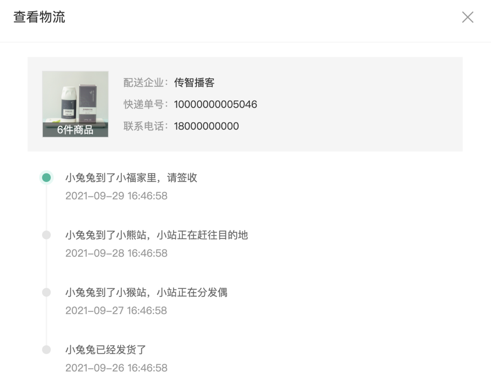

------

- [ ] 创建物流信息展示组件, 实现基础布局
- [ ] 为查看物流按钮添加点击事件, 渲染查看物流信息组件
- [ ] 创建用于获取查看物流信息的API接口函数
- [ ] 发送请求获取物流信息并渲染查看物流信息组件

------

第一步: 创建物流信息展示组件, 实现基础布局

`views/member/order/components/OrderLogistics.vue`

```vue
<template>
  <XtxDialog v-model:visible="visible" title="物流信息">
    <div class="order-logistics-goods">
      <a class="image" href="javascript:"
        >
        <p>1件商品</p></a
      >
      <div class="info">
        <p><span>配送企业：</span>传智播客</p>
        <p><span>快递单号：</span>59595959595</p>
        <p><span>联系电话：</span>18586747568</p>
      </div>
    </div>
    <div class="order-logistics-list">
      <div class="item" v-for="i in 5" :key="i">
        <div class="line" :class="{ active: i === 0 }"></div>
        <div class="logistics">
          <p>物流信息</p>
          <p>2080-04-05</p>
        </div>
      </div>
    </div>
  </XtxDialog>
</template>
<script>
import { ref } from "vue";
export default {
  name: "OrderLogistics",
  setup() {
    const visible = ref(true);
    return { visible };
  },
};
</script>
<style scoped lang="less">
.xtx-dialog :deep(.wrapper) {
  width: 680px;
}
.order-logistics-goods {
  display: flex;
  background-color: #f5f5f5;
  height: 130px;
  align-items: center;
  padding: 0 20px;
  margin-bottom: 20px;
  font-size: 14px;
  .image {
    width: 92px;
    height: 92px;
    border: 1px solid #e4e4e4;
    position: relative;
    p {
      position: absolute;
      left: 0;
      bottom: 0;
      width: 100%;
      height: 20px;
      line-height: 20px;
      color: #fff;
      background-color: rgba(0, 0, 0, 0.5);
      text-align: center;
    }
  }
  .info {
    flex: 1;
    padding-left: 20px;
    line-height: 30px;
    span {
      color: #999;
    }
  }
}
.order-logistics-list {
  position: relative;
  padding-top: 10px;
  font-size: 14px;
  .item {
    display: flex;
    &:last-child {
      .line {
        border-color: transparent;
        &::before {
          top: 0;
        }
      }
    }
    .line {
      width: 27px;
      border-right: 2px solid #f5f5f5;
      margin-right: 25px;
      position: relative;
      &::before {
        content: "";
        position: absolute;
        top: 0;
        right: 0;
        transform: translate(7px, 0);
        border-radius: 50%;
      }
      &::before {
        width: 12px;
        height: 12px;
        background: #e4e4e4;
      }
      // 激活
      &.active {
        &::before {
          background: @xtxColor;
          z-index: 1;
        }
        &::after {
          content: "";
          position: absolute;
          top: 0;
          right: 0;
          transform: translate(11px, -4px);
          border-radius: 50%;
          width: 20px;
          height: 20px;
          background: #e3f9f4;
        }
      }
    }
    .logistics {
      flex: 1;
      padding-bottom: 35px;
      position: relative;
      top: -3px;
      p {
        &:first-child {
          color: #666;
        }
        &:last-child {
          color: #999;
          margin-top: 6px;
        }
      }
    }
  }
}
</style>
```

第二步: 为查看物流按钮添加点击事件, 渲染查看物流组件

`views/member/order/components/OrderItem.vue`

```vue
<a @click="onViewLogisticsButtonClickHandler(order.id)">查看物流</a>
```

```javascript
// 当用户点击查看物流按钮时
const onViewLogisticsButtonClickHandler = (id) => {
	emit("onViewLogistics", id);
};
```

`views/member/order/OrderListPage.vue`

```vue
<OrderLogistics ref="OrderLogisticsComponent" />
```

```javascript
export default {
  components: { OrderLogistics },
  setup() {
    // 用于存储查看物流弹框组件实例对象
    const OrderLogisticsComponent = ref();
    // 当用户点击查看物流按钮时
    const onViewLogisticsHandler = (id) => {
      // 渲染查看物流弹框组件
      OrderLogisticsComponent.value.visible = true;
    };
    return { OrderLogisticsComponent, onViewLogisticsHandler };
  },
};
```

第三步: 创建用于查看物流信息的API函数

`api/member.js` [查看物流](http://zhoushugang.gitee.io/erabbit-client-pc-document/api.html#u67e5u770bu7269u6d410a3ca20id3du67e5u770bu7269u6d413e203ca3e)

```javascript
/**
 * 获取订单物流信息
 * @param id 订单ID
 * @return {AxiosPromise}
 */
export function getLogisticsByOrderId(id) {
  return request(`/member/order/${id}/logistics`, "get");
}
```

第四步: 获取物流信息并渲染查看物流组件

`views/member/order/OrderListPage.vue`

```javascript
import { getLogisticsByOrderId } from "@/api/member";

// 当用户点击查看物流按钮时
const onViewLogisticsHandler = (id) => {
  // 获取订单物流信息
  getLogisticsByOrderId(id).then((data) => {
    // 存储订单物流信息
    OrderLogisticsComponent.value.logistics = data.result;
  });
};
```

`views/member/order/components/OrderLogistics.vue`

```javascript
export default {
  setup() {
    const logistics = ref(null);
    return { logistics };
  },
};
```

```vue
<template>
  <XtxDialog v-model:visible="visible" title="物流信息">
    <div class="order-logistics-goods" v-if="logistics">
      <a class="image" href="javascript:"
        >
        <p>{{ logistics.count }}件商品</p></a
      >
      <div class="info">
        <p><span>配送企业：</span>{{ logistics.company.name }}</p>
        <p><span>快递单号：</span>{{ logistics.number }}</p>
        <p><span>联系电话：</span>{{ logistics.tel }}</p>
      </div>
    </div>
    <div class="order-logistics-list" v-if="logistics">
      <div class="item" v-for="(item, index) in logistics.list" :key="item.id">
        <div class="line" :class="{ active: index === 0 }"></div>
        <div class="logistics">
          <p>{{ item.text }}</p>
          <p>{{ item.time }}</p>
        </div>
      </div>
    </div>
  </XtxDialog>
</template>
```

## 16. 订单详情-头部展示

> 目标：完成订单详情页面的头部展示

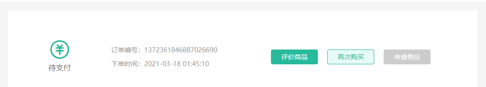

------

- [ ] 创建订单详情头部组件, 实现基础布局
- [ ] 创建用于获取订单详情的API接口函数
- [ ] 在订单详情页面组件中发送请求获取订单详情数据
- [ ] 在订单详情组件中调用订单详情头部组件并传递订单详情数据
- [ ] 根据不同的订单状态显示不同的操作按钮

------

第一步: 创建组件订单详情头部组件, 实现基础布局

`views/member/components/DetailAction.vue`

```html
<template>
  <div class="detail-action">
    <div class="state">
      <span class="iconfont icon-order-unpay"></span>
      <p>待支付</p>
    </div>
    <div class="info">
      <p>订单编号：1372361846887026690</p>
      <p>下单时间：2021-03-18 01:45:10</p>
    </div>
    <div class="btn">
      <XtxButton type="primary" size="small">评价商品</XtxButton>
      <XtxButton type="plain" size="small">再次购买</XtxButton>
      <XtxButton type="gray" size="small">申请售后</XtxButton>
    </div>
  </div>
</template>
<script>
export default {
  name: "DetailAction",
};
</script>
<style scoped lang="less">
.detail-action {
  height: 180px;
  width: 100%;
  display: flex;
  align-items: center;
  .state {
    width: 220px;
    text-align: center;
    .iconfont {
      font-size: 40px;
      color: @xtxColor;
    }
    p {
      font-size: 16px;
      color: #666;
      margin-bottom: 10px;
    }
  }
  .info {
    width: 240px;
    line-height: 30px;
    p {
      color: #999;
    }
  }
  .btn {
    flex: 1;
    text-align: right;
    margin-right: 100px;
    .xtx-button {
      margin-left: 20px;
    }
  }
}
</style>
```

第二步: 创建用于获取订单详情的API接口函数

`api/member.js`  [获取我的订单详情](http://zhoushugang.gitee.io/erabbit-client-pc-document/api.html#u83b7u53d6u6211u7684u8ba2u5355u8be6u60c50a3ca20id3du83b7u53d6u6211u7684u8ba2u5355u8be6u60c53e203ca3e)

```javascript
/**
 * 获取订单详情
 * @param id 订单ID
 * @return {AxiosPromise}
 */
export function getOrderDetail(id) {
  return request(`/member/order/${id}`, "get");
}
```

第三步: 在订单详情页面组件中发送请求获取订单详情数据并调用订单详情头部组件

`views/member/order/OrderDetailPage.vue`

```javascript
import { ref } from "vue";
import { getOrderDetail } from "@/api/member";
import { useRoute } from "vue-router";
import DetailAction from "@/views/member/order/components/DetailAction";

export default {
  setup() {
    // 获取订单详情
    const { orderDetail, getData } = useOrderDetail();
    return { orderDetail, getData };
  },
};
function useOrderDetail() {
  // 获取路由信息对象
  const route = useRoute();
  // 用于存储订单详情信息
  const orderDetail = ref(null);
  // 获取订单详情数据
  const getData = () => {
    getOrderDetail(route.params.id).then((data) => {
      orderDetail.value = data.result;
    });
  };
  getData();
  return { orderDetail, getData };
}
```

```vue
<DetailAction :orderDetail="orderDetail" :getOrderDetail="getData"/>
```

第四步: 在订单详情头部组件中接收订单详情信息及重新获取订单详情的方法

`views/member/order/components/DetailAction.vue`

```javascript
export default {
  props: {
    orderDetail: {
      type: Object,
      default: () => ({}),
    },
    getOrderDetail: {
      type: Function,
      default: () => {},
    },
  }
};
```

第五步: 根据不同的订单状态显示不同的操作按钮

1. 待付款：立即付款，取消订单
2. 待发货：再次购买
3. 待收货：确认收货，再次购买
4. 待评价：评价商品，再次购买，申请售后
5. 已完成：查看评价，再次购买，申请售后
6. 已取消：-

```html
<div class="btn">
  <!-- 待付款 -->
  <template v-if="orderDetail.orderState === 1">
    <XtxButton
      @click="$router.push('/member/pay?orderId=' + orderDetail.id)"
      type="primary"
      size="small"
    >立即付款</XtxButton>
    <XtxButton type="gray" size="small">取消订单</XtxButton>
  </template>
  <!-- 待发货 -->
  <template v-if="orderDetail.orderState === 2">
    <XtxButton type="primary" size="small">再次购买</XtxButton>
  </template>
  <!-- 待收货 -->
  <template v-if="orderDetail.orderState === 3">
    <XtxButton type="primary" size="small">确认收货</XtxButton>
    <XtxButton type="plain" size="small">再次购买</XtxButton>
  </template>
  <!-- 待评价 -->
  <template v-if="orderDetail.orderState === 4">
    <XtxButton type="primary" size="small">再次购买</XtxButton>
    <XtxButton type="plain" size="small">评价商品</XtxButton>
    <XtxButton type="gray" size="small">申请售后</XtxButton>
  </template>
  <!-- 已完成 -->
  <template v-if="orderDetail.orderState === 5">
    <XtxButton type="primary" size="small">再次购买</XtxButton>
    <XtxButton type="plain" size="small">查看评价</XtxButton>
    <XtxButton type="gray" size="small">申请售后</XtxButton>
  </template>
  <!-- 已取消 -->
</div>
```

## 17. 订单详情-封装步骤条组件

> 目标: 封装步骤条组件

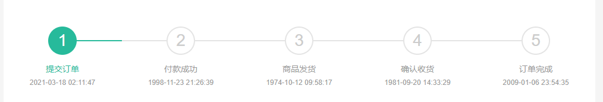

------

- [ ] 了解步骤条组件的最终调用方式
- [ ] 创建 `XtxSteps` 组件, 实现基础布局
- [ ] 创建 `XtxStepItem` 组件, 用于接收 props 数据
- [ ] 实现 `XtxSteps` 组件内部的封装逻辑
- [ ] 使用订单详情数据渲染步骤条组件

------

```vue
<XtxSteps active="3">
  <XtxStepItem title="提交订单" desc="2021-09-25 21:12:22"></XtxStepItem>
  <XtxStepItem title="付款成功" desc="2021-09-25 21:12:22"></XtxStepItem>
  <XtxStepItem title="商品发货" desc="2021-09-25 21:12:22"></XtxStepItem>
  <XtxStepItem title="确认收货" desc="2021-09-25 21:12:22"></XtxStepItem>
  <XtxStepItem title="订单完成" desc="2021-09-25 21:12:22"></XtxStepItem>
</XtxSteps>
```

------

第一步: 创建 `XtxSteps` 组件, 实现基础布局

`components/library/XtxSteps.vue`

```html
<template>
  <div class="xtx-steps">
    <div class="xtx-steps-item active" v-for="i in 5" :key="i">
      <div class="step">
        <span>{{ i }}</span>
      </div>
      <div class="title">提交订单</div>
      <div class="desc">2021-03-18 02:11:47</div>
    </div>
  </div>
</template>
<script>
export default {
  name: "XtxSteps",
};
</script>
<style lang="less">
.xtx-steps {
  display: flex;
  text-align: center;
  padding: 20px;
  &-item {
    flex: 1;
    &:first-child {
      .step {
        &::before {
          display: none;
        }
      }
    }
    &:last-child {
      .step {
        &::after {
          display: none;
        }
      }
    }
    &.active {
      .step {
        > span {
          border-color: @xtxColor;
          background: @xtxColor;
          color: #fff;
        }
        &::before,
        &::after {
          background: @xtxColor;
        }
      }
      .title {
        color: @xtxColor;
      }
    }
    .step {
      position: relative;
      > span {
        width: 48px;
        height: 48px;
        font-size: 28px;
        border: 2px solid #e4e4e4;
        background: #fff;
        border-radius: 50%;
        line-height: 44px;
        color: #ccc;
        display: inline-block;
        position: relative;
        z-index: 1;
      }
      &::after,
      &::before {
        content: "";
        position: absolute;
        top: 23px;
        width: 50%;
        height: 2px;
        background: #e4e4e4;
      }
      &::before {
        left: 0;
      }
      &::after {
        right: 0;
      }
    }
    .title {
      color: #999;
      padding-top: 12px;
    }
    .desc {
      font-size: 12px;
      color: #999;
      padding-top: 6px;
    }
  }
}
</style>
```

第二步: 创建 `XtxStepItem` 组件, 用于接收 props 数据

`components/XtxStepItem.vue`

```vue
<script>
export default {
  name: "XtxStepItem",
  props: {
    title: {
      type: String,
      default: "",
    },
    desc: {
      type: String,
      default: "",
    },
  },
};
</script>
```

第三步: 实现 `XtxSteps` 组件内部的封装逻辑

```react
export default {
  name: "XtxSteps",
  props: {
    active: {
      type: Number,
      default: 1,
    },
  },
  setup(props, { slots }) {
    // 获取插槽内容
    const steps = slots.default && slots.default();
    const result = [];

    steps.forEach((item) => {
      if (typeof item.type === "symbol") {
        item.children.forEach((child) => result.push(child));
      } else {
        result.push(item);
      }
    });

    return () => (
      <div className="xtx-steps">
        {result.map((item, index) => (
          <div
            key={index}
            className={`xtx-steps-item ${
              index + 1 <= props.active ? "active" : ""
            }`}
          >
            <div className="step">
              <span>{index + 1}</span>
            </div>
            <div className="title">{item.props.title}</div>
            <div className="desc">{item.props.desc}</div>
          </div>
        ))}
      </div>
    );
  },
};
```

第四步: 使用订单详情数据渲染步骤条组件

`views/member/order/OrderDetailPage.vue`

```vue
<XtxSteps :active="orderDetail.orderState === 6 ? 1 : orderDetail.orderState">
  <XtxStepItem title="提交订单" :desc="orderDetail.createTime"></XtxStepItem>
  <XtxStepItem title="付款成功" :desc="orderDetail.payTime"></XtxStepItem>
  <XtxStepItem title="商品发货" :desc="orderDetail.consignTime"></XtxStepItem>
  <XtxStepItem title="确认收货" :desc="orderDetail.endTime"></XtxStepItem>
  <XtxStepItem title="订单完成" :desc="orderDetail.evaluationTime"></XtxStepItem>
</XtxSteps>
```

## 18. 订单详情-物流信息

> 目标: 显示物流信息组件渲染

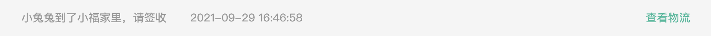

------

- [ ] 创建物流信息展示组件, 实现基础布局
- [ ] 根据订单ID获取订单物流信息并渲染模板
- [ ] 为物流信息展示组件增加 loading 提示信息
- [ ] 实现点击查看物流按钮渲染物流信息查看组件
- [ ] 弹框结构渲染位置优化

------

第一步: 创建物流信息展示组件, 实现基础布局

`views/member/order/components/DetailLogistics.vue`

```html
<template>
  <div class="detail-logistics">
    <p>
      <span>2016-09-14 15:00:32</span>
      <span>浦东转运中心公司 已收入</span>
    </p>
    <a href="javascript:">查看物流</a>
  </div>
</template>
<script>
export default {
  name: "DetailLogistics",
};
</script>
<style scoped lang="less">
.detail-logistics {
  height: 50px;
  display: flex;
  align-items: center;
  padding: 0 30px;
  background-color: #f5f5f5;
  margin: 30px 50px 0;
  > p {
    flex: 1;
    span {
      color: #999;
      &:first-child {
        margin-right: 30px;
      }
    }
  }
  > a {
    color: @xtxColor;
    text-align: center;
  }
}
</style>
```

第二步: 根据订单ID获取订单物流信息并渲染模板 (异步组件)

`views/member/order/components/DetailLogistics.vue`

```javascript
import { useRoute } from "vue-router";
import { getLogisticsByOrderId } from "@/api/member";
import { ref } from "vue";

/*
 *  Vue 规定必须先执行 setup 函数再渲染模板, 因为 setup 函数要返回渲染模板所需的数据
 *  如果将 setup 函数更改为异步函数, 将导致代码执行顺序更改为先渲染模板再执行 setup 函数
 *  在调用异步组件时外部需要包裹 suspense 组件, 保证 setup 函数执行完成后再进行模板渲染
 * */
export default {
  name: "DetailLogistics",
  async setup() {
    // 获取路由信息对象
    const route = useRoute();
    // 用于存储订单物流信息
    const logistics = ref(null);
    // 获取物流信息
    let data = await getLogisticsByOrderId(route.params.id);
    // 存储物流信息
    logistics.value = data.result;
    return { logistics };
  },
};
```

```vue
<div class="detail-logistics" v-if="logistics">
  <p>
    <span>{{ logistics.list[0].text }}</span>
    <span>{{ logistics.list[0].time }}</span>
  </p>
  <a href="javascript:">查看物流</a>
</div>
```

`views/member/order/OrderDetailPage.vue`

```vue
<Suspense>
	<DetailLogistics />
</Suspense>
```

第三步: 为物流信息展示组件增加 loading 提示信息

注意: 只有订单状态为待收货、待评价、已完成时才渲染物流显示组件

`views/member/order/OrderDetailPage.vue`

```vue
<Suspense>
  <template v-slot:default>
  	<DetailLogistics v-if="[3, 4, 5].includes(orderDetail.orderState)" />
  </template>
  <template v-slot:fallback>loading...</template>
</Suspense>
```

```javascript
async function delay(time) {
  await new Promise((resolve) => setTimeout(() => resolve(), time));
}
```

第四步: 实现点击查看物流按钮渲染物流信息查看组件

```vue
<a @click="onViewLogisticsButtonClickHandler">查看物流</a>
```

```javascript
export default {
  async setup() {
    // 用于存储物流信息弹层组件实例对象
    const orderLogisticsComponent = ref();
    // 当用户点击查看物流按钮时
    const onViewLogisticsButtonClickHandler = () => {
      // 渲染弹层
      orderLogisticsComponent.value.visible = true;
      // 传递物流信息
      orderLogisticsComponent.value.logistics = logistics.value;
    };
    return { onViewLogisticsButtonClickHandler, orderLogisticsComponent };
  },
};
```

第五步: 弹框结构渲染位置优化

目前存在的问题: 弹框被渲染在了 `DetailLogistics.vue` 组件中, 弹框是固定定位, 固定定位默认是相对于浏览器, 但如果固定定位元素的父级有 `transform` 样式, 那么弹框的固定定位就相对于这个父级元素了, 也就是说, 弹框有潜在的样式隐患.

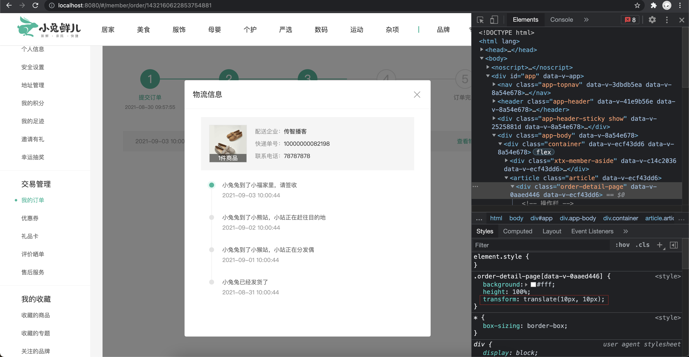

解决办法: 使用 teleport 组件将弹框渲染在应用外部

```html
<!-- 查看物流信息 -->
<teleport to="#modal">
	<OrderLogistics ref="orderLogisticsComponent" />
</teleport>
```

`public/index.html`

```html
<div id="modal"></div>
```

## 19. 订单详情-商品信息

> 目标: 渲染商品详情组件中的剩余部分

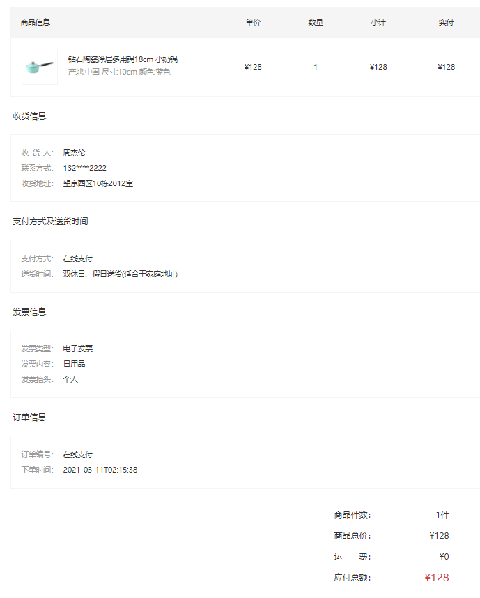

------

- [ ] 创建商品信息展示组件, 实现基本布局
- [ ] 获取商品详情信息, 渲染商品详情组件

------

第一步: 创建商品信息展示组件, 实现基本布局

`views/member/order/components/DetailOrderGooods.vue`

```vue
<template>
  <div class="order-info">
    <!-- 商品列表 -->
    <h3>订单商品</h3>
    <table class="goods-table">
      <thead>
        <tr>
          <th>商品信息</th>
          <th>单价</th>
          <th>数量</th>
          <th>小计</th>
          <th>实付</th>
        </tr>
      </thead>
      <tbody>
        <tr v-for="i in 3" :key="i">
          <td>
            <a href="javascript:" class="product">
              
              <div class="info">
                <p class="name ellipsis">小米电视4A 32英寸</p>
                <p class="attrs ellipsis">颜色：黑色 尺寸：32寸</p>
              </div>
            </a>
          </td>
          <td>¥1899</td>
          <td>1</td>
          <td>¥1899</td>
          <td>¥1899</td>
        </tr>
      </tbody>
    </table>
    <!-- 收货信息 -->
    <h3>收货信息</h3>
    <div class="info-box">
      <dl>
        <dt>收<i></i>货<i></i>人：</dt>
        <dd>周杰伦</dd>
      </dl>
      <dl>
        <dt>联系方式：</dt>
        <dd>180****1849</dd>
      </dl>
      <dl>
        <dt>收货地址：</dt>
        <dd>北京海淀区黄平路金燕龙</dd>
      </dl>
    </div>
    <!-- 支付方式及送货时间 -->
    <h3>支付方式及送货时间</h3>
    <div class="info-box">
      <dl>
        <dt>支付方式：</dt>
        <dd>在线支付</dd>
      </dl>
      <dl>
        <dt>送货时间：</dt>
        <dd>双休日、假日送货(适合于家庭地址)</dd>
      </dl>
    </div>
    <!-- 发票信息 -->
    <h3>发票信息</h3>
    <div class="info-box">
      <dl>
        <dt>发票类型：</dt>
        <dd>电子发票</dd>
      </dl>
      <dl>
        <dt>发票内容：</dt>
        <dd>日用品</dd>
      </dl>
      <dl>
        <dt>发票抬头：</dt>
        <dd>个人</dd>
      </dl>
    </div>
    <!-- 订单信息 -->
    <h3>订单信息</h3>
    <div class="info-box">
      <dl>
        <dt>订单编号：</dt>
        <dd>1432160622853754881</dd>
      </dl>
      <dl>
        <dt>下单时间：</dt>
        <dd>2038-01-06 17:09:35</dd>
      </dl>
    </div>
    <!-- 汇总信息 -->
    <div class="sum-info">
      <div class="info">
        <div class="item">
          <label>商品件数：</label>
          <span>5件</span>
        </div>
        <div class="item">
          <label>商品总价：</label>
          <span>¥5697</span>
        </div>
        <div class="item">
          <label>运<i></i>费：</label>
          <span>0</span>
        </div>
        <div class="item">
          <label>应付总额：</label>
          <span class="price">¥5697</span>
        </div>
      </div>
    </div>
  </div>
</template>

<script>
export default {
  name: "DetailOrderGoods",
};
</script>

<style scoped lang="less">
.order-info {
  padding: 0 50px;
  h3 {
    font-weight: normal;
    font-size: 16px;
    padding: 25px 5px;
  }
}
// 商品表格
.goods-table {
  width: 100%;
  border-collapse: collapse;
  border-spacing: 0;
  margin: 0 auto;
  th {
    font-weight: normal;
    line-height: 60px;
    background: #f5f5f5;
    &:first-child {
      text-align: left;
      padding-left: 20px;
    }
  }
  td {
    border-bottom: 1px solid #f5f5f5;
    text-align: center;
    &:first-child {
      padding-left: 20px;
      border-left: 1px solid #f5f5f5;
    }
    &:last-child {
      border-right: 1px solid #f5f5f5;
    }
  }
  .product {
    display: flex;
    padding: 20px 0;
    img {
      width: 70px;
      height: 70px;
      border: 1px solid #f5f5f5;
    }
    .info {
      align-self: center;
      padding-left: 20px;
      text-align: left;
      p {
        margin-bottom: 5px;
        width: 280px;
      }
      .attrs {
        color: #999;
      }
    }
  }
}
// 信息盒子
.info-box {
  border: 1px solid #f5f5f5;
  padding: 20px;
  dl {
    display: flex;
    line-height: 30px;
    dt {
      width: 80px;
      color: #999;
      font-size: 14px;
      i {
        display: inline-block;
        width: 0.5em;
      }
    }
    dd {
      flex: 1;
    }
  }
}
// 汇总信息
.sum-info {
  padding: 30px 30px 100px 30px;
  overflow: hidden;
  .info {
    width: 250px;
    height: 160px;
    float: right;
    font-size: 16px;
    .item {
      line-height: 40px;
      display: flex;
      label {
        width: 90px;
        i {
          display: inline-block;
          width: 2em;
        }
      }
      span {
        flex: 1;
        text-align: right;
        padding-right: 30px;
        &.price {
          font-size: 20px;
          color: @priceColor;
        }
      }
    }
  }
}
</style>
```

第二步: 获取商品详情信息, 渲染商品详情组件

`src/views/member/order/OrderDetailPage.vue`

```vue
<!-- 订单商品信息 -->
<DetailOrderGoods :orderDetail="orderDetail" />
```

`views/member/order/components/DetailOrderGooods.vue`

```vue
<template>
  <div class="order-info" v-if="orderDetail">
    <h3>订单商品</h3>
    <table class="goods-table">
      <thead>
        <tr>
          <th>商品信息</th>
          <th>单价</th>
          <th>数量</th>
          <th>小计</th>
          <th>实付</th>
        </tr>
      </thead>
      <tbody>
        <tr v-for="sku in orderDetail.skus" :key="sku.id">
          <td>
            <a href="javascript:" class="product">
              
              <div class="info">
                <p class="name ellipsis">{{ sku.name }}</p>
                <p class="attrs ellipsis">{{ sku.attrsText }}</p>
              </div>
            </a>
          </td>
          <td>¥{{ sku.curPrice }}</td>
          <td>{{ sku.quantity }}</td>
          <td>¥{{ sku.totalMoney }}</td>
          <td>¥{{ sku.realPay }}</td>
        </tr>
      </tbody>
    </table>
    <!-- 收货信息 -->
    <h3>收货信息</h3>
    <div class="info-box">
      <dl>
        <dt>收<i></i>货<i></i>人：</dt>
        <dd>{{ orderDetail.receiverContact }}</dd>
      </dl>
      <dl>
        <dt>联系方式：</dt>
        <dd>
          {{
            orderDetail.receiverMobile.replace(
              /(\d{3})\d{4}(\d{4})/,
              "$1****$2"
            )
          }}
        </dd>
      </dl>
      <dl>
        <dt>收货地址：</dt>
        <dd>{{ orderDetail.receiverAddress }}</dd>
      </dl>
    </div>
    <!-- 订单信息 -->
    <h3>订单信息</h3>
    <div class="info-box">
      <dl>
        <dt>订单编号：</dt>
        <dd>{{ orderDetail.id }}</dd>
      </dl>
      <dl>
        <dt>下单时间：</dt>
        <dd>{{ orderDetail.createTime }}</dd>
      </dl>
    </div>
    <!-- 汇总信息 -->
    <div class="sum-info">
      <div class="info">
        <div class="item">
          <label>商品件数：</label>
          <span>{{ orderDetail.totalNum }}件</span>
        </div>
        <div class="item">
          <label>商品总价：</label>
          <span>¥{{ orderDetail.totalMoney }}</span>
        </div>
        <div class="item">
          <label>运<i></i>费：</label>
          <span>{{ orderDetail.postFee }}</span>
        </div>
        <div class="item">
          <label>应付总额：</label>
          <span class="price">¥{{ orderDetail.payMoney }}</span>
        </div>
      </div>
    </div>
  </div>
</template>
<script>
export default {
  name: "DetailOrderGoods",
  props: {
    orderDetail: {
      type: Object,
      default: () => ({}),
    },
  },
};
</script>
```

## 20. 订单详情-取消订单

> 目标: 复用订单列表组件中的取消订单逻辑

------

- [ ] 为取消订单按钮添加点击事件, 复用逻辑
- [ ] 在 `DetailAction` 组件中复用 `CancelOrder` 组件
- [ ] 在订单详情页面组件中重新获取订单信息以更新组件

------

第一步: 为取消订单按钮添加点击事件, 复用逻辑

`views/member/order/components/DetailAction.vue`

```vue
<template>
	<XtxButton @click="onCancelOrderHandler(orderDetail.id)">取消订单</XtxButton>
</template>
<script>
	// 当用户点击取消按钮时
  const onCancelOrderHandler = (id) => {
    // 渲染取消订单弹层
    cancelOrderComponent.value.visible = true;
    // 通过组件实例对象传递要取消订单的订单ID
    cancelOrderComponent.value.id = id;
  };
</script>
```

第二步: 在 `DetailAction` 组件中复用 `CancelOrder` 组件

`views/member/order/components/DetailAction.vue`

```vue
<template>
	<CancelOrder ref="cancelOrderInstance" @onOrderListReload="$emit('onOrderListReload', orderDetail.id)" />
</template>
<script>
export default {
  emits: ["onOrderListReload"],
	setup () {
		// 用于存储取消订单弹层组件实例对象
    const cancelOrderComponent = ref();
    return { cancelOrderComponent }
	}
}
</script>
```

第三步: 在订单详情页面组件中重新获取订单信息以更新组件

`views/member/OrderDetailPage.vue`

```vue
<DetailAction :orderDetail="orderDetail" @onOrderListReload="getData($event)" />
```

## 21. 订单详情-确认收货

> 目标: 实现确认收货功能

------

- [ ] 为确认收货按钮添加点击事件
- [ ] 调用接口函数实现确认收货功能

------

第一步: 为确认收货按钮添加点击事件, 实现确认收货功能

```vue
<XtxButton @click="onConfirmReceiptButtonClickHandler(orderDetail.id)">确认收货</XtxButton>
```

第二步: 调用接口函数实现确认收货功能

```javascript
// 当确认收货按钮被点击时
const onConfirmReceiptButtonClickHandler = async (id) => {
  try {
    // 和用户进行确认
    await Confirm({ title: "确认收货", content: "确定要进行收货吗" });
    // 发送请求进行确认收货
    await confirmReceiptGoods(id);
    // 用户提示
    Message({ type: "success", text: "确认收货成功" });
    // 重新获取订单详情数据
    props.getOrderDetail();
  } catch (e) {
    // 用户提示
    Message({ type: "warn", text: "确认收货失败" });
  }
};
```

## 22. 订单详情-再次购买

> 目标: 实现再次购买订单中商品的逻辑

当用户点击再次购买按钮时, 携带订单ID跳转到结算页面, 根据当前订单ID生成新的订单.

------

- [ ] 为再次购买按钮添加跳转链接, 跳转到结算页面并传递当前订单ID
- [ ] 创建用于实现再次购买的API函数 (根据订单ID创建新的订单)
- [ ] 在填写订单页面判断是否有订单ID路由参数, 有则根据订单Id创建新的订单, 没有则根据服务器端购物车创建订单

------

第一步: 为再次购买按钮添加跳转链接, 跳转到结算页面并传递当前订单ID

`views/member/order/components/DetailAction.vue`

```vue
<XtxButton @click="$router.push(`/checkout/order?id=${orderDetail.id}`)">再次购买</XtxButton>
```

第二步: 创建用于实现再次购买的API函数 (根据订单ID创建新的订单)

 `api/order.js` [订单-再次购买](http://zhoushugang.gitee.io/erabbit-client-pc-document/api.html#u8ba2u5355-u518du6b21u8d2du4e700a3ca20id3du8ba2u5355-u518du6b21u8d2du4e703e203ca3e)

```javascript
/**
 * 根据订单ID创建新的订单
 * @param id 订单ID
 * @return {AxiosPromise}
 */
export function createOrderById(id) {
  return request(`/member/order/repurchase/${id}`, "get");
}
```

第三步: 在填写订单页面判断是否有订单ID路由参数, 有则根据订单Id创建新的订单, 没有则根据服务器端购物车创建订单

`src/views/member/pay/CheckoutPage.vue`

```javascript
function getOrderInfo() {
	// 获取路由信息对象
  const route = useRoute();
  // 如果 ID 参数存在
  if (route.query.id) {
    // 根据订单ID创建新的订单
    createOrderById(route.query.id).then((data) => (order.value = data.result));
  } else {
    // 如果 ID 参数不存在
    // 根据服务器端购物车创建订单
    createOrder().then((data) => (order.value = data.result));
  }
}
```
